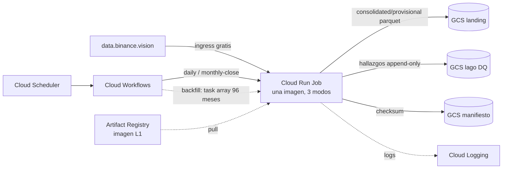

# Documento de Requerimientos Técnicos — Capa 1 (TRD-L1)

## Ingesta, ordenamiento y materialización a Parquet de aggTrades crudos (BTC/USDT, Binance)

> **Capa Raw / Landing · Arquitectura Medallion · Single-Node Big Data · Google Cloud Platform**

|Campo        |Valor                                                                           |
|-------------|--------------------------------------------------------------------------------|
|Documento    |TRD-L1 — Capa de ingesta y conformación raw                                     |
|Versión      |**1.1**                                                                         |
|Estado       |Línea base con ítems de §14 cerrados (dimensionamiento, techo de cómputo, DECIMAL, calendario)|
|Fecha        |Junio de 2026                                                                   |
|Documento padre|TRD maestro v2.0 / v2.1                                                        |
|Alcance      |Capa 1 (Raw / Landing) de la capa Batch                                          |
|Clasificación|Académico / Uso personal                                                        |
|Contexto     |Trabajo de grado — Maestría en Finanzas · Universidad EAFIT (Medellín, Colombia)|

### Historial de revisiones

|Versión|Fecha|Descripción|
|---|---|---|
|1.0|Jun 2026|Línea base inicial derivada de la discusión de diseño de L1.|
|1.1|Jun 2026|Cierre de ítems abiertos de §14 con evidencia oficial: techo de Cloud Run Jobs confirmado (32 GiB / 8 vCPU / 168 h) y config inicial 4 vCPU / 16 GiB; corrección del rationale DECIMAL (dimensionar por **precisión de activo = 8**, no por tickSize/stepSize); calendario de publicación de Binance (diario en D+1; mensual el **primer lunes** de M+1); header por época degradado a caracterización (el diseño ya es robusto). La sonda de dimensionamiento pasa a criterio de aceptación ejecutable.|

-----

## Cómo leer este documento

Este TRD detalla la **Capa 1** y **hereda las invariantes** fijadas por el TRD maestro (región, formato, presupuesto, particionado, reusabilidad batch↔streaming). No las repite salvo cuando las concreta. Si una decisión de este documento corrige o concreta una afirmación del maestro, se indica explícitamente.

- Si buscas **qué construye L1 y con qué garantías** → secciones 4 y 5 (requerimientos).
- Si buscas **el qué y el porqué de cada decisión** → sección 6 (ADR de capa).
- Si buscas **el esquema exacto de entrada y salida** → sección 7 (contrato de datos).
- Si buscas **el algoritmo paso a paso** → sección 8 (pipeline interno).
- Si buscas **cómo se valida la calidad** → sección 9.

-----

## Tabla de contenido

1. [Introducción y propósito](#1-introducción-y-propósito)
1. [Invariantes heredadas del TRD maestro](#2-invariantes-heredadas-del-trd-maestro)
1. [Alcance de la Capa 1](#3-alcance-de-la-capa-1)
1. [Requerimientos funcionales de L1](#4-requerimientos-funcionales-de-l1)
1. [Requerimientos no funcionales de L1](#5-requerimientos-no-funcionales-de-l1)
1. [Decisiones de diseño de L1 (ADR de capa)](#6-decisiones-de-diseño-de-l1-adr-de-capa)
1. [Contrato de datos](#7-contrato-de-datos)
1. [Pipeline interno y modos de ejecución](#8-pipeline-interno-y-modos-de-ejecución)
1. [Validaciones y política de calidad de datos](#9-validaciones-y-política-de-calidad-de-datos)
1. [Arquitectura de cómputo, dimensionamiento y costo](#10-arquitectura-de-cómputo-dimensionamiento-y-costo)
1. [Operaciones](#11-operaciones)
1. [Riesgos y mitigaciones](#12-riesgos-y-mitigaciones)
1. [Criterios de aceptación](#13-criterios-de-aceptación)
1. [Ítems abiertos y a validar](#14-ítems-abiertos-y-a-validar)
1. [Anexos](#15-anexos)

-----

## 1. Introducción y propósito

La Capa 1 es la **aduana de datos** de la plataforma: ingiere los `aggTrades` crudos de SPOT BTC/USDT desde `data.binance.vision`, garantiza su orden e integridad, y los materializa en Parquet conformado para que las capas posteriores los consuman por contrato. Todo defecto que entra sin detectarse aquí contamina silenciosamente las 50 cadenas de θ aguas abajo; por eso el énfasis de esta capa **no es el ordenamiento sino la correctitud**.

L1 produce una capa Raw/Landing que conserva el **esquema completo del proveedor** (todas las columnas disponibles), aplicando únicamente conformaciones **sin pérdida** que son obligatorias al pasar de CSV a Parquet (tipado y unidad temporal canónica). La canonización semántica entre proveedores, de existir, se difiere aguas abajo.

-----

## 2. Invariantes heredadas del TRD maestro

L1 hereda y no contradice:

- **Región única us-east1** para cómputo y almacenamiento (egress intra-región nulo).
- **Formato Parquet** comprimido en Cloud Storage.
- **Presupuesto:** costo operativo ≤ 100 USD/mes; objetivo del pipeline < 5 USD/mes.
- **Particionado hive** por `provider × market × asset × …` (L1 concreta el sufijo temporal; no usa θ, que nace en L2).
- **Idempotencia y reanudabilidad** por ventana.
- **Reusabilidad batch↔streaming:** el diseño no debe impedir el reúso del núcleo hacia la futura Capa Kappa.
- **IaC reproducible** (Terraform) y **mínimo privilegio** (IAM, service accounts por job).
- **Terminología:** se usa *stack* (batch/kappa) y *environment* (dev/qa/prod) como conceptos distintos; este TRD pertenece al stack `batch`.

-----

## 3. Alcance de la Capa 1

### 3.1 Dentro de alcance

- Ingesta histórica (backfill) de los archivos **mensuales** de aggTrades SPOT BTC/USDT desde 2017-08-17.
- Ingesta **incremental diaria** del mes en curso y **cierre mensual** (reemplazo de diarios por el consolidado mensual).
- Validación de integridad (checksum de descarga; orden; contigüidad y unicidad de `aggTradeId`; costura inter-partición).
- Normalización de unidad temporal a microsegundos y tipado exacto de precio/cantidad.
- Materialización a Parquet conformado, particionado y comprimido.
- Emisión de hallazgos de calidad de datos a un lago append-only.
- Manifiesto de checksums para trazabilidad/procedencia.

### 3.2 Fuera de alcance (se difiere)

- **Auto-sanación diaria por hallazgo** (ciclo abierto→resuelto con re-chequeo diario y reescritura selectiva): redundante con "mensual = verdad" para la tesis; relevante en la era del bot. Ver ADR-L1-08.
- **Capa de consumo de hallazgos** (BigQuery externo + Looker): solo se persiste; el consumo se difiere.
- **Análisis comparativo diario↔mensual** más allá del log del hallazgo (cuantificar frecuencia de drift): futuro.
- **Canonización multi-proveedor**: L1 deja el esquema del proveedor; la unificación es aguas abajo.

-----

## 4. Requerimientos funcionales de L1

*Prioridad MoSCoW: M (Must), S (Should), C (Could). Trazabilidad al RF del maestro entre paréntesis.*

|ID       |Nombre                       |Descripción                                                                                                                            |Prio.|
|---------|-----------------------------|---------------------------------------------------------------------------------------------------------------------------------------|-----|
|RF-L1-01 |Ingesta histórica (RF-01)    |Descargar los archivos **mensuales** de aggTrades SPOT BTC/USDT para todo el histórico (desde 2017-08-17).                              |M    |
|RF-L1-02 |Ingesta incremental (RF-02)  |Ingerir el archivo **diario** del mes en curso como partición provisional.                                                             |M    |
|RF-L1-03 |Cierre mensual (RF-02)       |Al cierre de mes, reemplazar las particiones diarias provisionales por el **consolidado mensual canónico** e inmutable.                |M    |
|RF-L1-04 |Validación de descarga       |Verificar el checksum SHA-256 publicado por Binance antes de procesar; reintentar la descarga si falla.                                |M    |
|RF-L1-05 |Detección de header (RF-04)  |Determinar por archivo si el CSV trae fila de encabezado (parseando el primer campo como entero) y tratarla en consecuencia.           |M    |
|RF-L1-06 |Normalización temporal       |Normalizar `transact_time` a **microsegundos** venga en ms o µs, detectando la unidad por magnitud.                                     |M    |
|RF-L1-07 |Tipado exacto                |Materializar `price` y `quantity` como **DECIMAL exacto**, no float.                                                                   |M    |
|RF-L1-08 |Ordenamiento (RF-03)         |Garantizar orden por **`transact_time` (primario)** y **`agg_trade_id` (desempate)**; verificar primero y reordenar solo si falla.     |M    |
|RF-L1-09 |Integridad por `aggTradeId`  |Verificar contigüidad (sin huecos) y unicidad (sin duplicados) de `agg_trade_id` dentro de la partición.                               |M    |
|RF-L1-10 |Costura inter-partición      |Verificar continuidad de `agg_trade_id` en el borde entre particiones, usando **estadísticas del footer de Parquet** (sin cargar datos).|S    |
|RF-L1-11 |Materialización (RF-04)      |Escribir Parquet ZSTD ordenado, particionado hive, con todas las columnas del proveedor.                                               |M    |
|RF-L1-12 |Hallazgos de calidad (RF-19) |Emitir cada hallazgo de calidad de datos como evento **append-only** a un lago de DQ, además del log de consola.                        |M    |
|RF-L1-13 |Manifiesto de checksums      |Registrar el checksum de cada archivo ingerido para trazabilidad y detección de republicación.                                         |S    |
|RF-L1-14 |Idempotencia (RF-12)         |Re-ejecutar una ventana mensual produce un resultado idéntico (escritura a ruta determinista).                                          |M    |
|RF-L1-15 |Reanudabilidad (RF-13)       |El backfill se reanuda procesando solo los meses faltantes o fallidos.                                                                 |M    |
|RF-L1-16 |Esquema completo de proveedor|Conservar **todas** las columnas del proveedor en la landing, sin descartar columnas no usadas por la DC.                              |M    |

-----

## 5. Requerimientos no funcionales de L1

|ID        |Atributo                |Requerimiento                                                                                                       |Prio.|
|----------|------------------------|--------------------------------------------------------------------------------------------------------------------|-----|
|RNF-L1-01 |Costo                   |Estado estacionario de L1 ≈ 1–2 USD/mes (dominado por storage); backfill como pico único absorbido por el crédito.   |M    |
|RNF-L1-02 |Eficiencia de memoria   |Memoria pico dimensionada a una ventana mensual; el sort, si se requiere, acotado (estimado 6–12 GB, **a validar**). |M    |
|RNF-L1-03 |Correctitud determinista|Tipado exacto (DECIMAL) y normalización de unidad para resultados deterministas y reproducibles.                    |M    |
|RNF-L1-04 |Reproducibilidad        |Salida reproducible a partir de código + datos; procedencia trazable vía manifiesto de checksums.                   |M    |
|RNF-L1-05 |Resiliencia             |Tolerar reintentos de descarga e interrupción de cómputo con pérdida máxima de una ventana mensual.                 |M    |
|RNF-L1-06 |Auditabilidad           |Todo hallazgo de calidad queda persistido como evento inmutable, consultable a posteriori.                          |S    |
|RNF-L1-07 |Acoplamiento débil      |L1 se comunica con L2 solo por el contrato de datos Parquet documentado (sección 7).                                |M    |
|RNF-L1-08 |Sin secretos            |L1 no requiere Secret Manager: la fuente es pública y sin autenticación.                                            |M    |
|RNF-L1-09 |Portabilidad del núcleo |El núcleo de validación/normalización es agnóstico de la fuente (Parquet batch o, futuro, websocket).               |C    |

-----

## 6. Decisiones de diseño de L1 (ADR de capa)

*Cada decisión hereda las invariantes del maestro y las concreta para L1.*

### 6.1 ADR-L1-01 — Orden: tiempo primario, `aggTradeId` como desempate

|Campo|Contenido|
|---|---|
|**Decisión**|Ordenar y verificar por `transact_time` (primario) y `agg_trade_id` (desempate). El proceso modelado es una serie de precios en tiempo físico, así que el tiempo es la verdad; `aggTradeId` solo desempata, deduplica y detecta faltantes.|
|**Alternativa rechazada**|Ordenar por `aggTradeId` como clave primaria: introduciría en el dataset precios "posteriores" que en gráfica aparecen antes; si caen en un extremo o confirmación, contaminan la DC.|
|**Verificación primero**|Una pasada lineal valida el orden bajo la clave compuesta; solo si falla se reordena ese mes (el sort es contingencia, no costo de estado estacionario).|
|**Implicación**|El estimado de "sort de 6–12 GB" del maestro deja de ser el costo dominante de L1; el costo dominante es la decodificación de CSV.|

### 6.2 ADR-L1-02 — Normalización temporal a microsegundos por magnitud

|Campo|Contenido|
|---|---|
|**Decisión**|Toda `transact_time` se normaliza a **microsegundos** en la landing, venga en ms o µs.|
|**Justificación**|Binance entrega SPOT en milisegundos hasta 2024 y en microsegundos desde 2025-01-01; mezclar unidades corrompería las duraciones de L3/L4 por un factor 1000 en la cola reciente.|
|**Mecanismo**|Detectar la unidad por **magnitud** (≈13 dígitos = ms; ≈16 dígitos = µs), no solo por la fecha del archivo, para cazar archivos en la unidad equivocada para su época. Emitir hallazgo `timestamp_unit_corrected` cuando se convierte.|

### 6.3 ADR-L1-03 — Precio y cantidad como DECIMAL exacto

|Campo|Contenido|
|---|---|
|**Decisión**|`price` y `quantity` se materializan como **`DECIMAL(18,8)`**, no float. **Confirmado** (v1.1).|
|**Justificación**|El CSV entrega strings exactos; comparar strings es lexicográfico (`"9" > "10"`), inválido para matemáticas. DECIMAL es exacto, comparable y eficiente; float introduce error binario que rompe el determinismo (RNF-L1-03). El contrato entre capas es el **tipo lógico DECIMAL de Parquet**, agnóstico del motor que lo lea.|
|**Dimensionamiento (corrige v1.0)**|La escala se dimensiona por la **precisión de activo** del símbolo (`baseAssetPrecision = 8`, `quoteAssetPrecision = 8`), **no** por tickSize/stepSize. Razón: tickSize/stepSize son filtros de *colocación de órdenes* que Binance cambia con el tiempo y **no acotan los registros históricos de trades**; la precisión de activo sí acota qué puede aparecer en el dato. Por eso **escala 8** cubre todo el histórico.|
|**Detalle Parquet**|Precisión ≤ 18 para que Parquet respalde el DECIMAL en INT64 (compacto y rápido); con >18 se va a byte array. `18 − 8 = 10` dígitos enteros cubren el maxPrice histórico (~1.000.000, 7 dígitos) con margen.|

### 6.4 ADR-L1-04 — Detección de header por archivo

|Campo|Contenido|
|---|---|
|**Decisión**|Por cada archivo, intentar parsear el primer campo de la fila 1 como entero (`agg_trade_id`). Si parsea, no hay header; si no, hay header y se omite.|
|**Justificación**|Binance ha sido inconsistente con el encabezado a lo largo de los años; asumir una política global es frágil. La lógica vive en `/shared` y la aplican por igual todos los modos.|

### 6.5 ADR-L1-05 — Compresión ZSTD nivel 3

|Campo|Contenido|
|---|---|
|**Decisión**|Parquet con **ZSTD nivel 3** en toda la capa.|
|**Justificación**|L2 lee la ventana de corrido; la descompresión de ZSTD es casi tan rápida como Snappy pero con mejor ratio. Como el workload es memory/IO-bound, archivos más chicos = menos bytes desde GCS = más rápido de punta a punta. Nivel 3 es el punto dulce; subir a ~9 solo si se vuelve storage-bound.|

### 6.6 ADR-L1-06 — Mensual = verdad; diarios provisionales; partición cerrada inmutable

|Campo|Contenido|
|---|---|
|**Decisión**|El consolidado **mensual** es la fuente de verdad canónica; los **diarios** son provisionales y se reemplazan al cierre. Una partición mensual cerrada queda **congelada (inmutable)**.|
|**Justificación**|Los diarios desaparecen del proveedor; los mensuales persisten, así que para reproducir/recalibrar siempre se vuelve al mensual. El cierre mensual revalida y reescribe el mes completo: **es el mecanismo de corrección** del pipeline.|

### 6.7 ADR-L1-07 — Costura inter-partición por estadísticas de Parquet (no sidecar)

|Campo|Contenido|
|---|---|
|**Decisión**|La continuidad de `agg_trade_id` en el borde entre particiones se verifica leyendo `max` de la partición N y `min` de la N+1 desde las **estadísticas del footer de Parquet**, sin escanear datos ni mantener ficheros sidecar.|
|**Justificación**|El último valor de frontera ya vive en el dato (footer); un sidecar sería un duplicado que puede desincronizarse. La partición es la única fuente de verdad.|
|**Contraste con L2**|El carry-over de L2 **sí** es un sidecar legítimo, porque persiste **estado del detector que no está en el dato** (acumulador, extremo, dirección). El de L1 es solo el último valor, que sí está en el dato.|
|**Ejecución**|Como el backfill corre los 96 meses en paralelo, la costura se valida en un **barrido posterior** (O(96) lecturas de footer); en estado estacionario, contra la partición previa ya existente.|

### 6.8 ADR-L1-08 — Hallazgos append-only con event sourcing (sin motor transaccional)

|Campo|Contenido|
|---|---|
|**Decisión**|Los hallazgos se persisten **append-only en Parquet sobre GCS**, particionados por **fecha de detección**. El ciclo de estado (p. ej. provisional→canónico) se modela por **event sourcing**: no se actualiza un hallazgo, se añade un evento nuevo; el estado actual se deriva con un group-by por `finding_id` tomando el último evento.|
|**Alternativa rechazada**|Un motor transaccional (en GCP, Firestore sería el análogo a DynamoDB; Bigtable no tiene free tier). Innecesario a esta escala y perdería la historia (cuándo se abrió y se cerró).|
|**Política POC**|Para la tesis, los hallazgos heredan el ciclo del dato: `provisional` (emitido por `daily`) → `canonical` (re-emitido por `monthly-close` tras revalidar). El ciclo completo abierto→resuelto con re-chequeo diario se difiere a la era del bot.|
|**Distinción**|Este lago es de **calidad de datos**, distinto del lago de **meta-métricas operativas** (RF-19 del maestro: duración, costo, preempciones).|

### 6.9 ADR-L1-09 — Cómputo: Cloud Run Jobs (Batch diferido a L2)

|Campo|Contenido|
|---|---|
|**Decisión**|L1 corre íntegramente en **Cloud Run Jobs**. El backfill usa *task arrays* (1 tarea por mes; los meses son independientes en L1). **Cloud Batch se difiere y se reevalúa en el TRD-L2.**|
|**Justificación**|El backfill es liviano y memory-bound; el cómputo cae en o cerca del free tier de Cloud Run. Para un pico único de ~10–15 USD absorbido por el crédito, el descuento Spot de Batch no compensa su complejidad operativa. Colapsar L1 a un solo servicio de cómputo es una simplificación neta.|
|**Concreta el maestro**|El maestro asigna Cloud Batch+Spot a todo el cómputo pesado por reflejo; aquí se reanaliza para L1. Batch puede ganarse su lugar en L2 (fan-out de 50 θ), no en L1.|
|**Techo confirmado (v1.1)**|Cloud Run Jobs admite hasta **32 GiB**, **8 vCPU** y timeout por tarea de hasta **168 h (7 días)**. El estimado de sort mensual (6–12 GB) entra con holgura → el fallback a Cloud Batch **deja de ser necesario para L1**. Acoplamiento vCPU↔memoria: para >8 GiB se requieren ≥4 vCPU; para 16–32 GiB, 4–8 vCPU.|
|**Config inicial (v1.1)**|**4 vCPU / 16 GiB** (cubre 12 GB con margen), a afinar con la sonda (§14, ítem 1).|

### 6.10 ADR-L1-10 — Una imagen delgada por capa, parametrizada por modo

|Campo|Contenido|
|---|---|
|**Decisión**|L1 es **una sola imagen** (RF-15 del maestro) con tres **modos de ejecución**: `backfill`, `daily`, `monthly-close`. El núcleo compartido (descargar→validar→normalizar→ordenar→verificar→escribir→emitir) es idéntico; un flag activa los pasos extra de cierre.|
|**Alternativa rechazada**|Dos imágenes (diaria/mensual): duplican el núcleo, tienen dependencias idénticas (sin ganar delgadez) y contradicen "una imagen por capa".|
|**Incremental**|Se usa Cloud Run **Job** (run-to-completion), no Cloud Run *Function*.|

-----

## 7. Contrato de datos

### 7.1 Entrada — aggTrades de Binance (esquema del proveedor)

Archivos ZIP (con `.CHECKSUM` SHA-256) en `data.binance.vision`, mensuales y diarios. CSV de **8 columnas**, sin header garantizado:

|# |Campo (canónico)  |Origen|Tipo origen |Notas|
|--|------------------|------|------------|-----|
|1 |`agg_trade_id`    |a     |entero      |Estrictamente creciente; oráculo de integridad|
|2 |`price`           |p     |string dec. |Exacto|
|3 |`quantity`        |q     |string dec. |Exacto (base asset)|
|4 |`first_trade_id`  |f     |entero      ||
|5 |`last_trade_id`   |l     |entero      ||
|6 |`transact_time`   |T     |entero      |**ms hasta 2024, µs desde 2025-01-01**|
|7 |`is_buyer_maker`  |m     |booleano    ||
|8 |`is_best_match`   |M     |booleano    |Deprecado/constante; se conserva por fidelidad|

### 7.2 Salida — Parquet conformado de L1 (contrato hacia L2)

**Esquema (todas las columnas del proveedor, tipos canónicos):**

|Columna         |Tipo Parquet              |Notas|
|----------------|--------------------------|-----|
|`agg_trade_id`  |INT64                     |Clave de orden secundaria; integridad|
|`price`         |DECIMAL(18,8)             |Exacto (INT64-backed); escala 8 por `quoteAssetPrecision` (ADR-L1-03)|
|`quantity`      |DECIMAL(18,8)             |Exacto (INT64-backed); escala 8 por `baseAssetPrecision` (ADR-L1-03)|
|`first_trade_id`|INT64                     ||
|`last_trade_id` |INT64                     ||
|`transact_time` |INT64 (epoch µs, UTC)     |Clave de orden primaria; normalizado a µs. Alternativa aceptable: TIMESTAMP(MICROS, UTC)|
|`is_buyer_maker`|BOOLEAN                   ||
|`is_best_match` |BOOLEAN                   |Conservado|

**Propiedades físicas:** compresión ZSTD-3; ordenado por (`transact_time`, `agg_trade_id`) con flag de sortedness; row groups grandes; estadísticas (min/max) habilitadas por columna (requisito para la verificación de costura, ADR-L1-07).

**Particionado hive** dentro del bucket `landing`:

```
provider=binance/market=spot/asset=BTCUSDT/year=YYYY/month=MM/
```

- Partición mensual canónica: un único archivo `consolidated.parquet`.
- Mes en curso (provisional): archivos `provisional-day=DD.parquet` en la misma partición. El lector prefiere `consolidated.parquet` si existe. `monthly-close` escribe el consolidado y elimina los provisionales.

### 7.3 Lago de hallazgos de calidad de datos

Parquet append-only en GCS, **particionado por fecha de detección**. Esquema unificado:

|Columna                    |Tipo            |Notas|
|---------------------------|----------------|-----|
|`finding_id`               |STRING (UUID)   |Identidad del hallazgo (estable entre eventos del mismo hallazgo)|
|`detected_at`              |INT64 (µs)      |Marca del evento|
|`layer`                    |STRING          |`l1`|
|`mode`                     |STRING          |`backfill` / `daily` / `monthly-close`|
|`check_type`               |STRING          |Ver §9|
|`severity`                 |STRING          |`info` / `warning` / `error`|
|`stage`                    |STRING          |`provisional` / `canonical`|
|`status`                   |STRING          |`pass` / `fail` / `corrected`|
|`provider,market,asset,year,month`|STRING/INT|Scope del dato afectado|
|`metric_value`             |DOUBLE (nullable)|p. ej. nº de huecos|
|`details`                  |STRING (JSON)   |Payload libre/específico del chequeo|
|`run_id`                   |STRING          |Ejecución que lo emitió|
|`image_version`            |STRING          |semver + git SHA|

### 7.4 Manifiesto de checksums

Registro append-only por archivo ingerido: `provider, market, asset, year, month, granularity (monthly/daily), source_url, sha256, downloaded_at, file_bytes, image_version`. Habilita reproducibilidad (RNF-L1-04) y detección de republicación de Binance.

-----

## 8. Pipeline interno y modos de ejecución

### 8.1 Núcleo compartido (común a los tres modos)

1. **Descargar** ZIP + `.CHECKSUM` desde `data.binance.vision`.
1. **Validar checksum** (§9.1). Si falla → reintentar; si persiste → abortar la tarea.
1. **Descomprimir en RAM** (sin escribir el CSV crudo a disco) → Arrow.
1. **Detectar header** (ADR-L1-04) y aplicar **esquema explícito**.
1. **Tipar** `price`/`quantity` → DECIMAL; **normalizar** `transact_time` → µs (emitir `timestamp_unit_corrected` si se convierte).
1. **Verificar orden** por (`transact_time`, `agg_trade_id`); si falla → reordenar y emitir `reorder_applied` (severidad `warning`: en datos sanos de Binance no debería ocurrir).
1. **Verificar integridad** por `agg_trade_id`: contigüidad (huecos) y unicidad (duplicados) → emitir `aggid_gap` / `aggid_duplicate` (log-and-continue; los huecos suelen ser reales del proveedor).
1. **Escribir** Parquet ZSTD-3 ordenado a la ruta determinista (idempotente por sobrescritura atómica de objeto).
1. **Registrar** el checksum en el manifiesto (§7.4), solo después de la escritura confirmada: si la unidad se corta antes, el manifiesto conserva el sha anterior, la siguiente corrida ve `checksum_drift` y reprocesa en vez de saltar una partición desactualizada.
1. **Descartar** lo crudo (ZIP, CSV, `.CHECKSUM`) tras el registro en manifiesto.

### 8.2 Modo `backfill` (histórico, Cloud Run Jobs task array)

- Una tarea por mes (índice de tarea → `year/month`); meses independientes → paralelismo acotado por cuota.
- Ejecuta el núcleo §8.1 escribiendo `consolidated.parquet` en la partición del mes.
- Hallazgos con `stage = canonical` (el histórico mensual es canónico por definición).
- La **costura inter-mensual** se valida en un barrido posterior (ADR-L1-07).

### 8.3 Modo `daily` (mes en curso, Cloud Run Job agendado)

- **Calendario:** Binance publica el archivo diario del día D en **D+1**; el job se agenda para procesar D en D+1.
- Ejecuta el núcleo §8.1 sobre el archivo diario; escribe `provisional-day=DD.parquet`.
- Verifica la costura contra el día previo (estadísticas de footer).
- Hallazgos con `stage = provisional`.

### 8.4 Modo `monthly-close` (cierre del mes recién terminado, Cloud Run Job agendado)

- **Calendario:** Binance publica el consolidado mensual del mes M el **primer lunes de M+1** (no el día 1). El job se agenda **tras el primer lunes de M+1**. Implicación: la ventana provisional de los últimos días de M se extiende hasta ese cierre; entretanto, esos días los sirven los diarios.
- Ejecuta el núcleo §8.1 sobre el **consolidado mensual** → produce el canónico.
- **Comparación diario↔mensual**: contrasta el canónico contra los provisionales (conteos, continuidad) → emite `daily_monthly_drift` (log + persistido; cuantificación diferida).
- **Reemplazo:** escribe `consolidated.parquet`, luego elimina los `provisional-day=*.parquet`. La partición queda **congelada**.
- Re-emite los hallazgos del mes con `stage = canonical` (supersede a los provisionales).

-----

## 9. Validaciones y política de calidad de datos

### 9.1 Checksum (integridad de descarga)

El SHA-256 es la huella del **contenido**; valida que los bytes descargados son los que Binance publica (corrupción de transporte). Es **estático por versión de archivo**; solo "cambia" si Binance republica (regenera archivo *y* checksum juntos, siempre consistentes).

- **Checksum válido →** sin corrupción de transporte. *Nunca* se rebaja por "corrupto": rebajar daría los mismos bytes.
- **Checksum inválido →** rebajar (reintento acotado; si persiste, abortar la tarea).
- La **republicación** (p. ej. Binance arregla un hueco) no se detecta por el checksum del momento, sino comparando contra el manifiesto (§7.4); esa corrección la recoge el cierre mensual.

### 9.2 Compuerta de calidad de datos (`aggTradeId`)

Dentro de la partición: contigüidad (sin huecos) y unicidad (sin duplicados). **Política: log-and-continue.** Un checksum válido con un hueco implica un **hueco real del proveedor**: se deja el hallazgo y el pipeline continúa; la corrección, si Binance republica, llega por el cierre mensual. No se introduce cuarentena en la POC.

### 9.3 Tipos de chequeo (`check_type`)

`checksum_fail`, `checksum_drift`, `header_detected`, `timestamp_unit_corrected`, `reorder_applied`, `aggid_gap`, `aggid_duplicate`, `seam_discontinuity`, `daily_monthly_drift`.

### 9.4 Emisión

Cada chequeo deja **log de consola** (señal humana inmediata) **+ fila persistida** en el lago (registro consumible). La función `emit_findings()` y el contrato del hallazgo viven en `/shared`, horneados en la imagen en build-time; escritura a rutas únicas por tarea (sin cola; revisar solo ante contención real o el stream de la Kappa).

-----

## 10. Arquitectura de cómputo, dimensionamiento y costo

### 10.1 Vista de cómputo



- El fan-out de los 96 meses lo hace el **task array** del Job (no Workflows).
- **Workflows** secuencia entre pasos/capas y agenda el `daily`/`monthly-close`.

### 10.2 Dimensionamiento

**Techo (confirmado):** Cloud Run Jobs admite hasta **32 GiB**, **8 vCPU** y timeout de hasta **168 h** por tarea; el estimado de sort mensual (6–12 GB) entra con holgura. **Config inicial: 4 vCPU / 16 GiB**, a afinar con la sonda (§14, ítem 1).

**Costo (estimación a validar con sonda):** el workload es **memory-bound**, así que la dimensión que ata el free tier de Cloud Run es **GiB-segundos**, no vCPU-segundos (el free tier está balanceado a 2 GiB/vCPU; un job a ~4 GiB/vCPU drena primero la memoria). Estimación de servilleta (16 GiB × ~10 min × 96 meses ≈ 921.600 GiB-s vs. 360.000 gratis) → excedente de ~**1–2 USD** en el pico único del backfill, absorbido por el crédito. **El paralelismo cambia el tiempo de pared, no el costo.** La sonda reemplaza esta estimación por medición real.

### 10.3 Costo de L1

|Concepto|Costo|
|---|---|
|Backfill (Cloud Run Jobs, una vez)|≈ 0–1 USD, absorbido por el crédito|
|`daily` / `monthly-close` (estado estacionario)|≈ 0 (free tier)|
|Almacenamiento (~30 GB Parquet + hallazgos + manifiesto)|≈ 1–2 USD/mes|
|Scheduler + Workflows + Artifact Registry + Logging|≈ 0 (free tiers)|
|Secret Manager|0 (no aplica)|
|Egress|0 (intra-región; descarga = ingress gratis)|

-----

## 11. Operaciones

- **Imagen:** una imagen delgada de L1 (multi-stage, base slim/distroless, `.dockerignore`) en Artifact Registry (us-east1); etiquetada con semver + git SHA.
- **Modos:** `backfill` / `daily` / `monthly-close` por parámetro de ejecución.
- **Cómputo:** Cloud Run Jobs, config inicial **4 vCPU / 16 GiB** (§10.2), a afinar con la sonda.
- **Orquestación:** Cloud Workflows + Cloud Scheduler (free tier); task array para el fan-out mensual. **Calendario:** `daily` en D+1; `monthly-close` tras el **primer lunes** de M+1 (§8.3–8.4).
- **IaC:** módulo Terraform `layer` instanciado para L1 (bucket/prefijo `landing`, prefijo del lago de DQ, prefijo del manifiesto, IAM mínimo, plantilla de Job).
- **IAM:** una **service account** por modo de job, con permisos restringidos a sus prefijos GCS. WIF para GitHub Actions (sin llaves).
- **Observabilidad:** Cloud Logging (logs de consola) + lago de hallazgos + Budget alerts. Meta-métricas operativas y dashboards diferidos.
- **Sin Secret Manager** (RNF-L1-08).
- **Lifecycle GCS:** mes en curso en Standard; consolidado mensual estable migrable a Nearline/Coldline cuidando mínimos de permanencia.

-----

## 12. Riesgos y mitigaciones

|ID    |Riesgo|Impacto|Mitigación|
|------|------|-------|----------|
|RL1-01|El mes más pesado excede la config elegida (OOM/timeout) de Cloud Run.|Bajo|Techo de 32 GiB/8 vCPU/7 días confirmado > estimado (6–12 GB); sonda fija la config; DuckDB spillea a disco si la memoria aprieta; margen para subir de 16 a 32 GiB antes de considerar Batch.|
|RL1-02|Mala detección de unidad temporal (ms↔µs).|Alto|Detección por magnitud + aserción contra la época esperada; hallazgo si discrepan.|
|RL1-03|Deriva del header entre épocas.|Bajo|Detección por archivo (ADR-L1-04).|
|RL1-04|Confundir hueco real con descarga corrupta.|Medio|Rama de checksum (§9.1): inválido→rebajar; válido+hueco→log.|
|RL1-05|Republicación silenciosa de Binance.|Bajo|Manifiesto de checksums; el cierre mensual revalida.|
|RL1-06|Reordenamiento enmascara un problema más profundo.|Bajo|`reorder_applied` con severidad `warning`; investigar si aparece.|
|RL1-07|Estadísticas de footer ausentes (rompe la costura).|Bajo|Garantizar que el escritor emite estadísticas por columna.|
|RL1-08|Solapamiento momentáneo provisional/canónico en el cierre.|Bajo|Lector prefiere `consolidated.parquet`; escribir canónico antes de borrar provisionales.|
|RL1-09|Pérdida de cómputo a mitad de un mes.|Bajo|Idempotencia + reanudar solo meses faltantes.|

-----

## 13. Criterios de aceptación

1. El **backfill** del histórico completo (8 años) se materializa de forma **reproducible vía IaC**: un `consolidated.parquet` por mes, con todas las columnas del proveedor, `price`/`quantity` en DECIMAL y `transact_time` en µs, ZSTD-3, ordenado.
1. El orden se **verifica** por (`transact_time`, `agg_trade_id`); el reordenamiento ocurre solo cuando la verificación falla, de forma determinista.
1. La contigüidad y unicidad de `agg_trade_id` se verifican por partición y en la **costura** (vía estadísticas de footer); huecos/duplicados se registran como hallazgos y el pipeline continúa.
1. El comportamiento de **checksum** se valida: inválido→reintento/abort; válido+hueco→hallazgo sin rebajar.
1. **Idempotencia:** re-ejecutar un mes produce un Parquet idéntico.
1. **Diario→mensual:** los provisionales se reemplazan por el canónico; el drift se registra; la partición queda congelada.
1. Los **hallazgos** se emiten append-only con `stage` provisional/canónico y son consultables (DuckDB) por event sourcing.
1. El costo se mantiene en el free tier / presupuesto, con la **sonda de dimensionamiento documentada**.

-----

*Estado de cierre a v1.1: dos permanecen accionables (uno como criterio de aceptación ejecutable, otro como caracterización de bajo riesgo); tres quedaron cerrados con evidencia oficial.*

|# |Ítem|Estado (v1.1)|Resolución|
|--|----|-------------|----------|
|1 |**Sonda de dimensionamiento**|**Abierto — criterio de aceptación ejecutable**|Inherentemente empírico; se ejecuta en F1. Especificación en §14.1.|
|2 |Techo por tarea de Cloud Run|**Cerrado**|32 GiB / 8 vCPU / 168 h > estimado (6–12 GB). Config inicial 4 vCPU / 16 GiB. Fallback a Batch innecesario para L1 (ADR-L1-09, §10.2).|
|3 |Precisión/escala DECIMAL|**Cerrado**|`DECIMAL(18,8)`, escala 8 por **precisión de activo** (no tickSize/stepSize). Corrige el rationale de v1.0 (ADR-L1-03).|
|4 |Header por época|**Abierto — caracterización, bajo riesgo**|El diseño (detección por archivo) ya es robusto venga o no header. Queda registrar el hallazgo con una sonda de 3 épocas (§14.2). Los cambios de formato de Binance se documentan en su changelog.|
|5 |Calendario de publicación|**Cerrado**|Diario en D+1; mensual el **primer lunes** de M+1. Agendamiento en §8.3–8.4 y §11.|

### 14.1 Especificación de la sonda de dimensionamiento (ítem 1)

- **Insumo:** un mes reciente de alto volumen (máximo estrés de filas y memoria).
- **Medir:** memoria pico real (RSS) del proceso y tiempo de pared de la tarea.
- **Calcular:** `GiB-s = GiB asignados × segundos`; `vCPU-s = vCPU × segundos`. Extrapolar ×96 y contrastar contra los cupos gratis (360.000 GiB-s / 180.000 vCPU-s por mes por billing account).
- **Fijar:** `--parallelism` tal que `(GiB asignados × tareas concurrentes)` no exceda la cuota de Cloud Run en la región.
- **Criterio de aceptación:** el mes más pesado completa en la config elegida (p. ej. 16 GiB) **sin OOM** y dentro del timeout.

### 14.2 Caracterización de header (ítem 4)

- Descargar un archivo de 2017, 2020 y 2025; registrar por época si trae encabezado (hallazgo `header_detected`).
- No bloqueante: la detección por archivo (ADR-L1-04) ya cubre ambos casos.

-----

## 15. Anexos

### 15.1 Glosario (adiciones a L1)

|Término|Definición|
|---|---|
|aggTrade|Trade agregado de Binance: agrega trades del mismo precio/lado ejecutados en el mismo instante por una misma orden tomadora.|
|Costura inter-partición|Verificación de continuidad de `agg_trade_id` en el borde entre dos particiones consecutivas.|
|Event sourcing|Patrón en que el estado se deriva de una secuencia de eventos inmutables, en vez de actualizar registros en sitio.|
|Stage (provisional/canónico)|Etapa del dato y de su hallazgo: `provisional` (de diarios) vs `canonical` (del consolidado mensual).|
|Manifiesto de checksums|Registro append-only de la huella SHA-256 de cada archivo ingerido, para procedencia y detección de republicación.|
|Modo de ejecución|Parámetro que selecciona el comportamiento de la imagen única de L1: `backfill`, `daily`, `monthly-close`.|

### 15.2 Referencias

- Binance — Public data (`data.binance.vision`; `github.com/binance/binance-public-data`). Cambio de timestamp SPOT a microsegundos desde 2025-01-01.
- TRD maestro v2.0 / v2.1 — Plataforma de Análisis de Directional Change (documento padre).
- Google Cloud — Cloud Run (jobs, pricing, free tier), Cloud Batch pricing, Cloud Storage, Cloud Workflows, Artifact Registry, Free Tier (`cloud.google.com`).
- DuckDB (out-of-core, estadísticas Parquet), Apache Arrow (interoperabilidad zero-copy), formato Parquet (tipo lógico DECIMAL, estadísticas por columna).

-----

> **Nota de cierre.** TRD-L1 v1.0 consolida las decisiones de la discusión de diseño de la Capa 1 y hereda las invariantes del TRD maestro. Los ítems de la sección 14 deben resolverse antes de dar la capa por implementable. Las cifras de volumen, costo y dimensionamiento son estimaciones de referencia a 2026 y se validan con la sonda antes de fijarse.
