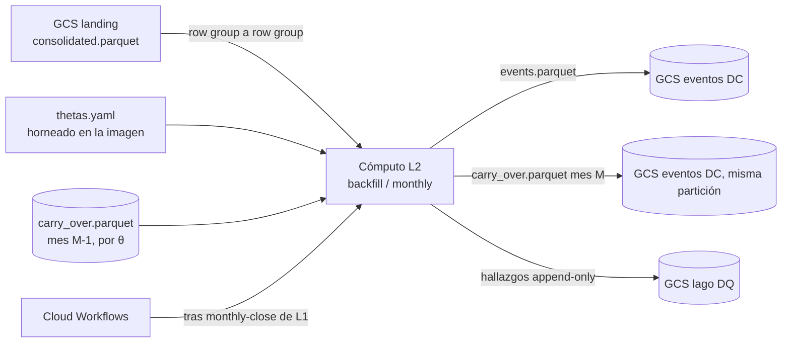

# Documento de Requerimientos Técnicos — Capa 2 (TRD-L2)

## Detección de eventos Directional Change (extremo, confirmación, overshoot) para 50 θ sobre aggTrades de BTC/USDT

> **Capa DC Events · Arquitectura Medallion · Single-Node Big Data · Google Cloud Platform**

|Campo        |Valor                                                                           |
|-------------|--------------------------------------------------------------------------------|
|Documento    |TRD-L2 — Capa de detección de eventos DC                                        |
|Versión      |**1.1**                                                                         |
|Estado       |Línea base. Cierra todo lo que el TRD maestro deja abierto para L2, ADR-04 incluido. |
|Fecha        |Septiembre de 2026                                                              |
|Documento padre|TRD maestro v2.0 / v2.1                                                        |
|Alcance      |Capa 2 (DC Events) de la capa Batch                                              |
|Clasificación|Académico / Uso personal                                                        |
|Contexto     |Trabajo de grado — Maestría en Finanzas · Universidad EAFIT (Medellín, Colombia)|

### Historial de revisiones

|Versión|Fecha|Descripción|
|---|---|---|
|1.0|Sep 2026|Línea base inicial. Fija la aritmética entera del detector, porta a L2 la regla de empates y la validación "un DC tiene al menos un tick" de `kernel.py` de la v0, cierra el contrato de salida (fila por evento, partición, 50 θ) y el carry-over O(1) por θ. Deja abierto únicamente ADR-04 (Cloud Run Jobs vs Cloud Batch), a cerrar con una sonda de dimensionamiento. Es la fuente única de decisiones para las siete hijas siguientes de la Épica: ninguna reabre lo que aquí se fija.|
|1.1|Sep 2026|Cierra ADR-04 con la sonda de dimensionamiento (ITSC-281, ITSC-282): L2 corre en **Cloud Run Jobs** con 2 vCPU y 4 GiB; Cloud Batch con Spot no hace falta. Actualiza §10.2, §10.3, §11, RL2-08 y §14 con la medición y el veredicto.|
|1.2|Oct 2026|Cierra en §14.1 el pendiente (c): por qué más vCPU no aceleraba (GIL retenido, hilos del fan-out por `floor(cuota)`, escritores por cores visibles y lectura de GCS en serie, ITSC-290). El tamaño de vCPU se remide con la imagen nueva; ADR-04 no se reabre salvo que esa medición lo pida.|
|1.3|Oct 2026|El catálogo de θ pasa a ser un dato en GCS (`gs://<proyecto>-manifest/l2/thetas.yaml`) y cada θ lleva su propia frontera (ITSC-285): agregar un θ no requiere PR ni reprocesa los demás. Actualiza RF-L2-07 y RF-L2-09, §7.3, §8.2, §8.3, §9.3, §11 y RL2-05; `theta_config_drift` cambia de sentido y se suman `theta_catalog_invalid` y `theta_behind_frontier`.|

-----

## Cómo leer este documento

Este TRD detalla la **Capa 2** y **hereda las invariantes** fijadas por el TRD maestro y por el TRD-L1 (contrato de entrada, orden, tipos, particionado, presupuesto). No las repite salvo cuando las concreta. La v0 (`legacy/v0-local`, tag `v0.2.0-legacy`) es la referencia de comportamiento del detector — no de arquitectura: L2 porta su aritmética probada (regla de empates, validación de DC no vacío) pero descarta su estado con ticks huérfanos en favor de un estado O(1) por θ (maestro §9.2).

- Si buscas **qué construye L2 y con qué garantías** → secciones 4 y 5 (requerimientos).
- Si buscas **el qué y el porqué de cada decisión** → sección 6 (ADR de capa).
- Si buscas **la aritmética exacta del detector** → sección 6.2–6.4 y 7.2.
- Si buscas **el esquema exacto de salida y el carry-over** → sección 7 (contrato de datos).
- Si buscas **el algoritmo paso a paso** → sección 8 (pipeline interno).
- Si buscas **cómo se cerró ADR-04 y qué queda pendiente** → sección 14.

-----

## Tabla de contenido

1. [Introducción y propósito](#1-introducción-y-propósito)
1. [Invariantes heredadas del TRD maestro y de L1](#2-invariantes-heredadas-del-trd-maestro-y-de-l1)
1. [Alcance de la Capa 2](#3-alcance-de-la-capa-2)
1. [Requerimientos funcionales de L2](#4-requerimientos-funcionales-de-l2)
1. [Requerimientos no funcionales de L2](#5-requerimientos-no-funcionales-de-l2)
1. [Decisiones de diseño de L2 (ADR de capa)](#6-decisiones-de-diseño-de-l2-adr-de-capa)
1. [Contrato de datos](#7-contrato-de-datos)
1. [Pipeline interno y modos de ejecución](#8-pipeline-interno-y-modos-de-ejecución)
1. [Validaciones y política de calidad de datos](#9-validaciones-y-política-de-calidad-de-datos)
1. [Arquitectura de cómputo, dimensionamiento y costo](#10-arquitectura-de-cómputo-dimensionamiento-y-costo)
1. [Operaciones](#11-operaciones)
1. [Riesgos y mitigaciones](#12-riesgos-y-mitigaciones)
1. [Criterios de aceptación](#13-criterios-de-aceptación)
1. [Ítems abiertos y a validar](#14-ítems-abiertos-y-a-validar)
1. [Anexos](#15-anexos)

-----

## 1. Introducción y propósito

La Capa 2 es el **corazón analítico** de la plataforma: transforma la serie de ticks ordenada de L1 en una serie de **eventos Directional Change (DC)**, para cada uno de 50 umbrales θ. Donde L1 garantiza que el dato de entrada es correcto, L2 garantiza que la **transformación** —el muestreo por tiempo intrínseco— es determinista, reproducible bit a bit y aritméticamente exacta: un error de redondeo aquí no se queda localizado, se propaga a las 50 cadenas de θ y a todo lo que L3/L4 y el backtesting calculen sobre ellas.

A diferencia de L1, donde los meses son independientes (§3.1 del maestro), en L2 los meses de un mismo θ son una **cadena secuencial**: el mes M consume el estado con el que terminó M-1 y produce el estado con el que empieza M+1. Los 50 θ, en cambio, son cadenas independientes entre sí y se evalúan compartiendo la misma serie en memoria (ADR-02 del maestro, fan-out por tick).

Este documento cierra, para L2, todo lo que el TRD maestro deja abierto (ADR-04 incluido, §14): la aritmética entera del detector, la regla de empates y la validación de eventos heredadas de la v0, el contrato de salida por evento, el particionado y los 50 θ, y el carry-over O(1) que reemplaza al almacenamiento de huérfanos de la v0.

-----

## 2. Invariantes heredadas del TRD maestro y de L1

L2 hereda y no contradice:

- **Región única us-east1**, **Parquet** comprimido en Cloud Storage, **presupuesto** ≤ 100 USD/mes (objetivo < 5 USD/mes en estado estacionario).
- **Particionado hive** por `provider × market × asset × …`; L2 es quien **introduce la dimensión θ** en el particionado (el maestro se la reserva explícitamente, §3.3).
- **Idempotencia y reanudabilidad** (RF-12/RF-13 del maestro): re-ejecutar un mes de un θ produce un resultado idéntico (por ventana y por θ, RF-12). La reanudación es **por θ**: cada θ retoma desde su propia frontera (el último mes de su cadena de carry-over válido) y un mes se lee una sola vez para todos los θ que lo necesitan (§8.2, RF-13, ITSC-285).
- **Reusabilidad batch↔streaming**: el núcleo de detección debe poder alimentarse desde Parquet (batch) o desde websocket (Kappa, futuro) sin reescritura (RF-11, RNF-09 del maestro).
- **IaC reproducible** (Terraform) y **mínimo privilegio** (IAM, service accounts por job).
- **Terminología** *stack*/*environment*; este TRD pertenece al stack `batch`.
- **Contrato de entrada**: el Parquet conformado de L1, en la forma exacta de [TRD-L1 §7.2](l1.md#72-salida--parquet-conformado-de-l1-contrato-hacia-l2) / [`docs/data-contracts.md`, "Salida Parquet de L1"](../data-contracts.md#salida-parquet-de-l1). En particular: `price`/`quantity` como `DECIMAL(18,8)` respaldado en INT64, `transact_time` en microsegundos, orden por (`transact_time`, `agg_trade_id`), `agg_trade_id` como INT64 estrictamente creciente, partición mensual `consolidated.parquet` **inmutable** una vez cerrada.
- **Idempotencia y `content_hash`** como en L1: `write.py` de L1 es la referencia de mecanismo (escritura atómica vía temporal + `commit`, `content_hash` sobre el contenido lógico); L2 reutiliza el mismo patrón, no uno nuevo.

**Decisiones que no se reabren aquí** (ya fijadas fuera de este documento; L2 las hereda como dadas):

|Decisión|Dónde se fijó|Qué fija para L2|
|---|---|---|
|Rust solo en el detector|Entrada de Documentación "Decisión: Rust solo en el detector de L2"|El hot loop (equivalente a `segment_events_kernel` de la v0) es Rust; la orquestación (I/O, manifiesto, emisión de hallazgos, CLI) puede seguir en Python, como en L1.|
|Fan-out por tick multihilo intra-proceso|ADR-02 del maestro; §7.4 del maestro|La serie de la ventana se carga una vez, read-only, compartida entre los 50 θ; cada θ mantiene su propio estado O(1) escalar. El paralelismo entre θ es intra-proceso (hilos), no procesos ni VMs separadas.|
|Ventana mensual con carry-over|ADR-01 del maestro|La dependencia secuencial por θ y el carry-over son propiedad de L2 (no de L1); 96 checkpoints por cadena de θ.|
|Eficiencia de memoria ante todo|[Decisión: eficiencia de memoria ante todo](https://app.notion.com/p/3e727957d23d811887eaf14c886b9a0c) (2026-09-26)|La serie se lee **por row group** de `consolidated.parquet` (`ROW_GROUP_SIZE = 1_000_000` filas, `layers/l1_ingest/src/l1_ingest/write.py`; ~32 MB decodificado por row group: `price` como `decimal128` de 16 B más `transact_time` y `agg_trade_id` de 8 B cada uno), nunca entera; cada row group se libera de RAM en cuanto los 50 θ lo consumieron; no coexisten dos representaciones (p. ej. decimal + float) del mismo precio.|

-----

## 3. Alcance de la Capa 2

### 3.1 Dentro de alcance

- Detección de eventos DC (referencia, confirmación, extremo) para los θ del **catálogo** (§7.3; la semilla son 50), sobre el histórico completo desde 2017-08.
- Ejecución **mensual** encadenada por θ: backfill de los 96 meses en orden y ejecución incremental tras cada `monthly-close` de L1.
- **Carry-over O(1) por θ**: persistencia del estado del detector al cierre de cada mes y su consumo por el mes siguiente.
- Materialización a Parquet particionado por `provider × market × asset × theta × year × month`.
- Emisión de hallazgos de calidad de datos propios de L2 (carry-over faltante o de otra versión, deriva de configuración de θ, eventos descartados por la validación de longitud mínima).
- `content_hash` e idempotencia por partición, como en L1.

### 3.2 Fuera de alcance (se difiere)

- **Cálculo de tramas e indicadores** (L3/L4): L2 solo emite el evento; los resúmenes por evento y las métricas son capas posteriores.
- **Consumo de hallazgos** (BigQuery externo + Looker): igual que en L1, solo se persiste.
- **Implementación de Cloud Batch**: ADR-04 (§14) se cerró a favor de Cloud Run Jobs, así que Batch no se implementa; solo se abriría una Épica de Batch si se reabre ADR-04 (§14, "Qué lo reabriría").
- **Extensibilidad multi-activo real**: el diseño no debe impedirla (partición por `asset`), pero la primera implementación es mono-activo (BTCUSDT), igual que L1.
- **Capa Kappa (streaming real)**: el núcleo debe ser reusable (RF-11); conectarlo a un websocket no es parte de esta capa.

-----

## 4. Requerimientos funcionales de L2

*Prioridad MoSCoW: M (Must), S (Should), C (Could). Trazabilidad al RF del maestro entre paréntesis.*

|ID       |Nombre                              |Descripción                                                                                                                       |Prio.|
|---------|-------------------------------------|-----------------------------------------------------------------------------------------------------------------------------------|-----|
|RF-L2-01 |Detección DC multi-θ (RF-05)        |Detectar eventos DC (referencia, confirmación, extremo) para los 50 θ, compartiendo una sola lectura de la serie por mes.          |M    |
|RF-L2-02 |Aritmética entera del detector      |Comparar precio contra umbral usando exclusivamente enteros (INT64/i128 intermedio); ningún paso del hot loop usa punto flotante.  |M    |
|RF-L2-03 |Regla de empates y DC no vacío      |Aplicar la regla conservadora de empates por timestamp y la validación "un DC tiene al menos un tick" de `kernel.py` de la v0.     |M    |
|RF-L2-04 |Carry-over por θ (RF-06)            |Consumir el estado O(1) de M-1 y persistir el de M al cierre, por cada θ.                                                          |M    |
|RF-L2-05 |Contrato de salida por evento       |Escribir una fila por evento confirmado, con referencia/confirmación/extremo (precio, tiempo, `agg_trade_id`), dirección y θ.      |M    |
|RF-L2-06 |Particionado por θ y mes            |Materializar `events.parquet` bajo `provider × market × asset × theta × year × month`; el mes lo decide la confirmación del evento siguiente, que es cuando se conoce el extremo.     |M    |
|RF-L2-07 |Catálogo de θ como dato             |Los θ son un parámetro del experimento: viven en un catálogo editable en GCS, validado antes de cada corrida (§7.3). Los 50 θ iniciales, generados por una regla documentada (ADR-L2-10), son su semilla.|M    |
|RF-L2-08 |Idempotencia y `content_hash` (RF-12)|Re-ejecutar un mes de un θ produce un `events.parquet` con `content_hash` idéntico, igual que en L1.                              |M    |
|RF-L2-09 |Reanudabilidad por θ (RF-13)        |Cada θ tiene su frontera (el último mes de su cadena de carry-over válido, §8.2); el backfill avanza cada θ solo desde ahí. Un mes se lee una sola vez y lleva únicamente los θ que lo necesitan, así que el costo de agregar un θ no depende de los demás.|M    |
|RF-L2-10 |Imagen única por modos              |Una sola imagen L2 con modos `backfill` / `monthly` (RF-15 del maestro).                                                           |M    |
|RF-L2-11 |Hallazgos de calidad de datos       |Emitir hallazgos propios de L2 (carry-over, configuración de θ) al lago de DQ compartido (RF-20/RF-21 del maestro).                |M    |
|RF-L2-12 |Reusabilidad streaming (RF-11)      |El núcleo Rust del detector no asume una fuente Parquet; recibe ticks por una interfaz agnóstica de origen, con una señal explícita de fin de entrada para cerrar un grupo de empate todavía abierto (§8.1 paso 4).|S    |

-----

## 5. Requerimientos no funcionales de L2

|ID        |Atributo                |Requerimiento                                                                                                                        |Prio.|
|----------|-------------------------|--------------------------------------------------------------------------------------------------------------------------------------|-----|
|RNF-L2-01 |Eficiencia de memoria    |Pico de memoria de una unidad de trabajo es **O(row group)**, no O(mes): un row group de 1.000.000 filas (~32 MB decodificado) en vuelo por vez, liberado tras el fan-out de los 50 θ; el estado de los 50 θ es O(1) cada uno.|M    |
|RNF-L2-02 |Correctitud determinista |Cero comparaciones en punto flotante en el hot loop; el ancho de entero (i64 almacenado, i128 intermedio) está dimensionado para no desbordar (§6.2).|M    |
|RNF-L2-03 |Portabilidad / reúso (RNF-09)|El núcleo de detección es agnóstico de la fuente (Parquet batch hoy, websocket en la futura Kappa).                              |S    |
|RNF-L2-04 |Rendimiento (RNF-02)     |El backfill completo (96 meses × 50 θ) corre en el orden de horas en un único nodo.                                                    |S    |
|RNF-L2-05 |Acoplamiento débil (RNF-14)|L2 se comunica con L1 y con L3 solo por contratos de datos Parquet documentados (§7).                                               |M    |
|RNF-L2-06 |Reproducibilidad de imágenes (RNF-13)|Cada partición es trazable a la imagen exacta (semver + git SHA) que la generó, igual que en L1.                              |S    |
|RNF-L2-07 |Latencia predecible (RNF-10)|El hot loop Rust no introduce pausas de GC; condición necesaria (no suficiente) para la futura Kappa.                              |C    |
|RNF-L2-08 |Sin secretos             |L2 no requiere Secret Manager: lee de buckets propios del project vía IAM, sin credenciales de terceros.                              |M    |

-----

## 6. Decisiones de diseño de L2 (ADR de capa)

*Cada decisión hereda las invariantes del maestro y de L1, y las concreta para L2.*

### 6.1 ADR-L2-01 — Aritmética entera: precio y θ comparten el mismo entero escalado

|Campo|Contenido|
|---|---|
|**Decisión**|El detector no usa punto flotante. El precio que entra al hot loop es el **entero con signo de escala implícita** que respalda `DECIMAL(18,8)` en L1 (`price_int = round(price × 10⁸)`, ya calculado por L1, **no recalculado** por L2). θ se representa con la **misma escala, `SCALE = 10⁸`**: `theta_int = round(θ × 10⁸)`. Ambos son `i64`.|
|**Justificación**|Usar la escala de L1 para θ elimina una conversión de unidad en el hot loop: no hay "escala de precio" y "escala de θ" que reconciliar, hay una sola constante `SCALE` para ambos. Es la misma razón por la que L1 fija DECIMAL exacto (ADR-L1-03): comparar floats es no determinista bit a bit entre plataformas/compiladores; comparar enteros es exacto y reproducible.|
|**Detalle de lectura**|Arrow materializa `decimal128` siempre en 128 bits en memoria (el ahorro a INT64 que documenta L1 es una optimización de la codificación física de **Parquet en disco**, no del layout en memoria de Arrow). L2 lee el `i128` que expone `arrow-rs` y lo **angosta a `i64`** inmediatamente, validando que cabe (ver bounds abajo): un único cast, sin mantener el valor ancho más de lo necesario, en línea con la decisión de eficiencia de memoria de no mantener dos representaciones del mismo dato.|

### 6.2 ADR-L2-02 — Umbral en enteros: ensanchar a i128 para multiplicar, angostar a i64 para comparar

|Campo|Contenido|
|---|---|
|**Decisión**|El umbral de reversión se calcula así, sin float en ningún paso: para un **upturn** (extremo de referencia = mínimo), `threshold = ceil_div(ext_low_int × (SCALE + theta_int), SCALE)`; para un **downturn** (extremo de referencia = máximo), `threshold = floor_div(ext_high_int × (SCALE − theta_int), SCALE)`. La multiplicación se hace en **`i128`**; el resultado de la división se angosta a **`i64`** antes de comparar. La confirmación dispara cuando `price_int ≥ threshold` (upturn) o `price_int ≤ threshold` (downturn).|
|**Por qué ensanchar a i128 y no más**|Cota del peor caso: `price_int` cabe en `i64` por contrato de L1 (`DECIMAL(18,8)`, ≤ 18 dígitos significativos, `< 10^18`); `theta_int` está acotado por el rango de θ (§6.10, `≤ 5×10⁶` para θ ≤ 0.05). El producto `price_int × (SCALE ± theta_int)` alcanza `~10^18 × 1.05×10^8 ≈ 10^26`, que **desborda `i64`** (máx. `~9.22×10^18`) por siete órdenes de magnitud, pero cabe con margen en `i128` (máx. `~1.7×10^38`). Tras dividir por `SCALE = 10^8`, el resultado vuelve a la magnitud de un precio (`~10^18`) y cabe en `i64`. Esto es exactamente lo que pide el maestro: fijar el ancho de entero que evita el desbordamiento, no ensanchar todo el pipeline a 128 bits sin necesidad (que costaría el doble de ancho de banda de memoria en el hot loop, contra la decisión de eficiencia de memoria).|
|**Por qué `ceil` en upturn y `floor` en downturn (no redondeo simétrico)**|El marco DC (`DC_FRAMEWORK.md` v0, §3.4) establece que la magnitud real de un DC nunca es menor a θ (`TMV ≥ θ`; el slippage del muestreo discreto solo puede sumar, nunca restar, al movimiento mínimo). Redondear el umbral hacia el extremo de referencia (`ceil` cuando el umbral crece desde el mínimo; `floor` cuando decrece desde el máximo) garantiza que un entero que pasa la comparación cumple la fracción real `≥ θ` exacta; redondear al valor más cercano podría, en el peor caso, aceptar un movimiento a `10⁻⁸` de distancia por debajo de θ, violando el invariante en el borde. El costo es un sesgo de a lo sumo una unidad de precio (`10⁻⁸`), imperceptible en la práctica.|

### 6.3 ADR-L2-03 — Regla conservadora de empates y validación "un DC tiene al menos un tick" (porta `kernel.py` de la v0)

|Campo|Contenido|
|---|---|
|**Decisión**|Se porta a L2, en aritmética entera, el comportamiento de `segment_events_kernel` (v0, `src/intrinseca/core/kernel.py`): (1) **Regla conservadora de empates**: entre los ticks que comparten el `transact_time` del primer tick que cruza el umbral, en un upturn se elige el de **precio mínimo** que aún cumple `≥ threshold`; en un downturn, el de **precio máximo** que aún cumple `≤ threshold`. (2) **Inclusión completa del instante de confirmación**: todos los ticks de ese mismo `transact_time` pertenecen a la fase DC (nunca al Overshoot); el índice de confirmación es el del **último** tick del grupo, no el del precio elegido. El instante de confirmación es **atómico**: los ticks del grupo no evalúan reversión ni actualizan el extremo reiniciado; ese extremo solo lo mueven ticks de instantes posteriores (§8.1 paso 4). Es una divergencia intencional con el kernel de la v0, que sí seguía evaluando esos ticks (ADR-L2-04). (3) **Validación "un DC tiene al menos un tick"**: si el tick de confirmación no queda estrictamente después del extremo de referencia, el evento se descarta sin emitir fila — pero el detector **sí adopta la nueva tendencia** (no continúa en la anterior): el extremo opuesto al que disparó la detección (el que la nueva tendencia necesitará como referencia para su propia reversión) se reinicia con el precio elegido y el `agg_trade_id` del último tick del grupo de empate, y el evento pendiente que ya estaba abierto (de una confirmación anterior) sigue abierto, sin verse afectado.|
|**Terna del extremo reiniciado**|El extremo que se reinicia en cada confirmación (rama (3) válida o inválida) arranca con la terna de esa misma confirmación: precio = `confirm_price` (el elegido por la regla de empates), tiempo = `confirm_time` y `agg_trade_id` = `confirm_agg_trade_id`, ambos del último tick del grupo de empate (§7.2). Es solo el punto de partida: desde ahí el extremo se sigue tick a tick, a partir del primer instante posterior al de la confirmación (§8.1 paso 4), y solo queda fijado como `extreme_*` de este evento — e, igual, como `reference_*` del evento siguiente (§7.2) — cuando ese evento siguiente confirma; el valor final no siempre coincide con la terna de arranque. Es una divergencia intencional de la v0 (ADR-L2-04): `kernel.py` guarda el precio elegido pero el **índice** del último tick, así que su `reference_price` del evento siguiente sale de `prices[prev_ext_idx]` — el precio real de ese último tick, no el elegido — una inconsistencia interna de la v0, no un contrato a preservar. L2 fija una terna completa y coherente.|
|**Adaptación de índice a `agg_trade_id`**|La v0 comparaba **índices de array** en un buffer en memoria completo (`prev_ext_idx >= conf_idx`). L2 lee row-group a row-group (§2, eficiencia de memoria): no existe un índice de array estable entre lotes. Se reemplaza el índice por **`agg_trade_id`**, que por contrato de L1 es INT64 estrictamente creciente y ya sirve de desempate de orden (ADR-L1-01): la validación pasa a ser `confirm.agg_trade_id > reference.agg_trade_id`. Es equivalente **dentro de la ventana**, no un reemplazo exacto en todo caso: dentro de una misma ventana en memoria, índice de array y `agg_trade_id` son ambos biyectivos con el orden de la serie. En el borde difieren — la v0 arranca los extremos heredados con `ext_high_idx = ext_low_idx = 0` (el primer índice del buffer), así que su validación puede disparar falsamente en el primer tick de una ventana nueva; con `agg_trade_id` real (el del último tick del carry-over anterior) eso no ocurre. Es una divergencia intencional de comportamiento en el borde (ADR-L2-04), no un defecto de la adaptación.|
|**Justificación**|Esta aritmética es la parte de la v0 que **sí** está validada por 8 años de datos reales; el TRD no la reinventa. Lo que sí cambia es el ancho de los datos que compara (float en v0, entero en L2, ADR-L2-01/02) y el ámbito del estado que necesita para operar (array completo en v0, O(1) más el `agg_trade_id` del propio tick en L2).|

### 6.4 ADR-L2-04 — Discrepancias con la v0 por redondeo float: la v0 no es oráculo

|Campo|Contenido|
|---|---|
|**Decisión**|Cuando L2 (aritmética entera exacta) y la v0 (float IEEE-754) difieran en la clasificación de un tick de frontera —un tick a `10⁻⁸` o menos del umbral—, **prevalece L2**. La v0 no es la fuente de verdad a igualar; es la implementación de referencia que motivó portar la regla de empates (ADR-L2-03), no un gozne de aceptación bit a bit.|
|**Justificación**|El redondeo binario de float no tiene una regla documentada ni auditable: puede aceptar o rechazar un tick de frontera de forma no trazable a una decisión de diseño. El entero de L2 sí la tiene (ADR-L2-02, redondeo dirigido hacia el extremo). Perseguir paridad exacta con la v0 en el borde congelaría un comportamiento no especificado como si fuera contrato.|
|**Alcance de la política**|Cubre el redondeo float en ticks de frontera (dentro de `10⁻⁸` relativo del umbral) y, además, una lista cerrada de divergencias de comportamiento ya declaradas intencionales en este documento, ninguna de ellas de redondeo: la terna del extremo reiniciado tras una confirmación (§6.3, "Terna del extremo reiniciado"), el comportamiento en el borde de una ventana nueva por usar `agg_trade_id` en vez de índice de array (§6.3, "Adaptación de índice a `agg_trade_id`") y el instante de confirmación atómico (fila "Divergencia: instante de confirmación atómico", abajo). Fuera de esos casos y del margen de redondeo, L2 y la v0 deben coincidir siempre; una discrepancia ahí **sí** es un defecto de la migración. Cualquier prueba de equivalencia contra la v0 (si una hija posterior la escribe) compara conteos de eventos y estadísticos agregados por θ, no identidad tick a tick en el borde ni en los casos de esta lista.|
|**Divergencia: instante de confirmación atómico**|Tercer caso de la lista cerrada. En la v0, tras confirmar en el tick `t`, el bucle retoma en `t+1` y cada tick del mismo `transact_time` vuelve a pasar por la actualización de extremos (paso 1) y por la detección de reversión (paso 2) de `kernel.py`: dentro de un solo instante puede mover el extremo reiniciado e incluso confirmar la reversión contraria. L2 no lo hace: los ticks del instante de confirmación pertenecen al DC y no evalúan reversión ni mueven el extremo (ADR-L2-03 (2), §8.1 paso 4). Son dos decisiones con justificaciones distintas. **(a) No evaluar reversión:** el kernel contradecía la regla que la propia v0 documenta, `DC_FRAMEWORK.md` §3.4 y el comentario de `kernel.py` sobre el "instante de confirmación": todos los ticks de ese instante van al DC. Una reversión confirmada dentro del instante abriría otra fase DC con ticks que ya pertenecen a la anterior (su `dc_start` quedaría antes del último tick del grupo) y partiría el instante entre dos DC. L2 sigue la regla documentada, no el descuido de su implementación. **(b) No mover el extremo:** no se deriva de la regla DC/OS: en `kernel.py`, que un tick del grupo mueva `ext_high`/`ext_low` no lleva ticks al Overshoot (`prev_os_start = conf_idx + 1`). Es decisión de arquitectura del humano (review del PR #56, 2026-09-28): el instante es atómico también para el precio, se representa con un solo valor, `confirm_price`. La regla conservadora de empates ya reduce el instante al precio menos favorable a la confirmación; arrancar el extremo con el precio más favorable del mismo instante le daría dos precios distintos a un solo instante sin orden interno confiable. **Consecuencias:** por (a), la v0 puede emitir eventos (o descartarlos por la validación de §9.1) que L2 nunca produce, porque confirman una reversión dentro del mismo instante que la anterior. Por (b), cuando el grupo sigue más allá de `confirm_price` (p. ej. un upturn cuyo instante trae 100, que cruza, y 110), el extremo arranca en 100 y el 110 no se cuenta: `extreme_price` del evento (y `reference_price` del siguiente) puede ser menos extremo que un precio del instante de confirmación, el Overshoot y el TMV quedan sesgados a la baja, y el umbral de la reversión siguiente se calcula desde ese extremo. Es más frecuente que (a): ocurre en cada confirmación cuyo grupo sigue más allá del precio elegido. La diferencia de conteos por θ con la v0 incluye ambos casos.|

### 6.5 ADR-L2-05 — Contrato de salida: una fila por evento con referencia, confirmación y extremo

|Campo|Contenido|
|---|---|
|**Decisión**|Cada evento DC confirmado es **una fila** con tres puntos completos —referencia, confirmación, extremo—, cada uno con precio, tiempo y `agg_trade_id`, más dirección y θ. Ver esquema completo en §7.2.|
|**Justificación**|Es la unidad natural del marco DC (`DC_FRAMEWORK.md`, §3.2–3.5): referencia (extremo del evento anterior, define el arranque), confirmación (DCC, cierra la fase DC), extremo (cierra la fase Overshoot, es la referencia del siguiente evento). Guardar los tres en una sola fila evita joins entre "evento" y "extremo" en L3/L4, que consumen ambas fases por evento.|
|**Consecuencia: llenado retrospectivo se vuelve espera, no relleno en memoria**|En la v0 (`kernel.py` §8.2.4), el extremo de un evento se rellena retrospectivamente **en el mismo buffer en memoria** cuando confirma el evento siguiente. L2 no mantiene ese buffer entre meses: si el evento siguiente todavía no confirma al cierre del mes, la fila **no se escribe todavía** — queda como evento pendiente en el carry-over (§6.7) hasta que el mes en el que sí confirma la completa y la escribe.|

### 6.6 ADR-L2-06 — Partición `provider × market × asset × theta × year × month`; la confirmación del evento siguiente decide el mes

|Campo|Contenido|
|---|---|
|**Decisión**|`events.parquet` particiona por `provider=<p>/market=<m>/asset=<a>/theta=<t>/year=YYYY/month=MM/`. Un evento se escribe en la partición del **mes que confirma el evento siguiente** — el mes que conoce su extremo (el tick que cierra su fase Overshoot) —, no del mes de su referencia ni de su confirmación. `extreme_time` puede pertenecer a un mes anterior al de la partición: lo que fija el mes es cuándo se resuelve el extremo, no la fecha del propio tick extremo.|
|**Justificación**|Es la única regla que no exige tocar nunca una partición ya cerrada. La referencia y la confirmación de un evento ya se conocen en el instante en que el evento confirma (mismo mes que lo procesa); el extremo, en cambio, solo se conoce cuando confirma el **siguiente** evento (ADR-L2-05) — y es ese mes de confirmación, no el mes del propio tick extremo, el que decide la partición. Fechar por el mes que resuelve el extremo significa que cada partición mensual solo contiene eventos que ese mismo mes terminó de resolver — exactamente los que puede escribir con la información que tiene, sin reabrir el mes anterior. Fechar por el mes de `extreme_time` o por el de la confirmación del propio evento, en cambio, obligaría a reescribir una partición ya inmutable cuando el Overshoot cruza el borde.|
|**Caso general, no solo el borde**|Al cierre de casi todo mes hay un evento "abierto" (el último confirmado, extremo aún desconocido): es el caso normal que resuelve el carry-over (§6.7), no una excepción, sea cual sea θ. Lo que θ cambia es cuánto dura: con θ grande los eventos son escasos y es más probable que el evento siga pendiente varios meses seguidos.|
|**Nombre de archivo**|`events.parquet`, análogo al `consolidated.parquet` de L1: una sola vez por mes cerrado, sin variante provisional (L2 no tiene concepto de "provisional" — ver ADR-L2-09).|

### 6.7 ADR-L2-07 — Carry-over O(1) por θ: Parquet de una fila, no Arrow IPC de huérfanos

|Campo|Contenido|
|---|---|
|**Decisión**|El carry-over es un Parquet de **una sola fila** por partición `theta × year × month`, con los campos escalares de §7.4: dirección, ambos extremos candidatos (alto y bajo, cada uno con precio/tiempo/`agg_trade_id`) y el evento pendiente sin extremo (referencia y confirmación, si existe). Se escribe junto a `events.parquet`, en la misma partición del mes que lo produce; el mes siguiente lo lee desde ahí.|
|**Contraste con la v0**|`state.py` de la v0 persistía los **ticks huérfanos completos** (arrays de precio/tiempo/cantidad/dirección) en Arrow IPC (Feather), porque su algoritmo de stitching reprocesaba esos ticks contra la ventana siguiente. L2 no reprocesa ticks: el estado que necesita para continuar es exactamente el que describe el maestro §9.2 — extremo, dirección, evento pendiente — sin buffer de ticks. Sin buffer que justifique el mmap zero-copy de Feather, Parquet es la opción consistente con el resto del contrato (mismo formato, mismo `content_hash`, misma escritura atómica que L1 y que `events.parquet`).|
|**Por qué ambos extremos, no solo el activo**|Son el estado exacto del kernel de la v0, que actualiza `ext_high` y `ext_low` en cada tick sin importar la tendencia vigente. Con `direction = 0` (sin ninguna reversión confirmada aún) ambos son necesarios para decidir cuál dispara la primera tendencia. Con `direction` ya establecida, el extremo que no es la referencia activa queda en un estado transitorio: al confirmar la reversión, ADR-L2-03 lo reinicia con la terna de esa confirmación (no con el valor que traía acumulado) para que sirva de referencia a la reversión siguiente — persistir el campo, aunque su valor previo no sobreviva al reinicio, es lo que permite reproducir ese reinicio sin reprocesar ticks.|
|**Formato**|Parquet, compresión ZSTD-3 (consistencia, no ahorro: el archivo pesa un puñado de filas). `content_hash` como en L1, aplicado también al carry-over: dos corridas del mismo mes con el mismo carry-over de entrada deben producir un carry-over de salida idéntico.|

### 6.8 ADR-L2-08 — Carry-over faltante o de otra versión: fail-closed, no log-and-continue

|Campo|Contenido|
|---|---|
|**Decisión**|Para cualquier mes que no sea el primero de la serie para un θ dado: si el carry-over esperado **no existe**, o su `state_version` no coincide con la versión de esquema que la imagen actual sabe leer, la tarea **aborta** esa unidad (θ, mes) y emite un hallazgo `error`. No hay política de "continuar sin estado" para L2.|
|**Justificación — por qué L2 no hereda el log-and-continue de L1**|En L1 (§9.2 de TRD-L1) un hueco de `agg_trade_id` es local a la partición: el resto del pipeline sigue siendo correcto porque los meses son independientes (ADR-01 del maestro). En L2 los meses de un θ son una **cadena secuencial**: arrancar sin el carry-over correcto no pierde un dato, corrompe silenciosamente el detector completo desde ese punto — el estado que falta (extremo, dirección) es insumo directo del cálculo, no un dato adicional a validar después. Tratar "sin estado" como "estado inicial" (dirección indefinida, extremo = primer precio del mes) produciría eventos con apariencia válida pero de origen incorrecto, indistinguibles de eventos reales.|
|**Primer mes de la serie**|Es el único caso legítimo sin carry-over previo: se inicializa igual que la v0 en frío (`current_trend = 0`; `ext_high = ext_low` = precio del primer tick del mes; sin evento pendiente). Se distingue de "carry-over faltante" por posición (`year/month` es el mínimo configurado para el backfill de ese θ), no por inferencia.|
|**Recuperación**|La tarea abortada no avanza el checkpoint de reanudación (RF-L2-09): el humano debe resolver el motivo (re-ejecutar el mes anterior, o reprocesar con la imagen correcta) antes de que el mes siguiente pueda continuar. No hay auto-sanación en la POC, igual que ADR-L1-08 para L1.|

### 6.9 ADR-L2-09 — L2 solo consume `consolidated.parquet`; nunca los provisionales diarios de L1

|Campo|Contenido|
|---|---|
|**Decisión**|L2 solo lee la partición mensual **canónica e inmutable** de L1 (`consolidated.parquet`, post `monthly-close`). Nunca lee `provisional-day=DD.parquet`.|
|**Justificación**|Un provisional puede ser reemplazado por el cierre mensual (ADR-L1-06): si L2 avanzara su cadena de estado sobre datos que luego cambian, el carry-over que produjo quedaría basado en un extremo o una confirmación que el consolidado puede corregir — y, a diferencia de L1 (que corrige reescribiendo la partición del mes), L2 no puede "reabrir" un mes ya encadenado sin invalidar todos los meses posteriores de ese θ. Esperar al consolidado es el precio de la corrección: L2 no tiene, ni necesita, modo `daily`.|
|**Consecuencia en modos**|L2 tiene dos modos, no tres (§8): `backfill` (histórico, sobre consolidados ya cerrados) y `monthly` (incremental, agendado **después** del `monthly-close` de L1 del mes correspondiente). No existe un modo diario de L2.|

### 6.10 ADR-L2-10 — Los 50 θ: rango log-espaciado, congelado en un archivo versionado

|Campo|Contenido|
|---|---|
|**Decisión**|Los 50 θ se generan una vez con la regla `θᵢ = θ_min · (θ_max / θ_min)^(i / (N-1))`, `i = 0..49`, `N = 50`, `θ_min = 0.0001` (1 punto básico), `θ_max = 0.05` (5 %); cada `θᵢ` se redondea a `theta_int = round(θᵢ × 10⁸)` (misma escala que ADR-L2-01). El resultado —no la fórmula— se congela en `layers/l2_dc_events/src/l2_dc_events/config/thetas.yaml`, que desde ITSC-285 es la **semilla** del catálogo (la fuente de verdad en la nube es el objeto de §7.3); la fórmula es solo el procedimiento para regenerarlo si una hija futura decidiera ampliar el rango, y no altera retroactivamente lo ya versionado.|
|**Justificación del rango**|`DC_FRAMEWORK.md` (v0, §3.1) documenta el rango típico de la literatura, `θ ∈ [0.001, 0.05]`, y su propia recomendación de calibración para datos de tick: "θ puede ser tan pequeño como 0.0001". Con aggTrades (resolución de tick), se toma el extremo inferior de esa recomendación como `θ_min`.|
|**Justificación del espaciado logarítmico (no lineal)**|Las leyes de escala del marco DC (Glattfelder et al. 2011, citadas en `DC_FRAMEWORK.md` §1) son relaciones sobre `log(θ)`: un espaciado lineal (paso `≈ 0,00102` entre consecutivos) deja la década `[10⁻⁴, 10⁻³)` con un solo punto —`θ_min` mismo— y apenas ~5 de los 50 puntos caen en el primer decil lineal del rango; la década inferior, la más relevante para datos de tick, queda sin muestrear. El espaciado geométrico, en cambio, da peso igual a cada década (~18,5 puntos por década en las ~2,7 décadas del rango), que es como se leen esas leyes de escala en el análisis posterior (L4/ML).|
|**Ejemplo (no exhaustivo — la lista completa vive en el config)**|`θ₀ = 0.0001` (`10.000` en unidades de `10⁻⁸`); `θ₄₉ = 0.05` (`5.000.000`); paso multiplicativo `r = (θ_max/θ_min)^(1/49) ≈ 1,13522`, p. ej. `θ₅ ≈ 0,0001886`.|
|**Colisión tras redondeo**|Con 8 decimales de resolución y un paso mínimo de ~13,5 % entre consecutivos, ningún par de `θᵢ` redondeados puede coincidir; la generación del config incluye, de todos modos, una aserción de que la lista resultante es estrictamente creciente, para que un cambio futuro de `N`/rango no la viole en silencio.|

-----

## 7. Contrato de datos

### 7.1 Entrada — Parquet conformado de L1

Único contrato de entrada: [TRD-L1 §7.2](l1.md#72-salida--parquet-conformado-de-l1-contrato-hacia-l2) / [`docs/data-contracts.md`, "Salida Parquet de L1"](../data-contracts.md#salida-parquet-de-l1). L2 lee `consolidated.parquet` (nunca provisionales, ADR-L2-09) **row group por row group** (`ROW_GROUP_SIZE = 1_000_000` filas, `write.py` de L1, tal como L1 los escribe), usando directamente:

- `price` → `price_int` (i64, escala `10⁸`, ADR-L2-01), sin recalcular la conversión de L1.
- `transact_time` (i64, µs UTC) y `agg_trade_id` (i64) → identidad de cada punto de referencia/confirmación/extremo.

`quantity`, `first_trade_id`, `last_trade_id`, `is_buyer_maker`, `is_best_match` no participan en la detección; L2 no los lee para el hot loop (L3/L4, si los necesitan, vuelven a L1).

### 7.2 Salida — `events.parquet` (contrato hacia L3)

Una fila por evento DC confirmado. `PRICE_SCALE = 10⁸` para todo campo de precio, igual que L1.

|Columna                    |Tipo Parquet   |Notas|
|----------------------------|--------------|-----|
|`reference_price`           |DECIMAL(18,8) |Precio del extremo que define el arranque del evento (el extremo del evento anterior).|
|`reference_time`            |INT64 (µs UTC)|Timestamp de la referencia.|
|`reference_agg_trade_id`    |INT64         |`agg_trade_id` de la referencia.|
|`confirm_price`             |DECIMAL(18,8) |Precio de confirmación (DCC); regla conservadora de empates, ADR-L2-03.|
|`confirm_time`              |INT64 (µs UTC)|Timestamp del **último** tick del grupo de empate (no del precio elegido).|
|`confirm_agg_trade_id`      |INT64         |`agg_trade_id` del **último** tick del grupo de empate, igual criterio que `confirm_time` (no el del precio elegido).|
|`extreme_price`             |DECIMAL(18,8) |Precio del extremo que cierra el Overshoot de este evento — el máximo (upturn) o mínimo (downturn) seguido tick a tick desde la confirmación de este evento (arranca en la terna reiniciada de ADR-L2-03 y solo la actualizan ticks de instantes posteriores al de la confirmación, nunca los del propio grupo de empate, §8.1 paso 4) hasta la confirmación del siguiente; es igual a `reference_price` del evento siguiente. Conocido solo cuando confirma el evento siguiente (ADR-L2-05). **Invariante:** `extreme_agg_trade_id ≥ confirm_agg_trade_id` y `extreme_time ≥ confirm_time`, siempre. El Overshoot puede ser vacío, nunca negativo ni partido entre dos fases. **Overshoot vacío:** si el evento siguiente confirma antes de que un tick de un instante posterior supere la terna de arranque —incluso en el primer instante después de la confirmación—, `extreme_*` es igual a `confirm_*` (`extreme_price = confirm_price`, `extreme_time = confirm_time`, `extreme_agg_trade_id = confirm_agg_trade_id`) y el Overshoot no tiene ticks. L3 debe tratar su duración como cero, no como un dato inválido; la v0 tolera el mismo caso (`if os_length > 0`, `kernel.py`).|
|`extreme_time`              |INT64 (µs UTC)|Timestamp del extremo — igual a `reference_time` del evento siguiente.|
|`extreme_agg_trade_id`      |INT64         |`agg_trade_id` del extremo — igual a `reference_agg_trade_id` del evento siguiente.|
|`direction`                 |INT8          |`1` = upturn, `-1` = downturn.|
|`theta`                     |DECIMAL(9,8)  |θ del evento, misma escala que los precios (`10⁻⁸`); redundante con la partición, para lectura sin `hive_partitioning`.|

**Propiedades físicas:** ZSTD-3, estadísticas por columna, ordenado por `confirm_time` (orden de confirmación dentro de la partición). `content_hash` sobre el contenido lógico, igual mecanismo que `l1_ingest.write.content_hash`.

**Particionado hive:**

```
provider=binance/market=spot/asset=BTCUSDT/theta=<t>/year=YYYY/month=MM/
```

- `theta=<t>`: string de ancho fijo, `"0."` + 8 dígitos decimales, sin recorte de ceros (`theta=0.00010000`, …, `theta=0.05000000`). Ancho fijo evita la representación de longitud variable de `format_theta()` en la v0 (`state.py`), que no colisiona pero ordena mal como string y no deja evidente la escala compartida con el precio.
- **Archivo:** `events.parquet`. Un evento pertenece a la partición del **mes que confirma el evento siguiente** (ADR-L2-06), no a la de su referencia, su confirmación, ni necesariamente la de `extreme_time`.

### 7.3 El catálogo de θ

θ es un parámetro del experimento, no código: agregar uno es editar un objeto y lanzar L2, sin PR y sin reprocesar los θ que ya existen. La trazabilidad no la da el archivo sino la partición `theta=<t>`, la columna `theta`, `image_version` y el versionado del bucket.

**Fuente de verdad en la nube:** `gs://<proyecto>-manifest/l2/thetas.yaml`. La CLI toma la ruta de `L2_THETAS_URI` (o `--thetas-uri`, que gana). Sin ninguno de los dos usa la **semilla**, `layers/l2_dc_events/src/l2_dc_events/config/thetas.yaml` (los 50 θ de ADR-L2-10), que viaja dentro de la imagen y sirve para local y pruebas. Los dos tienen el mismo formato:

```yaml
scale: 100000000        # 10^8, coincide con PRICE_SCALE
thetas:                  # round(θ × 10^8), en cualquier orden
  - 10000                # 0.00010000
  - 11352                # 0.00011352
  # ... uno por θ
```

**Validación**, antes de tocar nada: `scale` exactamente `10⁸`; `thetas` una lista no vacía de enteros (la escala exacta: ningún valor es un decimal que haya que redondear), **únicos** y dentro de **[10⁻⁴, 5·10⁻²]**, es decir `10000 ≤ θ ≤ 5000000`. El orden es libre; la corrida los ordena de menor a mayor. Si el objeto no existe, no se puede leer o incumple algo, la corrida termina con **código 2**, emite el hallazgo `theta_catalog_invalid` (§9.3) y no escribe datos.

**Quitar un θ no borra nada:** sus particiones quedan en el lago y L2 deja de avanzarlo (`theta_config_drift`, §9.3). Cambiar el valor de un θ no existe: es quitar uno y agregar otro.

**Escala de costo:** los eventos los dominan los θ pequeños. Un θ grande agrega casi nada; uno diminuto multiplica el volumen de `events.parquet` (con θ = 0,01 % hay un evento cada pocos ticks).

### 7.4 Carry-over — contrato y disposición física

Un Parquet de **una fila** por `(theta, year, month)`, escrito junto a `events.parquet` en la partición del mes que lo produce.

|Columna                        |Tipo Parquet |Nulable|Notas|
|--------------------------------|-------------|-------|-----|
|`provider,market,asset`         |STRING       |no     |Coordenadas del dato, redundantes con la partición (igual criterio que el manifiesto de L1).|
|`theta`                         |DECIMAL(9,8) |no     |θ de esta cadena.|
|`year`,`month`                  |INT32        |no     |Mes que produjo este estado (se consume desde `month+1`).|
|`state_version`                 |STRING       |no     |semver del esquema de carry-over que escribió la imagen; se compara contra lo que la imagen que lee sabe interpretar (ADR-L2-08).|
|`direction`                     |INT8         |no     |`0` = indefinida (aún sin ninguna reversión confirmada), `1` = upturn, `-1` = downturn.|
|`ext_high_price/time/agg_trade_id`|DECIMAL(18,8)/INT64/INT64|no|Extremo alto vigente al cierre del mes.|
|`ext_low_price/time/agg_trade_id` |DECIMAL(18,8)/INT64/INT64|no|Extremo bajo vigente al cierre del mes.|
|`has_pending_event`             |BOOLEAN      |no     |`true` si hay un evento confirmado cuyo extremo aún no se conoce (el caso general tras el primer evento de la serie, ADR-L2-05).|
|`pending_reference_price/time/agg_trade_id`|DECIMAL(18,8)/INT64/INT64|sí|Referencia del evento pendiente. Nulo si `has_pending_event = false`.|
|`pending_confirm_price/time/agg_trade_id`  |DECIMAL(18,8)/INT64/INT64|sí|Confirmación del evento pendiente. Nulo si `has_pending_event = false`. (Su dirección es `direction`: no se repite.)|

**Consumo por M+1:** M+1 carga el único carry-over `year=M.year/month=M.month/` de su θ, inicializa `direction`/`ext_high`/`ext_low` del detector con esos valores en vez de arrancar en frío, y si `has_pending_event`, retiene la referencia/confirmación pendientes hasta el mes en que confirma el evento siguiente (M+1 o posterior; si M+1 tampoco confirma, el evento pasa sin cambios a su propio carry-over) — ese mes escribe la fila en **su propia** partición (ADR-L2-06), no en la de M.

**Primer mes de la serie:** sin carry-over previo por definición (§6.8); se inicializa en frío como la v0.

**Carry-over faltante o de otra versión (mes ≠ primero):** fail-closed, sin log-and-continue (ADR-L2-08).

-----

## 8. Pipeline interno y modos de ejecución

### 8.1 Núcleo compartido (común a los dos modos)

1. **Cargar** el carry-over de `(θ, año, mes-1)` para cada θ que el mes procesa (o inicializar en frío si es el primer mes de la serie, §6.8). Los θ del mes son los que necesitan avanzar (§8.2).
1. **Abrir** `consolidated.parquet` del mes a procesar (ADR-L2-09) y **leer row group por row group** (RNF-L2-01): nunca la ventana mensual completa en memoria.
1. Por cada row group: para cada tick, evaluar los 50 θ (fan-out por tick, ADR-02 del maestro) contra su propio estado O(1), usando la aritmética entera de ADR-L2-01/02 y la regla de empates de ADR-L2-03.
1. **Regla de empates como máquina de estados, no lookahead sobre un buffer**: la v0 mira hacia adelante en el array completo en memoria (`while j < n and timestamps[j] == conf_ts`, §6.3); L2 no tiene ese buffer (lee row-group a row-group, y RF-L2-12 exige una interfaz por tick para la futura Kappa, que tampoco puede mirar hacia adelante). En su lugar, al cruzar el umbral la confirmación queda **"en grupo abierto"**: se retienen el mejor precio que cumple el umbral y el `agg_trade_id` del último tick visto, actualizándose tick a tick mientras `transact_time` no cambie — incluso si el siguiente tick llega en el row group siguiente. El instante de confirmación es **atómico** (ADR-L2-03 (2)): mientras el grupo sigue abierto, sus ticks solo alimentan la regla de empates; **no evalúan reversión ni actualizan ningún extremo**. La confirmación se cierra en el primer tick con un `transact_time` distinto, y en ese cierre el extremo opuesto se reinicia con la terna de la confirmación (`confirm_price`, `confirm_time`, `agg_trade_id` del último tick del grupo). Desde ese primer tick de un instante posterior, el detector vuelve al ciclo normal: ese tick y los siguientes actualizan el extremo y evalúan la reversión contraria, que puede confirmarse de inmediato; si ocurre antes de que el extremo se mueva, el Overshoot del evento anterior queda vacío, con `extreme_*` igual a `confirm_*` (§7.2). Es una divergencia intencional con la v0, cuyo bucle retoma en `t+1` y hace pasar cada tick del grupo por la actualización de extremos y por la detección de reversión (ADR-L2-04, "Divergencia: instante de confirmación atómico"). Ningún grupo de empate cruza el borde de mes en sentido estricto: el primer tick de M+1 tiene, por construcción, un `transact_time` distinto del último tick de M. Pero M nunca llega a ver ese tick de M+1 —se procesa en otra invocación—, así que si el último tick de M queda dentro de un grupo todavía abierto, el fin de la entrada de M debe tratarse como el mismo cierre que un cambio de `transact_time`, antes de los pasos 7 y 8 (escribir `events.parquet` y el carry-over). RF-L2-12 expone esa señal de fin de entrada en su interfaz por tick, para que la futura Kappa pueda cerrar el mismo tipo de grupo al final de su propia unidad de trabajo.
1. Cada confirmación que pasa la validación "un DC tiene al menos un tick" cierra el evento pendiente anterior (le asigna su `extreme_*`) y abre uno nuevo (con la `reference_*` = extremo recién cerrado, `confirm_*` = la confirmación actual).
1. **Liberar** el row group antes de leer el siguiente (eficiencia de memoria: no coexisten dos row groups ni dos representaciones del mismo precio).
1. Al terminar el mes: los eventos con `extreme_*` ya conocido (cerrados dentro de este mes) van a `events.parquet` de este mes; el evento todavía abierto (si lo hay) y el estado de extremos/dirección de cada θ se escriben en `carry_over.parquet` de este mes.
1. **Registrar** `content_hash` de ambos archivos; escritura atómica (temporal + `commit`), igual mecanismo que L1.

### 8.2 Modo `backfill` (histórico)

- **Frontera por θ.** Antes de procesar, la unidad calcula la frontera de cada θ del catálogo: el último mes de su cadena de carry-over, **contigua desde `--series-start`** (un hueco la rompe: el carry-over de un mes sale del anterior) y con un `carry_over.parquet` **válido** al final (existe, de la `state_version` de la imagen, con el esquema y el θ de su partición; si el último no lo es, la frontera retrocede al anterior). No hay manifiesto de L2 y los hallazgos `events_summary` no dicen si el archivo sigue ahí, así que la frontera sale de **un solo listado recursivo** de la raíz de eventos del activo más la lectura del carry-over de la frontera de cada θ; no se consulta cada partición. Un θ sin frontera arranca en `--series-start`.
- **Un mes, una lectura, los θ que lo necesitan.** Recorre `[--from, --to]` en **orden estricto** y en un solo proceso (la cadena de carry-over lo exige; no es un task array de meses independientes como en L1 — ADR-01 del maestro). En cada mes el fan-out lleva solo los θ cuya frontera es anterior a ese mes; al terminarlo, la frontera de esos θ es ese mes. Un mes que ningún θ necesita **se salta sin leer L1**. Con el catálogo sin cambios y todo al día, la corrida termina en segundos sin escribir.
- **Rango.** `--from` es opcional: por defecto `--series-start`, y la frontera de cada θ decide desde dónde avanza. `--to` por defecto es el último mes con `consolidated.parquet` en L1 (nunca provisionales, ADR-L2-09). `--thetas` acota la corrida a un subconjunto del catálogo (en decimal, como en la ruta: `0.00010000`); un θ fuera del catálogo es un error de uso (código 2).
- **`--force`** ignora la frontera: reprocesa todo `[--from, --to]` para los θ elegidos (idempotente, RF-L2-08). Exige `--from` (código 2 sin él), como en ITSC-279: sin él reprocesaría la serie completa por un argumento mal puesto. Con `--from` posterior a `--series-start` exige el carry-over del mes anterior, como siempre.
- **Agregar un θ.** Editar el catálogo y lanzar `l2-backfill` sin `--from`: el θ nuevo recorre la serie desde el inicio mientras los demás se saltan, y sus archivos no se tocan (mismo `content_hash`). El paralelismo del backfill es **entre θ** dentro de un mes, no entre meses.
- Un fallo detiene el rango; los meses siguientes no se tocan. Corregida la causa, relanzar retoma desde las fronteras.

### 8.3 Modo `monthly` (incremental)

- Se agenda **después** de que L1 publique el `consolidated.parquet` del mes vía `monthly-close` (orquestación Cloud Workflows, encadenando L1→L2 como en el playbook del maestro §8.6).
- Procesa el mes anterior (o `--from`) **solo para los θ del catálogo cuya frontera es el mes previo**, consumiendo su carry-over. Un θ que ya llegó al mes se salta. Un θ **rezagado** (agregado sin backfill, o con un hueco en su cadena) no se procesa: deja el hallazgo `theta_behind_frontier` con su frontera y, si otros θ sí están listos, la unidad no falla. Si ningún θ está listo y hay rezagados, la unidad termina con código 1 sin leer L1 (fail-closed, §9.2): un `monthly` perdido deja a todos los θ con frontera n-2, y eso no debe pasar como éxito. Si ningún θ necesita el mes y ninguno está rezagado (todos ya lo tienen), termina con código 0.

### 8.4 Frontera de mes

No hay un paso especial: es el mecanismo general de los pasos 5–7 de §8.1 (incluido el cierre de grupo abierto al fin de la entrada del mes, §8.1 paso 4). Un evento cuyo evento siguiente aún no confirma al cierre del mes queda, en ese cierre, como el `has_pending_event` del carry-over (§7.4); el mes en el que sí confirma lo completa y lo escribe en su propia partición (ADR-L2-06).

-----

## 9. Validaciones y política de calidad de datos

### 9.1 Validación algorítmica: "un DC tiene al menos un tick"

No valida el dato de entrada, sino una invariante del detector (ADR-L2-03), idéntica en espíritu a la de la v0: si la confirmación no queda estrictamente después de la referencia (por `agg_trade_id`), el "evento" no se emite — el detector adopta igual la nueva tendencia y reinicia el extremo opuesto (§6.3), sin que eso cuente como un evento nuevo. En L2 es una **guarda defensiva**, no una caracterización del mercado: se cuenta por θ y por mes, y un conteo mayor que cero emite el hallazgo `dc_zero_tick_discarded` (`error`, `fail`, §9.3). No aborta la unidad: la única compuerta que aborta es la del carry-over (§9.2).

Su frecuencia difiere de la v0 por la divergencia del instante de confirmación atómico (ADR-L2-04). En la v0, la rama se dispara sobre todo cuando un tick del mismo instante confirma la reversión contraria y el extremo reiniciado no se movió; L2 no evalúa reversión dentro del instante de confirmación (§8.1 paso 4), así que ese caso no existe en L2. Con la regla atómica, la referencia de una confirmación siempre es anterior al tick que cruza el umbral, y `confirm_agg_trade_id` es el del último tick del grupo: la rama queda como guarda defensiva y su conteo se espera en cero. Un conteo distinto de cero señala un defecto del detector, no un caso de mercado.

### 9.2 Compuerta de carry-over

Carry-over faltante o `state_version` incompatible en un mes que no es el primero de la serie: **fail-closed** (ADR-L2-08). Es la única compuerta de L2 que aborta en vez de continuar-con-hallazgo, porque el estado que falta es insumo del cálculo, no un dato adicional a auditar después (contraste explícito con L1 §9.2, que sí continúa ante un hueco).

### 9.3 Tipos de chequeo (`check_type`)

|`check_type`            |`severity`|`status`            |Cuándo|
|-------------------------|----------|--------------------|------|
|`carry_over_missing`     |`error`   |`fail`              |Mes ≠ primero de la serie sin carry-over previo (§6.8).|
|`carry_over_version_mismatch`|`error`|`fail`             |`state_version` del carry-over no coincide con lo que la imagen actual sabe leer, o el archivo no se puede leer o su columna `theta` no es la de su partición.|
|`theta_config_drift`     |`info`    |`pass`              |El lago tiene particiones de un θ que ya no está en el catálogo (§7.3); `details` lleva `theta`, `months` y `last_month`, y `metric_value` los meses. Informa, nunca es error: quitar un θ no borra nada. Antes de ITSC-285 señalaba una columna `theta` distinta de la partición; ese caso ahora es `carry_over_version_mismatch`.|
|`theta_catalog_invalid`  |`error`   |`fail`              |El catálogo de θ no existe, no se puede leer o incumple §7.3; `details` lleva `source` y `problems`. La corrida termina con código 2 sin escribir datos (ITSC-285).|
|`theta_behind_frontier`  |`warning` |`fail`              |`monthly` no procesó un θ porque su frontera no es el mes previo (§8.3); `details` lleva `theta` y `frontier` (`YYYY-MM`, o `null` si no tiene). No falla la unidad si otros θ avanzan; si ninguno está listo, la unidad termina con código 1 (§8.3, ITSC-285).|
|`dc_zero_tick_discarded` |`error`   |`fail`              |La validación de §9.1 descartó al menos un evento en un θ y mes (el conteo va en `details`). Con el instante atómico el conteo esperado es cero: uno mayor señala un defecto del detector. Con conteo cero no se emite.|
|`input_missing`          |`error`   |`fail`              |El mes no tiene `consolidated.parquet` ni provisionales: L1 no lo ha publicado (ITSC-244).|
|`input_provisional_only` |`error`   |`fail`              |El mes solo tiene `provisional-day=DD.parquet`: L2 espera el `monthly-close` de L1 (ADR-L2-09, ITSC-244).|
|`events_summary`         |`info`    |`pass`              |Uno por θ al cerrar el mes: número de eventos y `content_hash` de `events.parquet` y `carry_over.parquet` en `details` (ITSC-244).|
|`unit_timing`            |`info`    |`pass`              |Uno por unidad (mes) al cerrarla: pared y tiempo por fase (lectura, decodificación, detección, escritura, carry-over), límite efectivo de CPU y bytes leídos en `details`; `metric_value` es la pared (ITSC-289). Va aparte de `events_summary` porque este es por θ y su `details` debe coincidir entre dos corridas del mes, y los tiempos nunca coinciden.|

Todos los hallazgos de L2 llevan `layer = "l2"`, `mode ∈ {backfill, monthly}`, `stage = "canonical"` (L2 no tiene noción de provisional, ADR-L2-09).

### 9.4 Emisión

Misma función compartida `emit_findings()` de `/shared/dq` que usa L1 (RF-21 del maestro): log de consola + fila persistida en el lago unificado de DQ (§7.3/§3.4 del maestro). El esquema de hallazgos no gana una columna `theta`: el θ del hallazgo viaja en `details` (payload JSON libre), como cualquier otro dato propio de un `check_type`. `docs/data-contracts.md` ya gana `mode = monthly` en su catálogo de modos válidos (junto a `backfill`, `daily`, `monthly-close`, `seam-check`) y, desde ITSC-244, el catálogo de hallazgos incluye los `check_type` de §9.3.

-----

## 10. Arquitectura de cómputo, dimensionamiento y costo

### 10.1 Vista de cómputo



### 10.2 Dimensionamiento (medido; ADR-04 cerrado)

**Configuración fijada:** Cloud Run Jobs, **2 vCPU / 4 GiB** en los dos modos, con `max_retries = 1` y estos timeouts (`infra/stacks/batch/l2/main.tf`):

|Modo|Timeout|Regla|Base|
|---|---|---|---|
|`monthly`|2400 s|≥ 6× la pared del mes más pesado, también contra la peor corrida|8,2× 292,2 s; 8,0× 301,1 s|
|`backfill`|54000 s (15 h)|≥ 1,5× la pared extrapolada de los 109 meses y ≤ 86400 s|1,7× 31850 s (109 × 292,2 s)|

**Medición (sonda ITSC-281, 2026-09-30):** mes 2023-03, el más pesado (190.227.841 ticks), imagen `l2_dc_events:0.5.0`, 4 GiB en las tres corridas, sin OOM ni timeout. Detalle y enlaces a los runs en [`docs/runbooks/sonda-l2.md`](../runbooks/sonda-l2.md).

|vCPU|RSS pico (MiB)|Pared (s)|vCPU-s|GiB-s|Costo de lista (USD)|
|---|---|---|---|---|---|
|2|446|292,2|584|1.169|0,0129|
|4|446|261,5|1.046|1.046|0,0209|
|8|445|301,1|2.409|1.204|0,0458|

- **Memoria:** el RSS pico es ~446 MiB y no cambia con la CPU: 11 % de 4 GiB, contra el 75 % que permite la regla de L1. Coincide con lo esperado por RNF-L2-01 (un row group más 50 estados O(1)): el pico no crece con los ticks. Se fija 4 GiB, la memoria medida, y no menos, porque bajarla sería extrapolar.
- **CPU:** la pared **no baja con más vCPU** (292,2 s con 2, 261,5 con 4 y 301,1 con 8). Con una corrida por configuración, 261 frente a 301 s puede ser ruido; lo sólido es que más CPU no acelera. Por eso se elige 2 vCPU: la pared es la misma y el costo es 3,5× menor que con 8 vCPU. Con 1 vCPU no se midió (el README de `l2_dc_events` ya lo pedía) y no se fija sin medirlo.
- **Timeout de `monthly`:** un mes recién cerrado es de ordinario mucho más liviano que 2023-03; 2400 s cubre el peor caso con 8,2× de margen (8,0× contra la corrida más lenta, 301,1 s, de modo que el 6× no depende de una sola corrida).
- **Timeout de `backfill`:** L2 no usa task array (los meses se encadenan por carry-over), así que la pared del backfill es la suma de los meses y el timeout de Cloud Run es por tarea. 109 × 292,2 s = 31.850 s (8,85 h) es un techo, porque repite el mes más pesado 109 veces. 54000 s lo cubre 1,7× y queda bajo el tope de 86.400 s que acepta el módulo `layer`.

### 10.3 Costo de L2

Medido con la sonda de ADR-04 (§10.2), a tarifas de lista de Cloud Run Jobs del 2026-09-30 en `us-east1` (vCPU-s 0,000018 USD, GiB-s 0,000002 USD), sin descontar el cupo gratis:

|Concepto|vCPU-s|GiB-s|Costo de lista (USD)|Con cupo gratis (USD)|
|---|---|---|---|---|
|Mes más pesado (2023-03), 2 vCPU / 4 GiB|584|1.169|0,0129|—|
|Backfill de 109 meses, techo (109 × mes más pesado)|63.700|127.399|1,40|0,00|

El backfill cabe entero en el cupo mensual gratis de Cloud Run (360.000 GiB-s y 180.000 vCPU-s): usa 35 % de ambos, si L1 no consumió cupo ese mes. Con 8 vCPU habría superado el cupo de vCPU-s (146 %) y costado 1,49 USD con cupo. El estado estacionario (`monthly`, un mes por mes) cuesta como máximo lo que el mes más pesado, 0,013 USD de lista, y cae dentro del cupo.

Contra Cloud Batch, solo hay una referencia por tarifa, no una medición: `c2d-standard-8` Spot (0,083 USD/h, maestro §7.2) por las 8,85 h del techo da ~0,73 USD antes de disco y arranque de VM. Es del mismo orden que el costo de lista de Cloud Run (1,40 USD) y más caro que su costo con cupo (0,00), y suma gestión de VMs y preempción. En el costo de la corrida de 2 vCPU, 0,0105 de los 0,0129 USD son vCPU-s: domina la CPU y no la memoria, el reverso de L1 (memory-bound), que ata el cupo por GiB-s.

-----

## 11. Operaciones

- **Imagen:** una sola imagen L2 (RF-L2-10) con modos `backfill` / `monthly`, igual patrón que L1 (RF-15 del maestro).
- **Cómputo:** Cloud Run Jobs, 2 vCPU / 4 GiB (§10.2), según ADR-04 (§14).
- **Orquestación:** Cloud Workflows encadena L1 (`monthly-close`) → L2 (`monthly`); Cloud Scheduler no agenda L2 directamente (depende del evento de cierre de L1, no de un calendario propio).
- **IaC:** módulo Terraform `layer` instanciado para L2 (bucket/prefijo de eventos DC, prefijo de carry-over dentro de la misma partición, IAM mínimo).
- **IAM:** service account de L2 con permisos de lectura sobre el bucket `landing` de L1 (solo `consolidated.parquet`) y de lectura/escritura sobre su propio bucket de eventos DC. Sin Secret Manager (RNF-L2-08).
- **Config:** el catálogo de θ es un objeto en `gs://<proyecto>-manifest/l2/thetas.yaml` (`L2_THETAS_URI`, §7.3), que el humano edita sin PR. La service account de L2 lo lee (`roles/storage.objectViewer` bajo `l2/` del bucket `manifest`). La semilla `thetas.yaml` sigue horneada en la imagen para local y pruebas.
- **Observabilidad:** Cloud Logging + lago de hallazgos de DQ (§9); meta-métricas operativas (eventos por θ, duración) diferidas al mismo consumo diferido que L1. `dc_zero_tick_discarded` es un hallazgo de §9.3, no una meta-métrica.

-----

## 12. Riesgos y mitigaciones

|ID    |Riesgo|Impacto|Mitigación|
|------|------|-------|----------|
|RL2-01|Desbordamiento de enteros en la multiplicación de umbral.|Alto|Ensanchado obligatorio a `i128` antes de dividir (ADR-L2-02); cotas de `price_int`/`theta_int` documentadas y verificables en tiempo de compilación/prueba.|
|RL2-02|Carry-over corrupto o de versión vieja se acepta silenciosamente.|Alto|Fail-closed (ADR-L2-08); `state_version` explícito, sin inferencia de compatibilidad.|
|RL2-03|Redondeo del umbral relaja el invariante `TMV ≥ θ`.|Medio|Redondeo dirigido (`ceil`/`floor` hacia el extremo, ADR-L2-02), no redondeo simétrico.|
|RL2-04|Un evento cuyo evento siguiente aún no confirma al cierre de mes se pierde o se duplica.|Alto|Carry-over con `has_pending_event` explícito (§7.4); el evento se escribe una única vez, en la partición del mes que confirma el evento siguiente (ADR-L2-06).|
|RL2-05|Un θ agregado o quitado del catálogo después de tener historia escrita desalinea lago y catálogo.|Bajo|La partición lleva el θ y la frontera es por θ (§8.2): agregar no reprocesa nada y quitar no borra. `theta_config_drift` (§9.3) informa los θ del lago fuera del catálogo; `theta_behind_frontier` avisa de los que `monthly` no pudo avanzar.|
|RL2-06|Perseguir paridad bit a bit con la v0 en ticks de frontera consume esfuerzo sin valor.|Bajo|Política explícita de que la v0 no es oráculo en el borde (ADR-L2-04).|
|RL2-07|Cadena secuencial por θ impide paralelizar meses; el backfill es más lento que L1.|Medio|El paralelismo es entre los 50 θ (independientes), no entre meses; aceptado como propiedad del algoritmo, no un defecto a resolver.|
|RL2-08|Dimensionamiento de cómputo (Cloud Run Jobs vs Batch) fijado sin medir.|Medio|Cerrado: ADR-04 se fijó con la sonda de dimensionamiento (§10.2 y §14, ítem 1); no se implementó Batch por reflejo.|

-----

## 13. Criterios de aceptación

1. El detector no ejecuta ninguna comparación de precio contra umbral en punto flotante; el umbral se calcula con multiplicación en `i128` y división angostada a `i64`, con redondeo dirigido (`ceil` en upturn, `floor` en downturn).
1. La regla conservadora de empates y la validación "un DC tiene al menos un tick" reproducen, sobre datos reales, el mismo criterio de decisión que `kernel.py` de la v0 (adaptado a `agg_trade_id` en vez de índice de array), fuera de la lista cerrada de divergencias intencionales de ADR-L2-04; se verifica por conteo de eventos por θ, no por identidad tick a tick en el borde ni en esos casos. La diferencia de conteo por θ entre L2 y la v0 debe explicarse entera por esa lista y por el margen de redondeo; en particular, por las reversiones que la v0 confirma dentro del instante de confirmación de la anterior y L2 no, y por el extremo que L2 no mueve con los ticks de ese instante (instante atómico, (a) y (b)). Por (b), `extreme_price`/`reference_price` de L2 puede ser menos extremo que un precio del instante de confirmación; es el comportamiento esperado, no un defecto. La validación de §9.1 se verifica aparte: su conteo en L2 es cero, es decir, ningún hallazgo `dc_zero_tick_discarded` (§9.3).
1. `events.parquet` de un mes cerrado contiene una fila por evento con referencia/confirmación/extremo completos (precio, tiempo, `agg_trade_id`), dirección y θ; ningún evento con extremo pendiente aparece en él.
1. El carry-over de un mes permite reanudar exactamente el estado del detector (dirección, ambos extremos, evento pendiente) sin reprocesar ticks anteriores.
1. Un mes procesado sin el carry-over correcto de su predecesor (faltante o de otra versión) aborta con un hallazgo `error`, sin producir `events.parquet` ni avanzar el checkpoint de reanudación.
1. Los θ salen del catálogo validado de §7.3 (la semilla `thetas.yaml` son los 50 de la regla log-espaciada de ADR-L2-10, estrictamente crecientes); agregar uno no reprocesa los demás.
1. `content_hash` es estable: re-ejecutar un mes de un θ con el mismo carry-over de entrada produce `events.parquet` y `carry_over.parquet` con `content_hash` idéntico.
1. El pico de memoria de una unidad de trabajo (row group + 50 estados O(1)) se mide y queda muy por debajo de la ventana mensual completa.

-----

## 14. Ítems abiertos y a validar

El único ítem que el TRD maestro dejaba abierto para L2 y que la v1.0 de este documento no cerraba era **ADR-04 (Cloud Run Jobs vs Cloud Batch)**. La v1.1 lo cierra con la sonda.

|# |Ítem|Estado|Resolución|
|--|----|------|----------|
|1 |**ADR-04 — Cloud Run Jobs vs Cloud Batch para L2**|**Cerrado** (v1.1)|**Veredicto: Cloud Run Jobs, 2 vCPU / 4 GiB.** Cloud Batch con Spot no hace falta. Medición y configuración en §10.2, costo en §10.3; la decisión completa y su porqué, en el bloque siguiente.|

### 14.1 ADR-04 — Cómputo de L2: Cloud Run Jobs (cerrado)

|Campo|Contenido|
|---|---|
|**Decisión**|L2 corre en **Cloud Run Jobs**, una imagen con los modos `backfill` y `monthly`, con **2 vCPU / 4 GiB**, `max_retries = 1`, timeout de 2400 s en `monthly` y de 54000 s en `backfill`. Cloud Batch con Spot no se implementa.|
|**Regla (escrita antes de medir)**|Se aplicó sobre la corrida de 8 vCPU, el techo de Cloud Run Jobs. Cloud Run Jobs si (1) el mes más pesado corre sin OOM con RSS pico ≤ 75 % de 32 GiB y (2) 109 × la pared del mes más pesado < 86.400 s. Cloud Batch solo si falla alguna.|
|**Medición**|Mes 2023-03 (190,2 M de ticks): RSS pico 445 MiB de 24.576 MiB (1,8 %), sin OOM; 109 × 301,1 s = 32.820 s (9,12 h), 38 % del tope de 24 h. Cumple las dos. Números por vCPU en §10.2; fuente en [`docs/runbooks/sonda-l2.md`](../runbooks/sonda-l2.md).|
|**Justificación**|La carga usa 1,8 % de la memoria del techo de Cloud Run Jobs (11 % de los 4 GiB fijados) y deja un factor 2,6 de holgura en tiempo aun con el techo del backfill. Cloud Run Jobs no exige gestionar VMs ni preempción, y el backfill cae dentro del cupo gratis mensual con 2 vCPU. Cloud Batch solo compraría paralelismo que la medición dice que L2 no usa: la pared no mejora de 2 a 8 vCPU.|
|**vCPU elegidos**|2: pared 292,2 s frente a 261,5 s (4) y 301,1 s (8), a 3,5× menos costo que 8 vCPU. La diferencia de pared entre configuraciones puede ser ruido (una corrida cada una); el costo no.|
|**Alternativa descartada**|Cloud Batch + Spot (`c2d-standard-8`). Descartada por la regla, no por una medición propia de Batch: solo hay una referencia de costo por tarifa (§10.3), del mismo orden que Cloud Run.|
|**Qué lo reabriría**|Que el mes más pesado crezca hasta incumplir alguna de las dos condiciones de la regla, o que L2 pase a necesitar más de 8 vCPU / 32 GiB por tarea. Entonces se abre una Épica del módulo batch; esta decisión no la crea.|
|**Pendiente (fuera de esta decisión)**|(a) 1 vCPU no se midió; si se quiere bajar el costo, hay que medirlo antes (ITSC-286). (b) La sonda reportaba `cores` de la máquina y no el límite del job (6, 6 y 9 con 2, 4 y 8 vCPU), así que `ticks_s_core` de su línea no servía. ITSC-289 lo corrige: `cores` es la cuota del cgroup (`cpu.max`) o, sin ella, los cores visibles, y `cores_visible` conserva el dato viejo. (c) **Cerrado (ITSC-290).** Más vCPU no aceleraba por cuatro cuellos medidos en laboratorio (cgroup v1, cuota 1,97, 100 M de ticks), no por falta de paralelismo disponible: (1) el binding retenía el GIL durante la detección y los escritores de Parquet esperaban; (2) los hilos del fan-out eran `floor(cuota)` (`available_parallelism` divide con enteros), así que con las cuotas que Cloud Run entregó para 2 vCPU (1,61, 1,86 y 1,97) el detector corrió con un hilo; (3) los escritores eran los cores visibles (5 o 6), no la cuota, y sobresuscribían el cgroup; (4) la lectura de GCS era en serie, 237 row groups a ~0,3 s. Además, el Parquet con diccionario sobre columnas de alta cardinalidad costaba 5× más de codificar y 1,7× más de volumen. ITSC-290 los corrige sin cambiar el contrato (detalle y medidas en el README de la capa). **El tamaño de vCPU se remide con esa imagen**; ADR-04 solo se reabre si esa medición lo pide.|

-----

## 15. Anexos

### 15.1 Glosario (adiciones a L2)

|Término|Definición|
|---|---|
|Extremo (referencia/EXT)|Precio máximo o mínimo local que define el arranque de un evento DC; es el punto donde termina la fase Overshoot del evento anterior. Arranca en `confirm_price` al reiniciarse (ADR-L2-03) y se actualiza tick a tick, desde el primer instante posterior al de la confirmación, hasta que la confirmación siguiente lo fija como `extreme_*` de ese evento y `reference_*` del que empieza. Es máximo o mínimo local de esos ticks, no de los del instante de confirmación: un precio de ese instante más allá de `confirm_price` no cuenta (ADR-L2-04, "Divergencia: instante de confirmación atómico", (b)).|
|Confirmación (DCC)|Primer precio observado (bajo la regla conservadora de empates) que cruza el umbral θ desde el extremo; cierra la fase DC.|
|Overshoot (OS)|Tramo de precio entre la confirmación de un evento y su propio extremo (`extreme_*`, que es la referencia del evento siguiente); su duración/magnitud es lo que el carry-over puede dejar pendiente al cierre de un mes. Puede ser vacío: si el evento siguiente confirma antes de que un tick de un instante posterior mueva el extremo, `extreme_*` es igual a `confirm_*` y su duración es cero (§7.2). Nunca es negativo: `extreme_time ≥ confirm_time`.|
|`PRICE_SCALE` / `SCALE`|Constante `10⁸` compartida por precio y θ (ADR-L2-01): el factor que convierte el `DECIMAL(18,8)` de L1 y el θ fraccionario en el mismo espacio de enteros.|
|Evento pendiente|Evento cuya referencia y confirmación ya se conocen pero cuyo extremo todavía no (el Overshoot sigue abierto al cierre del mes); vive en el carry-over hasta el mes en que confirma el evento siguiente (M+1 o posterior; si M+1 tampoco confirma, pasa a su propio carry-over).|
|Carry-over O(1)|Estado del detector persistido entre meses para un θ: dirección, ambos extremos candidatos, evento pendiente. No incluye ticks huérfanos (a diferencia de la v0).|
|Regla conservadora de empates|Entre ticks del mismo `transact_time`, elegir el precio menos favorable a la confirmación (mínimo en upturn, máximo en downturn) para el precio de confirmación, pero asignar todos esos ticks a la fase DC.|
|`state_version`|Versión de esquema del carry-over; una tarea aborta (fail-closed) si no coincide con lo que la imagen actual sabe leer.|
|Fan-out por tick|Ver glosario del TRD maestro (§12.1): cada tick se evalúa contra los 50 θ en una sola pasada, con la serie compartida en memoria.|

### 15.2 Referencias

- TRD maestro v2.0/v2.1 — Plataforma de Análisis de Directional Change (documento padre).
- [TRD-L1](l1.md) — contrato de entrada, `content_hash`, patrón de escritura atómica.
- `legacy/v0-local` (tag `v0.2.0-legacy`): `src/intrinseca/core/kernel.py` (detector, regla de empates, validación de DC no vacío), `src/intrinseca/core/state.py` (estado y stitching de la v0), `src/intrinseca/core/DC_FRAMEWORK.md` (definiciones de extremo, confirmación, overshoot, leyes de escala).
- Glattfelder, J. B., Dupuis, A., & Olsen, R. B. (2011). *Patterns in high-frequency FX data: discovery of 12 empirical scaling laws.* Quantitative Finance, 11(4), 599–614.
- Google Cloud — Cloud Run Jobs, Cloud Batch, Compute Engine (familias de máquina), Cloud Storage, Free Tier (`cloud.google.com`).

-----

> **Nota de cierre.** TRD-L2 v1.1 cierra, para la Capa 2, todo lo que el TRD maestro dejaba abierto, ADR-04 incluido (Cloud Run Jobs, 2 vCPU / 4 GiB, §14.1): la aritmética entera del detector (con sus cotas de desbordamiento explícitas), la regla de empates y la validación de DC no vacío heredadas de `kernel.py` de la v0, el contrato de salida por evento, el particionado por θ y mes, los 50 θ y su regla de generación, y el carry-over O(1) que reemplaza el almacenamiento de huérfanos de la v0. Ninguna de las siete hijas siguientes de esta Épica reabre estas decisiones; solo las implementan.
