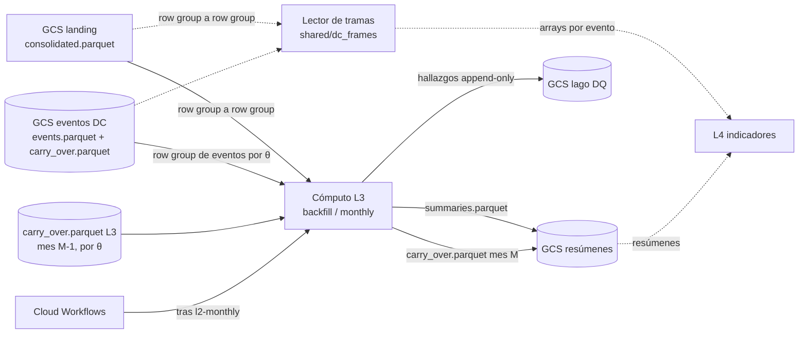

# Documento de Requerimientos Técnicos — Capa 3 (TRD-L3)

## Resúmenes por evento y θ (confirmación, overshoot) y lector de tramas sobre L1 y L2

> **Capa Summaries · Arquitectura Medallion · Single-Node Big Data · Google Cloud Platform**

|Campo        |Valor                                                                           |
|-------------|--------------------------------------------------------------------------------|
|Documento    |TRD-L3 — Capa de resúmenes por evento y lector de tramas                         |
|Versión      |**1.0**                                                                         |
|Estado       |Línea base. Cierra todo lo que el TRD maestro deja abierto para L3: contrato de salida, carry-over, contrato del lector de tramas, modos, hallazgos y nombre de la capa. Deja abierto el cómputo (§14), a cerrar con la sonda. |
|Fecha        |Octubre de 2026                                                                 |
|Documento padre|TRD maestro v2.7                                                              |
|Alcance      |Capa 3 (Summaries) de la capa Batch y el lector de tramas de `shared/`           |
|Clasificación|Académico / Uso personal                                                        |
|Contexto     |Trabajo de grado — Maestría en Finanzas · Universidad EAFIT (Medellín, Colombia)|

### Historial de revisiones

|Versión|Fecha|Descripción|
|---|---|---|
|1.0|Oct 2026|Línea base inicial (ITSC-329). Fija la pertenencia de un tick a una fase por `agg_trade_id`, el contrato de `summaries.parquet` (una fila por evento, columnas por fase), el carry-over O(1) de tres cubetas y su regla de fusión, el contrato del lector de tramas, los modos `backfill` y `monthly`, los `check_type` con `layer = "l3"`, la sonda del lector como criterio de aceptación y el nombre de la capa (`l3_summaries`). Es la fuente única de decisiones para las hijas siguientes de la Épica E5: ninguna reabre lo que aquí se fija.|

-----

## Cómo leer este documento

Este TRD detalla la **Capa 3** y **hereda las invariantes** del TRD maestro, del [TRD-L1](l1.md) y del [TRD-L2](l2.md). No las repite salvo cuando las concreta. El **porqué** de que L3 guarde resúmenes y no copias de ticks está escrito una sola vez en dos entradas de Documentación (§2); aquí se citan, no se repiten.

- Si buscas **qué construye L3 y con qué garantías** → secciones 4 y 5.
- Si buscas **el qué y el porqué de cada decisión de capa** → sección 6.
- Si buscas **las columnas de `summaries.parquet`, el carry-over o el contrato del lector** → sección 7.
- Si buscas **el algoritmo paso a paso y los modos** → sección 8.
- Si buscas **los umbrales de la sonda del lector** → secciones 10.3 y 13.
- Si buscas **qué queda abierto** → sección 14.

-----

## Tabla de contenido

1. [Introducción y propósito](#1-introducción-y-propósito)
1. [Invariantes heredadas](#2-invariantes-heredadas)
1. [Alcance de la Capa 3](#3-alcance-de-la-capa-3)
1. [Requerimientos funcionales de L3](#4-requerimientos-funcionales-de-l3)
1. [Requerimientos no funcionales de L3](#5-requerimientos-no-funcionales-de-l3)
1. [Decisiones de diseño de L3 (ADR de capa)](#6-decisiones-de-diseño-de-l3-adr-de-capa)
1. [Contrato de datos](#7-contrato-de-datos)
1. [Pipeline interno y modos de ejecución](#8-pipeline-interno-y-modos-de-ejecución)
1. [Validaciones y política de calidad de datos](#9-validaciones-y-política-de-calidad-de-datos)
1. [Arquitectura de cómputo, dimensionamiento y costo](#10-arquitectura-de-cómputo-dimensionamiento-y-costo)
1. [Operaciones](#11-operaciones)
1. [Riesgos y mitigaciones](#12-riesgos-y-mitigaciones)
1. [Criterios de aceptación](#13-criterios-de-aceptación)
1. [Ítems abiertos y a validar](#14-ítems-abiertos-y-a-validar)
1. [Anexos](#15-anexos)

-----

## 1. Introducción y propósito

L2 dice **dónde** están las fronteras de cada evento (referencia, confirmación, extremo). L3 dice **qué pasó entre ellas**: para cada evento y θ resume los ticks de sus dos fases, la de **confirmación** (el movimiento DC) y el **overshoot** (lo que sigue hasta el extremo). L4 consume ese resumen para los indicadores que se calculan fila a fila.

Los ticks no se copian. L1 los guarda una vez y L2 guarda las fronteras; L3 lee ambas y escribe una fila por evento. Los indicadores que necesitan la **secuencia** de ticks de un evento (microestructura, Fourier, wavelets, secuencias para ML) usan el **lector de tramas**, un módulo compartido que recorta L1 con las fronteras de L2 y entrega los arrays de cada fase sin persistirlos. L3 deja así a L4 dos entradas: la tabla de resúmenes y el lector.

L3 también hace **medible el sesgo del instante atómico** de L2 (ADR-L2-04, divergencia (b)): `confirm_price` es el precio menos favorable del grupo de empate y un tick más extremo del mismo instante no cuenta. Con el máximo y el mínimo reales por fase, y el mejor y el peor precio del instante de confirmación, L4 tiene las dos medidas y puede cuantificar la diferencia en vez de ignorarla.

Como L2, L3 es una **cadena secuencial por θ**: el evento que sigue abierto al cierre de un mes arrastra sus agregados al mes siguiente. Los θ son cadenas independientes y se evalúan en una sola pasada sobre la serie.

-----

## 2. Invariantes heredadas

L3 hereda y no contradice:

- **Región única us-east1**, **Parquet** ZSTD-3 en Cloud Storage, **presupuesto** ≤ 100 USD/mes (objetivo < 5 USD/mes), **IaC** con Terraform, **mínimo privilegio**. Pertenece al stack `batch`.
- **Particionado hive** `provider × market × asset × theta × year × month`, el mismo de L2. La partición de una fila de L3 es la de su fila de L2.
- **Idempotencia y `content_hash`** (RF-12/RF-13 del maestro): `pyutils.PartitionWriter` y `pyutils.content_hash`, el mismo patrón de L1 y L2 (escritura atómica con temporal y `commit`). Re-ejecutar un mes de un θ da el mismo `content_hash`.
- **Contratos de entrada**: el Parquet conformado de L1 ([TRD-L1 §7.2](l1.md#72-salida--parquet-conformado-de-l1-contrato-hacia-l2)) y la salida de L2 ([TRD-L2 §7.2](l2.md#72-salida--eventsparquet-contrato-hacia-l3) y [§7.4](l2.md#74-carry-over--contrato-y-disposición-física)).
- **Solo consolidados** (ADR-L2-09): L3 nunca lee `provisional-day=DD.parquet`. No tiene modo diario.
- **Hallazgos de DQ** con `emit_findings()` de `shared/dq` (RF-20/RF-21 del maestro).

**Decisiones que no se reabren aquí:**

|Decisión|Dónde se fijó|Qué fija para L3|
|---|---|---|
|L3 guarda resúmenes por evento, no copias de ticks; los indicadores de ticks releen L1 con fan-out|[Decisión: L3 guarda resúmenes por evento, no copias de ticks](https://app.notion.com/p/3eb27957d23d81d69ccac074bef2f8b3) (2026-09-30)|Una fila por evento y θ con estadísticos por fase. Pesa como L2, no como L1. Un indicador nuevo es una pasada que escribe solo su columna.|
|L1 y L2 son la fuente de verdad y las tramas se leen con un lector compartido|[Decisión: L3 no copia ticks; L1 y L2 son la fuente de verdad y las tramas se leen con un lector compartido](https://app.notion.com/p/3f327957d23d814b8a76cf2677ddeaa5) (2026-10-08)|Cero copias de ticks para cualquier θ (cierra la excepción del 30-09). Pertenencia por `agg_trade_id`. El lector es criterio de aceptación de la Épica. Define cuándo reabrir (§14).|
|Eficiencia de memoria ante todo|[Decisión: eficiencia de memoria ante todo](https://app.notion.com/p/3e727957d23d811887eaf14c886b9a0c) (2026-09-26)|Un row group en vuelo, estado O(1) por θ. El pico de una unidad es O(lote), no O(unidad).|
|Rust solo en el detector|Entrada de Documentación "Decisión: Rust solo en el detector de L2"|L3 es Python sobre Arrow (ADR-L3-07).|
|Los agentes no despliegan|[Decisión: despliegue de stacks de capa por GitHub Actions con WIF](https://app.notion.com/p/3e527957d23d810e9401d9d941d17f83) (2026-09-24)|Los agentes solo abren PRs. El humano aplica el stack y lanza los jobs en el environment `gcp`.|
|Instante de confirmación atómico y terna del extremo|ADR-L2-03 y ADR-L2-04|El instante de confirmación entero es fase de confirmación; el extremo reiniciado arranca en la terna de la confirmación.|
|El tick extremo pertenece al evento que cierra|ADR-VZ-12 ([TRD-viz](viz.md))|Frontera entre overshoot y la confirmación siguiente (ADR-L3-01).|

-----

## 3. Alcance de la Capa 3

### 3.1 Dentro de alcance

- Resúmenes por fase (confirmación y overshoot) de **cada evento cerrado de L2**, para los θ del catálogo, sobre el histórico completo desde 2017-08.
- Resumen propio del **instante de confirmación** (número de ticks, mejor y peor precio).
- Ejecución **mensual** encadenada por θ: backfill de los meses en orden y ejecución incremental tras cada `monthly` de L2.
- **Carry-over O(1) por θ** del evento abierto, en tres cubetas (ADR-L3-04).
- Materialización a Parquet en la misma partición que la fila de L2.
- El **lector de tramas** en `shared/`: contrato (§7.4) y sonda de rendimiento. Es también el **oráculo** de las pruebas de la capa.
- Hallazgos de calidad de datos propios de L3 (`layer = "l3"`).

### 3.2 Fuera de alcance

- **Indicadores** (L4) y su catálogo. L3 solo garantiza que L4 tenga sus dos entradas.
- **Copias de ticks por θ**, para cualquier subconjunto de θ (decisión del 2026-10-08).
- **Cambios en L1, L2 o viz.** Si el contrato de L1 o L2 no alcanza, se bloquea la card y se abre otra aparte.
- **Rust.** L3 no tiene hot loop propio (ADR-L3-07).
- **Capa Kappa**: el lector y el resumen trabajan sobre Parquet; conectarlos a un websocket no es parte de esta capa.
- **Rachas** y otros estadísticos que no se calculan con estado O(1) por fase: se agregan cuando un indicador los pida (§7.5) o son indicadores de L4 sobre el lector.
- **Extensibilidad multi-activo real**: el diseño no la impide (partición por `asset`), pero la primera implementación es mono-activo (BTCUSDT).

-----

## 4. Requerimientos funcionales de L3

*Prioridad MoSCoW: M (Must), S (Should), C (Could). Trazabilidad al RF del maestro entre paréntesis.*

|ID       |Nombre                                |Descripción                                                                                                                                  |Prio.|
|---------|--------------------------------------|---------------------------------------------------------------------------------------------------------------------------------------------|-----|
|RF-L3-01 |Resumen por fase (RF-07)              |Escribir, por evento cerrado de L2 y θ, los agregados de la fase de confirmación y del overshoot (§7.2).                                      |M    |
|RF-L3-02 |Pertenencia por `agg_trade_id`        |Asignar cada tick a una fase por su `agg_trade_id`, nunca por tiempo ni por posición (ADR-L3-01).                                              |M    |
|RF-L3-03 |Instante de confirmación              |Resumir aparte los ticks del instante de confirmación: número, mejor y peor precio.                                                           |M    |
|RF-L3-04 |Una fila de L3 por fila de L2         |Misma partición, mismo orden, clave de unión `(theta, confirm_agg_trade_id)` sin duplicar columnas de L2 (ADR-L3-03).                          |M    |
|RF-L3-05 |Carry-over por θ (RF-06)              |Consumir el estado O(1) de M-1 y persistir el de M al cierre: tres cubetas del evento abierto (ADR-L3-04).                                    |M    |
|RF-L3-06 |Fail-closed                           |Sin el carry-over correcto, o con una entrada de L2 incoherente, la unidad aborta con un hallazgo `error` (ADR-L3-05).                          |M    |
|RF-L3-07 |Lector de tramas                      |Entregar por evento cerrado su fila de L2 y los arrays de cada fase, con pertenencia por id y sin copiar ticks al lago (ADR-L3-06).            |M    |
|RF-L3-08 |Sonda del lector                      |Medir el lector sobre el mes más pesado antes de que L4 dependa de él, con los umbrales de §10.3 (ADR-L3-09).                                 |M    |
|RF-L3-09 |Idempotencia y `content_hash` (RF-12) |Re-ejecutar un mes de un θ produce `summaries.parquet` y `carry_over.parquet` con `content_hash` idéntico.                                    |M    |
|RF-L3-10 |Reanudabilidad por θ (RF-13)          |Frontera por θ, igual que L2 (§8.2).                                                                                                          |M    |
|RF-L3-11 |Imagen única por modos                |Una imagen `l3` con modos `backfill` y `monthly` (RF-15 del maestro).                                                                         |M    |
|RF-L3-12 |Hallazgos de calidad de datos         |Emitir los `check_type` de §9.3 al lago de DQ compartido (RF-20/RF-21).                                                                       |M    |
|RF-L3-13 |Verificación cruzada                  |Los agregados de un mes coinciden con lo que el lector entrega para cada evento cerrado.                                                      |M    |

-----

## 5. Requerimientos no funcionales de L3

|ID        |Atributo                  |Requerimiento                                                                                                                                       |Prio.|
|----------|--------------------------|----------------------------------------------------------------------------------------------------------------------------------------------------|-----|
|RNF-L3-01 |Eficiencia de memoria     |El pico de una unidad es O(row group): un row group de L1 (≈ 48 MB decodificado con las cinco columnas que L3 lee), un row group de eventos de L2 por θ y estado O(1) por θ. Los ticks se liberan en cuanto los agregó el fan-out.|M    |
|RNF-L3-02 |Exactitud                 |Cantidades y precios se agregan en aritmética exacta (decimal o entero escalado). Ningún paso usa punto flotante.                                     |M    |
|RNF-L3-03 |Determinismo              |Misma entrada, mismo `content_hash`. El orden de las filas y el de la suma no dependen de hilos ni de la partición en row groups.                     |M    |
|RNF-L3-04 |Acoplamiento débil (RNF-14)|L3 no importa `l1_ingest` ni `l2_dc_events`. Se comunica con L1 y L2 solo por sus contratos Parquet y usa `shared/` (`pyutils`, `dq`, el lector).      |M    |
|RNF-L3-05 |Rendimiento del lector    |Umbrales de §10.3, fijados antes de medir.                                                                                                          |M    |
|RNF-L3-06 |Peso de la capa           |L3 pesa del orden de L2, no del orden de L1 por θ; el tamaño total se estima en §10.4 y se mide con la sonda en la nube.                              |S    |
|RNF-L3-07 |Reproducibilidad (RNF-13) |Cada partición es trazable a la imagen exacta (semver + git SHA) que la generó.                                                                      |S    |
|RNF-L3-08 |Sin secretos              |L3 lee y escribe buckets propios del project vía IAM, sin credenciales de terceros.                                                                  |M    |

-----

## 6. Decisiones de diseño de L3 (ADR de capa)

*Cada decisión hereda las invariantes de §2 y las concreta para L3.*

### 6.1 ADR-L3-01 — Pertenencia de un tick a una fase: por `agg_trade_id`, no por tiempo ni por posición

|Campo|Contenido|
|---|---|
|**Decisión**|Dado un evento con `reference_agg_trade_id` (R), `confirm_agg_trade_id` (C) y `extreme_agg_trade_id` (E), un tick con id `i` pertenece a: **fase de confirmación** si `R < i ≤ C`; **overshoot** si `C < i ≤ E`. El overshoot puede ser vacío (`E = C`). Los ticks con `i ≤ R` son del evento anterior; los de `i > E`, del siguiente.|
|**Consecuencias de los límites**|(1) **El instante de confirmación entero es fase de confirmación** (ADR-L2-03): `C` es el id del último tick del grupo de empate, así que todos los ticks del grupo caen en `(R, C]`. (2) **El tick extremo pertenece al evento que cierra** (ADR-VZ-12): `E` es inclusivo en el overshoot de este evento, y el tick `E + 1` abre la confirmación del siguiente. (3) **El tick de referencia no pertenece al evento**: es el extremo del anterior. (4) Cada tick de la serie desde la primera referencia pertenece a **exactamente una** fase de exactamente un evento. Los ticks anteriores a la primera referencia de la serie no pertenecen a ningún evento. (5) **El evento pendiente del carry-over no es trama hasta que cierra**: sus ticks viven en las cubetas de ADR-L3-04, no en un resumen.|
|**El id es criterio de pertenencia, no índice posicional**|El proveedor deja huecos en `agg_trade_id` (`docs/data-contracts.md`). Con huecos, `posición = id − primer_id` no vale. L3 y el lector **buscan** el id en el arreglo de cada row group (búsqueda binaria), no lo restan. Ejemplo: con ticks de ids `101, 103, 104` entre `R = 100` y `C = 104` (falta el 102), la fase de confirmación tiene **3** ticks, no `104 − 100 = 4`.|
|**Alternativa descartada: cortar por tiempo**|Varios ticks comparten `transact_time` (hasta 4 090 en un milisegundo el 2026-09-30), la unidad del proveedor cambió de ms a µs en 2025 (ADR-L1-02) y L2 fija sus fronteras por id. Un corte por tiempo repartiría sin regla los ticks del instante de frontera y se comportaría distinto según el año.|
|**Instante de confirmación (definición)**|Los ticks de la fase de confirmación con `transact_time = confirm_time`. No incluye ticks del mismo `transact_time` con id `≤ R` (de otro evento). Incluye siempre al tick `C`, así que `confirm_instant_ticks ≥ 1`.|

### 6.2 ADR-L3-02 — Las fronteras son las de L2: L3 no repite el detector

|Campo|Contenido|
|---|---|
|**Decisión**|L3 no detecta nada. Toda frontera sale de L2: `R`, `C` y `E` de cada fila de `events.parquet`; y, para el evento que sigue abierto, `pending_reference_agg_trade_id`, `pending_confirm_agg_trade_id`, `pending_confirm_time` y el **candidato a extremo** (`ext_high_*` si `direction = 1`, `ext_low_*` si `direction = −1`) del `carry_over.parquet` de L2.|
|**Justificación**|Repetir la lógica del extremo (reglas de empate, instante atómico, comparación entera) en un segundo lugar crea dos fuentes de verdad que pueden divergir en el borde, y L2 ya la tiene probada. Con las fronteras dadas, L3 es una agregación por rangos de id, vectorizable. Si L3 detectara su propio extremo, el costo no sería solo código: cada corrección de L2 exigiría la misma corrección en L3.|
|**Consecuencia**|L3 de un mes `M` **requiere** `events.parquet` y `carry_over.parquet` de L2 del mismo mes y θ. L3 va siempre después de L2 (§8.3). Cualquier contradicción entre L2 y las cubetas (por ejemplo un candidato anterior al ya guardado) es una entrada rota: fail-closed (ADR-L3-05).|

### 6.3 ADR-L3-03 — Contrato de `summaries.parquet`: una fila por evento, columnas por fase, claves para unir con L2

|Campo|Contenido|
|---|---|
|**Decisión**|`summaries.parquet` tiene **una fila por fila de L2**, en la **misma partición**, en el mismo orden (el de confirmación) y con los mismos límites de row group (§7.2). Las columnas son: las **claves** `theta` y `confirm_agg_trade_id`; los agregados de la fase de confirmación con prefijo `c_`; los del overshoot con prefijo `os_`; y los del instante de confirmación con prefijo `confirm_instant_`. Esquema completo en §7.2.|
|**Por qué las claves y no copiar columnas de L2**|`(theta, confirm_agg_trade_id)` identifica un evento: `confirm_agg_trade_id` crece estrictamente dentro de un θ. L4 une con `events.parquet` por esa clave (o fila a fila, porque el orden y los row groups coinciden) y no paga el doble de almacenamiento de referencia, confirmación y extremo.|
|**Por qué esos estadísticos**|Son los mínimos de la decisión del 2026-10-08 y salen con estado O(1) por fase: conteo, volumen total, volumen comprador y vendedor según `is_buyer_maker`, y el máximo y el mínimo **reales** de los ticks de la fase. Del instante de confirmación: cuántos ticks tiene y su mejor y peor precio. Los dos primeros (máximo y mínimo reales) son los que hacen medible el sesgo del instante atómico (§1). La lista no está cerrada; la regla de evolución es §7.5.|
|**Alternativa descartada**|Una fila por fase (dos filas por evento). Duplica las claves, rompe la relación 1:1 con L2 y obliga a L4 a pivotar para tener la fila del evento.|

### 6.4 ADR-L3-04 — Carry-over O(1) por θ: tres cubetas de agregados

|Campo|Contenido|
|---|---|
|**Decisión**|Al cierre de cada mes, el estado de un θ es un Parquet de **una sola fila** (§7.3) con tres cubetas de agregados del evento abierto (el último confirmado, `p`), más su identidad y el candidato a extremo:<br>**A — fase de confirmación de `p`**: `(R_p, C_p]`, completa y fija desde que `p` confirmó, con su instante de confirmación.<br>**B — overshoot certero**: los ticks de `(C_p, cand]`, donde `cand` es el candidato a extremo vigente. Si algo cambia el extremo, esos ticks serán del overshoot de `p`: nada de lo que venga puede sacarlos de él.<br>**T — cola provisional**: los ticks de `(cand, fin del mes]`. Su fase se decide después: si el candidato no se mueve y el evento siguiente confirma, son el **comienzo de la fase de confirmación del evento siguiente**; si el candidato se mueve más allá de ellos, son overshoot de `p`.|
|**Por qué tres y no una o dos**|Con un solo agregado del "evento abierto" no se puede repartir su contenido cuando el extremo se resuelve. Con dos (confirmación y todo lo posterior) tampoco: al confirmar el evento siguiente hay que separar lo que quedó antes del extremo (overshoot de `p`) de lo que quedó después (confirmación del siguiente), y esa frontera es el candidato. Las tres cubetas son el mínimo que permite resolver el extremo en el mes siguiente **sin releer ticks** de meses anteriores (sin el buffer de huérfanos de la v0 que descartó ADR-L2-07).|
|**Regla de fusión**|Al procesar el mes `M+1` de un θ con evento abierto `p`, con el candidato guardado `cand` y el candidato `cand'` que resuelve L2 (el extremo `E_p` de la fila de `p` si cierra en `M+1`, o el candidato del `carry_over.parquet` de L2 de `M+1` si sigue abierto):<br>**(i) El candidato no se movió** (`cand' = cand`): B no cambia. Si `p` cierra, su overshoot es B y T pasa a ser el comienzo de la confirmación del evento siguiente. Si `p` sigue abierto, T absorbe todos los ticks de `M+1`.<br>**(ii) El candidato se movió** (`cand' > cand` en id): T y los ticks de `M+1` hasta `cand'` (inclusive) se **fusionan en B**. Si `p` cierra, esa B fusionada es su overshoot y los ticks posteriores a `E_p` son el comienzo de la confirmación de `p+1`; si sigue abierto, T se reabre vacía con los ticks posteriores a `cand'`.<br>**(iii) `cand' < cand`** es imposible: contradice a L2 (ADR-L3-05).<br>En ambos casos, al cerrar `p` en `M+1`, el evento siguiente `p+1` nace con la cubeta A = lo que le toque de T y de los ticks hasta su `C`, y su instante de confirmación se calcula en `M+1`: un instante comparte `transact_time` y el mes se define por tiempo, así que **nunca cruza el borde de mes**.|
|**Por qué el candidato sale de L2 y no se rastrea tick a tick**|Ver ADR-L3-02. El candidato del cierre de mes `M` es el de `carry_over.parquet` de L2 de `M`; el extremo final de un evento cerrado es su `extreme_agg_trade_id`. L3 solo compara ids.|
|**Evento aún no iniciado**|Antes de la primera referencia de la serie no hay evento abierto (`has_pending = false`): los ticks no pertenecen a ninguna fase y solo se cuentan como no asignados (§9.1).|
|**Formato**|Parquet de una fila, ZSTD-3, `state_version` semver, `content_hash` como en L2, escrito junto a `summaries.parquet` en la partición del mes que lo produce (§7.3).|

### 6.5 ADR-L3-05 — Carry-over faltante, de otra versión o entrada de L2 incoherente: fail-closed

|Campo|Contenido|
|---|---|
|**Decisión**|Para cualquier mes que no sea el primero de la serie de un θ: si el carry-over de L3 de `M-1` **no existe**, o su `state_version` no coincide con la que la imagen sabe leer, o el archivo no se puede leer o su `theta` no es el de su partición, la unidad `(θ, M)` **aborta** y emite un hallazgo `error`. Lo mismo si falta `events.parquet` o `carry_over.parquet` de L2 de `M`, o si L2 contradice las cubetas (§9.2). No hay política de "continuar sin estado".|
|**Justificación**|Idéntica a ADR-L2-08: los meses de un θ son una cadena. Arrancar sin las cubetas no pierde un dato, corrompe todos los agregados del evento abierto desde ese punto, y la fila resultante parecería válida. Con L2 incoherente, escribir la fila sería publicar una cifra que se sabe falsa.|
|**Primer mes de la serie**|Es el único caso sin carry-over previo; se distingue de "faltante" por posición (`year/month` es el mínimo del backfill del θ), no por inferencia. Arranca con `has_pending = false`.|
|**Recuperación**|La unidad abortada no avanza la frontera. El humano resuelve el motivo (reprocesar L2 o el mes anterior de L3, o la imagen correcta) antes de continuar. Sin auto-sanación en la POC.|

### 6.6 ADR-L3-06 — El lector de tramas es un módulo compartido que recorta L1 con las fronteras de L2

|Campo|Contenido|
|---|---|
|**Decisión**|Las tramas se **leen**, no se guardan. El lector vive en `shared/` (paquete `dc_frames`, Python sobre Arrow) y recorre `consolidated.parquet` row group a row group alineado con `events.parquet` de uno o varios θ. Entrega, por cada evento cerrado, su fila de L2 y las dos tramas con arrays de `transact_time`, `price`, `quantity` e `is_buyer_maker`. Contrato completo en §7.4.|
|**Cómo localiza**|Por **búsqueda binaria** de las fronteras sobre el arreglo de `agg_trade_id` de cada row group, y entrega **slices de Arrow sin copiar**. Nunca itera tick a tick en Python. Para llegar a un row group sin recorrer el mes usa las estadísticas min/max de `agg_trade_id` del pie del archivo (L1 las escribe, `shared/pyutils/src/pyutils/parquet.py`, y `agg_trade_id` es INT64 estrictamente creciente, ADR-L1-01).|
|**Es también el oráculo de la capa**|Las pruebas de L3 comparan los agregados de `summaries.parquet` contra los arrays que entrega el lector para cada evento cerrado (§13). Por eso el lector se escribe antes que el núcleo de resúmenes (hijas 2 y 4 de la Épica) y por eso **no comparte código de agregación con él**: dos implementaciones independientes que deben coincidir.|
|**`is_best_match` no se entrega ni se resume**|Es constante en el proveedor (TRD-L1 §7.1). Tampoco se entregan `first_trade_id` ni `last_trade_id`: la pertenencia usa `agg_trade_id` (que está en la fila de L2, no en las tramas).|
|**Por qué un módulo compartido y no una consulta suelta de cada indicador**|La pertenencia por id con huecos y los eventos que cruzan row groups y meses son fáciles de escribir mal. Con un solo lector, un error se arregla en un lugar y la verificación cruzada lo cubre. Cada indicador de L4 que mire la secuencia reutiliza el mismo recorte.|

### 6.7 ADR-L3-07 — Python sobre Arrow, vectorizado: sin Rust y sin iterar tick a tick

|Campo|Contenido|
|---|---|
|**Decisión**|L3 y el lector son Python sobre Arrow, sin Rust (decisión "Rust solo en el detector"). El trabajo por row group es **vectorizado**: `searchsorted` de las fronteras sobre `agg_trade_id` y agregación por segmento sobre vistas del buffer de Arrow. Un bucle de Python por tick está prohibido; uno por evento dentro de un row group, solo si la sonda lo muestra suficiente (§10.3).|
|**Justificación**|La unidad completa de L2 corrió a ≈ 58 000 ticks/s por core antes de ITSC-290 por su parte serial en Python, contra 2,8 M ticks/s del detector en Rust (TRD maestro §7.1). Un lector que itere tick a tick tardaría ≈ 20 horas-core por pasada histórica y volvería atractiva la materialización de tramas que la decisión del 2026-10-08 descarta. La aritmética de L3 (conteos, sumas, máximos y mínimos por rango) es exactamente el tipo de operación que Arrow y numpy hacen por columna.|
|**Técnica prevista (no contractual)**|`price` y `quantity` llegan como `decimal128(18,8)`. Como L1 garantiza que caben en `i64`, la palabra baja de cada valor de 128 bits es el valor y se puede leer como vista `int64` con paso 2 **sin copiar el buffer**, de modo que no conviven dos representaciones del mismo dato (regla de eficiencia de memoria). Las sumas se hacen con acumulador ancho (`decimal128(38,8)` o `i128`) y se angostan al escribir (§7.2).|

### 6.8 ADR-L3-08 — L3 solo lee consolidados de L1 y salidas de L2; modos `backfill` y `monthly`

|Campo|Contenido|
|---|---|
|**Decisión**|L3 lee `consolidated.parquet` de L1 y `events.parquet` más `carry_over.parquet` de L2. Nunca provisionales, nunca otra cosa. Nunca escribe fuera de `l3/`. Tiene dos modos, `backfill` y `monthly`, con frontera por θ y códigos de salida como L2 (§8).|
|**Justificación**|Igual que ADR-L2-09: un resumen encadenado sobre datos que L1 aún puede corregir quedaría basado en ticks que luego cambian, y L3 no puede reabrir un mes encadenado sin invalidar los siguientes del θ. Además, sin L2 de `M` no hay fronteras (ADR-L3-02).|

### 6.9 ADR-L3-09 — La sonda del lector es criterio de aceptación, no una mejora posterior

|Campo|Contenido|
|---|---|
|**Decisión**|Antes de que L4 dependa del lector, una sonda sobre el mes más pesado (2023-03, 190.227.841 ticks) debe cumplir los umbrales de §10.3. Los umbrales se **escriben antes de medir**. Es un `ops-script` (mismo mecanismo que las sondas de viz), no una prueba del CI.|
|**Qué pasa si no cumple**|Se aplica "Cuándo reabrir" de la decisión del 2026-10-08: **se mide dónde está el costo antes de considerar copias**. No se reabre por reflejo.|

### 6.10 ADR-L3-10 — Nombre de la capa: `l3_summaries`

|Campo|Contenido|
|---|---|
|**Decisión**|La capa se llama `l3_summaries`: `layers/l3_summaries/`, tags `l3_summaries/vX.Y.Z` (convención `l<N>_<nombre>`, maestro §8.1), imagen e identificadores `l3`. Reemplaza al `l3_frames/` del árbol del maestro.|
|**Justificación**|`l3_frames` prometía tramas materializadas, que es justo lo que se descartó. La capa produce **resúmenes**; las tramas las entrega el lector (`shared/dc_frames`).|

-----

## 7. Contrato de datos

### 7.1 Entrada

**L1:** `consolidated.parquet` (ADR-L2-09), row group por row group (`ROW_GROUP_SIZE = 1_000_000`, `layers/l1_ingest/src/l1_ingest/write.py`; L3 no depende de ese valor, usa los metadatos del archivo). Columnas que lee: `agg_trade_id` (INT64), `transact_time` (INT64, µs UTC), `price` y `quantity` (`DECIMAL(18,8)`), `is_buyer_maker` (BOOL). No lee `first_trade_id`, `last_trade_id` ni `is_best_match`. Un row group con esas cinco columnas decodificadas pesa ≈ 48 MB (16 + 16 + 8 + 8 B por tick más el bit de `is_buyer_maker`).

**L2:** `events.parquet` del mes (ordenado por `confirm_time`; sus row groups no tienen tamaño fijo: `FLUSH_ROWS = 32_768` en `layers/l2_dc_events/src/l2_dc_events/events.py` es solo el umbral de vaciado, y cada row group lleva todo lo acumulado, así que tiene al menos 32 768 filas, salvo el último, y puede superarlas): usa siete columnas: `reference_agg_trade_id`, `confirm_agg_trade_id`, `confirm_time`, `extreme_agg_trade_id` y `direction`, más `confirm_price` y `extreme_price` para los chequeos de §9.2. El θ lo da la partición. Y `carry_over.parquet` del mes: `direction`, `has_pending_event`, `pending_reference_agg_trade_id`, `pending_confirm_agg_trade_id`, `pending_confirm_time` y `ext_high_*`/`ext_low_*`. Un θ sin eventos en el mes tiene un `events.parquet` válido de cero filas.

### 7.2 Salida — `summaries.parquet` (contrato hacia L4)

Una fila por evento cerrado de L2. Las cantidades usan la misma escala que L1 (`10⁻⁸`).

|Columna|Tipo Parquet|Nulable|Notas|
|---|---|---|---|
|`theta`|DECIMAL(9,8)|no|θ del evento. Clave. Redundante con la partición.|
|`confirm_agg_trade_id`|INT64|no|Clave. Con `theta` identifica al evento y une con la fila de L2.|
|`c_ticks`|INT64|no|Ticks de la fase de confirmación `(R, C]`. ≥ 1.|
|`c_quantity`|DECIMAL(18,8)|no|Suma de `quantity`. Igual a `c_quantity_buy + c_quantity_sell`.|
|`c_quantity_buy`|DECIMAL(18,8)|no|Suma de `quantity` con `is_buyer_maker = false` (el agresor compró).|
|`c_quantity_sell`|DECIMAL(18,8)|no|Suma de `quantity` con `is_buyer_maker = true` (el comprador era el maker: el agresor vendió).|
|`c_price_max`|DECIMAL(18,8)|no|Precio máximo real de los ticks de la fase.|
|`c_price_min`|DECIMAL(18,8)|no|Precio mínimo real de los ticks de la fase.|
|`os_ticks`|INT64|no|Ticks del overshoot `(C, E]`. 0 si el overshoot es vacío (`E = C`).|
|`os_quantity`, `os_quantity_buy`, `os_quantity_sell`|DECIMAL(18,8)|no|Como `c_*`. 0 si `os_ticks = 0`.|
|`os_price_max`, `os_price_min`|DECIMAL(18,8)|**sí**|Como `c_*`. Nulos si `os_ticks = 0`.|
|`confirm_instant_ticks`|INT64|no|Ticks de la fase de confirmación con `transact_time = confirm_time` (ADR-L3-01). ≥ 1.|
|`confirm_instant_price_best`|DECIMAL(18,8)|no|Precio **más favorable a la confirmación** del instante: el máximo en un upturn, el mínimo en un downturn.|
|`confirm_instant_price_worst`|DECIMAL(18,8)|no|Precio **menos favorable**: el mínimo en un upturn, el máximo en un downturn.|

**Invariantes verificables de una fila** (se prueban en §13 y se chequean en §9.2): `c_ticks ≥ confirm_instant_ticks ≥ 1`; `confirm_instant_price_worst ≤ confirm_price ≤ confirm_instant_price_best` en un upturn (al revés en un downturn); en un upturn `c_price_max ≥ confirm_price` y en un downturn `c_price_min ≤ confirm_price`; si `os_ticks > 0`, en un upturn `os_price_max = extreme_price` y en un downturn `os_price_min = extreme_price`; `os_ticks = 0` si y solo si `extreme_agg_trade_id = confirm_agg_trade_id`; y `c_ticks ≤ C − R` y `os_ticks ≤ E − C`, con igualdad si el proveedor no dejó huecos en el rango.

**Tipo de las cantidades.** Una fase puede juntar decenas de millones de ticks, pero el volumen de una fase no puede superar el volumen total negociado de la serie. El volumen histórico de BTC/USDT en Binance es del orden de 10⁹ BTC, y `DECIMAL(18,8)` llega a ≈ 10¹⁰: la suma cabe con un margen de un orden de magnitud y el valor ocupa 8 B (el respaldo en INT64 de Parquet). Si alguna vez no cupiera, la conversión al escribir falla (la unidad aborta) en vez de truncar: es una guarda, no una política.

**Propiedades físicas:** ZSTD-3, estadísticas por columna, **sin diccionario** en las columnas de alta cardinalidad (el aprendizaje de ITSC-290 en L2), ordenado por `confirm_agg_trade_id`. **Mismos límites de row group que `events.parquet` de L2**: L3 lee `num_rows` de cada row group en los metadatos de `events.parquet` y escribe un row group por cada uno, con ese mismo número de filas (no un tamaño fijo, porque los de L2 son variables). Así la fila `i` de un archivo es la fila `i` del otro, también por row group, y L4 puede leer ambos en paralelo sin join. `content_hash` sobre el contenido lógico con `pyutils.content_hash` (el patrón de L1 y L2).

**Particionado hive** (raíz de L3):

```
provider=binance/market=spot/asset=BTCUSDT/theta=<t>/year=YYYY/month=MM/
```

`theta=<t>` con el formato de ancho fijo de L2 (`theta=0.00010000`). **Archivos:** `summaries.parquet` y `carry_over.parquet`. Una fila pertenece a la partición del mes que cierra su evento (el mes de su fila de L2, ADR-L2-06), no al de su confirmación.

### 7.3 Carry-over — contrato y disposición física

Un Parquet de **una fila** por `(theta, year, month)`, escrito junto a `summaries.parquet` en la partición del mes que lo produce.

|Columna|Tipo Parquet|Nulable|Notas|
|---|---|---|---|
|`provider,market,asset`|STRING|no|Coordenadas del dato, redundantes con la partición.|
|`theta`|DECIMAL(9,8)|no|θ de esta cadena.|
|`year`,`month`|INT32|no|Mes que produjo este estado (se consume desde `month+1`).|
|`state_version`|STRING|no|semver del esquema del carry-over; se compara contra lo que la imagen sabe leer (ADR-L3-05).|
|`has_pending`|BOOLEAN|no|`true` si hay un evento abierto. Es `false` solo antes de la primera referencia de la serie. Debe coincidir con `has_pending_event` del carry-over de L2 del mismo mes.|
|`last_agg_trade_id`|INT64|no|Id del último tick que L3 procesó del mes. El primer tick del mes siguiente debe tener un id mayor.|
|`pending_confirm_agg_trade_id`|INT64|sí|Clave del evento abierto. Nulo si `has_pending = false`. Debe coincidir con `pending_confirm_agg_trade_id` de L2.|
|`candidate_agg_trade_id`, `candidate_price`|INT64, DECIMAL(18,8)|sí|Candidato a extremo vigente (`cand`). Debe coincidir con `ext_high_*` o `ext_low_*` de L2 según su `direction`. Iguales a la confirmación si el overshoot aún es vacío.|
|`a_*`: `a_ticks`, `a_quantity`, `a_quantity_buy`, `a_quantity_sell`, `a_price_max`, `a_price_min`|INT64, DECIMAL(18,8)|sí|**Cubeta A**: fase de confirmación del evento abierto, completa.|
|`a_instant_ticks`, `a_instant_price_best`, `a_instant_price_worst`|INT64, DECIMAL(18,8)|sí|Su instante de confirmación.|
|`b_*`: `b_ticks`, `b_quantity`, `b_quantity_buy`, `b_quantity_sell`, `b_price_max`, `b_price_min`|INT64, DECIMAL(18,8)|sí|**Cubeta B**: overshoot certero hasta el candidato. `b_ticks = 0` y precios nulos si es vacío.|
|`t_*`: `t_ticks`, `t_quantity`, `t_quantity_buy`, `t_quantity_sell`, `t_price_max`, `t_price_min`|INT64, DECIMAL(18,8)|sí|**Cubeta T**: cola provisional. `t_ticks = 0` y precios nulos si es vacía.|

Todo es escalar: el estado es O(1) por θ (≈ 40 valores), sin buffer de ticks.

**Consumo por M+1:** carga el único carry-over `year=M.year/month=M.month/` de su θ, verifica `state_version`, `theta` y la coincidencia con el carry-over de L2 del mismo mes (`has_pending`, clave, candidato), y arranca la pasada con A, B y T de ahí. Aplica la regla de fusión de ADR-L3-04 al ritmo de los ticks y las fronteras de L2 de `M+1`. **Primer mes de la serie:** sin carry-over previo (ADR-L3-05). **Faltante o de otra versión (mes ≠ primero):** fail-closed.

### 7.4 Contrato del lector de tramas

**Módulo:** `shared/dc_frames` (import `dc_frames`). Lo implementa la hija 2 de la Épica; este es el contrato.

**Entrada** (`read_frames`):

|Parámetro|Contenido|
|---|---|
|`thetas`|Uno o más θ del catálogo. Con varios, cada row group de L1 se decodifica **una vez** para todos (fan-out). Con uno, es el caso trivial.|
|`l1_root`, `l2_root`|Raíces de L1 (`consolidated.parquet`) y L2 (`events.parquet`), locales o `gs://`.|
|`start`, `end`|Rango de meses `(year, month)` **de las particiones de L2** cuyos eventos se entregan, ambos inclusivos. Un evento pertenece al mes que lo cierra (ADR-L2-06); sus ticks pueden estar en meses anteriores a `start`, y el lector los lee.|
|`provider`, `market`, `asset`|Coordenadas del dato. Por defecto `binance`, `spot`, `BTCUSDT`.|

Además hay un **acceso puntual**, `frames_of(event, l1_root)`: recibe la fila de L2 de un evento que el llamador ya tiene y devuelve sus tramas. Localiza sus row groups por las estadísticas min/max de `agg_trade_id` y decodifica solo esos.

**Salida:** un iterador de `EventFrames`, uno por **evento cerrado** (no entrega el evento pendiente del carry-over):

|Campo|Contenido|
|---|---|
|`theta`|θ del evento.|
|`event`|La fila de L2 completa (`events.parquet`, 11 columnas), sin transformar.|
|`confirmation`|Trama de la fase de confirmación `(R, C]`.|
|`overshoot`|Trama del overshoot `(C, E]`. **Vacía** (cuatro arrays de largo 0) si `E = C`.|

Cada trama son cuatro arrays de Arrow del mismo largo y orden de la serie: `transact_time` (INT64, µs UTC), `price` (`decimal128(18,8)`), `quantity` (`decimal128(18,8)`) e `is_buyer_maker` (BOOL). Los tipos son los de L1: el lector no convierte a punto flotante ni a otra representación; si el consumidor la necesita, la convierte en su lado. **No** se entregan `agg_trade_id`, `first_trade_id`, `last_trade_id` ni `is_best_match`.

**Orden:** dentro de cada θ, por `confirm_agg_trade_id` ascendente. Entre θ no hay orden garantizado: un evento se entrega en cuanto se decodificó el row group de su extremo.

**Garantías de pertenencia** (validadas en cada evento, fail-closed con `FrameBoundaryError`):

1. El primer tick de `confirmation` es el primer tick con id mayor que `reference_agg_trade_id`; el último tiene id `confirm_agg_trade_id` y `transact_time = confirm_time`.
2. Si `overshoot` no es vacío, su último tick tiene id `extreme_agg_trade_id`. Está vacío si y solo si `extreme_agg_trade_id = confirm_agg_trade_id`.
3. Los ids de frontera (`reference_`, `confirm_` y `extreme_agg_trade_id`) **existen como ticks** en L1. Si no existe, L1 y L2 no cuadran: error, no se corre el límite.
4. **Con huecos de `agg_trade_id`** la pertenencia no se corre: las fronteras se buscan por valor (`searchsorted`), nunca se calculan por resta.

**Garantías de memoria:** a lo sumo **un row group de L1 en vuelo** (≈ 48 MB con las cinco columnas), un row group de eventos de L2 por θ y **el evento en curso de cada θ**. Con un solo θ es un evento; con fan-out, cada θ tiene el suyo abierto a la vez y el pico es la **suma de los ticks de esos eventos** (≈ 48 B por tick), que con θ grandes puede pasar de 4 GiB (RL3-04). Dentro de un row group, las tramas son slices sin copia. Cuando un evento cruza un row group o un mes, el lector **copia solo los ticks del evento** (concatena la parte ya leída) y suelta el row group, en vez de retenerlo; así el row group no queda anclado por un evento largo. Al entregar un evento el lector lo suelta. Si el consumidor conserva los arrays de un slice sin copia, ancla ese row group: es un costo suyo y está documentado.

**Eventos que cruzan row groups y meses:** el lector abre `consolidated.parquet` del mes siguiente cuando termina el actual; si falta un mes intermedio de L1, error. Para empezar en `start` retrocede a los meses anteriores de L1 que necesite el primer evento (a partir de `reference_agg_trade_id` y las estadísticas de los row groups).

**Límite conocido:** el pico por evento es O(evento), y un evento de un θ grande puede tener decenas o cientos de millones de ticks (§12, RL3-04, y §14, ítem 3). En una pasada con varios θ el pico es la suma de los eventos abiertos a la vez, no el mayor de ellos. La sonda reporta el evento más grande por θ, el RSS pico de la pasada de 50 θ y la suma máxima de ticks de eventos abiertos simultáneamente.

### 7.5 Evolución del contrato

La lista de estadísticos por fase no está cerrada. Una columna nueva de `summaries.parquet` entra si y solo si se calcula con **estado O(1) por fase** (conteo, suma, máximo, mínimo, primero, último). Cambiar el esquema de `summaries.parquet` o del carry-over sube `state_version` (menor si solo se agregan columnas) y, como el carry-over de la versión anterior deja de ser legible (ADR-L3-05), exige un `backfill` completo de los θ afectados: cuesta una pasada de L3, del orden de L2 (§10). Lo que no se calcula con estado O(1) (rachas, secuencias, espectros) no es una columna de L3: es un indicador de L4 sobre el lector.

-----

## 8. Pipeline interno y modos de ejecución

### 8.1 Núcleo compartido (común a los dos modos)

1. **Cargar** el carry-over de L3 de `(θ, año, mes-1)` de cada θ que el mes procesa, o iniciar en frío si es el primer mes de la serie (ADR-L3-05). Verificar su coincidencia con el carry-over de L2 del mismo mes (§9.2).
1. **Abrir** `events.parquet` de L2 de cada θ y `consolidated.parquet` de L1 del mes. Los eventos se leen **por row group** con un cursor por θ, proyectando solo las siete columnas de §7.1: L1 y L2 están ordenados por id, así que alinearlos es una **mezcla de dos listas ordenadas**, y los eventos del mes (millones para un θ pequeño) nunca están enteros en memoria.
1. Por cada row group de L1 y cada θ: localizar con `searchsorted`, sobre `agg_trade_id`, las fronteras de L2 que caen dentro (`R`, `C`, `E` de los eventos que el row group toca y el candidato del cierre de mes). Los segmentos entre fronteras sumados al rol que ADR-L3-01 les da (confirmación, overshoot, o cubetas B y T del evento abierto) se agregan de forma vectorizada: conteo, sumas de `quantity` (total, `is_buyer_maker = false` y `true`), máximo y mínimo de `price`. Los ticks del instante de confirmación (`transact_time = confirm_time` dentro de la fase) se agregan aparte. Un segmento que continúa en el row group siguiente deja su acumulador abierto: es la misma cubeta del carry-over.
1. **Liberar** el row group antes de leer el siguiente (RNF-L3-01): no conviven dos row groups ni dos representaciones del mismo precio.
1. Cuando la pasada supera el `extreme_agg_trade_id` de un evento, ese evento se **cierra**: se aplica la regla de fusión de ADR-L3-04 si le tocaba, se validan los invariantes de §7.2 contra su fila de L2 (§9.2) y se **escribe su fila** en `summaries.parquet` con los mismos límites de row group de L2 (§7.2), en el orden de L2.
1. Al terminar el mes, las cubetas A, B y T del evento abierto y el candidato (el de L2 al cierre del mes) van a `carry_over.parquet`. Se **conciliza** la cuenta de ticks (§9.1).
1. **Registrar** el `content_hash` de ambos archivos y publicar con escritura atómica (temporal + `commit`).

Un mes que L3 procesa lee L1 **una sola vez** para todos los θ de la unidad (fan-out).

### 8.2 Modo `backfill` (histórico)

Igual que [TRD-L2 §8.2](l2.md#82-modo-backfill-histórico), con estas diferencias:

- **Frontera por θ.** Es el último mes de su cadena de carry-over de L3, **contigua desde `--series-start`** y con un `carry_over.parquet` **válido** al final (existe, con `state_version` legible, esquema y θ de su partición). Sale de **un listado recursivo** de la raíz de L3 más la lectura del carry-over de la frontera de cada θ; no se consulta cada partición. Un θ sin frontera arranca en `--series-start`.
- **Requisito de L2.** Un mes `M` de un θ solo se procesa si L2 ya tiene `events.parquet` y `carry_over.parquet` de `(θ, M)`; se comprueba con **un listado** de la raíz de L2. Si faltan, el rango del θ se detiene con el hallazgo `l2_input_missing` (error; ADR-L3-05).
- **Rango y opciones**: `--from`, `--to` (por defecto, el último mes con `consolidated.parquet` en L1), `--thetas` y `--force` con la misma semántica que L2. `--force` exige `--from` (código 2 sin él).
- **Un mes, una lectura, los θ que lo necesitan.** Un solo proceso, en orden estricto de meses; el paralelismo es entre los θ del mes. Un mes que ningún θ necesita se salta sin leer L1. Con todo al día termina en segundos sin escribir.
- **Agregar un θ** (al catálogo de L2): tras el `backfill` de L2 de ese θ, lanzar `backfill` de L3 sin `--from`: recorre la serie desde el inicio mientras los demás se saltan.
- Un fallo detiene el rango; los meses siguientes no se tocan.

### 8.3 Modo `monthly` (incremental)

- Se agenda **después** de `l2-monthly` del mismo mes (orquestación Cloud Workflows, encadenamiento definido en la hija 6). No hay modo diario (ADR-L3-08).
- Procesa el mes anterior (o `--from`) **solo para los θ cuya frontera de L3 es el mes previo y cuyo L2 ya tiene el mes**. Un θ que ya llegó al mes se salta.
- Un θ **rezagado** no se procesa y deja `theta_behind_frontier` (warning), con `details.reason` igual a `l3_frontier` (su cadena de L3 tiene un hueco o no existe) o `l2_missing` (L2 no tiene el mes de ese θ). Si otros θ sí están listos, la unidad no falla.
- Si **ningún θ está listo**, ninguno ya tiene el mes y hay rezagados, la unidad termina con código **1** sin leer L1 (fail-closed): un `monthly` perdido no pasa como éxito. Si algún θ ya tiene el mes, o ningún θ necesita el mes y ninguno está rezagado, termina con código **0**.

### 8.4 Códigos de salida

|Código|Cuándo|
|---|---|
|0|Éxito: todos los θ listos avanzaron o ya estaban al día.|
|1|Fallo de la unidad: entrada ausente (L1 o L2), carry-over faltante o de otra versión, L2 incoherente, no conciliación de ticks, o `monthly` sin ningún θ listo con rezagados (§8.3).|
|2|Error de uso o de configuración: argumento inválido, `--force` sin `--from`, rango que arranca antes de la serie, `--thetas` fuera del catálogo, catálogo de θ inválido, `CLOUD_RUN_TASK_INDEX` distinto de 0. No escribe datos.|

### 8.5 Frontera de mes

No hay un paso especial: es el mecanismo de los pasos 3–6 de §8.1. El evento cuyo evento siguiente aún no confirmó al cierre del mes queda en las cubetas A, B y T; el mes en que se resuelve su extremo lo completa y lo escribe en su propia partición (ADR-L2-06).

-----

## 9. Validaciones y política de calidad de datos

### 9.1 Conciliación de ticks

Es la invariante central de la capa. Con `N_M` los ticks de `consolidated.parquet` del mes, `Σ_cerrados` la suma de `c_ticks + os_ticks` de las filas que cierran en `M`, `Q_in` y `Q_out` la suma `a_ticks + b_ticks + t_ticks` del carry-over de entrada y de salida, y `U_M` los ticks anteriores a la primera referencia de la serie (solo distinto de cero en el primer mes con eventos de un θ):

```
Σ_cerrados + Q_out  =  Q_in + N_M − U_M
```

Cada tick del mes queda en exactamente una fase (ADR-L3-01). Si no cuadra, la unidad aborta: es un defecto, no un caso de mercado. Es la versión por mes de "la suma de ticks de todos los eventos cerrados de un θ más los no asignados es el total del mes".

### 9.2 Coherencia con L2 y compuerta de carry-over

Dos compuertas que **abortan** (ADR-L3-05), porque el estado o la entrada son insumo del cálculo:

- **Carry-over de L3**: faltante, de otra `state_version` o ilegible en un mes que no es el primero.
- **L2 incoherente**: falta `events.parquet` o `carry_over.parquet` de L2; el carry-over de L3 de `M-1` no coincide con el de L2 de `M-1` (`has_pending`, clave del evento abierto, candidato); un candidato nuevo anterior al guardado; el extremo `E` de la fila que cierra el evento abierto de `M-1` anterior al candidato guardado, o mayor que él pero no posterior a `last_agg_trade_id`; un id de frontera que no existe como tick; o una fila que viola un invariante de §7.2 (por ejemplo, `os_price_max ≠ extreme_price` en un upturn).

### 9.3 Tipos de chequeo (`check_type`)

Todos los hallazgos de L3 llevan `layer = "l3"`, `mode ∈ {backfill, monthly}` y `stage = "canonical"`. El θ viaja en `details`, como en L2.

|`check_type`|`severity`|`status`|Cuándo|
|---|---|---|---|
|`carry_over_missing`|`error`|`fail`|Mes ≠ primero de la serie sin carry-over de L3 previo (ADR-L3-05).|
|`carry_over_version_mismatch`|`error`|`fail`|`state_version` distinta de la que la imagen lee, archivo ilegible, o `theta` distinto del de su partición.|
|`l2_input_missing`|`error`|`fail`|Falta `events.parquet` o `carry_over.parquet` de L2 de `(θ, M)`. `details` lleva `theta`, `month` y el archivo faltante.|
|`l2_state_inconsistent`|`error`|`fail`|L2 contradice las cubetas o un invariante de fila (§9.2). `details` lleva `theta`, `month`, el campo y los dos valores.|
|`phase_ticks_mismatch`|`error`|`fail`|No cuadra la conciliación de §9.1. `details` lleva los cuatro términos.|
|`input_missing`|`error`|`fail`|El mes no tiene `consolidated.parquet` ni provisionales.|
|`input_provisional_only`|`error`|`fail`|El mes solo tiene `provisional-day=DD.parquet`: L3 espera el `monthly-close` de L1 (ADR-L2-09).|
|`theta_catalog_invalid`|`error`|`fail`|El catálogo de θ no existe, no se puede leer o incumple [TRD-L2 §7.3](l2.md#73-el-catálogo-de-θ). Código 2, sin escribir datos.|
|`theta_behind_frontier`|`warning`|`fail`|`monthly` no procesó un θ (§8.3); `details` lleva `theta`, `frontier` (`YYYY-MM` o `null`) y `reason`. No falla la unidad si otros θ avanzan.|
|`theta_config_drift`|`info`|`pass`|El lago de L3 tiene particiones de un θ que ya no está en el catálogo. Informa, no es error: quitar un θ no borra nada.|
|`summaries_summary`|`info`|`pass`|Uno por θ al cerrar el mes: filas escritas, `content_hash` de `summaries.parquet` y `carry_over.parquet`, `content_hash` de las entradas de L2 que usó (`events.parquet` y `carry_over.parquet`) y `unassigned_ticks`. Deja el linaje contra L2.|
|`unit_timing`|`info`|`pass`|Uno por unidad (mes): pared y tiempo por fase, límite efectivo de CPU y bytes leídos en `details`. Va aparte de `summaries_summary` porque los tiempos nunca coinciden entre corridas.|

### 9.4 Emisión

La misma función `emit_findings()` de `shared/dq` que usan L1 y L2: log de consola más fila en el lago unificado de DQ. El esquema del hallazgo no gana columnas. `docs/data-contracts.md` gana la sección de `summaries.parquet` y el catálogo de `check_type` de §9.3 cuando se implementen (hijas 4 y 5).

-----

## 10. Arquitectura de cómputo, dimensionamiento y costo

### 10.1 Vista de cómputo



### 10.2 Dimensionamiento — hipótesis de partida, sin medir

**Todo lo de esta sección es una hipótesis hasta que lo mida la sonda de la hija 7 (§14, ítem 1).** No hay todavía una sola medición de L3.

- **Memoria.** Un row group de L1 con cinco columnas (≈ 48 MB, contra los ≈ 32 MB de L2, que no lee `quantity` ni `is_buyer_maker`), más la lectura anticipada, más un row group de eventos por θ con siete columnas proyectadas (≈ 2 MB por θ con 32 768 filas, ≈ 100 MB con 50 θ; L2 no fija un tope de filas por row group, así que la sonda reporta el row group de eventos más grande), más temporales de la agregación y estado O(1). El pico esperado es del orden de unos cientos de MiB, y no crece con los ticks del mes (RNF-L3-01). El tamaño de L2 (4 GiB) deja holgura.
- **CPU.** El trabajo por tick es de lectura, `searchsorted` y reducciones por columna, sin el hot loop de L2 pero con 50 θ sobre cada row group. Se espera un tiempo de pared **del mismo orden que L2** (184 s el mes más pesado a 4 vCPU), sin respaldo medido.
- **Configuración inicial:** Cloud Run Jobs, **4 vCPU / 4 GiB** (el tamaño de L2), `max_retries = 1`, **una sola tarea** (los meses se encadenan por carry-over, como en L2). Timeouts iniciales con la regla de L2: `monthly` ≥ 6× la pared del mes más pesado medida, `backfill` ≥ 1,5× la suma de los meses y ≤ 86400 s. La hija 7 los fija con la medición y aplica la regla de ADR-04 de L2: Cloud Batch solo si falla alguna condición.

### 10.3 Sonda del lector de tramas — umbrales de aceptación (se escriben antes de medir)

Sobre el mes **2023-03** (190.227.841 ticks), como `ops-script` en Cloud Run con 4 vCPU / 4 GiB. Todos los umbrales son criterio de aceptación de la Épica (ADR-L3-09):

|#|Medida|Umbral|
|--|---|---|
|1|**Pasada completa de un θ** (se miden `θ_min`, un θ intermedio y `θ_max`)|Pared **≤ 10 min** por θ. Es el techo; el objetivo es ≤ 5 min.|
|2|RSS pico de esa pasada|**≤ 1 GiB** más el tamaño de los arrays del evento más grande en vuelo, que la sonda reporta aparte.|
|3|**Pasada de 50 θ** sobre el mes|Bytes leídos de `consolidated.parquet` **≤ 1,1 ×** su tamaño y decodificaciones de row group **igual** al número de row groups del mes (no 50 ×). La pared y el **RSS pico** de la pasada se reportan, sin umbral, junto con la **suma máxima de ticks de eventos abiertos a la vez** (la cota de memoria del fan-out, §7.4).|
|4|**Evento al azar** (`frames_of`)|Decodifica un row group (dos si el evento cruza una frontera) y lee **≤ 2 ×** el tamaño de un row group en bytes.|
|5|Corrección|Cero violaciones de las garantías de pertenencia de §7.4 sobre todos los eventos de la pasada de 50 θ, incluidos los que cruzan row groups.|
|6|Informe|Eventos por θ, evento más grande por θ (ticks y MiB), ticks/s, y la **extrapolación al histórico** (4 051 M de ticks) a la tasa medida.|

*Qué implica el umbral 1.* 10 min para 190 M de ticks son ≈ 0,32 M ticks/s, y ese ritmo da ≈ 3,5 h para el histórico de un θ. Es un techo para aceptar la capa, no un objetivo de producto. Si la extrapolación del histórico de un θ pasa de **unas pocas horas** (la medición lo dice), se aplica "Cuándo reabrir" de la decisión del 2026-10-08: se mide dónde está el costo antes de considerar copias. El humano puede endurecer el umbral antes de que la hija 3 mida; la hija 3 no lo cambia por su cuenta.

### 10.4 Tamaño de L3 — estimación por fila

L3 escribe **una fila por fila de L2**, así que su número de filas es el de L2 por construcción. El tamaño relativo depende del ancho de la fila.

|Concepto|L2 (`events.parquet`)|L3 (`summaries.parquet`)|
|---|---|---|
|Columnas|11|17|
|Ancho sin comprimir|≈ 77 B (3 precios, 3 tiempos, 3 ids, `direction`, `theta`)|≈ 132 B (`theta` 4 B, 1 id y 15 valores de 8 B: 3 conteos, 6 cantidades y 6 precios)|
|Comprimido (ZSTD-3)|≈ 36 B por evento (421 MiB por 12,15 M de eventos, 2020-01, ITSC-244)|**≈ 70 a 90 B por evento (supuesto)**|

La compresión de L3 se supone **peor** que la de L2: L2 comprime bien porque sus ids y tiempos crecen; las cantidades agregadas de L3 son menos regulares. Con ese supuesto, **L3 pesa 2 a 2,5 veces L2**: de **≈ 42 a 53 GiB** para los 21,14 GiB medidos de L2, y de **≈ 30 a 37 MB por mes y θ** en el mes más pesado (contra 15 MB de L2, 735 MiB entre los 50 θ).

Dos lecturas honestas de esa cifra. **(1)** Es "del orden de L2", y por θ y mes son decenas de MB, como dijo la decisión del 2026-09-30. **(2)** En total, ese volumen es **comparable al de L1 entero** (38,4 GiB), no un orden de magnitud menor: lo que la decisión descarta es la copia de ticks por θ, que serían ≈ 1,9 TiB, no que L3 sea más liviana que L1. El medallion L1 + L2 + L3 queda en ≈ 100 a 115 GiB (≈ 0,1 TB), de modo que el supuesto de §7.1 del maestro (≈ 0,1 TB y ≈ 2 USD/mes de almacenamiento) se mantiene, pero ya sin holgura para una L4 grande. La estimación la reemplaza la medición de la hija 7. Si resulta mayor, las palancas son quitar la redundancia (`c_quantity` y `os_quantity` son la suma de los dos lados) o separar columnas en un segundo archivo; ambas cambian el contrato (§7.5).

### 10.5 Costo

Con la hipótesis de §10.2, un backfill completo cuesta del orden del de L2: ≈ 1,6 USD de lista (≈ 80.000 vCPU-s y GiB-s, 45 % del cupo mensual de vCPU-s de Cloud Run). El cupo gratis es compartido con L1, L2 y viz, así que L3 puede dejar el cupo corto el mes del backfill; el excedente sería de unos pocos USD, dentro del presupuesto. El estado estacionario (`monthly`, un mes por mes) cuesta como máximo lo que el mes más pesado (centavos). El almacenamiento adicional de L3 a la tarifa Standard de us-east1 (0,020 USD/GiB-mes) son ≈ 0,8 a 1,1 USD al mes con el rango de §10.4. **Todo esto se reemplaza con la medición.**

-----

## 11. Operaciones

- **Imagen:** una sola imagen `l3` con modos `backfill` y `monthly` (RF-L3-11), `layers/l3_summaries/`, entra en `LAYERS` del CI.
- **Cómputo:** Cloud Run Jobs, una tarea, 4 vCPU / 4 GiB (provisional, §10.2).
- **Orquestación:** Cloud Workflows encadena `l2-monthly` → `l3-monthly`. Cloud Scheduler no agenda L3 (depende del cierre de L2). viz no depende de L3.
- **IaC:** módulo Terraform `layer` instanciado para L3 (stack `l3`, hija 6): job, service account, `run-job.yml`.
- **IAM:** la service account de L3 **lee** `l1/` (solo `consolidated.parquet`) y `l2/` (eventos y carry-over), y **escribe solo** bajo `l3/`. Lee el catálogo de θ de L2 (`roles/storage.objectViewer` bajo `l2/` del bucket `manifest`). Sin Secret Manager (RNF-L3-08).
- **Catálogo de θ:** L3 **no tiene catálogo propio**: usa el de L2 ([TRD-L2 §7.3](l2.md#73-el-catálogo-de-θ)), validado igual, desde `L3_THETAS_URI` (o `--thetas-uri`). En producción apunta al mismo objeto `l2/thetas.yaml`. Qué semilla local usa se define en la hija 5.
- **Reproceso de L2.** Si el humano reprocesa L2 de un θ desde un mes `M` y el resultado cambia, las filas de L3 de ese θ desde `M` quedan obsoletas. Se reprocesa L3 con `--force --from M --thetas <θ>`. El hallazgo `summaries_summary` guarda los `content_hash` de L2 que usó cada mes, para detectar el desfase (la hija 8 lo verifica).
- **Cambios en `shared/`.** El lector vive en `shared/` y toda carpeta bajo `shared/` entra en cada imagen, así que el PR que lo agregue sube el `VERSION` de **todas** las capas con imagen (`.github/scripts/check-layer-versions.sh`). Es un costo de proceso, no técnico, y lo paga la hija 2 una vez.
- **Observabilidad:** Cloud Logging y lago de hallazgos (§9). `unit_timing` por unidad.
- **Runbook:** `docs/runbooks/operacion-l3.md` (volumen, costo, métricas de la sonda, lectura de fallos). Lo escribe la hija 8.

-----

## 12. Riesgos y mitigaciones

|ID    |Riesgo|Impacto|Mitigación|
|------|------|-------|----------|
|RL3-01|Los agregados de L3 y los arrays del lector divergen en un caso de borde.|Alto|Dos implementaciones independientes (ADR-L3-06) y verificación cruzada para los 50 θ (§13). El lector es el oráculo.|
|RL3-02|La pertenencia se corre por un hueco de `agg_trade_id` (se usa posición o resta de ids).|Alto|Pertenencia por búsqueda del id (ADR-L3-01). Pruebas con un fixture con hueco y con un hueco justo en una frontera.|
|RL3-03|Reprocesar L2 deja filas de L3 obsoletas sin que nadie lo note.|Medio|Linaje en `summaries_summary` (hashes de las entradas de L2), reproceso con `--force` (§11) y verificación cruzada.|
|RL3-04|Un evento de un θ grande tiene cientos de millones de ticks y el lector lo retiene entero (O(evento)): choca con la regla de memoria.|Medio|Es una propiedad del contrato (la trama de un evento es un array). La sonda reporta el evento más grande por θ y, en la pasada de 50 θ, el RSS pico y la suma máxima de eventos abiertos a la vez (el pico del fan-out es esa suma, no un solo evento). Si no cabe en 4 GiB, se evalúa un tope configurable con error explícito o un modo por chunks, también para el fan-out (§14, ítem 3). El núcleo de resúmenes **no** lo sufre: agrega por row group.|
|RL3-05|Una suma de cantidades desborda `DECIMAL(18,8)`.|Bajo|Cota de §7.2 con un orden de magnitud de margen; la conversión al escribir falla en vez de truncar.|
|RL3-06|L3 pesa más de lo supuesto (§10.4).|Medio|La sonda de la hija 7 la mide. Palancas: quitar columnas redundantes o separar archivos (§7.5).|
|RL3-07|El Python por evento domina el tiempo y el lector no cumple los umbrales.|Medio|Vectorización por row group (ADR-L3-07), sonda con umbrales escritos antes (§10.3), y "Cuándo reabrir" de la decisión del 2026-10-08: medir antes de copiar.|
|RL3-08|Confundir `quantity_buy` y `quantity_sell`: `is_buyer_maker = true` es agresor **vendedor**.|Bajo|Definido en §7.2 y probado en §13.|
|RL3-09|El cambio de `shared/` para el lector obliga a subir la versión de todas las capas.|Bajo|Costo de proceso conocido (§11); lo paga una sola hija.|
|RL3-10|L2 cambia su contrato y L3 sigue leyendo columnas que ya no significan lo mismo.|Medio|Verificación cruzada (§13) y linaje en `summaries_summary`, que guarda los `content_hash` de L2 que usó cada mes (§9.3). La compuerta de §9.2 no comprueba la `state_version` del carry-over de L2: solo la del de L3. Un cambio de L2 es una card que declara su efecto sobre L3.|

-----

## 13. Criterios de aceptación

1. La pertenencia de un tick a una fase es por `agg_trade_id` como fija ADR-L3-01: probado con un fixture con un hueco de id dentro de una fase y con un hueco justo en `R`, `C` y `E`; el instante de confirmación entero está en la confirmación y el tick extremo en el overshoot.
1. `summaries.parquet` de un mes tiene exactamente una fila por fila de `events.parquet` de L2 de la misma partición, en el mismo orden y con los mismos límites de row group; `(theta, confirm_agg_trade_id)` une 1:1; no copia columnas de L2.
1. Las columnas de §7.2 existen con esos nombres y tipos; `c_quantity = c_quantity_buy + c_quantity_sell`; `is_buyer_maker = true` suma en `*_sell`; un overshoot vacío da conteos y cantidades en 0 y precios nulos; los invariantes de fila de §7.2 se cumplen en todos los eventos de un mes real.
1. **Invariancia al corte de meses:** procesar dos meses consecutivos en dos unidades da las mismas filas (mismo `content_hash` de contenido lógico) que procesarlos como una sola pasada con el mismo código. Se prueba con un evento abierto que cruza el borde, un candidato que **no** se mueve y uno que **sí** se mueve en el mes siguiente (regla de fusión, casos (i) y (ii) de ADR-L3-04).
1. **Conciliación de ticks:** §9.1 se cumple para todo mes y θ del mes de prueba real, con `U_M` explicado.
1. Un mes procesado sin el carry-over correcto (faltante o de otra versión) o con una entrada de L2 incoherente aborta con un hallazgo `error`, sin producir `summaries.parquet` ni avanzar la frontera.
1. **Verificación cruzada:** los agregados de `summaries.parquet` de un mes real coinciden con los que se calculan sobre los arrays que entrega el lector para cada evento cerrado, para los 50 θ (criterio 4 de la Épica).
1. **Contrato del lector (§7.4):** las cuatro garantías de pertenencia se cumplen en todos los eventos; entrega `transact_time`, `price`, `quantity` e `is_buyer_maker` y nada de `is_best_match`; no entrega el evento pendiente; cruza row groups y meses sin retener el row group (se verifica por memoria).
1. **Sonda del lector:** se cumplen todos los umbrales de §10.3 sobre 2023-03 y el informe del punto 6 está publicado.
1. `content_hash` es estable: re-ejecutar un mes de un θ con el mismo carry-over de entrada y las mismas entradas de L2 da `summaries.parquet` y `carry_over.parquet` idénticos.
1. Modos y salida: `backfill` y `monthly` con frontera por θ y códigos 0, 1 y 2 de §8.4; `--force` sin `--from` da código 2; un θ rezagado deja `theta_behind_frontier` sin fallar la unidad si otros avanzan.
1. Todos los `check_type` de §9.3 existen con `layer = "l3"` y se emiten en el caso que los describe.
1. El histórico de L3 pesa del orden de L2 (§10.4), decenas de MB por mes y θ, y no el equivalente de una copia de L1 por θ: se mide y se compara con la estimación; la diferencia se explica.
1. El pico de memoria de una unidad se mide y queda muy por debajo del mes completo (RNF-L3-01).
1. Cambiar código de L3, del lector o de `shared/` sube el `VERSION` que exige `check-layer-versions.sh`.

-----

## 14. Ítems abiertos y a validar

|# |Ítem|Estado|Qué lo cierra|
|--|----|------|-------------|
|1 |**Cómputo de L3** (tamaño de Cloud Run Jobs, timeouts, y si hace falta Cloud Batch)|**Abierto.** Configuración provisional de §10.2.|La sonda en la nube (hija 7), con la regla de ADR-04 de L2 §14.1 escrita antes de medir. Actualiza §10 y el maestro (§3.2, ADR-04).|
|2 |**Tamaño real de L3** frente a la estimación de §10.4|**Abierto.**|Misma sonda de la hija 7.|
|3 |**Evento gigante en el lector** (RL3-04)|**Abierto.**|La sonda de la hija 3 reporta el evento más grande por θ, el RSS pico de la pasada de 50 θ y la suma máxima de eventos abiertos a la vez. Con el dato se decide si basta documentarlo, si se agrega un tope configurable con error explícito, o un modo que entregue la fase por chunks. No se decide sin la cifra.|
|4 |**Semilla local del catálogo de θ** para L3|**Abierto.**|Hija 5 (imagen): copia de la de L2 o lectura obligatoria de `L3_THETAS_URI`.|
|5 |**`docs/data-contracts.md`** (sección de `summaries.parquet` y catálogo de `check_type`)|**Pendiente de implementar.**|Hijas 4 y 5. La sección de row groups de L1 de ese documento dice "~800k filas"; `write.py` fija 1.000.000. Este TRD usa 1.000.000 y no depende de ese valor, pero el documento debería corregirse en una card aparte.|

**Qué reabriría el diseño de tramas** (decisión del 2026-10-08, "Cuándo reabrir"): que, tras medirlo, la pasada de un θ sobre el histórico no baje de horas (se mide dónde está el costo antes de considerar copias); que aparezca un uso con miles de accesos al azar por segundo sobre eventos de muchos θ (la respuesta esperada es una caché local, no una partición en el lago); o que cambie el contrato de L1 y deje de haber estadísticas por row group u orden por `agg_trade_id`.

-----

## 15. Anexos

### 15.1 Glosario (adiciones a L3)

|Término|Definición|
|---|---|
|Fase|Una de las dos partes de un evento DC: la de **confirmación** `(R, C]` y el **overshoot** `(C, E]` (ADR-L3-01).|
|Trama|Los ticks de un evento DC o de una de sus fases. No se guarda: la entrega el lector (§7.4) recortando L1 con las fronteras de L2.|
|Instante de confirmación|Los ticks de la fase de confirmación con `transact_time = confirm_time`. Siempre incluye el tick `C`. Nunca cruza el borde de un mes.|
|Resumen|La fila de `summaries.parquet` de un evento: sus agregados por fase.|
|Cubetas A, B y T|Los tres agregados del evento abierto en el carry-over: confirmación (A), overshoot certero hasta el candidato (B) y cola provisional después del candidato (T) (ADR-L3-04).|
|Candidato a extremo|El extremo vigente del evento abierto al cierre del mes, tal como lo guarda el carry-over de L2. Puede moverse en el mes siguiente.|
|Mejor y peor precio del instante|Más y menos favorable a la confirmación: máximo y mínimo en un upturn, mínimo y máximo en un downturn.|
|`quantity_buy` y `quantity_sell`|Cantidad con agresor comprador (`is_buyer_maker = false`) y con agresor vendedor (`is_buyer_maker = true`).|
|Lector de tramas|Módulo `shared/dc_frames` que entrega por evento las tramas de sus fases (ADR-L3-06).|

### 15.2 Referencias

- TRD maestro v2.7 — Plataforma de Análisis de Directional Change (documento padre): §3.1, RF-07, RF-08, §7.1, glosario "Trama".
- [TRD-L1](l1.md) — contrato de entrada (ADR-L1-01, ADR-L1-02, §7.1).
- [TRD-L2](l2.md) — ADR-L2-03 (grupo de empate, instante atómico), ADR-L2-04 (divergencias), ADR-L2-05 (fronteras), ADR-L2-06 (partición por mes de cierre), ADR-L2-07 (carry-over O(1)), ADR-L2-08 (fail-closed), ADR-L2-09 (solo consolidados), §7.2, §7.3, §7.4, §8.2, §8.3.
- [TRD-viz](viz.md) — ADR-VZ-12 (el tick extremo pertenece al evento que cierra), §7.5 (huecos de `agg_trade_id`).
- Decisiones: [L3 guarda resúmenes por evento](https://app.notion.com/p/3eb27957d23d81d69ccac074bef2f8b3) (2026-09-30), [L3 no copia ticks; las tramas se leen con un lector compartido](https://app.notion.com/p/3f327957d23d814b8a76cf2677ddeaa5) (2026-10-08), [eficiencia de memoria ante todo](https://app.notion.com/p/3e727957d23d811887eaf14c886b9a0c) (2026-09-26).
- `docs/data-contracts.md` — huecos de `agg_trade_id` del proveedor; `shared/pyutils` (`PartitionWriter`, `content_hash`, estadísticas y `sorting_columns`); `shared/dq` (`emit_findings`).

-----

> **Nota de cierre.** TRD-L3 v1.0 cierra, para la Capa 3, lo que el TRD maestro dejaba abierto: la pertenencia de un tick a una fase por `agg_trade_id`, el contrato de salida por evento y por fase, el carry-over O(1) de tres cubetas con su regla de fusión, el contrato del lector de tramas, los modos, los hallazgos y el nombre de la capa. Deja abierto el cómputo, que cierra la sonda de la hija 7. Ninguna de las hijas siguientes de la Épica E5 reabre estas decisiones; solo las implementan.
