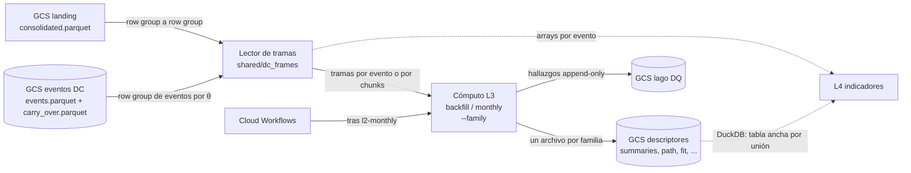

# Documento de Requerimientos Técnicos — Capa 3 (TRD-L3)

## Descriptores por evento y θ (familias de indicadores sobre un esqueleto común) y lector de tramas sobre L1 y L2

> **Capa Descriptores · Arquitectura Medallion · Single-Node Big Data · Google Cloud Platform**

|Campo        |Valor                                                                           |
|-------------|--------------------------------------------------------------------------------|
|Documento    |TRD-L3 — Capa de descriptores por evento y lector de tramas                      |
|Versión      |**1.2**                                                                         |
|Estado       |Línea base. Cierra todo lo que el TRD maestro deja abierto para L3: esqueleto común por familias, contrato de `summaries.parquet`, contrato del lector de tramas, modos, hallazgos, presupuesto de ticks por evento y nombre de la capa. Deja abierto el cómputo (§14), a cerrar con la sonda. |
|Fecha        |Octubre de 2026 (1.2: 2026-10-10)                                               |
|Documento padre|TRD maestro v2.8                                                              |
|Alcance      |Capa 3 (Descriptores, `l3_dc_descriptors`) de la capa Batch y el lector de tramas de `shared/`|
|Clasificación|Académico / Uso personal                                                        |
|Contexto     |Trabajo de grado — Maestría en Finanzas · Universidad EAFIT (Medellín, Colombia)|

### Historial de revisiones

|Versión|Fecha|Descripción|
|---|---|---|
|1.0|Oct 2026|Línea base inicial (ITSC-329). Fija la pertenencia de un tick a una fase por `agg_trade_id`, el contrato de `summaries.parquet` (una fila por evento, columnas por fase), el carry-over O(1) de tres cubetas (más dos provisionales mientras `direction = 0`) y su regla de fusión, el contrato del lector de tramas, los modos `backfill` y `monthly`, los `check_type` con `layer = "l3"`, la sonda del lector como criterio de aceptación y el nombre de la capa (`l3_summaries`). Es la fuente única de decisiones para las hijas siguientes de la Épica E5: ninguna reabre lo que aquí se fija.|
|1.1|Oct 2026|Tres ajustes de la revisión del arquitecto al PR 113 (ITSC-337), sin cambio de código ni de `VERSION`. (1) §9.2 y ADR-L3-05: un carry-over de L2 con `direction ≠ 0` y `has_pending_event = false` es L2 incoherente y aborta con `l2_state_inconsistent`; L3 no lee el conteo `dc_zero_tick_discarded` del lago de DQ de L2. (2) §10.3 y criterio 9 de §13: la pasada de un θ sobre 2023-03 tiene techo de 5 min (antes 10) y la de 50 θ gana umbral de pared ≤ 20 min, con L2 (184 s a 4 vCPU, TRD-L2 §10.2) como referencia escrita; se ajusta la aritmética de "Qué implica el umbral 1". (3) §8.1 paso 5: un `extreme_agg_trade_id` anterior al primer tick del mes cierra el evento al arrancar la pasada, con `cand' = E_p` en la regla de fusión de ADR-L3-04.|
|1.2|2026-10-10|Cambios de ITSC-340, sin código ni `VERSION`. Datos: las sondas de ITSC-338 (duración y tamaño de los eventos por θ) e ITSC-339 (eventos por umbral de ticks) y el notebook de exploración sobre 2026-08. (1) **ADR-L3-11 (nuevo)**: un archivo por familia sobre un esqueleto común; el §7.3 pasa a describirlo. (2) **ADR-L3-03 y §7.2**: `summaries.parquet` con 17 columnas de datos más las 2 claves; salen `c_quantity` y `os_quantity`, entran `c_duration`, `os_duration`, `c_vwap` y `os_vwap`; invariantes actualizadas. (3) **ADR-L3-12 (nuevo)**: sin carry-over; reemplaza a ADR-L3-04 y a la parte de carry-over de ADR-L3-05 (ambos siguen escritos, marcados como reemplazados). El antiguo §7.3 (`carry_over.parquet`) se elimina, §8 y §9.1 se reescriben, y §7.4 gana `ticks_before_month`, el modo por chunks y el parámetro de presupuesto. (4) **ADR-L3-13 (nuevo)**: presupuesto de 20 M de ticks por evento; cierra RL3-04 y el ítem 3 de §14. (5) **§7.5** con la regla de familia. (6) **ADR-L3-10**: la capa se llama `l3_dc_descriptors` (decisión del humano, 2026-10-10). (7) §3, §4, §10.4, §12, §13 y §14 coherentes con lo anterior. El TRD maestro sube a v2.8.|

-----

## Cómo leer este documento

Este TRD detalla la **Capa 3** y **hereda las invariantes** del TRD maestro, del [TRD-L1](l1.md) y del [TRD-L2](l2.md). No las repite salvo cuando las concreta. El **porqué** de que L3 guarde descriptores y no copias de ticks está escrito una sola vez en dos entradas de Documentación (§2); aquí se citan, no se repiten. El catálogo de familias y de registros (qué se calcula, con qué herramienta, en qué orden se construye) vive en el [Inventario de indicadores de L3](https://app.notion.com/p/3f427957d23d8141ac7ef5041ed8e9a5); este TRD lo enlaza y no lo duplica.

- Si buscas **qué construye L3 y con qué garantías** → secciones 4 y 5.
- Si buscas **el qué y el porqué de cada decisión de capa** → sección 6.
- Si buscas **las columnas de `summaries.parquet`, el esqueleto común de los archivos o el contrato del lector** → sección 7.
- Si buscas **el algoritmo paso a paso y los modos** → sección 8.
- Si buscas **el presupuesto de ticks por evento** → ADR-L3-13 (§6.13).
- Si buscas **los umbrales de la sonda del lector** → secciones 10.3 y 13.
- Si buscas **qué queda abierto** → sección 14.

-----

## Tabla de contenido

1. [Introducción y propósito](#1-introducción-y-propósito)
1. [Invariantes heredadas](#2-invariantes-heredadas)
1. [Alcance de la Capa 3](#3-alcance-de-la-capa-3)
1. [Requerimientos funcionales de L3](#4-requerimientos-funcionales-de-l3)
1. [Requerimientos no funcionales de L3](#5-requerimientos-no-funcionales-de-l3)
1. [Decisiones de diseño de L3 (ADR de capa)](#6-decisiones-de-diseño-de-l3-adr-de-capa)
1. [Contrato de datos](#7-contrato-de-datos)
1. [Pipeline interno y modos de ejecución](#8-pipeline-interno-y-modos-de-ejecución)
1. [Validaciones y política de calidad de datos](#9-validaciones-y-política-de-calidad-de-datos)
1. [Arquitectura de cómputo, dimensionamiento y costo](#10-arquitectura-de-cómputo-dimensionamiento-y-costo)
1. [Operaciones](#11-operaciones)
1. [Riesgos y mitigaciones](#12-riesgos-y-mitigaciones)
1. [Criterios de aceptación](#13-criterios-de-aceptación)
1. [Ítems abiertos y a validar](#14-ítems-abiertos-y-a-validar)
1. [Anexos](#15-anexos)

-----

## 1. Introducción y propósito

L2 dice **dónde** están las fronteras de cada evento (referencia, confirmación, extremo). L3 dice **qué pasó entre ellas**: para cada evento y θ describe los ticks de sus dos fases, la de **confirmación** (el movimiento DC) y el **overshoot** (lo que sigue hasta el extremo). L4 consume esos descriptores para los indicadores entre eventos (magnitudes DC, leyes de escala, régimen, dependencia entre fases).

Los ticks no se copian. L1 los guarda una vez y L2 guarda las fronteras; L3 lee ambas y escribe **familias de descriptores**. Cada familia es un archivo Parquet con una fila por evento cerrado (resumen por fase, trayectoria, forma, frecuencia, complejidad) o una vista SQL sobre esos archivos (derivados). Este TRD fija el esqueleto que todos comparten (ADR-L3-11), el contrato de la primera familia, `summaries.parquet`, y el **lector de tramas**: un módulo compartido que recorta L1 con las fronteras de L2 y entrega los arrays de cada fase sin persistirlos. Los indicadores que necesitan la **secuencia** de ticks de un evento (microestructura, Fourier, wavelets, secuencias para ML) usan el lector.

L3 también hace **medible el sesgo del instante atómico** de L2 (ADR-L2-04, divergencia (b)): `confirm_price` es el precio menos favorable del grupo de empate y un tick más extremo del mismo instante no cuenta. Con el máximo y el mínimo reales por fase, y el mejor y el peor precio del instante de confirmación, L4 tiene las dos medidas y puede cuantificar la diferencia en vez de ignorarla.

A diferencia de L2, L3 **no es una cadena secuencial por θ**: no guarda estado entre meses. El evento que sigue abierto al cierre de un mes no se resume hasta que cierra; el mes en que cierra, el lector relee hacia atrás los row groups de L1 que necesita (ADR-L3-12). Los θ se evalúan en una sola pasada sobre la serie.

-----

## 2. Invariantes heredadas

L3 hereda y no contradice:

- **Región única us-east1**, **Parquet** ZSTD-3 en Cloud Storage, **presupuesto** ≤ 100 USD/mes (objetivo < 5 USD/mes), **IaC** con Terraform, **mínimo privilegio**. Pertenece al stack `batch`.
- **Particionado hive** `provider × market × asset × theta × year × month`, el mismo de L2. La partición de una fila de L3 es la de su fila de L2.
- **Idempotencia y `content_hash`** (RF-12/RF-13 del maestro): `pyutils.PartitionWriter` y `pyutils.content_hash`, el mismo patrón de L1 y L2 (escritura atómica con temporal y `commit`). Re-ejecutar un mes de un θ da el mismo `content_hash`.
- **Contratos de entrada**: el Parquet conformado de L1 ([TRD-L1 §7.2](l1.md#72-salida--parquet-conformado-de-l1-contrato-hacia-l2)) y la salida de L2 ([TRD-L2 §7.2](l2.md#72-salida--eventsparquet-contrato-hacia-l3) y [§7.4](l2.md#74-carry-over--contrato-y-disposición-física)).
- **Solo consolidados** (ADR-L2-09): L3 nunca lee `provisional-day=DD.parquet`. No tiene modo diario.
- **Hallazgos de DQ** con `emit_findings()` de `shared/dq` (RF-20/RF-21 del maestro).

**Decisiones que no se reabren aquí:**

|Decisión|Dónde se fijó|Qué fija para L3|
|---|---|---|
|L3 guarda resúmenes por evento, no copias de ticks; los indicadores de ticks releen L1 con fan-out|[Decisión: L3 guarda resúmenes por evento, no copias de ticks](https://app.notion.com/p/3eb27957d23d81d69ccac074bef2f8b3) (2026-09-30)|Una fila por evento y θ con estadísticos por fase. Pesa como L2, no como L1. Un indicador nuevo es una pasada que escribe solo su archivo (ADR-L3-11).|
|L1 y L2 son la fuente de verdad y las tramas se leen con un lector compartido|[Decisión: L3 no copia ticks; L1 y L2 son la fuente de verdad y las tramas se leen con un lector compartido](https://app.notion.com/p/3f327957d23d814b8a76cf2677ddeaa5) (2026-10-08)|Cero copias de ticks para cualquier θ (cierra la excepción del 30-09). Pertenencia por `agg_trade_id`. El lector es criterio de aceptación de la Épica. Define cuándo reabrir (§14).|
|Eficiencia de memoria ante todo|[Decisión: eficiencia de memoria ante todo](https://app.notion.com/p/3e727957d23d811887eaf14c886b9a0c) (2026-09-26)|Un row group en vuelo y los acumuladores de las fases abiertas (RNF-L3-01). El pico de una unidad es O(lote), no O(unidad).|
|Rust solo en el detector|Entrada de Documentación "Decisión: Rust solo en el detector de L2"|L3 es Python sobre Arrow (ADR-L3-07).|
|Los agentes no despliegan|[Decisión: despliegue de stacks de capa por GitHub Actions con WIF](https://app.notion.com/p/3e527957d23d810e9401d9d941d17f83) (2026-09-24)|Los agentes solo abren PRs. El humano aplica el stack y lanza los jobs en el environment `gcp`.|
|Instante de confirmación atómico y terna del extremo|ADR-L2-03 y ADR-L2-04|El instante de confirmación entero es fase de confirmación; el extremo reiniciado arranca en la terna de la confirmación.|
|El tick extremo pertenece al evento que cierra|ADR-VZ-12 ([TRD-viz](viz.md))|Frontera entre overshoot y la confirmación siguiente (ADR-L3-01).|
|Catálogo de familias y registros de L3|[Inventario de indicadores de L3: candidatos, modo de cálculo, herramienta y orden de construcción](https://app.notion.com/p/3f427957d23d8141ac7ef5041ed8e9a5) (2026-10-09)|Qué familias existen, qué registros tiene cada una y en qué orden se construyen. El TRD lo enlaza y no repite su tabla (§7.5).|

-----

## 3. Alcance de la Capa 3

### 3.1 Dentro de alcance

- Las **familias de descriptores** del inventario sobre el lector, para **cada evento cerrado de L2**, los θ del catálogo y el histórico completo desde 2017-08: resumen por fase (`summaries`), trayectoria (`path`), forma (`fit`), frecuencia (`spectrum`) y complejidad (`complexity`) como archivos, y los derivados (`derived`) como vista SQL versionada. Cada familia se construye en su propia card; este TRD fija el esqueleto común (ADR-L3-11) y el contrato de la primera, `summaries.parquet` (§7.2).
- Resumen por fase (confirmación y overshoot) y resumen propio del **instante de confirmación** (número de ticks, mejor y peor precio).
- Ejecución **mensual** y `backfill`, **sin estado entre meses** (ADR-L3-12): cada unidad `(θ, mes)` se resume sola, con el lector.
- **Presupuesto de ticks por evento** para las familias de serie completa (ADR-L3-13).
- Materialización a Parquet en la misma partición que la fila de L2.
- El **lector de tramas** en `shared/`: contrato (§7.4) y sonda de rendimiento. Es también el **oráculo de pertenencia** de las pruebas de la capa.
- Hallazgos de calidad de datos propios de L3 (`layer = "l3"`).

### 3.2 Fuera de alcance

- Los **indicadores entre eventos** (L4): magnitudes DC, leyes de escala, duración neta, régimen y dependencia entre fases (familias M, L, N, R y K del inventario). Se calculan sobre filas de L2 y de las familias de L3, no sobre ticks.
- **Copias de ticks por θ**, para cualquier subconjunto de θ (decisión del 2026-10-08).
- **Cambios en L1, L2 o viz.** Si el contrato de L1 o L2 no alcanza, se bloquea la card y se abre otra aparte.
- **Rust.** L3 no tiene hot loop propio (ADR-L3-07).
- **Capa Kappa**: el lector y los descriptores trabajan sobre Parquet; conectarlos a un websocket no es parte de esta capa.
- **Extensibilidad multi-activo real**: el diseño no la impide (partición por `asset`), pero la primera implementación es mono-activo (BTCUSDT).

-----

## 4. Requerimientos funcionales de L3

*Prioridad MoSCoW: M (Must), S (Should), C (Could). Trazabilidad al RF del maestro entre paréntesis.*

|ID       |Nombre                                |Descripción                                                                                                                                  |Prio.|
|---------|--------------------------------------|---------------------------------------------------------------------------------------------------------------------------------------------|-----|
|RF-L3-01 |Resumen por fase (RF-07)              |Escribir, por evento cerrado de L2 y θ, el resumen de la fase de confirmación y del overshoot en `summaries.parquet` (§7.2).                      |M    |
|RF-L3-02 |Pertenencia por `agg_trade_id`        |Asignar cada tick a una fase por su `agg_trade_id`, nunca por tiempo ni por posición (ADR-L3-01).                                              |M    |
|RF-L3-03 |Instante de confirmación              |Resumir aparte los ticks del instante de confirmación: número, mejor y peor precio.                                                           |M    |
|RF-L3-04 |Esqueleto común                       |Todo archivo de familia tiene una fila por fila de L2, en la misma partición, con el mismo orden, los mismos límites de row group y las claves `(theta, confirm_agg_trade_id)`, sin duplicar columnas de L2 (ADR-L3-03, ADR-L3-11).|M    |
|RF-L3-05 |Evento que cruza meses (RF-06)        |El resumen de un evento sale del lector, que lee hacia atrás los row groups de L1 que el evento necesita. L3 no guarda estado entre meses (ADR-L3-12).|M    |
|RF-L3-06 |Fail-closed                           |Con una entrada de L2 faltante o incoherente, o con un archivo de familia que pierde el esqueleto, la unidad aborta con un hallazgo `error` (ADR-L3-05, ADR-L3-11).|M    |
|RF-L3-07 |Lector de tramas                      |Entregar por evento cerrado su fila de L2 y los arrays de cada fase, por evento o por chunks, con pertenencia por id y sin copiar ticks al lago (ADR-L3-06).|M    |
|RF-L3-08 |Sonda del lector                      |Medir el lector sobre el mes más pesado antes de que L4 dependa de él, con los umbrales de §10.3 (ADR-L3-09).                                 |M    |
|RF-L3-09 |Idempotencia y `content_hash` (RF-12) |Re-ejecutar un mes de un θ produce `summaries.parquet` con `content_hash` idéntico.                                                           |M    |
|RF-L3-10 |Reanudabilidad por θ (RF-13)          |Frontera por θ y familia: el último mes con su archivo válido (§8.2).                                                                          |M    |
|RF-L3-11 |Imagen única por modos                |Una imagen `l3` con modos `backfill` y `monthly` y selector `--family` (RF-15 del maestro).                                                    |M    |
|RF-L3-12 |Hallazgos de calidad de datos         |Emitir los `check_type` de §9.3 al lago de DQ compartido (RF-20/RF-21).                                                                       |M    |
|RF-L3-13 |Verificación cruzada                  |Los agregados de un mes coinciden con una agregación independiente sobre las tramas que entrega el lector, y el camino rápido coincide con el camino por evento (§13).|M    |
|RF-L3-14 |Presupuesto de ticks por evento       |Las familias de serie completa no cargan un evento de más de 20 M de ticks: dejan sus columnas nulas y emiten `event_over_budget` (ADR-L3-13). |M    |
|RF-L3-15 |Familias de descriptores              |Producir las familias del inventario sobre el lector, cada una con su archivo, su `state_version` y su regla de nulos (ADR-L3-11).            |S    |

-----

## 5. Requerimientos no funcionales de L3

|ID        |Atributo                  |Requerimiento                                                                                                                                       |Prio.|
|----------|--------------------------|----------------------------------------------------------------------------------------------------------------------------------------------------|-----|
|RNF-L3-01 |Eficiencia de memoria     |El pico del resumidor y de las familias por chunks es O(row group): un row group de L1 (≈ 48 MB decodificado con las cinco columnas que L3 lee), un row group de eventos de L2 por θ y los acumuladores de las fases abiertas. Las familias de serie completa cargan un evento, y solo si cabe en el presupuesto de ticks (ADR-L3-13). Los ticks se liberan en cuanto se aprovecharon.|M    |
|RNF-L3-02 |Exactitud                 |Cantidades y precios de `summaries.parquet` se agregan en aritmética exacta (decimal o entero escalado), sin punto flotante. Las familias de estadística (`path`, `fit`, `spectrum`, `complexity`) pueden usar `float64` en su cálculo; nunca para comparar precios.                                     |M    |
|RNF-L3-03 |Determinismo              |Misma entrada, mismo `content_hash`. El orden de las filas y el de la suma no dependen de hilos ni de la partición en row groups.                     |M    |
|RNF-L3-04 |Acoplamiento débil (RNF-14)|L3 no importa `l1_ingest` ni `l2_dc_events`. Se comunica con L1 y L2 solo por sus contratos Parquet y usa `shared/` (`pyutils`, `dq`, el lector).      |M    |
|RNF-L3-05 |Rendimiento del lector    |Umbrales de §10.3, fijados antes de medir.                                                                                                          |M    |
|RNF-L3-06 |Peso de la capa           |`summaries.parquet` pesa del orden de L2, no del orden de L1 por θ; su tamaño se estima en §10.4 y se mide con la sonda en la nube. Cada familia nueva declara el suyo en su card.                              |S    |
|RNF-L3-07 |Reproducibilidad (RNF-13) |Cada partición es trazable a la imagen exacta (semver + git SHA) que la generó.                                                                      |S    |
|RNF-L3-08 |Sin secretos              |L3 lee y escribe buckets propios del project vía IAM, sin credenciales de terceros.                                                                  |M    |

-----

## 6. Decisiones de diseño de L3 (ADR de capa)

*Cada decisión hereda las invariantes de §2 y las concreta para L3.*

### 6.1 ADR-L3-01 — Pertenencia de un tick a una fase: por `agg_trade_id`, no por tiempo ni por posición

|Campo|Contenido|
|---|---|
|**Decisión**|Dado un evento con `reference_agg_trade_id` (R), `confirm_agg_trade_id` (C) y `extreme_agg_trade_id` (E), un tick con id `i` pertenece a: **fase de confirmación** si `R < i ≤ C`; **overshoot** si `C < i ≤ E`. El overshoot puede ser vacío (`E = C`). Los ticks con `i ≤ R` son del evento anterior; los de `i > E`, del siguiente.|
|**Consecuencias de los límites**|(1) **El instante de confirmación entero es fase de confirmación** (ADR-L2-03): `C` es el id del último tick del grupo de empate, así que todos los ticks del grupo caen en `(R, C]`. (2) **El tick extremo pertenece al evento que cierra** (ADR-VZ-12): `E` es inclusivo en el overshoot de este evento, y el tick `E + 1` abre la confirmación del siguiente. (3) **El tick de referencia no pertenece al evento**: es el extremo del anterior. (4) Cada tick de la serie desde la primera referencia pertenece a **exactamente una** fase de exactamente un evento. Los ticks anteriores a la primera referencia de la serie no pertenecen a ningún evento. (5) **El evento pendiente no se resume hasta que cierra**: L3 no guarda estado de él; sus ticks se releen de L1 el mes en que cierra (ADR-L3-12).|
|**El id es criterio de pertenencia, no índice posicional**|El proveedor deja huecos en `agg_trade_id` (`docs/data-contracts.md`). Con huecos, `posición = id − primer_id` no vale. L3 y el lector **buscan** el id en el arreglo de cada row group (búsqueda binaria), no lo restan. Ejemplo: con ticks de ids `101, 103, 104` entre `R = 100` y `C = 104` (falta el 102), la fase de confirmación tiene **3** ticks, no `104 − 100 = 4`.|
|**Alternativa descartada: cortar por tiempo**|Varios ticks comparten `transact_time` (hasta 4 090 en un milisegundo el 2026-09-30), la unidad del proveedor cambió de ms a µs en 2025 (ADR-L1-02) y L2 fija sus fronteras por id. Un corte por tiempo repartiría sin regla los ticks del instante de frontera y se comportaría distinto según el año.|
|**Instante de confirmación (definición)**|Los ticks de la fase de confirmación con `transact_time = confirm_time`. No incluye ticks del mismo `transact_time` con id `≤ R` (de otro evento). Incluye siempre al tick `C`, así que `confirm_instant_ticks ≥ 1`.|

### 6.2 ADR-L3-02 — Las fronteras son las de L2: L3 no repite el detector

|Campo|Contenido|
|---|---|
|**Decisión**|L3 no detecta nada. Toda frontera sale de L2: `R`, `C` y `E` de cada fila de `events.parquet`. El evento que sigue abierto al cierre del mes no tiene `E` y no se resume (ADR-L3-12). El `carry_over.parquet` de L2 solo sirve para conciliar los ticks (§9.1: `direction` y extremos que fijan los ticks no asignados) y para la compuerta de coherencia (§9.2).|
|**Justificación**|Repetir la lógica del extremo (reglas de empate, instante atómico, comparación entera) en un segundo lugar crea dos fuentes de verdad que pueden divergir en el borde, y L2 ya la tiene probada. Con las fronteras dadas, L3 es una agregación por rangos de id, vectorizable. Si L3 detectara su propio extremo, el costo no sería solo código: cada corrección de L2 exigiría la misma corrección en L3.|
|**Consecuencia**|L3 de un mes `M` **requiere** `events.parquet` y `carry_over.parquet` de L2 del mismo mes y θ, y `consolidated.parquet` de L1 de `M` y de los meses anteriores que sus eventos necesiten. L3 va siempre después de L2 (§8.3). Cualquier contradicción entre L2 y L1 (un id de frontera que no existe como tick, una fila que viola un invariante de §7.2) es una entrada rota: fail-closed (ADR-L3-05).|

### 6.3 ADR-L3-03 — Contrato de `summaries.parquet`: una fila por evento, columnas por fase, claves para unir con L2

|Campo|Contenido|
|---|---|
|**Decisión**|`summaries.parquet` (familia S del inventario) tiene **una fila por fila de L2**, en la **misma partición**, en el mismo orden (el de confirmación) y con los mismos límites de row group: es el esqueleto de ADR-L3-11. Tiene **17 columnas de datos** más las 2 **claves** `theta` y `confirm_agg_trade_id`: los agregados de la fase de confirmación con prefijo `c_`, los del overshoot con prefijo `os_` y los del instante de confirmación con prefijo `confirm_instant_`. Esquema completo en §7.2.|
|**Por qué las claves y no copiar columnas de L2**|`(theta, confirm_agg_trade_id)` identifica un evento: `confirm_agg_trade_id` crece estrictamente dentro de un θ. L4 une con `events.parquet` por esa clave (o fila a fila, porque el orden y los row groups coinciden) y no paga el doble de almacenamiento de referencia, confirmación y extremo.|
|**Por qué esos estadísticos**|Son estado O(1) por fase y sin parámetros: conteo, cantidad comprada y vendida según `is_buyer_maker`, máximo y mínimo **reales** de los ticks, duración (último menos primer `transact_time`) y precio medio ponderado por cantidad (VWAP). Del instante de confirmación: cuántos ticks tiene y su mejor y peor precio. El máximo y el mínimo reales son los que hacen medible el sesgo del instante atómico (§1). Lo que no cumple esa regla es otra familia (§7.5).|
|**Qué salió y qué entró en v1.2**|**Salen `c_quantity` y `os_quantity`**: son `buy + sell`, y guardarlas repite el dato. La igualdad con la suma de `quantity` de todos los ticks de la fase se comprueba al escribir y, si falla, la unidad aborta (§7.2). **Entran `c_duration` y `os_duration`** (INT64, µs) **y `c_vwap` y `os_vwap`** (DECIMAL(18,8)): son la lectura que se pide primero de una fase, y los derivados de ritmo, tamaño de operación y velocidad no se pueden calcular sin ellos. El VWAP se calcula **al escribir, en decimal**, porque en entero escalado desborda (§7.2).|
|**Alternativa descartada**|Una fila por fase (dos filas por evento). Duplica las claves, rompe la relación 1:1 con L2 y obliga a L4 a pivotar para tener la fila del evento.|

### 6.4 ADR-L3-04 — Carry-over O(1) por θ: tres cubetas de agregados *(reemplazado por ADR-L3-12 en v1.2)*

|Campo|Contenido|
|---|---|
|**Estado**|**Reemplazado en v1.2 por ADR-L3-12 (§6.12).** Se conserva como registro de lo que se decidió en la v1.0 y de lo que costaba; no rige. L3 ya no tiene carry-over, cubetas ni regla de fusión, y el "§7.3" que cita abajo es el antiguo (`carry_over.parquet`), que ya no existe.|
|**Decisión**|Al cierre de cada mes, el estado de un θ es un Parquet de **una sola fila** (§7.3) con tres cubetas de agregados del evento abierto (el último confirmado, `p`), más su identidad y el candidato a extremo:<br>**A — fase de confirmación de `p`**: `(R_p, C_p]`, completa y fija desde que `p` confirmó, con su instante de confirmación.<br>**B — overshoot certero**: los ticks de `(C_p, cand]`, donde `cand` es el candidato a extremo vigente. Si algo cambia el extremo, esos ticks serán del overshoot de `p`: nada de lo que venga puede sacarlos de él.<br>**T — cola provisional**: los ticks de `(cand, fin del mes]`. Su fase se decide después: si el candidato no se mueve y el evento siguiente confirma, son el **comienzo de la fase de confirmación del evento siguiente**; si el candidato se mueve más allá de ellos, son overshoot de `p`.|
|**Por qué tres y no una o dos**|Con un solo agregado del "evento abierto" no se puede repartir su contenido cuando el extremo se resuelve. Con dos (confirmación y todo lo posterior) tampoco: al confirmar el evento siguiente hay que separar lo que quedó antes del extremo (overshoot de `p`) de lo que quedó después (confirmación del siguiente), y esa frontera es el candidato. Las tres cubetas son el mínimo que permite resolver el extremo en el mes siguiente **sin releer ticks** de meses anteriores (sin el buffer de huérfanos de la v0 que descartó ADR-L2-07).|
|**Regla de fusión**|Al procesar el mes `M+1` de un θ con evento abierto `p`, con el candidato guardado `cand` y el candidato `cand'` que resuelve L2 (el extremo `E_p` de la fila de `p` si cierra en `M+1`, o el candidato del `carry_over.parquet` de L2 de `M+1` si sigue abierto):<br>**(i) El candidato no se movió** (`cand' = cand`): B no cambia. Si `p` cierra, su overshoot es B y T pasa a ser el comienzo de la confirmación del evento siguiente. Si `p` sigue abierto, T absorbe todos los ticks de `M+1`.<br>**(ii) El candidato se movió** (`cand' > cand` en id): T y los ticks de `M+1` hasta `cand'` (inclusive) se **fusionan en B**. Si `p` cierra, esa B fusionada es su overshoot y los ticks posteriores a `E_p` son el comienzo de la confirmación de `p+1`; si sigue abierto, T se reabre vacía con los ticks posteriores a `cand'`.<br>**(iii) `cand' < cand`** es imposible: contradice a L2 (ADR-L3-05).<br>En ambos casos, al cerrar `p` en `M+1`, el evento siguiente `p+1` nace con la cubeta A = lo que le toque de T y de los ticks hasta su `C`, y su instante de confirmación se calcula en `M+1`: un instante comparte `transact_time` y el mes se define por tiempo, así que **nunca cruza el borde de mes**.|
|**Por qué el candidato sale de L2 y no se rastrea tick a tick**|Ver ADR-L3-02. El candidato del cierre de mes `M` es el de `carry_over.parquet` de L2 de `M`; el extremo final de un evento cerrado es su `extreme_agg_trade_id`. L3 solo compara ids.|
|**Antes de la primera confirmación (`direction = 0`)**|No hay evento abierto (`has_pending = false`) y aún no se sabe cuál extremo será la referencia del evento 1. El estado lleva **dos cubetas provisionales**, no otro tipo de cubeta: es la misma T del régimen normal, que existe desde cada extremo candidato. Con `direction = 0` hay dos, `T_alto` = ticks de `(ext_high, fin del mes]` y `T_bajo` = ticks de `(ext_low, fin del mes]`; con `direction` fijada hay una. Misma regla que T: **cada una se vacía cuando su extremo se mueve** (el `agg_trade_id` de `ext_high_*`/`ext_low_*` que resuelve L2).<br>**Primera confirmación.** Sea `R₁` el extremo que resultó referencia y `C₁` la confirmación del evento 1. La provisional de `R₁` (si `R₁` es el extremo guardado) más los ticks del mes de la confirmación hasta `C₁` —el grupo de empate entero, ADR-L2-03— es la **fase de confirmación del evento 1** (cubeta A). La otra provisional se descarta y el estado pasa al régimen de tres cubetas. Si `R₁` es posterior al último tick del mes anterior (el extremo se movió), la provisional guardada no aplica y la fase son los ticks de `(R₁, C₁]` del mes.<br>**Arranque en frío del primer mes:** `ext_high = ext_low` = primer tick de la serie, ambas cubetas vacías. Cubre también que `direction = 0` dure varios meses: cada mes aplica la regla de fusión sobre las dos provisionales con los extremos de `carry_over.parquet` de L2.<br>Los ticks con id `≤ R₁` no pertenecen a ningún evento y solo se cuentan como no asignados (§9.1).|
|**Por qué dos provisionales y no fail-closed**|L2 modela `direction = 0` como estado legítimo y lo persiste (ADR-L2-07), y con un θ grande puede durar meses. Abortar dejaría al θ sin cadena por un caso que no es un defecto. Dos provisionales cuestan unos diez escalares más y ningún tick: como L3 no existe aún y este TRD es la 1.0, el esquema nace con ellas, sin subir `state_version` ni exigir `backfill` (§7.5).|
|**Formato**|Parquet de una fila, ZSTD-3, `state_version` semver, `content_hash` como en L2, escrito junto a `summaries.parquet` en la partición del mes que lo produce (§7.3).|

### 6.5 ADR-L3-05 — Entrada de L2 faltante o incoherente: fail-closed

|Campo|Contenido|
|---|---|
|**Decisión**|Para cualquier unidad `(θ, M)`: si falta `events.parquet` o `carry_over.parquet` de L2 de `M`, o si L2 contradice a L1 o a sí mismo (§9.2), la unidad **aborta** y emite un hallazgo `error`. No hay política de "continuar sin la entrada".<br>**L2 incoherente incluye un estado que L3 no puede conciliar.** Un carry-over de L2 con `direction ≠ 0` y `has_pending_event = false` aborta con `l2_state_inconsistent`. Es lo que deja la validación "un DC tiene al menos un tick" de ADR-L2-03 (3) si descarta la primera confirmación de la serie: la conciliación de §9.1 supone que `direction ≠ 0` implica un evento pendiente. L2 ya reporta ese descarte como `dc_zero_tick_discarded` en su propio lago de DQ ([TRD-L2 §9.1](l2.md), conteo esperado cero). L3 no lee ese lago: no es entrada de L3 (§7.1 declara solo `events.parquet` y `carry_over.parquet`) y el carry-over de L2 basta para detectar el estado.|
|**Justificación**|Con L2 incoherente, escribir la fila sería publicar una cifra que se sabe falsa. Es la misma lógica de ADR-L2-08, ahora limitada a la entrada.|
|**`direction = 0` no es un caso de fail-closed**|Un carry-over de L2 con `direction = 0` (`has_pending_event = false`) es un estado válido que L2 modela como legítimo (ADR-L2-07): se consume sin abortar.|
|**Recuperación**|La unidad abortada no avanza la frontera. El humano resuelve el motivo (reprocesar L2 o L1) antes de continuar. Sin auto-sanación en la POC.|
|**Reemplazado en v1.2**|La parte de **carry-over de L3** de la v1.0 (carry-over faltante, de otra `state_version`, primer mes sin carry-over previo, `direction = 0` como estado de la cadena) la reemplaza ADR-L3-12 (§6.12): no hay estado entre meses y, por tanto, nada que pueda faltar. Seguía el razonamiento de ADR-L2-08 (los meses eran una cadena) y se conserva solo como registro.|

### 6.6 ADR-L3-06 — El lector de tramas es un módulo compartido que recorta L1 con las fronteras de L2

|Campo|Contenido|
|---|---|
|**Decisión**|Las tramas se **leen**, no se guardan. El lector vive en `shared/` (paquete `dc_frames`, Python sobre Arrow) y recorre `consolidated.parquet` row group a row group alineado con `events.parquet` de uno o varios θ. Entrega, por cada evento cerrado, su fila de L2 y las dos tramas con arrays de `transact_time`, `price`, `quantity` e `is_buyer_maker`, por evento o por chunks de un row group. Contrato completo en §7.4.|
|**Cómo localiza**|Por **búsqueda binaria** de las fronteras sobre el arreglo de `agg_trade_id` de cada row group, y entrega **slices de Arrow sin copiar**. Nunca itera tick a tick en Python. Para llegar a un row group sin recorrer el mes usa las estadísticas min/max de `agg_trade_id` del pie del archivo (L1 las escribe, `shared/pyutils/src/pyutils/parquet.py`, y `agg_trade_id` es INT64 estrictamente creciente, ADR-L1-01).|
|**Es también el oráculo de pertenencia de la capa**|El lector es la **única** implementación de qué tick es de qué fase. Las pruebas comparan los agregados de `summaries.parquet` contra una agregación **ingenua e independiente** sobre las tramas que entrega (un bucle de Python sobre una fixture pequeña, sin Arrow compute) y contra los valores del notebook de 2026-08, calculado con otro código (§13). Como el resumidor consume el lector (ADR-L3-12), la pertenencia no se verifica con dos implementaciones sino con las garantías de §7.4, la fixture con huecos y el oráculo del notebook. La **agregación** sí tiene dos implementaciones que deben coincidir: el camino por evento y el camino rápido (§8.1).|
|**`is_best_match` no se entrega ni se resume**|Es constante en el proveedor (TRD-L1 §7.1). Tampoco se entregan `first_trade_id` ni `last_trade_id`: la pertenencia usa `agg_trade_id` (que está en la fila de L2, no en las tramas).|
|**Por qué un módulo compartido y no una consulta suelta de cada indicador**|La pertenencia por id con huecos y los eventos que cruzan row groups y meses son fáciles de escribir mal. Con un solo lector, un error se arregla en un lugar y la verificación cruzada lo cubre. Cada familia que mire la secuencia de ticks reutiliza el mismo recorte.|

### 6.7 ADR-L3-07 — Python sobre Arrow, vectorizado: sin Rust y sin iterar tick a tick

|Campo|Contenido|
|---|---|
|**Decisión**|L3 y el lector son Python sobre Arrow, sin Rust (decisión "Rust solo en el detector"). El trabajo por row group es **vectorizado**: `searchsorted` de las fronteras sobre `agg_trade_id` y agregación por segmento sobre vistas del buffer de Arrow. Un bucle de Python por tick está prohibido; uno por evento dentro de un row group, solo si la sonda lo muestra suficiente (§10.3).|
|**Justificación**|La unidad completa de L2 corrió a ≈ 58 000 ticks/s por core antes de ITSC-290 por su parte serial en Python, contra 2,8 M ticks/s del detector en Rust (TRD maestro §7.1). Un lector que itere tick a tick tardaría ≈ 20 horas-core por pasada histórica y volvería atractiva la materialización de tramas que la decisión del 2026-10-08 descarta. La aritmética de L3 (conteos, sumas, máximos y mínimos por rango) es exactamente el tipo de operación que Arrow y numpy hacen por columna.|
|**Técnica prevista (no contractual)**|`price` y `quantity` llegan como `decimal128(18,8)`. Como L1 garantiza que caben en `i64`, la palabra baja de cada valor de 128 bits es el valor y se puede leer como vista `int64` con paso 2 **sin copiar el buffer**, de modo que no conviven dos representaciones del mismo dato (regla de eficiencia de memoria). Las sumas se hacen con acumulador ancho (`decimal128(38,8)` o `i128`) y se angostan al escribir (§7.2). Para el VWAP, la suma de `p·q` lleva escala 10⁻¹⁶ en `decimal128(38,16)` y se divide al escribir.|

### 6.8 ADR-L3-08 — L3 solo lee consolidados de L1 y salidas de L2; modos `backfill` y `monthly`

|Campo|Contenido|
|---|---|
|**Decisión**|L3 lee `consolidated.parquet` de L1 y `events.parquet` más `carry_over.parquet` de L2. Nunca provisionales, nunca otra cosa. Nunca escribe fuera de `l3/`. Tiene dos modos, `backfill` y `monthly`, con frontera por θ y familia y códigos de salida como L2 (§8).|
|**Justificación**|Igual que ADR-L2-09: un descriptor calculado sobre datos que L1 aún puede corregir quedaría basado en ticks que luego cambian. Además, sin L2 de `M` no hay fronteras (ADR-L3-02). Si L1 corrige un mes, las filas de L3 de los eventos que lo leyeron quedan obsoletas y se reprocesan (§11).|

### 6.9 ADR-L3-09 — La sonda del lector es criterio de aceptación, no una mejora posterior

|Campo|Contenido|
|---|---|
|**Decisión**|Antes de que L4 dependa del lector, una sonda sobre el mes más pesado (2023-03, 190.227.841 ticks) debe cumplir los umbrales de §10.3. Los umbrales se **escriben antes de medir**. Es un `ops-script` (mismo mecanismo que las sondas de viz), no una prueba del CI.|
|**Qué pasa si no cumple**|Se aplica "Cuándo reabrir" de la decisión del 2026-10-08: **se mide dónde está el costo antes de considerar copias**. No se reabre por reflejo.|

### 6.10 ADR-L3-10 — Nombre de la capa: `l3_dc_descriptors`

|Campo|Contenido|
|---|---|
|**Decisión**|La capa se llama `l3_dc_descriptors`: `layers/l3_dc_descriptors/`, tags `l3_dc_descriptors/vX.Y.Z` (convención `l<N>_<nombre>`, maestro §8.1), imagen e identificadores `l3`. Son los descriptores de cada evento DC, en línea con `l2_dc_events`. Reemplaza al `l3_summaries` de la v1.0 y al `l3_frames/` del árbol del maestro hasta la v2.6. Decidido por el humano el 2026-10-10.|
|**Justificación**|`l3_frames` prometía tramas materializadas, que es justo lo que se descartó. `l3_summaries` describía la capa mientras tenía un solo archivo; desde ADR-L3-11 `summaries.parquet` es una familia entre varias y el nombre ya no la describe. Las tramas las entrega el lector (`shared/dc_frames`).|
|**Alcance del cambio**|No hay código bajo `layers/l3*`, así que el cambio es solo documental: este ADR, el árbol de `layers/README.md` y el TRD maestro (v2.8).|

### 6.11 ADR-L3-11 — Un archivo por familia sobre un esqueleto común

|Campo|Contenido|
|---|---|
|**Decisión**|L3 es un **directorio por partición** `theta/year/month` (§7.3). Cada **familia** de indicadores es un archivo Parquet (`summaries`, `path`, `fit`, `spectrum`, `complexity`) o, si es SQL sobre filas, una **vista versionada en el repo** (`derived`, sin datos propios). Una **familia es un ciclo de vida**: la misma pasada sobre los datos, los mismos parámetros y versión, la misma regla de nulos. El catálogo de familias y registros es el [Inventario de indicadores de L3](https://app.notion.com/p/3f427957d23d8141ac7ef5041ed8e9a5).|
|**Esqueleto común**|Todos los archivos de familia comparten: una fila por evento cerrado de L2; orden por `confirm_agg_trade_id`; los mismos límites de row group que `events.parquet` de L2; las claves `(theta, confirm_agg_trade_id)`. Se unen **por posición**, y L4 los lee con DuckDB como una tabla ancha sin que lo sean en disco. Cada archivo lleva su propia `state_version`.|
|**Por qué**|Parquet no agrega columnas. Con una tabla ancha, un indicador nuevo reescribiría 1 052 M de filas, y cambiar un parámetro de una familia invalidaría las demás. Con un archivo por familia, un indicador nuevo es **una pasada que escribe solo su archivo**, y descartar una familia es **borrar un archivo**. Dos familias con distinta pasada, parámetros o regla de nulos no comparten archivo: cambiar una no toca la otra.|
|**Regla de herramienta**|**Vista** cuando el cálculo es SQL sobre filas ya escritas (razones, tasas, banderas). **Job de Python que escribe Parquet** cuando necesita ticks o matemática que SQL no tiene.|
|**Alternativas descartadas**|(1) Una tabla ancha única: reescritura completa por cada indicador (arriba). (2) Un archivo por registro: multiplica archivos y aperturas sin que cambie el ciclo de vida.|
|**Riesgo y mitigación**|Que un archivo de familia pierda el esqueleto (filas, orden o row groups distintos) y la unión por posición dé resultados falsos sin error (RL3-11). Un **escritor común en `shared/`** copia filas, orden y row groups de `summaries.parquet`, y §13 lo verifica.|

### 6.12 ADR-L3-12 — Sin carry-over: el resumidor lee hacia atrás con el lector

|Campo|Contenido|
|---|---|
|**Decisión**|L3 **no guarda estado entre meses**. El **resumidor** (la pasada que escribe `summaries.parquet`) consume el lector de tramas (§7.4) y agrega por evento cerrado. El evento que cruza meses lo resuelve el lector, que **lee hacia atrás solo los row groups de L1 que el evento necesita**. Reemplaza a ADR-L3-04 y a la parte de carry-over de ADR-L3-05.|
|**Por qué**|(1) ITSC-338 mide que el evento más largo del histórico dura **42 días** (θ = 0,05), así que `monthly` relee a lo sumo dos meses anteriores y solo sus row groups útiles. (2) El histórico se corre pocas veces (decisión del humano, 2026-10-09), así que el costo de releer no pesa donde se pagaría. (3) El carry-over costaba: una `state_version`, las reglas de fusión de tres cubetas más dos provisionales, una compuerta contra el carry-over de L2 y un `backfill` completo por cada columna nueva.|
|**Consecuencias**|Se eliminan el antiguo §7.3 y `carry_over.parquet` de L3. **§8.1** se reescribe: lector, agregación Arrow por evento y un camino rápido opcional con numpy `reduceat` por row group, que agrega todos los eventos del row group en una llamada. **§8.2** define la frontera de un θ como el último mes con `summaries.parquet` válido. **§8.3**: `monthly` es el `backfill` de un mes. **§9.1** se reformula sin entrada ni salida de estado: por θ y mes, cada tick está en exactamente un evento cerrado, en la cola pendiente o en los no asignados. **ADR-L3-05** queda solo para la entrada de L2 faltante o incoherente. Una columna nueva ya no invalida estado de nadie (§7.5).|
|**Conciliación por mes (decisión de esta versión)**|El lector informa, por evento, cuántos de sus ticks son anteriores al mes de la partición que lo cierra (`ticks_before_month`, adición a §7.4), y §9.1 concilia cada mes con esa cifra. Se descarta conciliar por rango completo: obligaría a un `monthly` a contar los ticks de toda la serie anterior.|
|**Costo asumido**|Un θ grande relee, en el mes en que cierra un evento largo, los row groups de los meses anteriores que este toca; con fan-out, un row group de `M-1` puede decodificarse otra vez en la pasada de `M`. La sonda del backfill completo lo mide (§14, ítem 1).|

### 6.13 ADR-L3-13 — Presupuesto de ticks por evento

|Campo|Contenido|
|---|---|
|**Decisión**|Las familias de **serie completa** (`spectrum` y `complexity`) cargan el evento entero **solo si tiene ≤ 20 M de ticks** (0,89 GiB a 48 B por tick, ≈ 3,5 GiB de trabajo con las copias del algoritmo, razón ≈ 4). Si lo supera, **sus columnas quedan nulas** y se emite `event_over_budget` (warning, con θ, clave y ticks). El resumidor y las familias por chunks (`path`, `fit`) **no tienen presupuesto**: su pico es un row group.|
|**Cómo se mide**|El tamaño de un evento es `extreme_agg_trade_id − reference_agg_trade_id`, una cota superior del número de ticks (los huecos del proveedor lo reducen) y lo mismo que contó ITSC-339. Se evalúa con la fila de L2, antes de leer un tick.|
|**Por qué 20 M**|ITSC-338: el evento más grande del histórico tiene 124 M de ticks (5,7 GiB a 48 B por tick) y en θ = 0,05 el p99 ya es 21 M. ITSC-339 cuenta **117 eventos de 1 052 M sobre 20 M de ticks, todos en θ ≥ 0,016**, y 16 sobre 50 M, que no caben en un job de 8 GiB (50 M × 48 B = 2,2 GiB, ≈ 8,8 GiB de trabajo). Con 20 M, la inmensa mayoría de los eventos se calcula entera y los nulos quedan en la cola de los θ más lentos.|
|**Memoria**|Las familias de serie completa corren con **un θ por pasada y un evento en vuelo**: mezclarlas con el fan-out sumaría los eventos abiertos de todos los θ (el RL3-04 de la v1.1).|
|**El número es del TRD**|20 M sale del job de 8 GiB, no del contrato. Con un job de **16 GiB** el presupuesto sube a 50 M y los nulos bajan a 16. Cambiarlo es editar este ADR y reprocesar las familias afectadas, sin cambiar columnas ni tipos.|
|**Cierra**|§14 ítem 3 y RL3-04.|

-----

## 7. Contrato de datos

### 7.1 Entrada

**L1:** `consolidated.parquet` (ADR-L2-09), row group por row group (`ROW_GROUP_SIZE = 1_000_000`, `layers/l1_ingest/src/l1_ingest/write.py`; L3 no depende de ese valor, usa los metadatos del archivo). Columnas que lee: `agg_trade_id` (INT64), `transact_time` (INT64, µs UTC), `price` y `quantity` (`DECIMAL(18,8)`), `is_buyer_maker` (BOOL). No lee `first_trade_id`, `last_trade_id` ni `is_best_match`. Un row group con esas cinco columnas decodificadas pesa ≈ 48 MB (16 + 16 + 8 + 8 B por tick más el bit de `is_buyer_maker`).

**L2:** `events.parquet` del mes (ordenado por `confirm_time`; sus row groups no tienen tamaño fijo: `FLUSH_ROWS = 32_768` en `layers/l2_dc_events/src/l2_dc_events/events.py` es solo el umbral de vaciado, y cada row group lleva todo lo acumulado, así que tiene al menos 32 768 filas, salvo el último, y puede superarlas): usa siete columnas: `reference_agg_trade_id`, `confirm_agg_trade_id`, `confirm_time`, `extreme_agg_trade_id` y `direction`, más `confirm_price` y `extreme_price` para los chequeos de §9.2. El θ lo da la partición. Y `carry_over.parquet` del mes, solo para conciliar los ticks y para la compuerta de §9.2: `direction`, `has_pending_event`, `pending_reference_agg_trade_id` y `ext_high_agg_trade_id`/`ext_low_agg_trade_id`. Del mes `M-1`, solo su `direction` (§9.1). Un θ sin eventos en el mes tiene un `events.parquet` válido de cero filas.

### 7.2 Salida — `summaries.parquet` (contrato hacia L4)

Una fila por evento cerrado de L2. Es la familia S del [inventario](https://app.notion.com/p/3f427957d23d8141ac7ef5041ed8e9a5), registros S-01 a S-17. Las cantidades usan la misma escala que L1 (`10⁻⁸`). Son **19 columnas**: las 2 claves y 17 de datos.

|Columna|Tipo Parquet|Nulable|Notas|
|---|---|---|---|
|`theta`|DECIMAL(9,8)|no|θ del evento. Clave. Redundante con la partición.|
|`confirm_agg_trade_id`|INT64|no|Clave. Con `theta` identifica al evento y une con la fila de L2.|
|`c_ticks`|INT64|no|S-01. Ticks de la fase de confirmación `(R, C]`. ≥ 1.|
|`c_quantity_buy`|DECIMAL(18,8)|no|S-02. Suma de `quantity` con `is_buyer_maker = false` (el agresor compró).|
|`c_quantity_sell`|DECIMAL(18,8)|no|S-03. Suma de `quantity` con `is_buyer_maker = true` (el comprador era el maker: el agresor vendió).|
|`c_price_max`|DECIMAL(18,8)|no|S-04. Precio máximo real de los ticks de la fase.|
|`c_price_min`|DECIMAL(18,8)|no|S-05. Precio mínimo real de los ticks de la fase.|
|`c_duration`|INT64|no|S-06. Último menos primer `transact_time` de la fase, en µs. 0 si todos los ticks comparten `transact_time`.|
|`c_vwap`|DECIMAL(18,8)|no|S-07. `Σ price·quantity / Σ quantity` de la fase, calculado al escribir en decimal.|
|`os_ticks`|INT64|no|S-08. Ticks del overshoot `(C, E]`. 0 si el overshoot es vacío (`E = C`).|
|`os_quantity_buy`, `os_quantity_sell`|DECIMAL(18,8)|no|S-09 y S-10. Como `c_*`. 0 si `os_ticks = 0`.|
|`os_price_max`, `os_price_min`|DECIMAL(18,8)|**sí**|S-11 y S-12. Como `c_*`. Nulos si `os_ticks = 0`.|
|`os_duration`|INT64|**sí**|S-13. Como `c_duration` sobre el overshoot. Nulo si `os_ticks = 0`.|
|`os_vwap`|DECIMAL(18,8)|**sí**|S-14. Como `c_vwap` sobre el overshoot. Nulo si `os_ticks = 0`.|
|`confirm_instant_ticks`|INT64|no|S-15. Ticks de la fase de confirmación con `transact_time = confirm_time` (ADR-L3-01). ≥ 1.|
|`confirm_instant_price_best`|DECIMAL(18,8)|no|S-16. Precio **más favorable a la confirmación** del instante: el máximo en un upturn, el mínimo en un downturn.|
|`confirm_instant_price_worst`|DECIMAL(18,8)|no|S-17. Precio **menos favorable**: el mínimo en un upturn, el máximo en un downturn.|

**La cantidad total de una fase no es columna.** `c_quantity` y `os_quantity` salieron en la v1.2 por ser `buy + sell` (ADR-L3-03). La igualdad se **comprueba al escribir**: el resumidor suma por separado la `quantity` de todos los ticks de la fase y la compara con `buy + sell`; si difieren, la unidad aborta con `phase_quantity_mismatch` (fail-closed).

**Invariantes verificables de una fila** (se prueban en §13 y se chequean en §9.2):

1. `c_ticks ≥ confirm_instant_ticks ≥ 1`.
2. `confirm_instant_price_worst ≤ confirm_price ≤ confirm_instant_price_best` en un upturn (al revés en un downturn).
3. En un upturn, `c_price_max = confirm_instant_price_best`; en un downturn, `c_price_min = confirm_instant_price_best`. Antes del instante de confirmación ningún precio cruza el umbral, así que el extremo de la fase está en el instante. De aquí sale `c_price_max ≥ confirm_price` en un upturn y `c_price_min ≤ confirm_price` en un downturn.
4. Si `os_ticks > 0`, en un upturn `os_price_max = extreme_price` y en un downturn `os_price_min = extreme_price`.
5. `os_ticks = 0` si y solo si `extreme_agg_trade_id = confirm_agg_trade_id`.
6. `c_ticks ≤ C − R` y `os_ticks ≤ E − C`, con igualdad si el proveedor no dejó huecos en el rango.
7. `c_duration = 0` si y solo si `c_ticks = confirm_instant_ticks` (todos los ticks de la fase comparten `transact_time`). Además `c_price_min ≤ c_vwap ≤ c_price_max` y, si `os_ticks > 0`, `os_price_min ≤ os_vwap ≤ os_price_max`.
8. Cantidad, **en escritura**: `c_quantity_buy + c_quantity_sell` y `os_quantity_buy + os_quantity_sell` son iguales a la suma de `quantity` de todos los ticks de su fase.

**Tipo de las cantidades.** Una fase puede juntar decenas de millones de ticks, pero el volumen de una fase no puede superar el volumen total negociado de la serie. El volumen histórico de BTC/USDT en Binance es del orden de 10⁹ BTC, y `DECIMAL(18,8)` llega a ≈ 10¹⁰: la suma cabe con un margen de un orden de magnitud y el valor ocupa 8 B (el respaldo en INT64 de Parquet). Si alguna vez no cupiera, la conversión al escribir falla (la unidad aborta) en vez de truncar: es una guarda, no una política.

**Tipo del VWAP.** `Σ price·quantity` lleva escala `10⁻¹⁶`. En entero escalado de 64 bits desborda: un precio de 10⁵ USD (10¹³ escalado) por 10² BTC (10¹⁰ escalado) ya da 10²³, contra el tope de ≈ 9,2·10¹⁸. Por eso se acumula en `decimal128(38,16)` (≈ 10¹⁴ de volumen nocional por fase, margen amplio), se divide por `Σ quantity` **al escribir** y se redondea a la escala `10⁻⁸` con una regla única (half-even), para que el `content_hash` no dependa del orden de las sumas. El VWAP queda entre el mínimo y el máximo de la fase (invariante 7).

**Propiedades físicas:** ZSTD-3, estadísticas por columna, **sin diccionario** en las columnas de alta cardinalidad (el aprendizaje de ITSC-290 en L2), ordenado por `confirm_agg_trade_id`. **Mismos límites de row group que `events.parquet` de L2**: L3 lee `num_rows` de cada row group en los metadatos de `events.parquet` y escribe un row group por cada uno, con ese mismo número de filas (no un tamaño fijo, porque los de L2 son variables). Así la fila `i` de un archivo es la fila `i` del otro, también por row group, y L4 puede leer ambos en paralelo sin join. `content_hash` sobre el contenido lógico con `pyutils.content_hash` (el patrón de L1 y L2).

**Particionado hive** (raíz de L3):

```
provider=binance/market=spot/asset=BTCUSDT/theta=<t>/year=YYYY/month=MM/
```

`theta=<t>` con el formato de ancho fijo de L2 (`theta=0.00010000`). **Archivos:** `summaries.parquet` y los de las demás familias (§7.3). Una fila pertenece a la partición del mes que cierra su evento (el mes de su fila de L2, ADR-L2-06), no al de su confirmación.

### 7.3 Directorio de la capa y esqueleto común

Cada partición `theta/year/month` de L3 es un directorio con un archivo por familia (ADR-L3-11):

```
provider=binance/market=spot/asset=BTCUSDT/theta=<t>/year=YYYY/month=MM/
├── summaries.parquet    # familia S: resumen por fase (§7.2)
├── path.parquet         # familia T: trayectoria
├── fit.parquet          # familia A: forma
├── spectrum.parquet     # familia F: frecuencia (serie completa)
└── complexity.parquet   # familia X: complejidad (serie completa)
```

La familia **D** (derivados) no es archivo: es una vista SQL (`derived`) en un `.sql` versionado y probado en el repo, sobre `summaries` unido a `events` de L2. La carga quien lee L3 y se reproduce citando la versión del `.sql`. Qué registros tiene cada familia, cómo se calculan y en qué orden se construyen está en el [inventario](https://app.notion.com/p/3f427957d23d8141ac7ef5041ed8e9a5); aquí no se repite.

**Esqueleto** (lo cumple todo archivo de familia):

|Propiedad|Regla|
|---|---|
|Filas|Una por fila de `events.parquet` de L2 de la misma partición.|
|Orden|Por `confirm_agg_trade_id` ascendente.|
|Row groups|Los mismos límites que `events.parquet`: un row group por cada uno, con el mismo número de filas.|
|Claves|`theta` y `confirm_agg_trade_id`, sin copiar otras columnas de L2.|
|Versión|`state_version` (semver) propia, en los metadatos del archivo. Cambiar una familia no invalida a las demás.|
|Nulos|Cada familia declara su regla (por ejemplo, los `os_*` con overshoot vacío; las de serie completa, los eventos sobre el presupuesto, ADR-L3-13).|

**Escritor común.** Un único escritor en `shared/` arma los archivos de familia: toma filas, orden y límites de row group de `summaries.parquet` de la partición y exige que el archivo nuevo los repita; si no coinciden, aborta con `family_skeleton_mismatch`. Es la mitigación de RL3-11. Una familia distinta de S de un mes solo se escribe si `summaries.parquet` de ese mes existe.

**Lectura.** L4 lee las familias con DuckDB como una tabla ancha, uniendo por `(theta, confirm_agg_trade_id)`. La posición común garantiza que la unión es 1:1 y barata.

**Frontera y escritura por familia.** Cada familia tiene su propia pasada, su `state_version` y su frontera por θ (§8.2); se selecciona con `--family`.

### 7.4 Contrato del lector de tramas

**Módulo:** `shared/dc_frames` (import `dc_frames`). Lo implementa la hija 2 de la Épica; este es el contrato.

**Entrada** (`read_frames`):

|Parámetro|Contenido|
|---|---|
|`thetas`|Uno o más θ del catálogo. Con varios, cada row group de L1 se decodifica **una vez** para todos (fan-out). Con uno, es el caso trivial.|
|`l1_root`, `l2_root`|Raíces de L1 (`consolidated.parquet`) y L2 (`events.parquet`), locales o `gs://`.|
|`start`, `end`|Rango de meses `(year, month)` **de las particiones de L2** cuyos eventos se entregan, ambos inclusivos. Un evento pertenece al mes que lo cierra (ADR-L2-06); sus ticks pueden estar en meses anteriores a `start`, y el lector los lee.|
|`provider`, `market`, `asset`|Coordenadas del dato. Por defecto `binance`, `spot`, `BTCUSDT`.|
|`chunks`, `max_event_ticks`|(v1.2, pendiente de implementar) `chunks = True` entrega cada fase como un iterador de slices, uno por row group (**modo por chunks**), en vez de arrays concatenados (**modo por evento**, el actual). `max_event_ticks` es el presupuesto de ticks del modo por evento (ADR-L3-13): un evento que lo supera se entrega sin tramas y marcado `over_budget`, para que la familia emita `event_over_budget`.|

Además hay un **acceso puntual**, `frames_of(event, l1_root)`: recibe la fila de L2 de un evento que el llamador ya tiene y devuelve sus tramas. Localiza sus row groups por las estadísticas min/max de `agg_trade_id` y decodifica solo esos.

**Salida:** un iterador de `EventFrames`, uno por **evento cerrado** (no entrega el evento pendiente de L2):

|Campo|Contenido|
|---|---|
|`theta`|θ del evento.|
|`event`|La fila de L2 completa (`events.parquet`, 11 columnas), sin transformar.|
|`confirmation`|Trama de la fase de confirmación `(R, C]` (en modo por chunks, un iterador de tramas).|
|`overshoot`|Trama del overshoot `(C, E]`. **Vacía** (cuatro arrays de largo 0) si `E = C`.|
|`ticks_before_month`|(v1.2, pendiente de implementar) Cuántos ticks del evento, de `(R, E]`, son anteriores al primer tick del mes de la partición de L2 que lo cierra. 0 si el evento nació en ese mes. Es el dato con el que §9.1 concilia por mes (ADR-L3-12).|

Cada trama son cuatro arrays de Arrow del mismo largo y orden de la serie: `transact_time` (INT64, µs UTC), `price` (`decimal128(18,8)`), `quantity` (`decimal128(18,8)`) e `is_buyer_maker` (BOOL). Los tipos son los de L1: el lector no convierte a punto flotante ni a otra representación; si el consumidor la necesita, la convierte en su lado. **No** se entregan `agg_trade_id`, `first_trade_id`, `last_trade_id` ni `is_best_match`.

**Orden:** dentro de cada θ, por `confirm_agg_trade_id` ascendente. Entre θ no hay orden garantizado: un evento se entrega en cuanto se decodificó el row group de su extremo.

**Garantías de pertenencia** (validadas en cada evento, fail-closed con `FrameBoundaryError`):

1. El primer tick de `confirmation` es el primer tick con id mayor que `reference_agg_trade_id`; el último tiene id `confirm_agg_trade_id` y `transact_time = confirm_time`.
2. Si `overshoot` no es vacío, su último tick tiene id `extreme_agg_trade_id`. Está vacío si y solo si `extreme_agg_trade_id = confirm_agg_trade_id`.
3. Los ids de frontera (`reference_`, `confirm_` y `extreme_agg_trade_id`) **existen como ticks** en L1. Si no existe, L1 y L2 no cuadran: error, no se corre el límite.
4. **Con huecos de `agg_trade_id`** la pertenencia no se corre: las fronteras se buscan por valor (`searchsorted`), nunca se calculan por resta.

**Garantías de memoria:** a lo sumo **un row group de L1 en vuelo** (≈ 48 MB con las cinco columnas) y un row group de eventos de L2 por θ. En **modo por chunks** eso es todo, con cualquier número de θ en fan-out: el lector no retiene ningún evento. En **modo por evento** se suma **el evento en curso** (≈ 48 B por tick), acotado por el presupuesto (≤ 20 M de ticks ≈ 0,89 GiB, ADR-L3-13); cuando el evento cruza row groups o meses, el lector copia solo los ticks del evento (concatena la parte ya leída) y suelta el row group, en vez de retenerlo, para no anclarlo. Por eso el modo por evento se usa con **un θ por pasada**: en fan-out el pico sería la suma de los eventos abiertos de todos los θ. Dentro de un row group, las tramas son slices sin copia. Si el consumidor conserva los arrays de un slice sin copia, ancla ese row group: es un costo suyo y está documentado.

**Eventos que cruzan row groups y meses:** el lector abre `consolidated.parquet` del mes siguiente cuando termina el actual; si falta un mes intermedio de L1, error. Para empezar en `start` retrocede a los meses anteriores de L1 que necesite el primer evento (a partir de `reference_agg_trade_id` y las estadísticas de los row groups) y lee **solo los row groups que esas estadísticas dicen que necesita**. El evento más largo del histórico dura 42 días (ITSC-338, θ = 0,05), así que retrocede a lo sumo dos meses.

**Límite conocido:** el pico del modo por evento es O(evento), acotado por el presupuesto; el modo por chunks no lo tiene. La sonda reporta el evento más grande por θ y el RSS pico de la pasada de 50 θ (§10.3).

### 7.5 Evolución del contrato

La unidad de evolución es la **familia** (ADR-L3-11):

- Una columna nueva entra a `summaries.parquet` **si y solo si** es estado O(1) por fase (conteo, suma, máximo, mínimo, primero, último) y **no tiene parámetros**. Cambia el esquema de ese archivo: sube su `state_version` (menor si solo se agregan columnas) y exige una pasada de L3 sobre los θ afectados (`--family summaries`), del orden de L2 (§10).
- **Todo lo demás es otra familia con su archivo**: lo que necesita parámetros (bandas, tamaño de muestra, umbral de silencio), una regla de nulos distinta o una pasada distinta (por chunks o de serie completa). Una familia nueva es una pasada que escribe solo su archivo y no toca el de otra.
- Cada archivo lleva su propia `state_version`: cambiar una familia no invalida a las demás.
- Lo que es aritmética sobre las columnas de una fila (razones, tasas, banderas) no se guarda: va en la vista `derived`.
- Desde v1.2, lo que no se calcula con estado O(1) (rachas, secuencias, espectros) **es una familia de L3**, por chunks o con presupuesto de ticks (ADR-L3-13). Los indicadores entre eventos siguen siendo de L4.

El [Inventario de indicadores de L3](https://app.notion.com/p/3f427957d23d8141ac7ef5041ed8e9a5) es el registro único de familias y registros: qué se calcula, cómo, con qué herramienta, en qué orden se construye y en qué estado está. Este TRD no repite su tabla. La card que implementa un registro actualiza su fila allí; la que cambia un contrato actualiza este TRD.

-----

## 8. Pipeline interno y modos de ejecución

### 8.1 Núcleo del resumidor (común a los dos modos)

Es la pasada que escribe `summaries.parquet`. Las demás familias siguen el mismo patrón (lector, un evento o un chunk a la vez, escritor común) con su propia agregación; su detalle va en la card de cada una.

1. **Abrir** `events.parquet` y `carry_over.parquet` de L2 de cada θ que el mes procesa y comprobar la entrada (§9.2). Los eventos se leen **por row group** con un cursor por θ, proyectando solo las siete columnas de §7.1: los eventos del mes (millones para un θ pequeño) nunca están enteros en memoria.
1. **Leer con el lector** (§7.4) en **modo por chunks**, para el rango `start = end = M`: una pasada sobre `consolidated.parquet` de L1, un row group en vuelo y fan-out de los θ del mes. Para los eventos que cruzan meses, el lector retrocede a los row groups de meses anteriores que el evento necesita (ADR-L3-12). Un evento cuyo `extreme_agg_trade_id` es anterior al primer tick del mes es el caso normal del borde (ADR-L2-06 escribe el evento en el mes que lo cierra): todos sus ticks son de meses anteriores y se resumen igual.
1. **Agregar por evento cerrado** (el **camino por evento**, el de referencia): con Arrow compute sobre los slices de cada fase se calculan el conteo, las sumas de `quantity` (total, `is_buyer_maker = false` y `true`), el máximo y el mínimo de `price`, el primer y el último `transact_time` y `Σ price·quantity` (§7.2). Los ticks del instante de confirmación (`transact_time = confirm_time` dentro de la fase) se agregan aparte. Una fase que continúa en el chunk siguiente deja su acumulador abierto.
1. **Camino rápido (opcional).** Para los eventos que caen enteros dentro de un row group, que son la mayoría, numpy `reduceat` sobre las vistas del row group agrega **todos los eventos del row group en una llamada**, sin bucle por evento. Debe dar exactamente la misma tabla que el camino por evento (§13); se adopta solo si la sonda (§10.3) lo muestra necesario.
1. **Liberar** el row group antes de leer el siguiente (RNF-L3-01): no conviven dos row groups ni dos representaciones del mismo precio.
1. Al cerrar el evento: comprobar que `buy + sell` de cada fase es igual a la suma de `quantity` de sus ticks (`phase_quantity_mismatch`), validar los invariantes de §7.2 contra su fila de L2 (§9.2), calcular el VWAP en decimal y **escribir su fila** en `summaries.parquet` con los mismos límites de row group de L2 (§7.2), en el orden de L2.
1. **Conciliar** la cuenta de ticks del mes (§9.1). **Registrar** el `content_hash` y publicar con escritura atómica (temporal + `commit`).

Un mes que L3 procesa lee L1 **una sola vez** para todos los θ de la unidad (fan-out).

### 8.2 Modo `backfill` (histórico)

Igual que [TRD-L2 §8.2](l2.md#82-modo-backfill-histórico), con estas diferencias:

- **Frontera por θ y familia.** Es el último mes de su serie de particiones, **contigua desde `--series-start`**, cuyo archivo de la familia es **válido**: existe, se lee, su esquema, su `theta` y su `state_version` son los de la imagen, y su número de filas por row group es el de `events.parquet` de L2 del mismo mes. Para `summaries.parquet` es la frontera del θ. Sale de **un listado recursivo** de la raíz de L3 más la lectura del pie del archivo de la frontera de cada θ; no se consulta cada partición. Un θ sin frontera arranca en `--series-start`.
- **Requisito de L2.** Un mes `M` de un θ solo se procesa si L2 ya tiene `events.parquet` y `carry_over.parquet` de `(θ, M)`; se comprueba con **un listado** de la raíz de L2. Si faltan, el rango del θ se detiene con el hallazgo `l2_input_missing` (error; ADR-L3-05).
- **Rango y opciones**: `--from`, `--to` (por defecto, el último mes con `consolidated.parquet` en L1), `--thetas` y `--force` con la misma semántica que L2. `--force` exige `--from` (código 2 sin él). `--family` elige la familia (por defecto `summaries`); una familia distinta de S requiere el `summaries.parquet` del mes (§7.3).
- **Un mes, una lectura, los θ que lo necesitan.** Un solo proceso, en orden de meses; el paralelismo es entre los θ del mes. Un mes que ningún θ necesita se salta sin leer L1. Con todo al día termina en segundos sin escribir.
- **Agregar un θ** (al catálogo de L2): tras el `backfill` de L2 de ese θ, lanzar `backfill` de L3 sin `--from`: recorre la serie desde el inicio mientras los demás se saltan.
- Un fallo detiene el rango; los meses siguientes no se tocan.

### 8.3 Modo `monthly` (incremental)

- Es el `backfill` de un mes. Se agenda **después** de `l2-monthly` del mismo mes (orquestación Cloud Workflows, encadenamiento definido en la hija 6). No hay modo diario (ADR-L3-08).
- Procesa el mes anterior (o `--from`) **solo para los θ cuya frontera de L3 es el mes previo y cuyo L2 ya tiene el mes**. Un θ que ya llegó al mes se salta. Releer meses anteriores de L1 es parte de leer el evento, no de la unidad.
- Un θ **rezagado** no se procesa y deja `theta_behind_frontier` (warning), con `details.reason` igual a `l3_frontier` (su serie de L3 tiene un hueco o no existe) o `l2_missing` (L2 no tiene el mes de ese θ). Si otros θ sí están listos, la unidad no falla.
- Si **ningún θ está listo**, ninguno ya tiene el mes y hay rezagados, la unidad termina con código **1** sin leer L1 (fail-closed): un `monthly` perdido no pasa como éxito. Si algún θ ya tiene el mes, o ningún θ necesita el mes y ninguno está rezagado, termina con código **0**.

### 8.4 Códigos de salida

|Código|Cuándo|
|---|---|
|0|Éxito: todos los θ listos avanzaron o ya estaban al día.|
|1|Fallo de la unidad: entrada ausente (L1 o L2), L2 incoherente, esqueleto de familia perdido, no conciliación de ticks o de cantidades, o `monthly` sin ningún θ listo con rezagados (§8.3).|
|2|Error de uso o de configuración: argumento inválido, `--force` sin `--from`, rango que arranca antes de la serie, `--thetas` fuera del catálogo, `--family` desconocida, catálogo de θ inválido, `CLOUD_RUN_TASK_INDEX` distinto de 0. No escribe datos.|

### 8.5 Frontera de mes

No hay un paso especial: es el mecanismo del paso 2 de §8.1. El evento cuyo siguiente aún no confirmó al cierre del mes **no se resume** y L3 no guarda estado de él. El mes en que cierra, el lector lo lee completo, incluidos sus ticks de meses anteriores, y su fila se escribe en su propia partición (ADR-L2-06). Sus ticks del mes anterior se contaron como cola pendiente en la conciliación de ese mes (§9.1).

-----

## 9. Validaciones y política de calidad de datos

### 9.1 Conciliación de ticks

Es la invariante central de la capa. Se hace **por θ y por mes**, sin estado de otros meses (ADR-L3-12): cada tick de `consolidated.parquet` del mes `M` está en exactamente un sitio, un evento que cierra en `M`, la cola pendiente o los no asignados.

```
N_M  =  (Σ_cerrados − P_M) + Cola_M + U_M
```

- `N_M`: ticks de `consolidated.parquet` del mes.
- `Σ_cerrados`: suma de `c_ticks + os_ticks` de las filas que cierran en `M`.
- `P_M`: suma de `ticks_before_month` (§7.4) de esas filas, es decir, los ticks de esos eventos que están en meses anteriores y no cuentan en `N_M`.
- `Cola_M`: ticks de `M` con id mayor que `max(τ, E_max)`, con `E_max` el mayor `extreme_agg_trade_id` de los eventos que cierran en `M`. Son los ticks del evento pendiente, que aún no tiene fila. Si ningún evento cierra en `M`, `E_max` no existe y la cola es lo que sigue a `τ`. Un evento que cierra en `M` tiene su extremo en `M` o antes, así que ningún tick de `M` posterior a `E_max` es de un evento cerrado.
- `U_M`: ticks de `M` con id `≤ τ`, que no pertenecen a ningún evento. Puede ser distinto de cero en **varios meses**, no solo en el primero: mientras `direction = 0` hay ticks que ya no pueden ser de ningún evento.

**Cómo se obtiene `τ`** (la primera referencia de la serie, o su cota mientras no se conoce):

- Si la `direction` de L2 al cierre de `M-1` es distinta de 0, la primera referencia ya quedó atrás: `τ` es anterior al mes y `U_M = 0`.
- Si es 0 (o `M` es el primer mes de la serie) y la `direction` al cierre de `M` es distinta de 0, la primera confirmación ocurrió en `M`: `τ = R₁`, la referencia del primer evento de la serie. Es la `reference_agg_trade_id` de la primera fila de `events.parquet` de `M` o, si ningún evento cerró aún, el `pending_reference_agg_trade_id` del carry-over de L2.
- Si la `direction` al cierre de `M` es 0: `τ = min(ext_high, ext_low)` de L2 al cierre. La primera referencia `R₁` será uno de los extremos o uno posterior, porque los extremos solo avanzan, así que todo tick `≤ τ` es no asignado.
- En el arranque en frío, `τ` es al menos el primer tick de la serie, que no es de ninguna fase.

`Σ_cerrados` y `P_M` salen del resumidor y del lector; `Cola_M` y `U_M`, de `searchsorted` sobre `agg_trade_id` de L1 con ids de L2. Son fuentes distintas: por eso la suma comprueba algo. Cada tick queda en exactamente una fase (ADR-L3-01), salvo los no asignados. Si no cuadra, la unidad aborta con `phase_ticks_mismatch`: es un defecto, no un caso de mercado. Es la versión por mes de "la suma de ticks de todos los eventos cerrados de un θ, más la cola y los no asignados, es el total".

### 9.2 Coherencia con L2

Una compuerta que **aborta** (ADR-L3-05), porque la entrada es insumo del cálculo. **L2 faltante o incoherente**:

- falta `events.parquet` o `carry_over.parquet` de L2 de `M` (`l2_input_missing`);
- un id de frontera (`R`, `C` o `E`) no existe como tick en L1;
- una fila viola un invariante de §7.2 (por ejemplo, `os_price_max ≠ extreme_price` en un upturn);
- un carry-over de L2 con `direction ≠ 0` y `has_pending_event = false`. Este estado lo deja la validación "un DC tiene al menos un tick" de ADR-L2-03 (3) si descarta la primera confirmación de la serie, y la conciliación de §9.1 no puede explicarlo. L2 ya lo reporta como `dc_zero_tick_discarded` en su propio lago de DQ ([TRD-L2 §9.1](l2.md)); L3 no lee ese lago y se apoya solo en el carry-over de L2.

La compuerta no comprueba la `state_version` del carry-over de L2 (RL3-10).

### 9.3 Tipos de chequeo (`check_type`)

Todos los hallazgos de L3 llevan `layer = "l3"`, `mode ∈ {backfill, monthly}` y `stage = "canonical"`. El θ viaja en `details`, como en L2.

|`check_type`|`severity`|`status`|Cuándo|
|---|---|---|---|
|`phase_quantity_mismatch`|`error`|`fail`|`buy + sell` de una fase no es igual a la suma de `quantity` de sus ticks (§7.2). `details` lleva `theta`, `confirm_agg_trade_id`, la fase y los dos valores.|
|`family_skeleton_mismatch`|`error`|`fail`|Un archivo de familia no repite el esqueleto de `summaries.parquet` de su partición: filas, orden, claves o límites de row group (ADR-L3-11). `details` lleva `theta`, `month`, `family` y qué difiere.|
|`event_over_budget`|`warning`|`fail`|Un evento supera el presupuesto de ticks (ADR-L3-13) y las columnas de las familias de serie completa quedan nulas. `details` lleva `theta`, `confirm_agg_trade_id`, `ticks` (`extreme_agg_trade_id − reference_agg_trade_id`), `budget` y `family`. No falla la unidad.|
|`l2_input_missing`|`error`|`fail`|Falta `events.parquet` o `carry_over.parquet` de L2 de `(θ, M)`. `details` lleva `theta`, `month` y el archivo faltante.|
|`l2_state_inconsistent`|`error`|`fail`|L2 contradice a L1 o un invariante de fila (§9.2). `details` lleva `theta`, `month`, el campo y los dos valores. En el caso sin valor de L3 con qué comparar (`direction ≠ 0` sin pendiente), lleva `theta`, `month` y el valor de L2: `direction` y `has_pending_event` del carry-over.|
|`phase_ticks_mismatch`|`error`|`fail`|No cuadra la conciliación de §9.1. `details` lleva `N_M`, `Σ_cerrados`, `P_M`, `Cola_M` y `U_M`.|
|`input_missing`|`error`|`fail`|El mes no tiene `consolidated.parquet` ni provisionales.|
|`input_provisional_only`|`error`|`fail`|El mes solo tiene `provisional-day=DD.parquet`: L3 espera el `monthly-close` de L1 (ADR-L2-09).|
|`theta_catalog_invalid`|`error`|`fail`|El catálogo de θ no existe, no se puede leer o incumple [TRD-L2 §7.3](l2.md#73-el-catálogo-de-θ). Código 2, sin escribir datos.|
|`theta_behind_frontier`|`warning`|`fail`|`monthly` no procesó un θ (§8.3); `details` lleva `theta`, `frontier` (`YYYY-MM` o `null`) y `reason`. No falla la unidad si otros θ avanzan.|
|`theta_config_drift`|`info`|`pass`|El lago de L3 tiene particiones de un θ que ya no está en el catálogo. Informa, no es error: quitar un θ no borra nada.|
|`summaries_summary`|`info`|`pass`|Uno por θ y familia al cerrar el mes: filas escritas, `content_hash` del archivo de la familia, `content_hash` de las entradas de L2 que usó (`events.parquet` y su `carry_over.parquet`) y, para `summaries`, `unassigned_ticks`. Deja el linaje contra L2.|
|`unit_timing`|`info`|`pass`|Uno por unidad (mes): pared y tiempo por fase, límite efectivo de CPU y bytes leídos en `details`. Va aparte de `summaries_summary` porque los tiempos nunca coinciden entre corridas.|

### 9.4 Emisión

La misma función `emit_findings()` de `shared/dq` que usan L1 y L2: log de consola más fila en el lago unificado de DQ. El esquema del hallazgo no gana columnas. `docs/data-contracts.md` gana la sección de `summaries.parquet` y el catálogo de `check_type` de §9.3 cuando se implementen (hijas 4 y 5).

-----

## 10. Arquitectura de cómputo, dimensionamiento y costo

### 10.1 Vista de cómputo



### 10.2 Dimensionamiento — hipótesis de partida, sin medir

**Todo lo de esta sección es una hipótesis hasta que lo mida la sonda de la hija 7 (§14, ítem 1).** No hay todavía una sola medición de L3.

- **Memoria.** Un row group de L1 con cinco columnas (≈ 48 MB, contra los ≈ 32 MB de L2, que no lee `quantity` ni `is_buyer_maker`), más la lectura anticipada, más un row group de eventos por θ con siete columnas proyectadas (≈ 2 MB por θ con 32 768 filas, ≈ 100 MB con 50 θ; L2 no fija un tope de filas por row group, así que la sonda reporta el row group de eventos más grande), más temporales de la agregación y los acumuladores de las fases abiertas. El pico esperado es del orden de unos cientos de MiB, y no crece con los ticks del mes (RNF-L3-01). El tamaño de L2 (4 GiB) deja holgura.
- **CPU.** El trabajo por tick es de lectura, `searchsorted` y reducciones por columna, sin el hot loop de L2 pero con 50 θ sobre cada row group. Se espera un tiempo de pared **del mismo orden que L2** (184 s el mes más pesado a 4 vCPU), sin respaldo medido.
- **Configuración inicial:** Cloud Run Jobs, **4 vCPU / 4 GiB** (el tamaño de L2), `max_retries = 1`, **una sola tarea**. Sin estado entre meses (ADR-L3-12) los meses ya no se encadenan y un task array por mes es posible; lo decide la sonda (§14, ítem 1). Timeouts iniciales con la regla de L2: `monthly` ≥ 6× la pared del mes más pesado medida, `backfill` ≥ 1,5× la suma de los meses y ≤ 86400 s. La hija 7 los fija con la medición y aplica la regla de ADR-04 de L2: Cloud Batch solo si falla alguna condición.
- **Familias de serie completa** (`spectrum`, `complexity`): job de **8 GiB**, un θ por pasada y un evento en vuelo de ≤ 20 M de ticks (≈ 0,89 GiB, ≈ 3,5 GiB de trabajo, ADR-L3-13). Los demás tamaños de cómputo los fija la card de cada familia.

### 10.3 Sonda del lector de tramas — umbrales de aceptación (se escriben antes de medir)

Sobre el mes **2023-03** (190.227.841 ticks), como `ops-script` en Cloud Run con 4 vCPU / 4 GiB. Todos los umbrales son criterio de aceptación de la Épica (ADR-L3-09):

|#|Medida|Umbral|
|--|---|---|
|1|**Pasada completa de un θ** (se miden `θ_min`, un θ intermedio y `θ_max`)|Pared **≤ 5 min** por θ. Es el techo de aceptación.|
|2|RSS pico de esa pasada|**≤ 1 GiB** más el tamaño de los arrays del evento más grande en vuelo, que la sonda reporta aparte.|
|3|**Pasada de 50 θ** sobre el mes|Bytes leídos de `consolidated.parquet` **≤ 1,1 ×** su tamaño y decodificaciones de row group **igual** al número de row groups del mes (no 50 ×). La pared de la pasada tiene umbral **≤ 20 min**. El **RSS pico** se reporta, sin umbral, junto con la **suma máxima de ticks de eventos abiertos a la vez** (la cota de memoria del fan-out, §7.4).|
|4|**Evento al azar** (`frames_of`)|Decodifica un row group (dos si el evento cruza una frontera) y lee **≤ 2 ×** el tamaño de un row group en bytes.|
|5|Corrección|Cero violaciones de las garantías de pertenencia de §7.4 sobre todos los eventos de la pasada de 50 θ, incluidos los que cruzan row groups.|
|6|Informe|Eventos por θ, evento más grande por θ (ticks y MiB), ticks/s, y la **extrapolación al histórico** (4 051 M de ticks) a la tasa medida.|

*De dónde salen 5 y 20 min.* La referencia es L2: detecta los 50 θ de este mes en **184 s a 4 vCPU** ([TRD-L2 §10.2](l2.md)). Un lector que solo decodifica, hace `searchsorted` y entrega slices no debe tardar tres veces más que L2 para **un** θ, y 5 min (300 s) es ≈ 1,6 × esos 184 s. Para los 50 θ, 20 min son ≈ 6,5 × la pared de L2: es holgura para el trabajo por evento, no un objetivo.

*Qué implica el umbral 1.* 5 min para 190 M de ticks son ≈ 0,63 M ticks/s, y ese ritmo da ≈ 1,8 h para el histórico de un θ (4 051 M de ticks). Es un techo para aceptar la capa, no un objetivo de producto. Si la extrapolación del histórico de un θ pasa de **unas pocas horas** (la medición lo dice), se aplica "Cuándo reabrir" de la decisión del 2026-10-08: se mide dónde está el costo antes de considerar copias. El humano puede endurecer el umbral antes de que la hija 3 mida; la hija 3 no lo cambia por su cuenta.

### 10.4 Tamaño de L3 — estimación por fila

Esta estimación es de `summaries.parquet`. Cada archivo de familia escribe **una fila por fila de L2** (el esqueleto, ADR-L3-11), así que su número de filas es el de L2 por construcción; lo que cambia es el ancho de la fila, y cada familia lo declara en su card.

|Concepto|L2 (`events.parquet`)|L3 (`summaries.parquet`)|
|---|---|---|
|Columnas|11|19 (17 de datos y 2 claves)|
|Ancho sin comprimir|≈ 77 B (3 precios, 3 tiempos, 3 ids, `direction`, `theta`)|≈ 148 B (`theta` 4 B, 1 id y 17 valores de 8 B: 3 conteos, 2 duraciones, 4 cantidades, 6 precios y 2 VWAP)|
|Comprimido (ZSTD-3)|≈ 36 B por evento (421 MiB por 12,15 M de eventos, 2020-01, ITSC-244)|**≈ 80 a 100 B por evento (supuesto)**|

La compresión de L3 se supone **peor** que la de L2: L2 comprime bien porque sus ids y tiempos crecen; las cantidades agregadas de L3 son menos regulares. Con ese supuesto, **`summaries.parquet` pesa 2,2 a 2,8 veces L2**: de **≈ 47 a 59 GiB** para los 21,14 GiB medidos de L2, y de **≈ 33 a 42 MB por mes y θ** en el mes más pesado (contra 15 MB de L2, 735 MiB entre los 50 θ).

Dos lecturas honestas de esa cifra. **(1)** Es "del orden de L2", y por θ y mes son decenas de MB, como dijo la decisión del 2026-09-30. **(2)** En total, ese volumen es **comparable al de L1 entero** (38,4 GiB), no un orden de magnitud menor: lo que la decisión descarta es la copia de ticks por θ, que serían ≈ 1,9 TiB, no que L3 sea más liviana que L1. Con solo S, el medallion L1 + L2 + L3 queda en ≈ 105 a 120 GiB (≈ 0,1 TB), de modo que el supuesto de §7.1 del maestro (≈ 0,1 TB y ≈ 2 USD/mes de almacenamiento) se mantiene, pero ya sin holgura. **Cada familia suma su archivo**: su card declara cuánto pesa y, si el total no cabe, se retira una familia borrando su archivo (ADR-L3-11). La estimación la reemplaza la medición de la hija 7. Las palancas que la v1.1 dejaba abiertas ya están aplicadas: `c_quantity` y `os_quantity` salieron (§7.2) y lo que no es estado O(1) va en otro archivo (§7.5).

### 10.5 Costo

Con la hipótesis de §10.2, un backfill completo de una familia cuesta del orden del de L2: ≈ 1,6 USD de lista (≈ 80.000 vCPU-s y GiB-s, 45 % del cupo mensual de vCPU-s de Cloud Run). El cupo gratis es compartido con L1, L2 y viz, así que L3 puede dejar el cupo corto el mes del backfill; el excedente sería de unos pocos USD, dentro del presupuesto. El estado estacionario (`monthly`, un mes por mes) cuesta como máximo lo que el mes más pesado (centavos). El almacenamiento adicional de `summaries.parquet` a la tarifa Standard de us-east1 (0,020 USD/GiB-mes) son ≈ 0,9 a 1,2 USD al mes con el rango de §10.4; cada familia suma el suyo. **Todo esto se reemplaza con la medición.**

-----

## 11. Operaciones

- **Imagen:** una sola imagen `l3` con modos `backfill` y `monthly` y selector `--family` (RF-L3-11), `layers/l3_dc_descriptors/`, entra en `LAYERS` del CI.
- **Cómputo:** Cloud Run Jobs, una tarea, 4 vCPU / 4 GiB (provisional, §10.2); 8 GiB para las familias de serie completa.
- **Orquestación:** Cloud Workflows encadena `l2-monthly` → `l3-monthly`. Cloud Scheduler no agenda L3 (depende del cierre de L2). viz no depende de L3.
- **IaC:** módulo Terraform `layer` instanciado para L3 (stack `l3`, hija 6): job, service account, `run-job.yml`.
- **IAM:** la service account de L3 **lee** `l1/` (solo `consolidated.parquet`) y `l2/` (eventos y carry-over), y **escribe solo** bajo `l3/`. Lee el catálogo de θ de L2 (`roles/storage.objectViewer` bajo `l2/` del bucket `manifest`). Sin Secret Manager (RNF-L3-08).
- **Catálogo de θ:** L3 **no tiene catálogo propio**: usa el de L2 ([TRD-L2 §7.3](l2.md#73-el-catálogo-de-θ)), validado igual, desde `L3_THETAS_URI` (o `--thetas-uri`). En producción apunta al mismo objeto `l2/thetas.yaml`. Qué semilla local usa se define en la hija 5.
- **Reproceso de L2.** Si el humano reprocesa L2 de un θ desde un mes `M` y el resultado cambia, las filas de L3 de ese θ desde `M` quedan obsoletas. Se reprocesa L3 con `--force --from M --thetas <θ>`. Lo mismo si L1 corrige un mes: quedan obsoletas las filas de los eventos que leyeron ticks de ese mes, que pueden estar en los dos meses siguientes. El hallazgo `summaries_summary` guarda los `content_hash` de L2 que usó cada mes, para detectar el desfase (la hija 8 lo verifica).
- **Cambios en `shared/`.** El lector vive en `shared/` y toda carpeta bajo `shared/` entra en cada imagen, así que el PR que lo agregue sube el `VERSION` de **todas** las capas con imagen (`.github/scripts/check-layer-versions.sh`). Es un costo de proceso, no técnico, y lo paga la hija 2 una vez.
- **Observabilidad:** Cloud Logging y lago de hallazgos (§9). `unit_timing` por unidad.
- **Runbook:** `docs/runbooks/operacion-l3.md` (volumen, costo, métricas de la sonda, lectura de fallos). Lo escribe la hija 8.

-----

## 12. Riesgos y mitigaciones

|ID    |Riesgo|Impacto|Mitigación|
|------|------|-------|----------|
|RL3-01|Los agregados de L3 y los arrays del lector divergen en un caso de borde.|Alto|Camino por evento y camino rápido independientes que deben coincidir, agregación ingenua de la prueba sobre las tramas del lector y oráculo del notebook de 2026-08 (§13). El lector se verifica con las garantías de §7.4 y la fixture con huecos.|
|RL3-02|La pertenencia se corre por un hueco de `agg_trade_id` (se usa posición o resta de ids).|Alto|Pertenencia por búsqueda del id (ADR-L3-01). Pruebas con un fixture con hueco y con un hueco justo en una frontera.|
|RL3-03|Reprocesar L2 deja filas de L3 obsoletas sin que nadie lo note.|Medio|Linaje en `summaries_summary` (hashes de las entradas de L2), reproceso con `--force` (§11) y verificación cruzada.|
|RL3-04|*(Cerrado en v1.2)* Un evento de un θ grande tiene cientos de millones de ticks y se carga entero (O(evento)): choca con la regla de memoria.|—|Cerrado por ADR-L3-13. El resumidor y las familias por chunks no cargan eventos: su pico es un row group. Las familias de serie completa los cargan solo si tienen ≤ 20 M de ticks; los 117 eventos de 1 052 M que lo superan quedan nulos y se cuentan con `event_over_budget`.|
|RL3-05|Una suma de cantidades desborda `DECIMAL(18,8)`.|Bajo|Cota de §7.2 con un orden de magnitud de margen; la conversión al escribir falla en vez de truncar.|
|RL3-06|`summaries.parquet` pesa más de lo supuesto (§10.4), o el total de las familias no cabe.|Medio|La sonda de la hija 7 mide S y cada familia mide la suya. Palancas: retirar una familia (borrar su archivo, ADR-L3-11) o endurecer sus columnas (§7.5).|
|RL3-07|El Python por evento domina el tiempo y el lector no cumple los umbrales.|Medio|Vectorización por row group (ADR-L3-07), sonda con umbrales escritos antes (§10.3), y "Cuándo reabrir" de la decisión del 2026-10-08: medir antes de copiar.|
|RL3-08|Confundir `quantity_buy` y `quantity_sell`: `is_buyer_maker = true` es agresor **vendedor**.|Bajo|Definido en §7.2 y probado en §13.|
|RL3-09|El cambio de `shared/` para el lector obliga a subir la versión de todas las capas.|Bajo|Costo de proceso conocido (§11); lo paga una sola hija.|
|RL3-10|L2 cambia su contrato y L3 sigue leyendo columnas que ya no significan lo mismo.|Medio|Verificación cruzada (§13) y linaje en `summaries_summary`, que guarda los `content_hash` de L2 que usó cada mes (§9.3). La compuerta de §9.2 no comprueba la `state_version` del carry-over de L2. Un cambio de L2 es una card que declara su efecto sobre L3.|
|RL3-11|Un archivo de familia pierde el esqueleto (filas, orden o row groups distintos de `summaries.parquet`) y la unión por posición da resultados falsos sin error.|Alto|Escritor común en `shared/` que copia filas, orden y row groups de `summaries.parquet` (§7.3); hallazgo `family_skeleton_mismatch` y verificación en §13 (criterio 2).|
|RL3-12|El presupuesto de 20 M deja nulos justo en los eventos más grandes, los de los θ más lentos.|Medio|Son 117 de 1 052 M de filas, todos en θ ≥ 0,016 (ITSC-339). `event_over_budget` los cuenta, y el presupuesto sube a 50 M con un job de 16 GiB, con 16 nulos (ADR-L3-13).|
|RL3-13|Sin carry-over, el resumidor relee row groups de meses anteriores y la pasada resulta más lenta de lo medido.|Bajo|El evento más largo dura 42 días (ITSC-338): a lo sumo dos meses atrás y solo sus row groups. El histórico se corre pocas veces y la sonda del backfill completo lo mide (§14, ítem 1).|

-----

## 13. Criterios de aceptación

1. La pertenencia de un tick a una fase es por `agg_trade_id` como fija ADR-L3-01: probado con un fixture con un hueco de id dentro de una fase y con un hueco justo en `R`, `C` y `E`; el instante de confirmación entero está en la confirmación y el tick extremo en el overshoot.
1. `summaries.parquet` de un mes tiene exactamente una fila por fila de `events.parquet` de L2 de la misma partición, en el mismo orden y con los mismos límites de row group; `(theta, confirm_agg_trade_id)` une 1:1; no copia columnas de L2. **Todo archivo de familia cumple lo mismo** contra `summaries.parquet` de su partición, y el escritor común aborta con `family_skeleton_mismatch` si no (RL3-11).
1. Las 17 columnas de datos y las 2 claves de §7.2 existen con esos nombres y tipos; `c_quantity` y `os_quantity` no existen; `buy + sell` es igual a la suma de `quantity` de los ticks de la fase y una prueba que fuerza la diferencia da `phase_quantity_mismatch`; `is_buyer_maker = true` suma en `*_sell`; un overshoot vacío da conteos y cantidades en 0 y precios, duración y VWAP nulos; el VWAP no desborda con una fase cuyo `Σ price·quantity` pasa de 9,2·10¹⁸ escalado; los invariantes de fila de §7.2 se cumplen en todos los eventos de un mes real.
1. **Invariancia al corte de meses:** procesar dos meses consecutivos en dos unidades da las mismas filas (mismo `content_hash` de contenido lógico) que procesarlos como una sola pasada con el mismo código. Se prueba con un evento que cruza el borde (sus ticks en `M-1` y su cierre en `M`), uno cuyo extremo es anterior al primer tick del mes y uno que abarca dos meses anteriores; y con `direction = 0` al cierre de varios meses seguidos, con la primera confirmación en un mes posterior y con `R₁` dentro del mes de la confirmación.
1. **Conciliación de ticks:** §9.1 se cumple para todo mes y θ del mes de prueba real, con `U_M` explicado y con eventos de `ticks_before_month > 0`, incluido un θ con `direction = 0` al cierre de más de un mes.
1. Un mes con una entrada de L2 faltante o incoherente aborta con un hallazgo `error`, sin producir `summaries.parquet` ni avanzar la frontera.
1. **Verificación cruzada:** los agregados de `summaries.parquet` de un mes real coinciden con una agregación independiente (ingenua, sin Arrow compute) sobre las tramas que entrega el lector para cada evento cerrado, para los 50 θ (criterio 4 de la Épica); y el camino rápido da la misma tabla (mismo `content_hash`) que el camino por evento.
1. **Oráculo del notebook.** Sobre el mes **2026-08, θ = 0,00961428**, la implementación da lo que el notebook de exploración verificó con el contrato: **119 eventos** (119 filas); las **7 invariantes del contrato en verde**, con `ext_ok` en 119 de 119 (el extremo del overshoot coincide con `extreme_price`); un evento atómico de **12 ticks y duración 0** (`c_ticks = confirm_instant_ticks = 12`, `c_duration = 0`); **1 overshoot vacío** (`os_ticks = 0`, con `os_price_max`, `os_price_min`, `os_duration` y `os_vwap` nulos); y la fila 0 con `c_ticks = 206 534` y `os_ticks = 12 713`. El notebook tardó 7,3 s en los 119 eventos: es una referencia, no un umbral. Se corre contra el lago (L1 y L2 de 2026-08), como las sondas.
1. **Contrato del lector (§7.4):** las cuatro garantías de pertenencia se cumplen en todos los eventos; entrega `transact_time`, `price`, `quantity` e `is_buyer_maker` y nada de `is_best_match`; no entrega el evento pendiente; `ticks_before_month` coincide con un conteo independiente; cruza row groups y meses sin retener el row group; el modo por chunks no retiene el evento (su pico es un row group, verificado por memoria); y un evento sobre `max_event_ticks` se entrega sin tramas y marcado.
1. **Presupuesto (ADR-L3-13):** una familia de serie completa con un evento sobre 20 M de ticks deja sus columnas nulas y emite `event_over_budget` con θ, clave y ticks; con un evento justo en el presupuesto lo calcula.
1. **Sonda del lector:** se cumplen todos los umbrales de §10.3 sobre 2023-03 (un θ en ≤ 5 min, 50 θ en ≤ 20 min) y el informe del punto 6 está publicado.
1. `content_hash` es estable: re-ejecutar un mes de un θ con las mismas entradas de L2 y L1 da `summaries.parquet` idéntico.
1. Modos y salida: `backfill` y `monthly` con frontera por θ y familia y códigos 0, 1 y 2 de §8.4; `--force` sin `--from` da código 2; un θ rezagado deja `theta_behind_frontier` sin fallar la unidad si otros avanzan.
1. Todos los `check_type` de §9.3 existen con `layer = "l3"` y se emiten en el caso que los describe.
1. El histórico de `summaries.parquet` pesa del orden de L2 (§10.4), decenas de MB por mes y θ, y no el equivalente de una copia de L1 por θ: se mide y se compara con la estimación; la diferencia se explica.
1. El pico de memoria de una unidad se mide y queda muy por debajo del mes completo (RNF-L3-01).
1. Cambiar código de L3, del lector o de `shared/` sube el `VERSION` que exige `check-layer-versions.sh`.

-----

## 14. Ítems abiertos y a validar

|# |Ítem|Estado|Qué lo cierra|
|--|----|------|-------------|
|1 |**Cómputo de L3** (tamaño de Cloud Run Jobs, timeouts, y si hace falta Cloud Batch)|**Abierto.** Configuración provisional de §10.2.|La sonda en la nube (hija 7), con la regla de ADR-04 de L2 §14.1 escrita antes de medir. Mide también el backfill completo sin carry-over (RL3-13) y si conviene un task array por mes (§10.2). Actualiza §10 y el maestro (§3.2, ADR-04).|
|2 |**Tamaño real de L3** frente a la estimación de §10.4|**Abierto.**|Misma sonda de la hija 7.|
|3 |**Evento gigante** (RL3-04)|**Cerrado en v1.2.**|ADR-L3-13: presupuesto de 20 M de ticks por evento para las familias de serie completa; el resumidor y las familias por chunks no cargan eventos. Con un job de 16 GiB sube a 50 M.|
|4 |**Semilla local del catálogo de θ** para L3|**Abierto.**|Hija 5 (imagen): copia de la de L2 o lectura obligatoria de `L3_THETAS_URI`.|
|5 |**`docs/data-contracts.md`** (sección de `summaries.parquet` y catálogo de `check_type`)|**Pendiente de implementar.**|Hijas 4 y 5. La sección de row groups de L1 de ese documento dice "~800k filas"; `write.py` fija 1.000.000. Este TRD usa 1.000.000 y no depende de ese valor, pero el documento debería corregirse en una card aparte.|
|6 |**Cards de las familias** (D, T, A, F y X) y reescritura de ITSC-332|**Pendiente.**|Se crean cuando S exista, en el orden del [inventario](https://app.notion.com/p/3f427957d23d8141ac7ef5041ed8e9a5). ITSC-333 a 336 se revisan contra esta v1.2 cuando esté aprobada.|
|7 |**Adiciones de v1.2 al lector** (`ticks_before_month`, modo por chunks, `max_event_ticks`, §7.4)|**Pendiente de implementar** en `shared/dc_frames`.|Card aparte. Sube el `VERSION` de todas las capas con imagen (§11).|

**Qué reabriría el diseño de tramas** (decisión del 2026-10-08, "Cuándo reabrir"): que, tras medirlo, la pasada de un θ sobre el histórico no baje de horas (se mide dónde está el costo antes de considerar copias); que aparezca un uso con miles de accesos al azar por segundo sobre eventos de muchos θ (la respuesta esperada es una caché local, no una partición en el lago); o que cambie el contrato de L1 y deje de haber estadísticas por row group u orden por `agg_trade_id`.

-----

## 15. Anexos

### 15.1 Glosario (adiciones a L3)

|Término|Definición|
|---|---|
|Fase|Una de las dos partes de un evento DC: la de **confirmación** `(R, C]` y el **overshoot** `(C, E]` (ADR-L3-01).|
|Trama|Los ticks de un evento DC o de una de sus fases. No se guarda: la entrega el lector (§7.4) recortando L1 con las fronteras de L2.|
|Instante de confirmación|Los ticks de la fase de confirmación con `transact_time = confirm_time`. Siempre incluye el tick `C`. Nunca cruza el borde de un mes.|
|Familia|Conjunto de registros con el mismo ciclo de vida: la misma pasada sobre los datos, los mismos parámetros y versión y la misma regla de nulos. Es un archivo de L3 (o una vista, `derived`) (ADR-L3-11).|
|Esqueleto|Lo que comparten todos los archivos de familia: una fila por evento cerrado de L2, orden por `confirm_agg_trade_id`, mismos límites de row group y claves `(theta, confirm_agg_trade_id)` (§7.3).|
|Resumen|La fila de `summaries.parquet` de un evento: sus agregados por fase (familia S).|
|Resumidor|La pasada que escribe `summaries.parquet`: consume el lector y agrega por evento cerrado (§8.1).|
|Camino por evento, camino rápido|Las dos formas de agregar del resumidor: Arrow compute evento por evento (referencia) y numpy `reduceat` por row group para todos los eventos a la vez (opcional). Deben dar la misma tabla (§8.1).|
|Presupuesto de ticks|Máximo de ticks de un evento que una familia de serie completa carga entera: 20 M (ADR-L3-13). Sobre él, sus columnas quedan nulas y se emite `event_over_budget`.|
|Cola pendiente|Los ticks de un mes posteriores al último evento cerrado en él: pertenecen al evento pendiente y aún no tienen fila (§9.1).|
|Mejor y peor precio del instante|Más y menos favorable a la confirmación: máximo y mínimo en un upturn, mínimo y máximo en un downturn.|
|`quantity_buy` y `quantity_sell`|Cantidad con agresor comprador (`is_buyer_maker = false`) y con agresor vendedor (`is_buyer_maker = true`).|
|Lector de tramas|Módulo `shared/dc_frames` que entrega por evento las tramas de sus fases, por evento o por chunks (ADR-L3-06).|

### 15.2 Referencias

- TRD maestro v2.8 — Plataforma de Análisis de Directional Change (documento padre): §3.1, RF-07, RF-08, §7.1, glosario "Trama".
- [TRD-L1](l1.md) — contrato de entrada (ADR-L1-01, ADR-L1-02, §7.1).
- [TRD-L2](l2.md) — ADR-L2-03 (grupo de empate, instante atómico), ADR-L2-04 (divergencias), ADR-L2-05 (fronteras), ADR-L2-06 (partición por mes de cierre), ADR-L2-07 (carry-over O(1)), ADR-L2-08 (fail-closed), ADR-L2-09 (solo consolidados), §7.2, §7.3, §7.4, §8.2, §8.3.
- [TRD-viz](viz.md) — ADR-VZ-12 (el tick extremo pertenece al evento que cierra), §7.5 (huecos de `agg_trade_id`).
- Decisiones: [L3 guarda resúmenes por evento](https://app.notion.com/p/3eb27957d23d81d69ccac074bef2f8b3) (2026-09-30), [L3 no copia ticks; las tramas se leen con un lector compartido](https://app.notion.com/p/3f327957d23d814b8a76cf2677ddeaa5) (2026-10-08), [eficiencia de memoria ante todo](https://app.notion.com/p/3e727957d23d811887eaf14c886b9a0c) (2026-09-26).
- Inventario y sondas: [Inventario de indicadores de L3](https://app.notion.com/p/3f427957d23d8141ac7ef5041ed8e9a5) (2026-10-09); [Sonda de duración y tamaño de los eventos de L2 por θ (ITSC-338)](https://app.notion.com/p/3f327957d23d81f8b4fdd0bc68e79400); [Sonda: eventos por umbral de ticks (ITSC-339)](https://app.notion.com/p/3f427957d23d8169b5dac0d7b8cee012).
- `docs/data-contracts.md` — huecos de `agg_trade_id` del proveedor; `shared/pyutils` (`PartitionWriter`, `content_hash`, estadísticas y `sorting_columns`); `shared/dq` (`emit_findings`).

-----

> **Nota de cierre.** TRD-L3 v1.2 cierra, para la Capa 3, lo que el TRD maestro dejaba abierto y lo que la v1.1 resolvía con estado: la pertenencia de un tick a una fase por `agg_trade_id`, el esqueleto común de un archivo por familia, el contrato de `summaries.parquet` con 17 columnas de datos, el resumidor sin carry-over que lee hacia atrás con el lector, el presupuesto de 20 M de ticks por evento, el contrato del lector de tramas, los modos, los hallazgos y el nombre de la capa (`l3_dc_descriptors`). Deja abierto el cómputo, que cierra la sonda de la hija 7. Las hijas siguientes de la Épica E5 implementan estas decisiones; ITSC-332 se reescribe contra esta versión.
