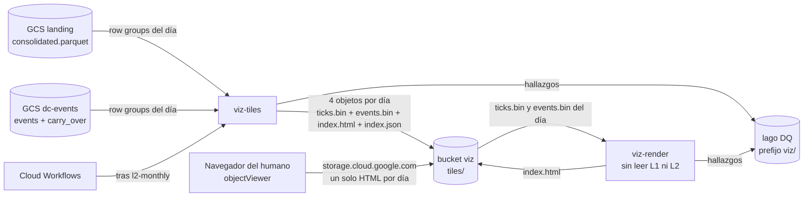

# Documento de Requerimientos Técnicos — Capa de visualización (TRD-viz)

## Tablero de un día con sus ticks y eventos exactos dentro de una página autocontenida y uPlot, servido desde un bucket sin servidor

> **Capa transversal de consumo · Arquitectura Medallion · Single-Node Big Data · Google Cloud Platform**

|Campo        |Valor                                                                           |
|-------------|--------------------------------------------------------------------------------|
|Documento    |TRD-viz — Capa transversal de visualización                                     |
|Versión      |**2.0**                                                                         |
|Estado       |Línea base. Fija el contrato de la página por día (`ticks.bin`, `events.bin`) que implementan las hijas de la Épica E6 (ITSC-303). |
|Fecha        |Octubre de 2026                                                                 |
|Documento padre|TRD maestro v2.5                                                              |
|Alcance      |Capa viz: job que codifica los ticks y los eventos de un día, modo de regeneración de páginas, página HTML autocontenida por día|
|Clasificación|Académico / Uso personal                                                        |
|Contexto     |Trabajo de grado — Maestría en Finanzas · Universidad EAFIT (Medellín, Colombia)|

### Historial de revisiones

|Versión|Fecha|Descripción|
|---|---|---|
|1.0|Oct 2026|Línea base (ITSC-304). Recoge la decisión [Decisión: principios de diseño de la capa de visualización](https://app.notion.com/p/3f027957d23d81b8b12ad2217ffa96fb) (2026-10-05) y fija el contrato de tiles por día: disposición en el bucket, formato binario (tiempo y precio en enteros exactos, dirección de los 50 θ empaquetada por nivel), niveles de zoom con su presupuesto de bytes, regla de estado por columna, procedencia de los eventos de un día e idempotencia. Fija también modos, variables, hallazgos de DQ, costos y observabilidad. Es la fuente única para las hijas 2 a 7: ninguna reabre lo que aquí se fija. |
|1.1|Oct 2026|Corrección de arquitectura (ITSC-305), antes de implementar el contrato. El `price_scale` ya no se elige por día (la mayor potencia de 10 que deja exactos todos los `price_int`): con una escala fina, un solo trade con cinco decimales hacía que el precio no cupiera en `int32` y borraba el día entero de BTCUSDT, lo que contradecía la política de §9.1 (continuar con hallazgo y hueco visible). Ahora es **fijo por activo**, igual al tick de la cotización (100 para BTCUSDT) y declarado en el código; un `price_int` fuera del tick se redondea al tick más cercano (mitad al par) al escribir, sobre acumuladores M4 calculados con el `price_int` crudo, y deja el hallazgo `price_rounded`. El día siempre se escribe; `price_unrepresentable` queda solo como guarda para un precio mayor que `INT32_MAX / price_scale`. Cambian §7.2, §7.3, §8.1, §9.1 a §9.3, RVZ-08, la prueba 2 de §13 y el ítem 10 de §14. |
|1.2|Oct 2026|Corrección de arquitectura (ITSC-308): la entrega ya no es una página que descarga tiles con `fetch` más un zip exportable, sino **un HTML autocontenido por día** que lleva los tiles dentro. La prueba del humano en `storage.cloud.google.com` descartó el `fetch` (Google sirve cada archivo privado desde un dominio bloqueado de un solo uso: §6.5). Cambian §6.5 (con la evidencia), §7.2 (el `index.html` y `latest.html`, los metadatos de cada objeto y `page` en el índice: `tiles_version` 1.1.0), §7.3 (presupuesto de la apertura), §7.8 (criterio del `input_hash`, abajo), §7.9 (el HTML es el exportable: no hay zip), §8.3 (modo `render` en lugar de `export`), §8.4, §9, §10, §11 (sin `site/` ni `exports/`, sin `VIZ_SITE_ROOT` ni `VIZ_EXPORTS_ROOT`), §12, §13 y §14 (ítem 5 cerrado). **Corrección heredada de ITSC-306 (PR #94):** en §7.8 el `input_hash` de un día incluye la cadena de carry-overs desde el día del candidato del `carry_over.parquet` **del propio mes**, no desde el del último carry-over de la cadena. Con el criterio de la 1.1, cuando `M+1` mueve el candidato fuera de `M` el hash de esos días no cambiaba y la cola provisional vieja nunca se rehacía; el código de ITSC-306 ya implementaba el criterio correcto y tiene prueba, y el documento se alinea al código. |
|1.3|Oct 2026|Evidencia del análisis del humano con el arquitecto (ITSC-316, 2026-10-06): L2 está bien y la vista no. Con `viz_check_day.py` sobre 2026-09-30 y θ = 0,00509931 (378 eventos en el mes, 0 violaciones de invariantes) un flash crash de cuatro eventos DC en 0,93 s cae entero en una columna de 84 s que se pinta de un solo estado, y con θ = 0,0001 hay 0,93 eventos por columna. Las muescas de primero y último de la vista 1.1 eran una vela. **`tiles_version` 1.2.0**: eventos exactos de cada θ (`events.bin`), ticks por columna (`count-<w>.u32`) y confirmaciones multiescala (`confirms-<w>.u8`, `simul-<w>.u8`). Cambian §6.4 y §6.6 (reparto de tres paneles), §6.9 (alcance nuevo del estado por columna), §6.10, §6.11 a §6.13 (ADR nuevos: precio sin velas, navegación por eventos y pertenencia del tick extremo, confirmaciones multiescala), §7.2 a §7.5, §7.3 (presupuesto), §7.9, §10, §13 y §14 (ítems 13 a 17). |
|2.0|Oct 2026|Decisión [la página de un día lleva sus ticks; fidelidad antes que eficiencia en viz](https://app.notion.com/p/3f127957d23d81c6a940de4fecb39185) (2026-10-06, ITSC-317), tomada tras verificar la Vista 1.2 sobre datos reales: a 37 s de ventana el nivel más fino (21 s por columna) reducía el flash crash de 12:40:26 (cuatro eventos en un segundo, 4 090 ticks en un milisegundo) a cuatro puntos M4, y el tooltip de confirmaciones no cambiaba entre franjas. **Nueva prioridad 1: fidelidad** (§6.2): lo que se dibuja es un tick de L1 o la envolvente exacta de los ticks de un píxel. **`tiles_version` 2.0.0**: por día, `ticks.bin` (todos los ticks: deltas varint de tiempo en ms, de precio en unidades del tick y la cantidad en 10⁻⁸, por tramos de hasta 65 536 ticks), `events.bin` (igual que 1.2.0), `index.json` e `index.html`; desaparecen los seis arreglos por nivel y la noción de nivel. El navegador deriva precio, volumen y confirmaciones por píxel al dibujar. El job escribe `ticks.bin` tramo a tramo mientras lee L1, sin retener el día (decisión del arquitecto sobre H2 de la revisión de ITSC-317: la regla de memoria de AGENTS.md no admite excepción aquí; §7.3, §8.1). Nuevo **ADR-VZ-14** (§6.14); **ADR-VZ-04, ADR-VZ-08 y ADR-VZ-09 quedan reemplazados**; ADR-VZ-11 y ADR-VZ-13 se reformulan sin tiles; ADR-VZ-12 pierde la línea de extremo. Ergonomía pedida por el humano sobre la 1.2: sin líneas de extremo, franja de estado solo con "evento k / n" (el detalle va al tooltip), leyenda con muestras, rótulos cortos en los paneles inferiores. Cambian §1, §3.1, §4, §5, §6.2, §6.4 a §6.6, §6.8 a §6.14, §7.2 a §7.5, §7.8, §7.9, §8.1, §8.3, §9, §10, §12 a §15. |

-----

## Cómo leer este documento

Este TRD detalla la **capa viz** y **hereda las invariantes** del TRD maestro, de [TRD-L1](l1.md) y de [TRD-L2](l2.md). No las repite salvo cuando las concreta. El porqué de cada decisión se escribe **una sola vez**, en la sección 6; el resto del documento y las cards de la Épica lo enlazan.

- Si buscas **qué construye viz y con qué garantías** → secciones 4 y 5 (requerimientos).
- Si buscas **por qué uPlot, los ticks sin reducir y bucket sin servidor** → sección 6 (ADR de capa).
- Si buscas **el formato exacto de `ticks.bin` y `events.bin`, o qué deriva el navegador por píxel** → sección 7 (contrato de datos).
- Si buscas **los modos, las variables y los nombres de job** → secciones 8 y 11.
- Si buscas **los hallazgos de DQ de viz** → sección 9.
- Si buscas **cuánto cuesta y qué mide cada card** → secciones 10 y 14.
- Si vas a **cambiar la vista** → sección 6.7 (los nueve principios y la Evaluación ergonómica, obligatoria en tu PR).

-----

## Tabla de contenido

1. [Introducción y propósito](#1-introducción-y-propósito)
1. [Invariantes heredadas](#2-invariantes-heredadas)
1. [Alcance de la capa viz](#3-alcance-de-la-capa-viz)
1. [Requerimientos funcionales](#4-requerimientos-funcionales)
1. [Requerimientos no funcionales](#5-requerimientos-no-funcionales)
1. [Decisiones de diseño de viz (ADR de capa)](#6-decisiones-de-diseño-de-viz-adr-de-capa)
1. [Contrato de datos](#7-contrato-de-datos)
1. [Pipeline interno y modos de ejecución](#8-pipeline-interno-y-modos-de-ejecución)
1. [Validaciones y política de calidad de datos](#9-validaciones-y-política-de-calidad-de-datos)
1. [Arquitectura de cómputo, dimensionamiento y costo](#10-arquitectura-de-cómputo-dimensionamiento-y-costo)
1. [Operaciones](#11-operaciones)
1. [Riesgos y mitigaciones](#12-riesgos-y-mitigaciones)
1. [Criterios de aceptación](#13-criterios-de-aceptación)
1. [Ítems abiertos y a validar](#14-ítems-abiertos-y-a-validar)
1. [Anexos](#15-anexos)

-----

## 1. Introducción y propósito

viz es la capa que **muestra** lo que las demás calculan. Sirve para juzgar si el detector y el pipeline están bien, a menudo mientras algo falla. Por eso se diseña como una cabina de pilotos —para decidir rápido y sin error— y no como una vitrina.

El problema técnico es de volumen: un día de BTCUSDT tiene del orden de un millón de ticks (948 740 el 2026-09-30) y, a θ bajo, miles de eventos DC por θ. Reducirlos antes de dibujar (columnas de tiempo fijo, M4) perdió justo lo que se estudia: la estructura fina (§6.14). viz lo resuelve **una sola vez por día**, en un job que **no reduce nada**: codifica los ticks del día en `ticks.bin` (deltas en varint, ≈ 5 B por tick) y los eventos de los θ en `events.bin`, y los escribe dentro de **un solo HTML** que el navegador abre, decodifica a arreglos tipados y, en cada dibujo, recorre una vez para derivar precio, volumen y confirmaciones **por píxel**. No hay servidor: el HTML de cada día, con uPlot y los datos dentro, vive en un bucket privado.

Este documento fija, para viz, todo lo que la Épica E6 necesita para repartir el trabajo sin que cada hija invente su propio formato: el contrato de los archivos de un día (§7), los modos y variables de los jobs (§8, §11), los hallazgos de DQ (§9), los costos y la observabilidad (§10, §11) y la regla de proceso que protege la vista de la deriva (§6.7).

-----

## 2. Invariantes heredadas

viz hereda y no contradice:

- **Región única us-east1** y **presupuesto** ≤ 100 USD/mes (objetivo < 5 USD/mes en estado estacionario). Salvaguarda adicional: presupuesto `intrinsica-mensual` de 5 USD en Facturación, con alertas al 50, 90 y 100 % del costo real (creado por el humano el 2026-10-05).
- **Particionado estilo hive** (`provider=<p>/market=<m>/asset=<a>/…`) en todo lo que viz escribe.
- **Idempotencia** (RF-12 del maestro): re-ejecutar un día con la misma entrada produce los mismos tiles.
- **Mínimo privilegio** (IAM, una service account por modo) e **IaC reproducible** (Terraform). Sin Secret Manager: viz lee y escribe buckets propios del project vía IAM.
- **Una imagen por capa, parametrizada por modo** (RF-15 del maestro): la imagen `viz_tiles` tiene los modos `tiles` y `render`.
- **Hallazgos de DQ** con el esquema unificado y la función compartida `emit_findings()` ([`docs/data-contracts.md`, "Lago de hallazgos de calidad de datos"](../data-contracts.md#lago-de-hallazgos-de-calidad-de-datos)); mismo formato de log que L1 y L2.
- **Contratos de entrada**: el Parquet conformado de L1 ([TRD-L1 §7.2](l1.md#72-salida--parquet-conformado-de-l1-contrato-hacia-l2)) y los `events.parquet` y `carry_over.parquet` de L2 ([TRD-L2 §7.2](l2.md#72-salida--eventsparquet-contrato-hacia-l3) y [§7.4](l2.md#74-carry-over--contrato-y-disposición-física)). viz no pide nada que esos contratos no entreguen.

**Decisiones que no se reabren aquí** (ya fijadas fuera de este documento; viz las hereda como dadas):

|Decisión|Dónde se fijó|Qué fija para viz|
|---|---|---|
|Principios de diseño de la capa de visualización|[Decisión: principios de diseño de la capa de visualización](https://app.notion.com/p/3f027957d23d81b8b12ad2217ffa96fb) (2026-10-05)|uPlot, solo bucket sin servidor, volumen en barras, los nueve principios y la Evaluación ergonómica obligatoria. Su punto 4 (tiles M4) y su prioridad 1 (eficiencia) los reemplaza la decisión de la fila siguiente. La sección 6 las recoge y escribe su porqué una sola vez.|
|La página de un día lleva sus ticks; fidelidad antes que eficiencia en viz|[Decisión: la página de un día lleva sus ticks; fidelidad antes que eficiencia en viz](https://app.notion.com/p/3f127957d23d81c6a940de4fecb39185) (2026-10-06)|Prioridad 1 fidelidad; la página lleva los ticks del día y los eventos de los θ y el navegador deriva todo por píxel; desaparecen los niveles y los tiles. §6.14 la materializa.|
|Los agentes no despliegan ni ejecutan pipelines|[Decisión: despliegue de stacks de capa por GitHub Actions con WIF](https://app.notion.com/p/3e527957d23d810e9401d9d941d17f83) (2026-09-24)|`terraform.yml` y `run-job.yml` los dispara y aprueba el humano; el stack `data` lo aplica solo el humano desde Cloud Shell. El backfill de tiles lo lanza el humano.|
|Eficiencia de memoria ante todo|[Decisión: eficiencia de memoria ante todo](https://app.notion.com/p/3e727957d23d811887eaf14c886b9a0c) (2026-09-26)|Todo dato en RAM se libera en cuanto se aprovechó; nunca conviven dos representaciones del mismo dato; el pico de una unidad es O(lote), no O(unidad) (§8.1).|
|Hallazgos con el esquema de L1 y L2|[TRD-L1 §7.3](l1.md#73-lago-de-hallazgos-de-calidad-de-datos), [TRD-L2 §9.4](l2.md#94-emisión)|viz agrega `check_type` propios y `layer = "viz"`; no agrega columnas al esquema (§9).|

-----

## 3. Alcance de la capa viz

### 3.1 Dentro de alcance

- **Ticks y eventos por día** (§7): `ticks.bin` con todos los ticks del día y `events.bin` con los eventos exactos de los θ, escritos al prefijo `tiles/` del bucket viz.
- **Job `viz-tiles`**: lee un mes de L1 una vez y los `events.parquet` de L2 una vez, escribe los archivos de cada día del mes, idempotente por hash de entrada.
- **Página del día**: un `index.html` autocontenido por día (plantilla de `layers/viz_tiles/site/`, uPlot con versión fija y `ticks.bin` y `events.bin` en base64), que el mismo job escribe junto a los tiles; `tiles/latest.html` es la copia del último día (§7.9). No hay publicación por Terraform.
- **Modo `render`**: vuelve a generar las páginas desde los archivos ya escritos, sin leer L1 ni L2, cuando cambia la plantilla (§8.3).
- **Hallazgos de DQ** propios de viz (§9) y la observabilidad del job (§11).
- **Backfill** de los días del histórico, lanzado por el humano.

### 3.2 Fuera de alcance (se difiere)

- **Cloud Run service** con autenticación propia (opción B de la decisión). Se abre como card solo cuando aparezca un usuario sin acceso IAM al proyecto; entre tanto, el HTML del día, que es un solo archivo y abre desde disco, cubre al asesor.
- **Más de un día en pantalla**, comparación de días o de símbolos, y Capas 3 y 4 en el tablero. Si aparece un segundo usuario con otra necesidad, se revisa la arquitectura de la página del día antes de agregar paneles (§6.1, "Cuándo reabrir").
- **Telemetría o logging desde el navegador.**
- **Multi-activo real**: el diseño no lo impide (partición por `asset`), pero `tiles/latest.json` es mono-activo (§7.7).
- **Consumo de los lagos de DQ y meta-métricas** (BigQuery externo): sigue diferido (maestro §8.4); no es el tablero de datos de esta capa.

-----

## 4. Requerimientos funcionales

*Prioridad MoSCoW: M (Must), S (Should), C (Could).*

|ID       |Nombre                         |Descripción                                                                                                                                  |Prio.|
|---------|--------------------------------|----------------------------------------------------------------------------------------------------------------------------------------------|-----|
|RF-VZ-01 |Ticks del día                  |`ticks.bin`: todos los ticks del día, sin reducir, en tramos de hasta 65 536 ticks de tres secciones de varint (tiempo en ms, precio en unidades del tick y cantidad en 10⁻⁸), con tiempo y precio exactos de L1 (§7.3).|M    |
|RF-VZ-02 |Precio y volumen por píxel       |La vista deriva, por cada píxel de ancho de la escala actual, el precio (un punto por tick con 1 o 2 ticks; con más, el segmento del mínimo al máximo) y el volumen (la suma de la cantidad). Cubeta mínima: el instante (§6.11, §7.4).|M    |
|RF-VZ-03 |Eventos por θ en la página       |Los eventos exactos de los θ del día viajan en `events.bin`; el θ elegido decide qué franjas se dibujan (§7.5). Ya no hay estado de dirección por columna.|M    |
|RF-VZ-04 |Índice y marca de commit        |`index.json` por día, escrito al final: su presencia significa que el día está completo (§7.2, §7.8).                                            |M    |
|RF-VZ-05 |Puntero al último día           |`tiles/latest.json` apunta al último día completo y `tiles/latest.html` es la copia de su página (§7.7).                                |M    |
|RF-VZ-06 |Cola provisional explícita      |Un día cuyo último evento aún no se cierra se escribe igual, con la cola marcada como provisional, y se corrige cuando L2 cierra el evento (§7.6).|M    |
|RF-VZ-07 |Idempotencia por hash de entrada|Un día se regenera solo si cambió el hash de sus archivos de entrada o la versión del formato; `--force` lo ignora (§7.8).                      |M    |
|RF-VZ-08 |Modo `tiles`                    |Por defecto el mes anterior (UTC); `--day`, o `--from` y `--to` por meses; `--force` (§8.2).                                                    |M    |
|RF-VZ-09 |Modo `render`                   |`--day`, o `--from` y `--to`, vuelve a generar el `index.html` de los días pedidos desde sus archivos, sin leer L1 ni L2 (§8.3).                      |M    |
|RF-VZ-10 |Hallazgos de DQ                 |Emitir al lago de DQ con `layer = "viz"` y el día en `details.day` (§9).                                                                          |M    |
|RF-VZ-11 |Modo degradado visible          |Un archivo o un día faltante se ve en pantalla como hueco con marcador y texto; nunca se interpola ni se rellena en silencio (principio 6, §6.7).    |M    |
|RF-VZ-12 |Evaluación ergonómica           |Todo PR que cambie la vista rediseña la vista completa e incluye la sección "Evaluación ergonómica" (§6.7).                                      |M    |
|RF-VZ-13 |Encadenamiento tras L2          |Al terminar `l2-monthly`, Cloud Workflows lanza `viz-tiles` sin intervención (hija 5).                                                          |S    |
|RF-VZ-14 |Backfill de días                |El humano lanza el histórico desde `run-job.yml`, por rangos de meses (§8.2, §10.3).                                                             |S    |
|RF-VZ-15 |Primera vista                   |Precio por píxel del último día disponible con franjas DC de dos tonos por θ, filtro de θ, tooltip por píxel y paneles de confirmaciones y volumen con eje X y cursor compartidos (§6.6).|M    |
|RF-VZ-16 |Eventos exactos por θ          |`events.bin`: por evento que toca el día, referencia, confirmación y extremo en ms desde el inicio del día, sentido y banderas (cola provisional, valores recortados) (§7.5).|M    |
|RF-VZ-17 |Franjas, densidad y navegación |Franjas en los instantes exactos de cada evento a cualquier zoom, marca con el número donde varios eventos caen en un píxel y navegación evento por evento con ventana `[referencia(k−1), extremo(k+1)]`; la franja de estado dice solo "evento k / n" y el detalle va al tooltip (§6.12).|M    |
|RF-VZ-18 |Conteo de ticks                 |El tooltip dice "n ticks" por píxel y "n ticks en este ms" cuando todos comparten el instante; el conteo sale de los ticks, no de un arreglo (§7.4).|M    |
|RF-VZ-19 |Confirmaciones por píxel          |Tercer panel de barras derivado de `events.bin`: θ que confirman en el píxel y máximo de θ con la misma hora de confirmación (§6.13, §7.4).|M    |

-----

## 5. Requerimientos no funcionales

|ID        |Atributo                  |Requerimiento                                                                                                                                       |Prio.|
|----------|---------------------------|-----------------------------------------------------------------------------------------------------------------------------------------------------|-----|
|RNF-VZ-01 |Fidelidad (prioridad 1)    |Lo que se dibuja es un tick de L1 con su tiempo y precio exactos, o la envolvente exacta de los ticks que caen en un píxel. Ningún dato resumido antes de dibujar; la única agregación es la cubeta mínima, el instante (§6.14).|M    |
|RNF-VZ-02 |Eficiencia (prioridad 2) y presupuesto de bytes|Abrir un día transfiere un solo documento, el HTML en gzip, de **≤ 4 MB** el 2026-09-30 (si lo supera, se decide antes de mergear; se reabre la decisión por encima de 10 MB, §6.14); el día abre en **menos de 5 s** en red doméstica; zoom y desplazamiento redibujan en **menos de 100 ms** con el día real (un recorrido lineal sobre los ticks visibles, con búsqueda binaria para el primero); cambiar θ responde en menos de 100 ms **sin ninguna petición de red** (§7.3, §7.9).|M    |
|RNF-VZ-03 |Ergonomía (prioridad 3)    |La vista cumple los nueve principios de §6.7.                                                                                                        |M    |
|RNF-VZ-04 |Eficiencia de memoria      |En el job, el pico de una unidad es O(lote): un row group de L1 más los bytes ya codificados del día (≈ 5 B por tick) y los eventos del mes en arreglos de NumPy; nunca los ticks del día decodificados (§8.1). En el navegador, el día decodificado (≈ 16 B por tick) es el único dato vivo y se reemplaza al cambiar de día.|M    |
|RNF-VZ-05 |Determinismo               |Misma entrada y misma `tiles_version` producen los mismos bytes en `ticks.bin` y `events.bin` (el `index.json` lleva `generated_at` y queda fuera; la página lo lleva dentro).|M    |
|RNF-VZ-06 |Costo fijo cero            |Sin servidor siempre encendido, sin base propia: el costo es almacenamiento más el cómputo de los jobs, dentro del presupuesto de §10.                |M    |
|RNF-VZ-07 |Regenerable                |Los archivos de un día se regeneran desde L1 y L2 en cualquier momento; no son fuente de verdad.                                                  |M    |
|RNF-VZ-08 |Acoplamiento débil         |viz se comunica con L1 y L2 solo por sus contratos Parquet (§7.1) y con el navegador solo por la página de §7.9.                                  |M    |
|RNF-VZ-09 |Sin terceros ni red        |La página no hace ninguna petición después de cargar: uPlot y los datos van dentro del documento, sin CDN, sin fuentes externas, sin `fetch`.         |M    |
|RNF-VZ-10 |Mínimo privilegio          |viz escribe solo en su bucket y en el lago de DQ (prefijo `viz/`); nunca toca `landing`, `dc-events` ni `manifest`.                                 |M    |

-----

## 6. Decisiones de diseño de viz (ADR de capa)

*Cada decisión hereda las invariantes del maestro y concreta la entrada de Documentación enlazada en §2. Las filas "Alternativas descartadas" son las de esa entrada.*

### 6.1 ADR-VZ-01 — Existe una capa transversal de consumo visual

|Campo|Contenido|
|---|---|
|**Decisión**|viz no es una capa Medallion más: **lee** de Silver y Gold, **no escribe en el lago** y **no es insumo de ningún otro proceso**. En el maestro entra en §3.1 como fila nueva de tipo "consumo" (ADR-09).|
|**Justificación**|Las cuatro capas Medallion suben la calidad del dato y cada una alimenta a la siguiente. viz no hace ninguna de las dos cosas: es una hoja del grafo. Tratarla como capa 5 la ataría al orden L1→L4 y haría que su retraso bloqueara a otras; como consumo transversal, E5 (Capa 3) no la bloquea ni ella a E5.|
|**Cuándo reabrir**|Si aparece un segundo usuario con otra necesidad (p. ej. comparar días o símbolos lado a lado), se revisa la arquitectura de tiles antes de agregar paneles.|

### 6.2 ADR-VZ-02 — Cuatro prioridades, en este orden; el orden rompe empates

|Campo|Contenido|
|---|---|
|**Decisión**|(1) **Fidelidad**: lo que se dibuja es un tick de L1 con su tiempo y precio exactos, o la envolvente exacta de los ticks que caen en un píxel; ningún dato se resume antes de dibujar. (2) **Eficiencia**: nada en RAM que ya se aprovechó, ningún cálculo que el dibujo no necesite y nada en la interacción que cueste más de 100 ms; se acepta esperar segundos al abrir un día. (3) **Ergonomía de monitoreo bajo estrés**: el tablero se diseña como una cabina de pilotos. (4) **Look and feel**: solo lo que sobrevive a las tres anteriores.|
|**Justificación**|El tablero juzga si el detector y el pipeline están bien, a menudo mientras algo falla, y lo que estudia es la estructura fina de la serie. Un resumen por columnas de tiempo fijo la pierde y el humano lo lee como dato (§6.14). Hasta la 1.3 la prioridad 1 era la eficiencia («nada se transfiere al navegador que no se vaya a dibujar»); la decisión de 2026-10-06 ([ficha](https://app.notion.com/p/3f127957d23d81c6a940de4fecb39185)) la pasó a segundo lugar y puso la fidelidad primero. Las normas de aviación existen porque un operador bajo estrés lee mal un color aislado, pierde el contexto si la escala salta y se equivoca si tiene que confirmar un diálogo. La estética va última porque es lo único que se puede perder sin perder la función.|

### 6.3 ADR-VZ-03 — Motor de gráficos: uPlot

|Campo|Contenido|
|---|---|
|**Decisión**|uPlot: librería de canvas de ~45 KB, sin dependencias, la que usa Grafana para series de tiempo. Se empaqueta en el repo con versión fija.|
|**Justificación**|Dibuja cientos de miles de puntos en milisegundos y su tamaño no pesa en el presupuesto de bytes (§7.3). Es el motor de dibujo de Grafana sin el servidor, la base y la pluginería que lo rodean.|
|**Cuándo reabrir**|Si uPlot no soporta una representación necesaria (p. ej. regiones con degradado), se evalúa un plugin propio antes de cambiar de motor.|

### 6.4 ADR-VZ-04 — Tiles M4 precalculados, un job por día **(reemplazada por ADR-VZ-14 en la 2.0)**

|Campo|Contenido|
|---|---|
|**Estado**|**Reemplazada** el 2026-10-06 por ADR-VZ-14 (§6.14). Hasta la 1.3 el job reducía cada día con **M4** (Jugel et al., 2014) a seis tiles por nivel de zoom, con la dirección de los 50 θ empaquetada por nivel. Se conserva el porqué de lo que sigue vigente.|
|**Lo que ya no rige**|El precálculo por columna de tiempo fijo: el nivel más fino era de 21 s por columna y el flash crash del 2026-09-30 a las 12:40:26 (cuatro eventos DC en un segundo, 4 090 ticks en un milisegundo) quedaba reducido a cuatro puntos M4. Agregar niveles más finos solo mueve el límite y multiplica el almacenamiento por cada uno. Desaparecen `price-<w>`, `volume-<w>`, `dir-<w>`, `count-<w>`, `confirms-<w>` y `simul-<w>`.|
|**Lo que sigue vigente — por qué por día**|El día es la unidad de la vista (un día en pantalla) y la de la regeneración: un día es independiente de los demás, a diferencia de los meses de L2, que se encadenan por carry-over. Los días se pueden generar en cualquier orden y en paralelo.|
|**Lo que sigue vigente — por qué el precio no depende de θ**|Los 50 θ comparten la misma serie de ticks: un `ticks.bin` por día y no 50. Cambiar θ nunca vuelve a bajar el precio (invariante de la Épica); cambiar θ solo cambia qué franjas se dibujan, con los eventos que ya están en la página.|
|**Lo que sigue vigente — pocos objetos**|Las escrituras son operaciones Clase A, una por objeto. Un día pasa de 39 objetos a 4 (§10.3).|

### 6.5 ADR-VZ-05 — Entrega: solo bucket, sin servidor

|Campo|Contenido|
|---|---|
|**Decisión**|El navegador recibe **un solo documento por día**: `index.html`, con la plantilla, uPlot y los dos archivos del día, `ticks.bin` y `events.bin` (base64, bajo su nombre, en `window.VIZ_DATA`), dentro (§7.9). Lo escribe el job `viz-tiles` junto a esos archivos y copia el del último día a `tiles/latest.html`; `viz-render` lo regenera cuando cambia la plantilla. Vive en el bucket privado declarado en el stack `data` y se abre por `storage.cloud.google.com/<bucket>/tiles/latest.html` (o el `index.html` de un día): Google pide iniciar sesión y sirve el documento si la cuenta tiene `objectViewer`. Costo fijo cero, ninguna superficie de autenticación propia, **ninguna publicación por Terraform** y ninguna petición de red después de la carga.|
|**Evidencia (prueba del humano, 2026-10-05)**|Se probó la versión anterior, una página que descargaba sus tiles con `fetch`, abierta desde `storage.cloud.google.com`. Google sirve cada archivo privado desde un **dominio bloqueado de un solo uso** (`<hash>-apidata.googleusercontent.com`, con un token `jk` en la URL): una petición relativa a ese documento recibe «Bad Locked Domain» y una absoluta a otro origen la bloquea el navegador por CORS. El inicio de sesión de Google sirve **un documento completo por URL, no sus recursos**. De ahí la decisión: todo lo que la página necesita viaja dentro del documento. Registrada en la card ITSC-308 y en el punto 5 de la decisión de diseño de viz.|
|**Justificación**|La pieza más eficiente es la que no se construye. Un servicio de Cloud Run con validación de Google Sign-In agrega imagen, stack, autenticación propia y logs para un problema que no existe con un solo usuario; y un sitio estático con tiles aparte exige un origen que sirva recursos, que es justo lo que `storage.cloud.google.com` no entrega. Con los datos dentro, abrir un día es **una petición** y cambiar θ o hacer zoom, **ninguna**; el mismo archivo abre desde disco (`file://`), desde un servidor estático o adjunto en un correo.|
|**Costo asumido**|El base64 infla 33 % (los 4,85 MB de `ticks.bin` del 2026-09-30 pasan a ≈ 6,5 MB) y el documento lleva todos los ticks del día. Con `Content-Encoding: gzip` en el objeto el día viaja en ≈ 3,3 MB (la cantidad es 1,5 MB de los 2,7 MB de ticks en gzip; tiempo y precio, 0,6 MB cada uno), de modo que **el presupuesto de bytes depende del gzip** (§7.3, §14 ítem 4). Los binarios siguen escritos junto a la página (los usa `render` y sirven de auditoría): el almacenamiento del día crece con ella (§10.3, §14 ítem 11).|
|**Opción B**|Cloud Run service con validación de Google Sign-In. Se abre como card solo cuando aparezca un usuario sin acceso IAM al proyecto; mientras tanto, el HTML del día cubre al asesor (es un archivo que se descarga y abre).|
|**Alternativas descartadas**|**Página que descarga tiles con `fetch` desde el bucket (versión previa de ITSC-308)**: descartada por la evidencia de arriba. **Zip exportable (`viz-export`, versión 1.0 y 1.1 de este documento)**: ya no hace falta, el HTML es el exportable (§7.9). **Cloud Run service para servir el tablero (hoy)**: ver la justificación. **Looker Studio**: conecta a BigQuery, no a Parquet en bucket; obligaría a una copia del dato y rompe la prioridad 2. **Grafana**: servidor siempre encendido, base propia y pluginería para Parquet; uPlot es su motor sin el resto. **Streamlit, Dash, Panel**: cada interacción vuelve al servidor Python, con latencia de cientos de ms y cómputo en caliente, contrario a la prioridad 2 y al principio 8. **Plotly**: dibuja en SVG/WebGL con un bundle de más de 3 MB; con cientos de miles de puntos el navegador se arrastra. **Stack del legacy (HoloViews, Bokeh, Datashader, Panel)**: resolvía el volumen con rasterización en servidor; aquí el volumen se resuelve codificando los ticks una vez, en el job, y dibujando por píxel en el navegador; el servidor desaparece.|

### 6.6 ADR-VZ-06 — Volumen como barras en un panel inferior, nunca como tamaño de punto

|Campo|Contenido|
|---|---|
|**Decisión**|El volumen es un panel inferior de barras (20 % de la altura desde la 1.3), con eje X y cursor compartidos con el precio y con el panel de confirmaciones, que va entre ambos (§6.13). Cada barra es la **suma de la cantidad de los ticks de un píxel**; con zoom suficiente, una barra por tick, y en un instante compartido, la suma. El panel lleva el rótulo corto «Volumen» arriba a la izquierda (el de precio no lleva).|
|**Justificación**|Cleveland y McGill (1984) muestran que el ojo compara longitudes alineadas con precisión y áreas con error sistemático; además, una burbuja gruesa tapa el precio que está debajo.|
|**Primera vista acordada**|Serie cruda de ticks contra tiempo del último día disponible. Franjas verticales de fondo por evento DC, en dos tonos: tenue para la fase de confirmación e intenso para el overshoot (sobre fondo oscuro, menos opacidad se ve más oscuro); verde para alza, rojo para baja; la dirección y la fase se repiten en una franja del borde (arriba alza, abajo baja; fina confirmación, gruesa overshoot), sin glifos (ITSC-315). El precio es la serie de §6.11 (puntos y envolventes por píxel, nunca velas) y las franjas salen de los eventos exactos (§6.12). Filtro de θ que elige los eventos de las franjas. Tooltip sobre el píxel: hora, ticks, mínimo y máximo, volumen y el evento del θ elegido. Confirmaciones y volumen como paneles inferiores.|

### 6.7 ADR-VZ-07 — Nueve principios de ergonomía y Evaluación ergonómica obligatoria

|Campo|Contenido|
|---|---|
|**Decisión**|Todo cambio visual se revisa contra los nueve principios, tomados de FAA HF-STD-001, SAE ARP4102/7, EASA CS-25.1302 y la filosofía de cabina oscura y silenciosa (*dark and quiet cockpit*). Cada card que cambie la vista rediseña la vista completa y su PR trae la sección "Evaluación ergonómica".|
|**Justificación**|Exigir el rediseño completo en cada incremento evita la deriva típica de los tableros: paneles que se acumulan hasta que nadie mira ninguno.|

|#|Principio|Qué significa en el tablero|
|---|---|---|
|1|Cabina oscura|Fondo oscuro de bajo brillo; lo normal no llama la atención; solo lo anómalo resalta.|
|2|El color nunca va solo|Todo estado codificado por color lleva también forma, posición o texto. Rojo y verde quedan reservados a la dirección DC; las alertas van en ámbar con texto.|
|3|Franja de estado fija|Una barra siempre visible con fecha del día, θ activo, navegación por eventos ("evento k / n"), última actualización y datos (completos o incompletos: motivo). Nunca se desplaza ni se oculta. El detalle de un evento va al tooltip, no a la franja.|
|4|Eje X y cursor compartidos|Todos los paneles alineados al mismo tiempo; el cursor se mueve en todos a la vez.|
|5|Escalas estables|El eje Y no salta al cambiar θ ni al mover el cursor; cambia solo con zoom explícito del usuario.|
|6|Modo degradado visible|Si falta un archivo o un día no llegó, se dice con texto en la franja de estado y en el panel; entre dos ticks no se une ni se interpola nada (en una ventana sin ticks el panel queda vacío).|
|7|Numerales tabulares monoespaciados|Cifras alineadas, contraste mínimo 7:1, tamaño mínimo 12 px.|
|8|Interacción menor a 100 ms y reversible|Toda acción responde antes de 100 ms y se deshace con una acción; sin confirmaciones modales.|
|9|Menos es más|Cada elemento justifica su lugar; un incremento que agrega sin quitar es sospechoso.|

**Regla de proceso: Evaluación ergonómica obligatoria.** El PR de toda card que agregue, mueva o quite un elemento de la vista incluye una sección "Evaluación ergonómica" con cuatro partes:

1. Captura o descripción de la **vista completa** resultante.
2. Revisión contra los nueve principios, con lo que se **quitó** para hacer lugar.
3. **Métricas de eficiencia antes y después**: bytes transferidos por día cargado, tiempo de decodificación y hasta el primer trazo, tiempo de redibujo tras zoom o desplazamiento y tiempo de respuesta al cambiar θ.
4. **Veredicto**: qué prioridad ganó cuando hubo conflicto y por qué.

`pr-review` rechaza el PR si la sección falta o si una métrica empeora sin justificación escrita.

### 6.8 ADR-VZ-08 — Seis niveles de zoom de 128 a 4 096 columnas por día **(reemplazada por ADR-VZ-14 en la 2.0)**

|Campo|Contenido|
|---|---|
|**Estado**|**Reemplazada** el 2026-10-06. Los niveles `w ∈ {128, …, 4096}` y M4 componible existían para derivar niveles gruesos de uno fino sin releer ticks. Sin tiles no hay niveles: el navegador toma la escala actual, cuenta los píxeles de ancho del gráfico y agrupa los ticks de cada píxel (§7.4). La resolución ya no la limita una columna de 21,09 s sino el instante (1 ms): lo que antes era el ítem 8 de §14 queda cerrado.|

### 6.9 ADR-VZ-09 — Estado de una columna: el del último tick de la cubeta **(reemplazada por ADR-VZ-14 en la 2.0)**

|Campo|Contenido|
|---|---|
|**Estado**|**Reemplazada** el 2026-10-06. El estado DC por columna (`dir-<w>.u8`) solo alimentaba el tooltip desde la 1.3 y no podía representar varios eventos en una columna (2026-09-30, θ = 0,00509931: cuatro eventos en 0,93 s dentro de una columna de 84 s, que se pintaba de un solo estado). Desaparece con los niveles: las franjas y el tooltip salen de los eventos exactos del θ elegido (`events.bin`, §7.5), y el tooltip dice en qué evento y fase cae el instante del cursor.|
|**Lo que sigue vigente**|Se compara por **`agg_trade_id`** y no por tiempo cuando se necesita decidir qué eventos tocan un día (§7.5): varios ticks comparten `transact_time`, pero `agg_trade_id` es estrictamente creciente. No se rellena ni se hereda un estado donde no hay dato (principio 6).|

### 6.10 ADR-VZ-10 — `index.json` al final como marca de commit; idempotencia por hash de entrada

|Campo|Contenido|
|---|---|
|**Decisión**|Un día se escribe en este orden: se borra su `index.json` si existía, se escriben `ticks.bin` (tramo a tramo mientras se lee L1), `events.bin` y la página y **al final** se escribe el `index.json`. El `index.json` es la marca de commit: un día sin él no existe para el tablero. Cada día lleva en su índice el `input_hash` de sus archivos de entrada y la `tiles_version`; si ambos coinciden con los calculados, el día se salta (§7.8).|
|**Justificación**|Cada objeto de GCS se publica entero o no se publica, pero un día son 4 objetos y no hay transacción entre ellos. L2 resolvió el mismo problema con la escritura atómica (temporal más `commit`) y el orden "primero eventos, luego carry-over". Aquí el índice es el último escrito: un lector que lo ve sabe que los archivos que lista ya están. Un archivo que se escribe de una vez (`ticks.bin` tramo a tramo bajo un índice ya borrado, `events.bin`, `index.json`) no necesita su propio temporal más renombre: ahorra una operación Clase A por objeto (§10.3). La página sí lo lleva, en un bucket también: sale en streaming y, si el render falla a medias, cerrar el flujo publica lo escrito (pyarrow no tiene `abort`); con el temporal, lo truncado cae en `index.html.tmp`, que se borra, y no sobre la página vigente, que en modo `render` y en `latest.html` está bajo un índice válido. En GCS `move` es copia más borrado (una operación Clase A más por página) y conserva los metadatos. Si el job muere a medias, el día queda sin índice (visible como degradado) y la siguiente corrida lo rehace.|

### 6.11 ADR-VZ-11 — El precio se dibuja como puntos y envolventes exactas por píxel, nunca como velas

|Campo|Contenido|
|---|---|
|**Decisión**|La vista dibuja solo dos cosas: un **tick** (un punto) o la **envolvente exacta de los ticks de un píxel** (el segmento del mínimo al máximo). Para la escala actual, cada píxel de ancho recibe los ticks cuyo tiempo cae en él: con 1 o 2 ticks, un punto por tick; con 3 o más, el segmento de su mínimo a su máximo y **nada más**. **Nada une un píxel con el vecino** y no hay muescas de primero ni de último. Con el zoom el píxel se estrecha y la envolvente se abre en ticks sueltos; no hay un nivel más fino que pedir.|
|**Cubeta mínima: el instante**|Varios ticks comparten `transact_time` (4 090 en un milisegundo el 2026-09-30 a las 12:40:26). El píxel de un tick es una función de su milisegundo, así que ningún zoom los separa: ese instante se dibuja como el segmento de su mínimo a su máximo, su volumen es la suma y el tooltip dice «4090 ticks en este ms». Es la única agregación que queda y es inherente al dato, no a la vista.|
|**Por qué no velas**|Las muescas de primero y último de la vista 1.1 eran una vela. El proyecto abandona las velas porque enmascaran datos (la apertura y el cierre de una vela no son los extremos de nada en DC), y la vista no puede reintroducirlas. Además inducían una lectura errónea: una barra ascendente con franja roja es legítima en DC (el contra-movimiento menor que θ dentro de un evento), pero la vela invita a leerla como una contradicción.|
|**Por qué es exacto**|Lo que se dibuja es un tick con su tiempo y precio de L1, o el mínimo y el máximo de los ticks del píxel: no se agrega nada que ningún tick haya medido (principio 6) y nada se descarta que un píxel pudiera mostrar. La vista 1.2 dibujaba, a 21 s por columna, cuatro puntos M4 para el flash crash; ahora, en el milisegundo de 4 090 ticks, un segmento de 84 900 a 85 100.|
|**Cómo se calcula**|Un recorrido lineal sobre los ticks visibles (búsqueda binaria para el primero) que acumula por píxel el conteo, el mínimo, el máximo y la suma de la cantidad (§7.4). Con el día real son decenas de milisegundos (medido: §10.2).|

### 6.12 ADR-VZ-12 — Las franjas salen de los eventos exactos; navegación por eventos; el tick extremo pertenece al evento que cierra

|Campo|Contenido|
|---|---|
|**Decisión**|(1) La vista dibuja la confirmación y el overshoot de cada evento con las fronteras reales (`events.bin`, §7.5), a cualquier zoom. (2) El **tick extremo pertenece al evento que cierra**: la franja del evento `k` termina en el instante del extremo, inclusive, y la del `k+1` arranca en el tick siguiente; el cambio de color entre franjas ya marca el extremo (los eventos alternan siempre), así que **no se dibuja línea de extremo** (la 1.2 dibujaba una línea clara de 1 px y el humano la pidió quitar: el precio es el único trazo claro del panel). Una línea vertical, del color del evento, marca cada confirmación. (3) Donde varios eventos **enteros** (de su referencia a su extremo) caben en un mismo píxel (extremos a menos de 3 px entre sí), la vista dibuja una marca gris con el número ("4 eventos") en vez de franjas indistinguibles: ningún evento queda invisible, o se ve o se cuenta; un evento angosto que está solo se ensancha hasta 3 px. Se calcula en el navegador, a partir de los eventos exactos del θ elegido y por el ancho de píxel actual. (4) **"Evento anterior" y "evento siguiente"** para el θ elegido (la franja de estado dice solo «evento k / n»; la referencia, la confirmación, el extremo, la ventana y las notas —recorte, provisional— van al tooltip al pasar el mouse sobre el evento): la ventana del evento `k` es `[referencia(k−1), extremo(k+1)]`, el evento completo con su predecesor y su sucesor completos, para ver las dos transiciones enteras. La navegación **desplaza** la ventana y conserva la escala que fijó el humano; **"ajustar a la ventana"** es una acción explícita y separada que pone la escala en ese intervalo con 5 % de margen a cada lado. (5) Funciona dentro del día: sin vecino dentro del día, o con una referencia o un extremo recortado al borde, la vista lo dice y recorta la ventana al borde; si el evento `k+1` es la cola pendiente del carry-over, su extremo es el candidato vigente y la vista lo marca como provisional. Cargar los días vecinos queda para otra card.|
|**Por qué el extremo es del evento que cierra**|Es el dilema de la frontera compartida de `DC_FRAMEWORK.md` §3.2: el extremo de `k` es también la referencia de `k+1`, y un tick solo puede estar en uno. El job usa `(referencia, extremo]` para decidir qué eventos tocan un día (§7.5) y la vista adopta la misma pertenencia, así que el tooltip y la franja nunca discrepan en el tick de la frontera.|
|**Por qué la ventana es `[ref(k−1), ext(k+1)]`**|Un evento DC solo se entiende contra sus vecinos: la confirmación de `k` es el desenlace de la transición que cerró `k−1` y el extremo de `k` es la referencia de la transición de `k+1`. Con la ventana de tres eventos se ven las dos transiciones enteras; una ventana solo de `k` esconde las dos.|
|**Por qué navegar no cambia la escala**|Principio 5 (escalas estables): el eje solo cambia con una acción explícita del humano. Navegar desplaza el centro y conserva el ancho; "ajustar" es la acción que cambia el ancho, y es reversible (doble clic o Esc).|
|**Por qué se cuentan los eventos enteros y no los que terminan en el píxel**|El extremo de un evento largo coincide con la referencia del siguiente: contar por extremo sumaría a la marca el evento largo que llega al píxel, cuyo cuerpo sí se ve como franja. Contar los enteros agrupa solo lo que una franja no puede mostrar. El caso de aceptación (2026-09-30, 12:40:26) da "4 eventos".|
|**Alternativa descartada**|Rebanar el almacenamiento por número de eventos en vez de por días: el conteo depende de θ, daría 50 particiones del mismo precio y no resuelve la resolución de pantalla. La navegación por eventos cubre la necesidad sin tocar el almacenamiento.|

### 6.13 ADR-VZ-13 — Confirmaciones por píxel derivadas de los eventos, tercer panel y reparto vertical

|Campo|Contenido|
|---|---|
|**Decisión**|Un tercer panel, entre el precio y el volumen y con el eje X y el cursor compartidos, muestra **barras verticales** derivadas de `events.bin` (§7.4): la barra es el número de θ con una confirmación dentro del píxel y una marca intensa, el máximo de θ con el mismo `confirm_time` dentro del píxel. El tooltip lista los θ y la hora de cada confirmación del píxel. El panel lleva el rótulo corto «θ que confirman». El navegador las calcula al dibujar, con las confirmaciones de los 50 θ ordenadas una sola vez al abrir el día.|
|**Por qué es una pregunta de la tesis**|Un salto brusco cruza varios θ en el mismo instante: es la coherencia multiescala del detector. `confirm_time` es el último tick del grupo de empate (ADR-L2-03), así que dos θ que confirman por el mismo tick comparten **exactamente** el mismo `confirm_time` (en `events.bin`, el mismo milisegundo: la resolución de los datos de la página).|
|**Por qué en el navegador y no en el job**|La 1.2 precalculaba `confirms` y `simul` por columna y el tooltip no cambiaba entre franjas: los valores eran de la columna y no del píxel. Con los eventos ya en la página (13 B por evento, decenas de miles) contar por píxel es un recorrido sobre las confirmaciones visibles, ordenadas una vez; no hay nada que precalcular y la respuesta es la de la escala actual.|
|**Por qué barras y no una franja de calor**|Enteros pequeños se leen por longitud (Cleveland y McGill, 1984) y el color no codifica magnitud (principio 2). Barra completa y marca intensa son del mismo tono: lo que cambia es la longitud y la opacidad, que para una marca superpuesta solo distingue «ambas» de «la barra».|
|**Reparto vertical**|Punto de partida: precio 65 %, confirmaciones 15 %, volumen 20 %. Con ~800 px de panel son 520 px de precio, 120 de confirmaciones (un máximo de 50 θ legible a ~2 px por unidad) y 160 de volumen. Lo valida la Evaluación ergonómica de la card; si el volumen no justifica su lugar, cede (principio 9).|

### 6.14 ADR-VZ-14 — La página de un día lleva sus ticks; fidelidad antes que eficiencia

|Campo|Contenido|
|---|---|
|**Fuente del porqué**|[Decisión: la página de un día lleva sus ticks; fidelidad antes que eficiencia en viz](https://app.notion.com/p/3f127957d23d81c6a940de4fecb39185) (2026-10-06, humano con el arquitecto). Reemplaza el punto 4 y la prioridad 1 de la decisión de principios de diseño (2026-10-05); el resto sigue vigente. Aquí solo se fija cómo se materializa y por qué es viable; el razonamiento no se repite.|
|**Decisión**|(1) La página de un día lleva los **ticks del día**, no resúmenes: tiempo, precio y cantidad de cada tick de L1 (`ticks.bin`, §7.3), más los eventos exactos de los θ (`events.bin`, §7.5). (2) El navegador deriva por píxel, en el momento de dibujar, la envolvente de precio, la suma de volumen y las confirmaciones (§7.4). (3) Desaparecen los niveles de zoom y los tiles M4, de dirección, de conteo y de confirmaciones: ADR-VZ-04, ADR-VZ-08 y ADR-VZ-09 quedan reemplazados; ADR-VZ-11 y ADR-VZ-13 se reformulan sin tiles. (4) Prioridad 1: fidelidad (§6.2). (5) Cubeta mínima: el instante (§6.11).|
|**Por qué es viable — bytes**|Sonda `viz_probe_ticks.py` (2026-10-06) sobre el 2026-09-30, 948 740 ticks: deltas varint 4,85 MB en crudo, 2,69 MB en gzip y 3,12 MB embebidos como base64 más gzip. La cantidad pesa 1,5 MB de los 2,7; tiempo y precio, 0,6 cada uno. La página del día queda en ≈ 3,3 MB (con `events.bin`) contra ≈ 0,6 MB en la 1.2, bajo el presupuesto de 4 MB de RNF-VZ-02; por encima de 10 MB en gzip se reabre la decisión (quitar la cantidad o partir el día en dos páginas).|
|**Por qué es viable — navegador**|Se decodifican tres arreglos tipados una sola vez al abrir (tiempo `Int32Array`, precio `Int32Array`, cantidad `Float64Array`: ≈ 16 B por tick, 15 MB con un millón de ticks) y cada redibujo es un recorrido lineal sobre los ticks visibles. Medido en V8 (Node) con 950 000 ticks y 50 θ de 600 eventos: decodificar ≈ 40 a 65 ms y redibujar el día entero ≈ 10 a 30 ms (§10.2); lo confirma el humano en el navegador.|
|**Por qué es viable — job**|El job se simplifica: `viz-tiles` 0.5.0 tardó 44 minutos en un mes (88 s por día) porque leía los eventos de cada θ una vez por día y reducía a seis niveles. Ahora lee el mes de L1 una vez, lee cada `events.parquet` de θ **una vez por mes** y empaqueta ticks y eventos: ≈ 0,8 s por día en la sonda sintética de 950 000 ticks (§10.2).|
|**Costo asumido**|Los 33 % del base64, un documento ≈ 5 veces mayor que el de la 1.2 y esperar un par de segundos al abrir el día. El tiempo de apertura es el de decodificar la página; ya no cabe «cero cálculo en el navegador» (la antigua prioridad 1): se paga con un recorrido lineal que mide el humano (< 100 ms al redibujar).|
|**Cuándo reabrir**|Si un activo o un día supera los 10 MB de página en gzip, o si aparece un segundo usuario que necesite comparar días lado a lado (§6.1).|

-----

## 7. Contrato de datos

### 7.1 Entradas

viz **solo lee** archivos de L1 y L2 que ya son inmutables o están completos:

|Entrada|Archivo|Qué usa viz|
|---|---|---|
|L1|`consolidated.parquet` del mes ([TRD-L1 §7.2](l1.md#72-salida--parquet-conformado-de-l1-contrato-hacia-l2))|`agg_trade_id`, `transact_time` (µs UTC), `price` (`DECIMAL(18,8)`), `quantity` (`DECIMAL(18,8)`). Nunca provisionales: L2 tampoco los consume ([ADR-L2-09](l2.md#69-adr-l2-09--l2-solo-consume-consolidatedparquet-nunca-los-provisionales-diarios-de-l1)) y un día sin eventos no tiene franjas que dibujar.|
|L2|`events.parquet` por θ y mes ([TRD-L2 §7.2](l2.md#72-salida--eventsparquet-contrato-hacia-l3))|Por evento: `reference_agg_trade_id`, `extreme_agg_trade_id`, `reference_time`, `confirm_time`, `extreme_time` y `direction`. Se lee **una vez por mes** (§8.1).|
|L2|`carry_over.parquet` por θ y mes ([TRD-L2 §7.4](l2.md#74-carry-over--contrato-y-disposición-física))|Para la cola provisional y para seguir la cadena de un pendiente de varios meses (§7.6): `has_pending_event`, `pending_reference_agg_trade_id`, `pending_confirm_agg_trade_id`, sus tiempos, `direction` y el extremo vigente (`ext_high_*` o `ext_low_*`).|

El **último día disponible** es el último día del último mes consolidado en L1 y cerrado por L2. Los archivos se generan por día, pero el disparo es mensual, tras `l2-monthly`. El día es UTC, como los archivos de Binance.

### 7.2 Disposición en el bucket

Raíz: `VIZ_TILES_ROOT` (§11), es decir `gs://<bucket viz>/tiles`. Un día:

```
tiles/provider=<p>/market=<m>/asset=<a>/day=YYYY-MM-DD/
├── ticks.bin                      # todos los ticks del día: tramos de tres secciones de varint (§7.3)
├── events.bin                     # los eventos exactos de todos los θ del día (§7.5)
├── index.html                     # la página del día: plantilla, uPlot, ticks.bin y events.bin (§7.9)
└── index.json                     # se escribe al final: marca de commit
tiles/latest.json                  # último día con index.json
tiles/latest.html                  # copia de la página de ese día
```

Un día completo son **4 objetos** (eran 39 hasta la 1.3). Los θ son los del catálogo que L2 tenía en ese mes ([TRD-L2 §7.3](l2.md#73-el-catálogo-de-θ)); su orden dentro de `events.bin` es el de `thetas` en el índice (§7.5). El prefijo se llama `tiles/` por continuidad con la 1.x: ya no hay tiles.

**Metadatos de cada objeto**, fijados al escribirlo (`write_day`): los binarios, `Content-Type: application/octet-stream` y `Cache-Control: private, max-age=31536000, immutable`; `index.json` y `latest.json`, `application/json` y `Cache-Control: no-cache`; las páginas (`index.html`, `latest.html`), `text/html; charset=utf-8`, `Content-Encoding: gzip` y `Cache-Control: no-cache`. En disco local los metadatos no existen y la página se escribe **sin comprimir**, para que abra por `file://`. Nadie descarga los binarios desde el navegador (la página los lleva dentro), y un día regenerado cambia el contenido de `index.html`, que se revalida en cada apertura (`no-cache`).

El `ticks.bin` se escribe **primero**, tramo a tramo mientras se lee L1 (§7.8), y el `index.html` **antes** del `index.json`: un índice implica su página y sus archivos.

**`index.json`** (ejemplo; todos los campos son obligatorios):

```json
{
  "tiles_version": "2.0.0",
  "provider": "binance", "market": "spot", "asset": "BTCUSDT",
  "day": "2026-09-30",
  "t0": 1790726400000000,
  "price_scale": 100,
  "ticks": 948740,
  "ticks_chunk": 65536,
  "first_agg_trade_id": 3021545600,
  "last_agg_trade_id": 3022494339,
  "ticks_file": "ticks.bin",
  "events": "events.bin",
  "page": "index.html",
  "thetas": [
    {"theta": "0.00010000", "events": 11873, "events_offset": 0, "provisional_from_s": null},
    {"theta": "0.05000000", "events": 4, "events_offset": 11873, "provisional_from_s": 41234.5}
  ],
  "missing_thetas": [],
  "input_hash": "9f2c…(sha256 en hex)",
  "content_hash": "b71e…(sha256 en hex)",
  "generated_at": "2026-10-07T17:00:00Z",
  "image_version": "1.0.0+3a9b2c1"
}
```

|Campo|Significado|
|---|---|
|`tiles_version`|semver del **formato** de los archivos y del índice (no la de la imagen). Cambia con cualquier modificación de §7.2 a §7.5 (la 1.1.0 agregó `page`; la 1.2.0, `count`, `confirms`, `simul`, `events` y `events_offset`; la 2.0.0 quitó los arreglos por nivel y agregó `ticks_file`, `ticks_chunk`, `first_agg_trade_id` y `last_agg_trade_id`); la página rechaza (modo degradado) una versión mayor que no conoce **y también una distinta de la 2**: no puede dibujar los tiles de la 1.x.|
|`t0`|Inicio del día UTC en µs desde la época: el origen del tiempo relativo de `ticks.bin` y `events.bin`.|
|`price_scale`|Unidades de precio de `ticks.bin` por unidad de la cotización: el precio en USDT es `p / price_scale`. **Fijo por activo**, igual al tick de la cotización: 100 para BTCUSDT (tick de 0,01). Nunca se elige por día (§7.3).|
|`ticks`|Ticks del día: la suma de los ticks de todos los tramos de `ticks.bin`.|
|`ticks_chunk`|Tamaño máximo de un tramo de `ticks.bin`, en ticks (65 536). El lector rechaza un tramo que declare más (§7.3).|
|`first_agg_trade_id`, `last_agg_trade_id`|`agg_trade_id` del primer y del último tick del día: con ellos se decide qué eventos tocan el día (§7.5).|
|`ticks_file`, `events`|Nombre de `ticks.bin` y de `events.bin`.|
|`page`|Nombre de la página autocontenida del día, `index.html` (§7.9).|
|`thetas`|Los θ con eventos en `events.bin`, en el orden de sus bloques. `theta` es el mismo texto de ancho fijo que la partición de L2 (`"0." + 8 decimales`), ordenado de menor a mayor. `events` son las filas que tocan el día, incluida la cola pendiente si la hay; `events_offset`, el índice del primer evento del θ en cada sección de `events.bin` (la suma de los `events` de los θ anteriores); `provisional_from_s`, los segundos desde el inicio del día a partir de los cuales la cola de ese θ es provisional hasta el final del día, o `null` si todo el día es definitivo (§7.6).|
|`missing_thetas`|θ del catálogo sin entrada completa en L2 ese mes; no tienen eventos en `events.bin` (§9.3). El tablero los muestra como hueco.|
|`input_hash`|Huella de los archivos de entrada (§7.8).|
|`content_hash`|SHA-256 de los archivos: por cada uno en orden de nombre (`events.bin`, `ticks.bin`), el nombre, un byte nulo y sus bytes. No depende de `generated_at`: dos corridas con las mismas entradas lo repiten.|
|`generated_at`|Momento de generación (UTC). Alimenta «Actualizado» de la franja de estado (principio 3). Es lo único del índice que cambia entre dos corridas idénticas; `render` lo conserva (no es la hora de la regeneración de la página).|

**Una sola fuente para los campos.** Los campos, su orden y su tipo JSON son los de `INDEX_FIELDS` (`layers/viz_tiles/src/viz_tiles/contract.py`), que `write_day` escribe. El TRD se alinea al código y no al revés (ITSC-312).

- `t0` lo escribe `write_day` (`write.py`) y lo leen las pruebas y `data-contracts.md`; la página no lo lee (los tiempos de la página son relativos). Se conserva porque es el nombre de las fórmulas de §7.3 (`rel_us = transact_time − t0`).
- `content_hash` lo verifica `render` (`pages.py`) antes de escribir la página, y la prueba de reproducibilidad de §7.9 lo compara con los archivos embebidos; la página no lo lee.
- Un índice de la 1.x (sin `ticks_file`) no se rehace con `render`: se rehace con `--mode tiles` (§8.3).

Dos pruebas rompen el CI si algo se desvía: la de `data-contracts.md` compara su tabla de campos con `INDEX_FIELDS`, y la de este TRD compara con `INDEX_FIELDS` el índice de ejemplo de arriba.

### 7.3 `ticks.bin`: los ticks del día sin reducir

**`ticks.bin`**: binario con **todos los ticks del día**, en el orden del consolidado de L1 (`transact_time` y, dentro de un mismo instante, `agg_trade_id`), como una **secuencia de tramos** de hasta `ticks_chunk` = 65 536 ticks. Todos los tramos salen llenos salvo el último, así que los bytes no dependen de cómo se partan los lotes al leer L1. Cada tramo es una **cabecera** de cuatro `uint32` little-endian (16 bytes: los `ticks` del tramo y los `bytes` de cada una de las tres secciones) seguida de sus **tres secciones consecutivas** de enteros varint, una con tantos valores como `ticks` del tramo:

|Sección|Contenido|
|---|---|
|1 `dt_ms`|Δtiempo: milisegundos (`⌊µs / 1000⌋`) desde el tick anterior; el primero del día, desde `t0`. Sin signo. Ticks del mismo milisegundo llevan 0.|
|2 `dprice_zigzag`|Δprecio en unidades de `1 / price_scale`, desde el tick anterior (el primero del día, desde 0), en **zigzag** (`(d << 1) ^ (d >> 63)`: 0, −1, 1, −2… pasan a 0, 1, 2, 3…).|
|3 `quantity_1e8`|Cantidad del tick en unidades de 10⁻⁸ (el entero exacto del `DECIMAL(18,8)` de L1), sin signo.|

Un **varint** es un entero sin signo en LEB128: siete bits por byte, del menos al más significativo, y el bit alto de cada byte marca que sigue otro (de 1 a 10 bytes). **El Δtiempo y el Δprecio del primer tick de un tramo son relativos al último tick del tramo anterior** (en el primer tramo del día, al inicio del día y a 0): el lector recorre los tramos en orden y arrastra los dos acumuladores de uno a otro, así que los deltas son los mismos que en un archivo sin tramos y solo cambia dónde cae cada cabecera. En cada tramo el lector decodifica los valores de la primera sección, los de la segunda y los de la tercera, y cada sección debe ocupar exactamente los bytes que declara la cabecera; los tramos juntos deben ocupar el archivo entero y sumar `ticks` (si sobran, faltan o no cuadran, el archivo está dañado y la vista lo dice). El tiempo absoluto de un tick es `t0 + Σ dt_ms` y su precio, `Σ dprice / price_scale`, con las sumas sobre todos los ticks anteriores del día. Un día con 948 740 ticks (2026-09-30) pesa 4,85 MB (≈ 5,1 B por tick; las cabeceras de sus 15 tramos suman 240 B): `dt_ms` y `dprice` casi siempre caben en un byte; la cantidad es la mayor (1,5 MB en gzip de los 2,7).

*Por qué tramos (decisión, ITSC-317, H2):* sin ellos el job tenía que retener las tres secciones del día entero (≈ 5 MB con un millón de ticks) hasta escribirlas, porque la sección 2 empieza después de que termina la 1 en el archivo: una memoria O(día), contra la regla de AGENTS.md (el pico de una unidad es O(lote); ver [Decisión: eficiencia de memoria ante todo](https://app.notion.com/p/3e727957d23d811887eaf14c886b9a0c)). El arquitecto, con autorización del humano, **no aceptó la excepción**: con tramos el job codifica un lote en el tramo en curso, escribe el tramo al objeto en cuanto se llena y lo suelta, y en RAM nunca hay más de un tramo (65 536 ticks × ≈ 5 B ≈ 330 KB) además del lote. Se eligió 65 536 (2¹⁶) porque acota la RAM del job a ≈ 330 KB y deja la cabecera en 16 B por tramo (≈ 0,005 % del archivo); el decodificador sigue siendo un solo recorrido lineal. Cada sección sigue siendo una corrida de decenas de miles de valores parecidos, así que no se espera un cambio en el gzip, pero **no se midió con el día real**: lo confirma la medición del tamaño de la página del 2026-09-30 (§14 ítem 18). La alternativa de un archivo por sección se descartó: serían cinco objetos por día y un `content_hash` más largo, sin ganar nada frente a tramos.

*Por qué deltas varint y por qué tres secciones (decisión):* los ticks de un día están ordenados y muy juntos en tiempo y en precio, así que los deltas son números pequeños y el varint los guarda en uno o dos bytes; separar las secciones junta valores parecidos y comprime mejor en gzip (2,69 MB contra 4,85 MB, sonda del 2026-10-06). Decodificar es un solo recorrido por sección, sin tablas ni diccionarios.

*Por qué enteros y no `float32` (decisión):* el tablero existe para juzgar al detector, y el principio 7 pide numerales exactos. Con `float32` la resolución del precio es 0,0078 USDT hasta 131 072 USDT, más gruesa que el tick de 0,01 de BTCUSDT. Con enteros en unidades de `1 / price_scale` el precio es el de L1 en el tick, hasta 21 474 836,47 USDT con `price_scale = 100` (el navegador lo guarda en un `Int32Array`). La cantidad pasa de 2³² unidades con 1 000 BTC, así que se decodifica con aritmética de coma flotante exacta hasta 2⁵³ y se guarda en un `Float64Array`. El tiempo es entero en ms: es exacto para los datos de Binance anteriores a 2025, que vienen en ms; desde 2025-01-01 vienen en µs ([ADR-L1-02](l1.md#62-adr-l1-02--normalización-temporal-a-microsegundos-por-magnitud)) y se truncan al ms (error < 1 ms). Los ticks del mismo milisegundo no se pueden separar en el eje de tiempo de la vista, y ese es el límite que ya impone el dato (§6.11).

*Cómo se fija `price_scale` (decisión, v1.1):* es **fijo por activo**, igual al tick de la cotización (100 para BTCUSDT), declarado en el código (`PRICE_SCALE_BY_ASSET`) y escrito en `index.json`. Nunca se elige por día: el tickSize no acota los trades históricos ([ADR-L1-03](l1.md#63-adr-l1-03--precio-y-cantidad-como-decimal-exacto)) y una escala fina por día hacía que un solo trade con cinco decimales borrara la visualización de un día entero de BTCUSDT, en contra de §9.1.

*Qué pasa con un precio fuera del tick:* cada precio se redondea **una vez**, al tick más cercano (mitad al par), antes de calcular el delta. El job cuenta, con memoria fija, los ticks del día fuera del tick y la mayor distancia de uno a su tick más cercano, y emite el hallazgo `price_rounded` (§9.3): el tooltip puede mostrar un precio que no se negoció al céntimo, pero el hallazgo lo hace visible y medible, y nunca ocurre en silencio. `price_unrepresentable` queda solo como guarda: un precio mayor que `INT32_MAX / price_scale` (§9.3).

**Presupuesto por apertura (≤ 4 MB en gzip el 2026-09-30).**

|Concepto|Bytes|Base|
|---|---|---|
|`ticks.bin` del 2026-09-30 (948 740 ticks)|4,85 MB|sonda `viz_probe_ticks.py` (2026-10-06)|
|`ticks.bin` en gzip|2,69 MB|sonda|
|`ticks.bin` en base64 más gzip, dentro de la página|3,12 MB|sonda|
|`events.bin` en gzip (≈ 13 B por evento, 3,1 B tras gzip)|≈ 0,1 a 0,15 MB|medido en el día del humo (4 395 B de 18 447 B); el catálogo completo se mide con un día real (§14 ítem 13)|
|Plantilla, `app.js`, CSS y uPlot 1.6.32|≈ 0,1 MB|medido|
|**Página del día en gzip, 2026-09-30**|**≈ 3,3 a 3,4 MB**|suma; la 1.2 pesaba ≈ 0,6 MB|
|Cambiar θ o hacer zoom|0 B, 0 peticiones|los ticks y los eventos ya están en memoria|

Abrir un día es **una sola petición**: el `index.html` en gzip. El presupuesto de RNF-VZ-02 es de 4 MB para el 2026-09-30; si la medición del día real lo supera, se decide antes de mergear (§14 ítem 18), y por encima de 10 MB se reabre la decisión (§6.14).

**Presupuesto por día y por histórico.** Por día: `ticks.bin` 4,85 MB + `events.bin` ≈ 0,4 MB + página ≈ 3,3 MB en gzip ≈ **8,5 MB**. El histórico de L1 y L2 va del 2017-08-17 al 2026-08-31, el último mes cerrado a la fecha (109 meses): **3 302 días**; los años anteriores a 2026 tienen bastantes menos ticks por día que el 2026-09-30, así que el total es una cota alta.

|Concepto|Cálculo|Resultado|
|---|---|---|
|Páginas del histórico|3 302 días × ≈ 3,3 MB en gzip|≈ 10,9 GB (la decisión estimó ≈ 9 GB con 2,7 MB)|
|Binarios del histórico (`ticks.bin` y `events.bin`, los que usa `render`)|3 302 días × ≈ 5,25 MB|≈ 17,3 GB|
|Objetos del histórico|3 302 días × 4|**≈ 13 mil**|
|**Total**||**≈ 28 GB (cota alta)**|
|Crecimiento en estado estacionario|~30 días × 8,5 MB|≈ 255 MB por mes|

El cupo gratis de 5 GB de Cloud Storage no es de viz: es uno por billing account y el medallion medido ya lo excede (L1 38,4 GiB + L2 21,14 GiB, maestro §7.1 y §9.1). El almacenamiento de viz se paga: ≈ 28 GB × 0,02 USD/GB-mes ≈ **0,56 USD/mes** como cota alta; solo las páginas serían ≈ 0,22 USD/mes (la cifra de la decisión). Los binarios duplican lo que lleva la página: esa duplicación es deliberada y se revisa en §14 ítem 11 (la salida más barata es dejar de escribirlos y que `render` lea los datos de la propia página). §10.3 recoge el efecto en el costo.

### 7.4 Lo que el navegador deriva por píxel

La vista no lee nada derivado: decodifica `ticks.bin` y `events.bin` **una sola vez al abrir** (`viz: ticks decodificados en … ms` en la consola) y en cada dibujo hace un **recorrido lineal** sobre lo visible.

**Arreglos en memoria.** Tiempo en ms (`Int32Array`), precio (`Int32Array`, unidades de `1 / price_scale`) y cantidad (`Float64Array`): ≈ 16 B por tick, el único dato vivo del día (se reemplaza al cambiar de día). Del texto base64 de cada archivo se suelta la cadena en cuanto se decodifica. Los eventos se leen de `events.bin` con `new Int32Array(buffer, 0, N)`, `new Int32Array(buffer, 4N, N)`, `new Int32Array(buffer, 8N, N)` y `new Uint8Array(buffer, 12N, N)`, sin copiar, y las confirmaciones de todos los θ se ordenan una sola vez en dos arreglos (hora y θ).

**El píxel.** Para la escala x actual `[a, z]` (ms) y un gráfico de `cols` píxeles CSS de ancho, el píxel de un tick de tiempo `t` es `⌊(t − a) · cols / (z − a)⌋` (el último, si `t = z`). Es función del milisegundo: los ticks de un mismo instante nunca se separan. Un **marco** acumula por píxel, en un recorrido sobre los ticks de `[a, z]` (búsqueda binaria para el primero, y se corta al pasar `z`):

|Dato|Qué es|Panel|
|---|---|---|
|`cnt`|Ticks del píxel|precio (punto o segmento) y tooltip|
|`lo`, `hi`|Precio mínimo y máximo|precio|
|`vol`|Suma de la cantidad|volumen|
|`cc`|θ con al menos una confirmación en el píxel (un θ cuenta una vez por píxel)|confirmaciones, barra|
|`cs`|Máximo de θ con el mismo `confirm_time` (ms) dentro del píxel|confirmaciones, marca intensa|

Los tres paneles comparten el marco y el eje Y de cada uno sale de él (precio: mínimo y máximo de lo visible, con 5 % de aire; volumen y confirmaciones: de 0 al máximo con un poco de aire). Un panel dibuja una marca por píxel con datos: **precio**, un punto de 3 px por tick con 1 o 2 ticks y, con 3 o más, un segmento de 1 px de ancho del máximo al mínimo (nunca menos de 1 px de alto); **volumen**, una barra de la suma; **confirmaciones**, una barra de `cc` y una marca intensa de `cs`. Nada une un píxel con otro.

**Tooltip.** Sobre un píxel: el rango de horas que cubre (ms), «n ticks» (o «n ticks en este ms» si todos comparten el instante, o «sin ticks»), mínimo y máximo o el precio, el volumen y, para el θ elegido, el evento que contiene ese instante: «θ x · evento k / n · alza», referencia, confirmación, extremo, ventana `[ref k−1, ext k+1]` y notas (recorte, provisional, sin evento anterior o siguiente). En el panel de confirmaciones: «θ que confirman», «máx. en el mismo instante» y la lista de θ con su hora.

**Resolución.** La de los datos: 1 ms. A un milisegundo de ventana el eje marca cada milisegundo y los 4 090 ticks del 2026-09-30 a las 12:40:26,350 son un único segmento del mínimo al máximo con volumen igual a la suma; la hora de una confirmación es la de `events.bin`, truncada a ms (la 1.x agrupaba `simul` en µs).

**Costo.** Un redibujo recorre solo los ticks visibles: con el día completo, un millón de ticks en decenas de milisegundos (§10.2). La vista escribe en la consola el tiempo de decodificación, el del primer trazo, el de cada redibujo y el de cada cambio de θ (`performance`): son las métricas de la Evaluación ergonómica y del runbook. Sin telemetría.

### 7.5 Eventos exactos

**`events.bin`**: los eventos de **todos** los θ del día en un solo archivo, sin cabecera y little-endian: **cuatro secciones** consecutivas de `N` valores, con `N` la suma de `thetas[].events`. Secciones: referencia, confirmación y extremo en `int32` (milisegundos desde `t0`, `⌊µs / 1000⌋`, recortados a `[0, 86 400 000]`) y un `uint8` de banderas; **13 B por evento**. El θ en la posición `k` ocupa de `events_offset` a `events_offset + events − 1` en cada sección. Las banderas son `1` alza (sin el bit, baja), `2` provisional, `4` referencia recortada, `8` confirmación recortada y `16` extremo recortado.

Los eventos son los de `events.parquet` que tocan el día (§7.6), con los tiempos de L2, más la cola pendiente del carry-over con su candidato como extremo, marcada provisional si su cadena sigue abierta y el candidato cae dentro del día o antes. Un tiempo fuera del día se recorta al borde y se marca; los ticks posteriores al candidato de una cola provisional no llevan evento (todavía no hay quien los cierre): la vista deja ahí el marcador «provisional». Los tiempos de un θ no decrecen y el extremo de un evento es la referencia del siguiente.

**Qué eventos tocan un día.** Un evento toca el día si `reference_agg_trade_id < last_agg_trade_id` y `extreme_agg_trade_id ≥ first_agg_trade_id` (los del índice). Se compara por id y no por tiempo porque varios ticks comparten `transact_time` y `agg_trade_id` es estrictamente creciente. La cola pendiente entra solo si el día tiene ticks posteriores a su referencia. El tick extremo pertenece al evento que cierra: `(referencia, extremo]` (ADR-VZ-12).

*Por qué un archivo por día y no uno por θ (decisión):* 50 archivos más por día suben los objetos de 4 a 54 y las operaciones Clase A del backfill ×13 sin ganar nada: la página lleva los eventos de todos modos (§7.9) y el navegador decodifica un solo bloque base64. Las secciones separadas alinean cada `Int32Array` sin copiar y comprimen mejor (tiempos parecidos juntos). **Presupuesto:** ≈ 12 B por evento más el byte de banderas; 2026-09-30 a θ = 0,0001 son ≈ 50 KB y el catálogo de 50 θ del orden de 0,3 a 0,6 MB (70 a 140 KB en gzip), que se mide con un día real; si supera 300 KB en gzip, se decide antes de mergear (§14 ítem 13).

### 7.6 De dónde salen los eventos de un día

Un evento DC se escribe en la partición del mes que confirma el evento **siguiente** ([ADR-L2-06](l2.md#66-adr-l2-06--partición-provider--market--asset--theta--year--month-la-confirmación-del-evento-siguiente-decide-el-mes)), así que los eventos que tocan un día `D` del mes `M` están en tres lugares:

|Fuente|Qué aporta para `D`|
|---|---|
|`events.parquet` de `M`|Los eventos **cerrados dentro de `M`**. Incluye el que cruza la medianoche de `D`: su extremo se resolvió en `M`.|
|`carry_over.parquet` de `M`|El evento **pendiente** al cierre de `M` (`has_pending_event`): su referencia y su confirmación son conocidas, su extremo no. Da la **cola provisional**.|
|`carry_over.parquet` de `M+1`, `M+2`, …, **solo si hay pendiente al cierre de `M`**|Dicen si el evento sigue pendiente (mismo `pending_confirm_agg_trade_id`) o ya se cerró. Un evento puede quedar pendiente varios meses (θ grande, [ADR-L2-06](l2.md#66-adr-l2-06--partición-provider--market--asset--theta--year--month-la-confirmación-del-evento-siguiente-decide-el-mes)): se leen en cadena, un mes tras otro, hasta el primero cuyo carry-over ya no trae ese pendiente o hasta el último mes existente.|
|`events.parquet` de `M+k`, el **primer** mes de la cadena cuyo carry-over ya no trae el pendiente (`k ≥ 1`)|El evento que era pendiente al cierre de `M`, ya cerrado: está en la partición de `M+k` y trae su `extreme_agg_trade_id` definitivo. Reemplaza la cola provisional. Si el carry-over de `M+k` aún no existe (L2 escribe primero los eventos y luego el carry-over), la cadena se considera abierta.|

**Cola provisional.** Tras la confirmación del evento pendiente `p`, el extremo vigente al cierre de `M` (`ext_high_*` si `direction = 1`, `ext_low_*` si `direction = −1`) es un **candidato**: nunca retrocede, pero un tick de un mes posterior puede superarlo. Si la cadena ya tiene carry-overs de meses posteriores (abajo), el candidato es el del **último carry-over existente**, no el de `M`: es el extremo más reciente que se conoce. Entonces, para los ticks de `M` posteriores a `p.confirm_agg_trade_id`:

- hasta el id del candidato: **overshoot** de `p` (certero: el extremo final es igual o posterior);
- después del candidato: **confirmación del sentido contrario** (provisional: es la fase DC del evento siguiente si el candidato no se mueve).

`provisional_from_s` de ese θ es el tiempo del candidato relativo al día, acotado a 0 si cae en un día anterior; es `null` en los días anteriores al candidato. Con el evento resuelto en `M+k`, las mismas reglas usan el `extreme_agg_trade_id` definitivo y la cola deja de ser provisional (`provisional_from_s = null`): los ticks posteriores al extremo y anteriores al fin de `M` son la confirmación del evento siguiente, que confirma en `M+k`.

Mientras la cadena sigue abierta (el último carry-over existente aún trae el mismo pendiente: un overshoot de más de un mes), la cola de `M` se calcula con el candidato de ese último carry-over. Si el candidato cae **después de `M`**, el extremo final es posterior a todo tick de `M`: toda la cola de `M` es overshoot certero de `p` y `provisional_from_s` es `null` en todos sus días; no hay "confirmación contraria" que dibujar. Si cae dentro de `M`, la cola sigue provisional como arriba. El último día disponible casi siempre trae cola provisional, porque su evento abierto no cierra hasta que L2 procese el mes que lo confirma.

**Regla para mantener los tiles al día.** Un evento pendiente deja cola provisional en **cada** mes que atraviesa, así que los meses con cola son contiguos hasta el mes anterior al que lo cierra. Por eso, cuando `viz-tiles` procesa un mes `N`, revisa hacia atrás **todos** los meses anteriores con cola provisional, no solo el previo: desde `N−1`, mira el `index.json` del último día del mes; si trae algún `provisional_from_s` distinto de `null`, retrocede por los días de ese mes mientras los encuentre provisionales y pasa al mes anterior; se detiene en el primer mes cuyo último día es definitivo para todos los θ. A cada día así hallado le aplica el protocolo de §7.8: el `input_hash` cambia solo si la cadena avanzó o se cerró, y el resto se salta. No hace falta un `--from` y `--to` del humano para corregir una cola larga.

### 7.7 `tiles/latest.json`

```json
{"tiles_version": "2.0.0", "provider": "binance", "market": "spot", "asset": "BTCUSDT", "day": "2026-08-31"}
```

Apunta al **último día con `index.json` escrito**. Se escribe después del `index.json` de ese día y solo avanza: un día anterior regenerado no lo retrocede. `tiles/latest.html`, la copia de la página de ese día, se escribe justo antes y con la misma regla. Es **mono-activo** porque vive en la raíz de `tiles/`; el multi-activo exigiría moverlo bajo `asset=<a>/`, y ese cambio de contrato sube `tiles_version`.

### 7.8 Idempotencia y marca de commit

**`input_hash`.** SHA-256 de un texto canónico: primero `tiles_version` y `day`, luego una línea `<ruta relativa a su raíz>␉<tamaño en bytes>␉<CRC32C>` por **cada archivo de entrada**, ordenadas por ruta. Tamaño y CRC32C salen de los metadatos del objeto en GCS, sin descargarlo (en local se calculan sobre el archivo). Los archivos de entrada de un día `D` del mes `M` son:

- el `consolidated.parquet` de `M` en L1;
- el `events.parquet` y el `carry_over.parquet` de `M` de cada θ del catálogo;
- por cada θ **con evento pendiente al cierre de `M`**, y **solo en los días `D` desde el día del candidato del `carry_over.parquet` de `M`** (el tiempo del extremo vigente que **ese** archivo reporta, `ext_high_*` o `ext_low_*` según su `direction`; no el del último carry-over de la cadena): los `carry_over.parquet` de la cadena de §7.6 (`M+1`, `M+2`, … hasta donde la cadena existe) y, si la cadena cerró, el `events.parquet` de `M+k`. Los días anteriores a ese candidato no los llevan: resolverse el evento no cambia sus estados, porque sus ticks son overshoot del pendiente con cualquier extremo posterior. Mientras la cadena sigue abierta, cada mes nuevo cambia el hash de esos días y los rehace; con el candidato aún dentro de `M` los tiles salen idénticos (inocuo y acotado a los días de la cola); cuando el candidato pasa a un mes posterior, los tiles cambian una sola vez (los días pasan a overshoot certero, `provisional_from_s = null`); y una vez cerrada la cadena, el conjunto de archivos queda fijo y no se vuelven a tocar.

*Por qué el candidato del propio mes (corrección de la 1.2).* La versión 1.1 medía "desde el día del candidato" con el del **último** carry-over de la cadena. Si el primer carry-over de la cadena (`M+1`) ya mueve el candidato a un mes posterior, el candidato último cae fuera de `M`, ningún día de `M` llevaba la cadena en el hash y **el hash de esos días no cambiaba**: la cola provisional vieja (confirmación del sentido contrario) nunca se rehacía. Con el candidato del propio mes, esos días incluyen la cadena, su hash cambia y se rehacen. El código de ITSC-306 ya lo implementa así (`ThetaMonth.affects`) y lo prueba.

*Por qué CRC32C y no un hash del contenido lógico:* L2 no publica un manifiesto de sus `content_hash` (solo van en los hallazgos `events_summary`), y descargar los archivos para hashearlos cuesta más que regenerar. El CRC32C es lo que GCS ya calcula. Que L2 reescriba un archivo con los mismos datos y distintos bytes provoca, a lo sumo, una regeneración que produce los mismos tiles: es inocuo.

**Protocolo por día.**

1. Calcular `input_hash`. Si el `index.json` del día existe con el mismo `input_hash` y la misma `tiles_version`, **saltar** (`tiles_summary` con `details.skipped = true`), salvo `--force`.
2. Si existe con otro hash, **borrarlo**: el día pasa a "no disponible" mientras se rehace. Se borra al abrir `ticks.bin`, antes de su primer tramo.
3. Escribir `ticks.bin` (tramo a tramo, mientras se lee L1; es el paso 2 de §8.1), después `events.bin` y la página `index.html` (lleva los mismos dos archivos: se vuelve a leer `ticks.bin` por bloques).
4. Escribir `index.json`: **la marca de commit**.
5. Escribir `latest.html` y `latest.json` si el día no es anterior al apuntado.

Si el job muere entre 2 y 4, el día queda sin índice (el tablero lo muestra como degradado) y la siguiente corrida lo rehace. Los archivos y la página huérfanos se sobrescriben.

**Efecto de agregar un θ al catálogo de L2.** El `events.parquet` nuevo entra en el hash de todos los días de ese mes y los regenera enteros (`ticks.bin` no cambia, pero se reescribe). Es un costo conocido (§10.3, §12).

### 7.9 La página del día (el exportable)

`index.html` es **un solo documento**, sin peticiones de red: ninguna URL apunta fuera de él (sin CDN, sin fuentes externas, sin `fetch`). Es también el exportable: compartir un día es descargar su `index.html`. Se arma así (`render_day` del paquete, a partir del `index.json` y los dos archivos del día):

|Parte|Contenido|
|---|---|
|`<meta name="viz-render">`|Al comienzo del documento: `tiles_version=<semver>;template=<SHA-256 de la plantilla>`. El modo `render` lo lee para saltar lo que ya está al día (§8.3).|
|`<style>` y `<script>`|`style.css` y `vendor/uPlot.min.css`; `vendor/uPlot.iife.min.js` (uPlot **1.6.32**, MIT); `app.js`. Todo de `layers/viz_tiles/site/`, que entra en la imagen.|
|`window.VIZ_DATA`|`{"tiles_version", "generated_at", "files": {"events.bin": <base64>, "ticks.bin": <base64>}, "index": <index.json>}`. Los archivos van codificados de uno en uno, en orden de nombre y por bloques de 768 KB (múltiplo de 3: sin relleno en medio); el `<` se escapa para que ningún dato cierre el `<script>`.|

**Reproducibilidad.** Los archivos embebidos reproducen byte a byte el `content_hash` del índice (una prueba los decodifica y los compara). Misma plantilla, mismos archivos y mismo `generated_at` dan el mismo documento; en un bucket va en gzip sin marca de tiempo, también determinista.

**La vista** (§7.4) decodifica `ticks.bin` y `events.bin` una sola vez al abrir y suelta el texto base64 de cada uno en cuanto lo decodifica. Cambiar θ solo repinta con otros eventos ya en memoria; el zoom y el desplazamiento recalculan el marco por píxel sobre los mismos arreglos. La **leyenda** son muestras dibujadas como en el gráfico (un recuadro del color y la intensidad de cada franja, un trazo por cada línea, la marca gris con número, la barra de confirmaciones y la de volumen) con su explicación al pasar el mouse; ninguna frase obliga a leer para encontrar un dato.

**Cómo se abre.** Desde un bucket, por `storage.cloud.google.com/<bucket>/tiles/latest.html` (o el `index.html` de un día), con sesión de Google (§6.5). Desde disco o un servidor estático, igual: en disco local el job escribe la página sin comprimir.

-----

## 8. Pipeline interno y modos de ejecución

### 8.1 Núcleo compartido (un día)

El orden del núcleo respeta la eficiencia de memoria: los ticks del día nunca están decodificados en RAM.

1. **Hash y decisión** (§7.8, paso 1). Si se salta, no se lee ningún tick ni ningún evento.
2. **Pasada por los ticks**: abrir `consolidated.parquet` de `M` y leer **solo los row groups cuyo rango de `transact_time` toca algún día por construir** (estadísticas de columna; el archivo viene ordenado), row group por row group, **una sola vez para todo el mes**. Cada día cierra cuando llegan ticks del día siguiente. Por lote: redondear el precio al tick, calcular los deltas de tiempo, de precio (zigzag) y la cantidad, codificarlos en varint dentro del tramo en curso y, **cuando el tramo se llena (65 536 ticks), escribirlo al objeto `ticks.bin` y soltarlo** (§7.3); cuenta además los ticks fuera del tick y la mayor distancia (§7.3, `price_rounded`) y guarda el primer y el último `agg_trade_id`. El lote se suelta antes del siguiente. En RAM: un row group más un tramo (≈ 330 KB); nunca los bytes del día.
3. **Eventos por θ** (al cerrar el día, un θ a la vez, en el orden de `thetas`): los `events.parquet` de `M` se leen **una vez por mes**, no una por día: la primera vez que un día los pide se leen row group a row group y quedan como arreglos de NumPy del mes (41 B por evento: decenas de miles de eventos por día con 50 θ). De ahí salen los eventos que tocan el día (§7.5) con un filtro por `agg_trade_id`, más la cola de §7.6. Sus filas (referencia, confirmación y extremo en ms, y banderas) se vuelcan en el `EventsBuffer` del día, que es la **única** representación de los eventos del día, 13 B por evento, y es el mismo que `events.bin` (al escribir, `packed` junta sus cuatro secciones dentro de él, sin concatenar ni copiar a otro buffer).
4. **Escribir** `events.bin` y la página `index.html` (`ticks.bin` ya está escrito: se vuelve a leer por bloques de 1 MB, una vez para el `content_hash` y otra para la página; los dos archivos se codifican en base64 por bloques de 768 KB y la página sale en streaming, con gzip, a un temporal `index.html.tmp` que se renombra al terminar (ADR-VZ-10); ni la página ni ningún archivo del día están enteros en RAM), después `index.json`, `latest.html` y `latest.json` (§7.8, pasos 3 a 5), y **emitir** `tiles_summary` y la **sonda** del día: `wall_s` (tiempo del día, desde su primer lote hasta que se escribe), `rss_mib`, `ticks_bytes` y `page_bytes`. Objetivo: un mes en menos de 10 minutos.

El pico de una unidad es **O(lote)**, **sin excepción**: un row group de L1, un tramo de `ticks.bin` (≈ 330 KB), un bloque de lectura de 1 MB al armar la página, los eventos del día en el `EventsBuffer` (13 B por evento: unos 0,4 MB con el catálogo completo de θ) y los eventos del mes en arreglos (decenas de MB como mucho). Los bytes de `ticks.bin` **no se retienen**: salen al objeto tramo a tramo y la página los lee de vuelta, así que el pico no crece con los ticks del día. No hay una segunda lectura de los ticks de L1 de un día ni una lectura de eventos por día. Nunca conviven los ticks y su codificación, ni dos copias de los eventos, ni la página y sus archivos.

### 8.2 Modo `tiles`

|Argumento|Efecto|
|---|---|
|(ninguno)|El **mes anterior** al actual (UTC), día por día, más la revisión de los meses anteriores con cola provisional (§7.6). Es lo que lanza el encadenamiento tras `l2-monthly`.|
|`--day YYYY-MM-DD`|Un solo día.|
|`--from YYYY-MM` y `--to YYYY-MM`|Todos los días de cada mes del rango, en orden. `--to` por defecto es `--from`. Es la forma del backfill.|
|`--force`|Ignora el `input_hash` del paso 1 y regenera lo seleccionado.|
|`--asset`|Activo; por defecto `BTCUSDT`, como en L1 y L2.|

`--day` no se combina con `--from` ni `--to` (código 2). A diferencia de L2, `--force` no exige `--from`: sin rango regenera el mes anterior, que es barato.

**Los días de un mes son independientes entre sí**, porque no hay carry-over que los encadene. Eso permite recorrer un mes con una sola lectura de L1 (cada día cierra cuando cambia el día de los ticks) y de cada `events.parquet` y, para el backfill, repartir meses entre tareas (§10.3).

**Códigos de salida**, como en L1 y L2: `0` éxito (incluye "todo al día"), `1` la unidad terminó pero dejó un hallazgo `input_missing` o falló, `2` error de uso (argumentos incompatibles, falta una variable de entorno).

### 8.3 Modo `render`

`--mode render [--day YYYY-MM-DD | --from YYYY-MM [--to YYYY-MM]] [--force]`. **No lee L1 ni L2**: lee del bucket (`VIZ_TILES_ROOT`) el `index.json`, `ticks.bin` y `events.bin` de cada día pedido y vuelve a escribir su `index.html` (y `latest.html` si es el último día). Es para cuando cambia la plantilla (HTML, JS, CSS o uPlot) y hay que regenerar las páginas sin volver a leer L1 ni L2. Un día de una versión anterior (un índice sin `ticks_file`, p. ej. los tiles 1.2.0) **no se rehace con `render`**: deja `input_missing` (`what = tiles`) con la razón, y se rehace con `--mode tiles` (el cambio de `tiles_version` lo detecta solo, §7.8).

- **Idempotente por `tiles_version` más hash de la plantilla**, guardados en el `<meta name="viz-render">` de la propia página (§7.9): si ambos coinciden, el día se salta (`render_summary` con `skipped = true`) y no se escribe nada; `--force` lo ignora. Para leerlo basta el comienzo del archivo (sea texto o gzip).
- **Sin argumentos**, el mes anterior (UTC), como `tiles`; con `--from` y `--to`, los días de cada mes del rango que tengan `index.json`; con `--day`, ese día.
- **Entradas faltantes**: un `--day` sin `index.json`, un mes pedido sin ningún día con tiles, un archivo que falta o que no coincide con el `content_hash` del índice dejan `input_missing` con `what = "tiles"` (con `reason` en los dos últimos) y código 1; el día **no se reescribe**.
- **Memoria**: los dos archivos de un día se leen por bloques de 1 MB (una vez para comprobar su `content_hash` y otra para la página), se codifican y la página sale en streaming a un temporal que se renombra al terminar, sin armarla en RAM; nunca más de un día en juego.
- El job `viz-render` (2 vCPU, 2 GiB, 3 600 s; solo `VIZ_TILES_ROOT` y `VIZ_DQ_ROOT`, sin acceso a L1 ni a L2) y su disparo desde `run-job.yml` los trajo ITSC-310.

### 8.4 Modo y nombre de job

La imagen es una sola, `viz_tiles` (capa `layers/viz_tiles`, con su `VERSION`), con `--mode tiles` y `--mode render`. El módulo Terraform `layer` nombra el job como `<capa>-<modo>`: con `layer = "viz"` salen **`viz-tiles`** y **`viz-render`**, cada uno con su service account (`viz-tiles`, `viz-render`).

-----

## 9. Validaciones y política de calidad de datos

### 9.1 Política: continuar con hallazgo y hueco visible

Los archivos de un día no son fuente de verdad y se regeneran. Por eso, a diferencia de L2 (cuyo estado encadenado exige fail-closed, [ADR-L2-08](l2.md#68-adr-l2-08--carry-over-faltante-o-de-otra-versión-fail-closed-no-log-and-continue)), viz **continúa y deja hallazgo**: si falta un θ en L2, el día se escribe con los demás y el θ ausente va a `missing_thetas` (se ve en pantalla, principio 6). Cuando el archivo aparece, el `input_hash` cambia y el día se rehace solo. Si falta el mes de L1, el día no se escribe, y tampoco si el precio máximo no cabe en `int32` (`price_unrepresentable`, solo una guarda teórica: §7.3). Un precio fuera del tick **no** impide escribir el día: se redondea al tick y deja `price_rounded` (`warning`). La unidad termina con código 1 cuando deja un hallazgo `error`, para que la alerta del job lo vea; un `warning` no cambia el código.

### 9.2 Chequeos

|Chequeo|Qué verifica|
|---|---|
|Entrada completa|Existe el `consolidated.parquet` del mes y los `events.parquet` y `carry_over.parquet` de cada θ del catálogo.|
|Día con ticks|El día tiene al menos un tick en L1.|
|Precio representable|Con el `price_scale` del activo, el precio máximo cabe en `int32` (§7.3).|
|Precio en el tick|Todo `price_int` del día cae en el tick del activo; si no, se redondea y se avisa (`price_rounded`, §7.3).|
|Archivos de entrada (render)|El día tiene `index.json`, `ticks.bin` y `events.bin` en `tiles/`, y estos coinciden con el `content_hash` del índice.|

### 9.3 Tipos de chequeo (`check_type`)

Todos llevan `layer = "viz"`, `mode ∈ {tiles, render}`, `stage = "canonical"`, `year` y `month` del día y **`details.day = "YYYY-MM-DD"`**. El esquema de hallazgos no gana columnas: el día y lo demás viajan en `details` ([`docs/data-contracts.md`](../data-contracts.md#lago-de-hallazgos-de-calidad-de-datos)).

|`check_type`      |`severity`|`status`|Cuándo|
|-------------------|----------|--------|------|
|`tiles_summary`    |`info`    |`pass`  |Uno por día al cerrarlo (escrito o saltado). `metric_value` = ticks del día. `details`: `day`, `input_hash`, `content_hash`, `tiles_version`, `skipped`, `objects` (4), `bytes`, `ticks_bytes`, `events_bytes`, `page_bytes` (lo guardado: gzip en un bucket), `provisional_tail`, `thetas`, `provisional_thetas` (θ con cola provisional) y `missing_thetas`.|
|`input_missing`    |`error`   |`fail`  |Falta una entrada. `details`: `day` y `what` ∈ {`l1`, `events`, `carry_over`, `ticks`, `tiles`}; con `events` o `carry_over` lleva también `theta`; lleva `path` cuando aplica. Un día sin ticks es `what = "ticks"`. `tiles` solo lo emite `render` (día sin `index.json`, archivo faltante o que no coincide con el `content_hash`: lleva `reason`).|
|`price_rounded`    |`warning` |`pass`  |El día tiene ticks cuyo `price_int` no cae en el tick del activo; `ticks.bin` los redondeó al tick más cercano, mitad al par (§7.3). El día **se escribe**. Uno por día afectado. `metric_value` = `count`. `details`: `day`, `count` (ticks del día fuera del tick) y `max_abs_delta_int` (la mayor distancia de uno de ellos a su tick más cercano, en enteros de L1, ×10⁻⁸).|
|`price_unrepresentable`|`error`|`fail`  |Guarda: el precio máximo del día es mayor que `INT32_MAX / price_scale` (21 474 836,47 con 100). No se espera verla. El día no se escribe. `details`: `day`, `price_scale` y `max_price_int`.|
|`render_summary`   |`info`    |`pass`  |Uno por día del modo `render`, regenerado o al día. `metric_value` = bytes de la página. `details`: `day`, `skipped`, `tiles_version`, `template_hash`, `content_hash`, `page_bytes` (lo guardado: gzip en un bucket, plano en disco) y `decoded_bytes` (el HTML descomprimido; en un día saltado sale del ISIZE del gzip o, si el almacenamiento descomprime al leer, de contar los bytes por bloques).|

Los `mode` nuevos (`tiles`, `render`) entran al catálogo de modos de `docs/data-contracts.md` y a la validación de `shared/dq`, si la hay; lo hace la hija 2 junto al código.

### 9.4 Emisión

La misma función `emit_findings()` de `/shared/dq` que usa L2: log de consola con una línea JSON por hallazgo (`finding_id`, severidad) más fila persistida en `VIZ_DQ_ROOT`. Se emiten en **una llamada por mes procesado**, no una por día, para no multiplicar archivos pequeños en el lago.

-----

## 10. Arquitectura de cómputo, dimensionamiento y costo

### 10.1 Vista de cómputo



**Efecto de la 2.0 en objetos y bytes por día** (mismos 50 θ):

|Versión|Objetos por día|Bytes por día (binarios + página en gzip)|
|---|---|---|
|1.3 (seis niveles M4)|39|≈ 1,25 MB + ≈ 0,55 MB|
|2.0 (ticks sin reducir)|4|≈ 5,25 MB + ≈ 3,3 MB (2026-09-30)|

### 10.2 Dimensionamiento

**Cómputo.** Cloud Run Jobs, una imagen, dos modos (RF-15). El tamaño de `viz-tiles` y `viz-render` **no se fija aquí**: se mide, como se hizo con L1 y L2. La memoria esperada es baja por construcción (§8.1: un row group de L1, los bytes codificados del día y los eventos del mes), así que 1 vCPU y 1 GiB son un punto de partida razonable para la sonda, no una decisión. Las reglas de L2 se heredan: timeout de `tiles` ≥ 6× la pared del mes más pesado y timeout del backfill ≥ 1,5× la pared extrapolada y ≤ 86 400 s (tope del módulo `layer`).

**Medido en sintético (ITSC-317, no sustituye la sonda real).** Un mes sintético de tres días con 950 000 ticks cada uno (cantidades aleatorias: peor caso de `ticks.bin`, 6,8 MB) y 50 θ de 800 eventos por día, en disco local con gzip forzado como en un bucket, una sola pasada: **0,8 s por día** (`wall_s` de la sonda), 6,8 MB de `ticks.bin` y 6,8 MB de página en gzip, **RSS pico 204 MiB** (proceso aparte, con la línea base de Python y Arrow). Extrapolado a 30 días son ≈ 25 s sin la latencia de GCS, frente a los 44 minutos de la 0.5.0; el objetivo de la card es un mes en menos de 10 minutos y lo confirma el humano con `viz-tiles` sobre 2026-09 (§14 ítem 16).

**Navegador, medido en V8 (Node, 950 000 ticks y 50 θ de 600 eventos, ≈ 6,2 MB decodificados).** Decodificar `ticks.bin` y `events.bin`: 40 a 65 ms. Redibujar el día entero (recorrido de los 950 000 ticks más el dibujo): ≈ 10 a 30 ms; un tramo del medio (110 000 ticks): ≈ 3 a 12 ms. La prueba del arnés exige menos de 100 ms y 5 s. La medida de verdad —apertura en red doméstica, redibujo tras zoom— la hace el humano en la consola (`viz: ticks decodificados en … ms`, `viz: redibujo en … ms`).

**Quién mide.** La hija 2 (smoke con un día real y sonda de un mes), la 5 (volumen real del backfill y tiempo de pared), la 4 (ITSC-308 y ITSC-317: bytes de la página; el redibujo y la apertura los mide el humano en el navegador) y la 7 (runbook con las métricas de eficiencia y el costo de Billing). Las cifras de §10.3 son de servilleta hasta entonces.

### 10.3 Costo

Todo cae en el nivel gratuito permanente de Google Cloud, salvo el almacenamiento, distinto del crédito de prueba. Cuadro de la decisión, con la columna de lo que la hija 7 debe confirmar:

|Recurso|Gratis cada mes|Estimación viz|Base|
|---|---|---|---|
|Almacenamiento GCS (región US)|5 GB|≈ 11 GB de páginas, ≈ 28 GB con los binarios, para 9 años|≈ 3,3 MB por página en gzip (2026-09-30; los años anteriores pesan menos) más `ticks.bin` y `events.bin` sueltos (≈ 5,25 MB). **Aritmética de §7.3.**|
|Lecturas GCS (clase B)|50 000|< 100|Un día abierto descarga **un** objeto: su `index.html` (o `latest.html`)|
|Egreso de red|100 GB|< 1 GB|Un usuario, pocos días por semana (≈ 3,3 MB por día abierto)|
|Job `viz-tiles`|180 000 vCPU-s y 360 000 GiB-s (compartido con L1 y L2)|≈ 1 vCPU-s por día en la sonda sintética (§10.2)|Se mide con un mes real|

**Lo que la servilleta no contaba** (aritmética a la vista; las tarifas son de lista de referencia y se confirman contra Billing en la hija 7):

|Concepto|Cálculo|Resultado|
|---|---|---|
|El cupo de 5 GB no es de viz|Es por billing account y el medallion medido (L1 38,4 + L2 21,14 GiB) ya lo excede. ≈ 28 GB × 0,02 USD/GB-mes como cota alta|≈ 0,56 USD/mes (se paga); solo páginas, ≈ 0,22 USD/mes|
|Operaciones **Clase A** (escritura) del backfill|3 302 días × 5 operaciones = 16 510 × 0,005 USD por 1 000. Un archivo se escribe directo, sin temporal más renombre, salvo la página, que suma la copia del temporal (ADR-VZ-10): 1 operación por objeto más 1 por página|≈ 0,08 USD **una vez** (eran ≈ 0,64 USD con 39 objetos)|
|Operaciones Clase A en estado estacionario|~30 días × 4 = 120 al mes × 0,005 USD por 1 000|< 0,01 USD/mes|
|Cómputo del backfill|3 302 días × ≈ 1 vCPU-s (sonda sintética) = ≈ 3 300 vCPU-s, a 0,000018 USD por vCPU-s. La 0.5.0 habría sido ≈ 80 horas de job, ≈ 30 USD|≈ 0,06 USD de lista a 1 s por día; con GCS en medio será mayor y lo fija la medición de 2026-09|
|Un θ nuevo en el catálogo de L2|Regenera todos los días del mes (§7.8)|Barato ahora: repetir el backfill de ese rango cuesta céntimos (§12)|
|Un cambio de la plantilla|`--mode render` regenera las páginas desde `ticks.bin` y `events.bin`, sin leer L1 ni L2: 3 302 escrituras (≈ 0,02 USD) y lecturas de ≈ 5,25 MB por día|Barato; es la razón del modo|

El backfill del histórico no se lanza con la 0.5.0. Tras el merge y el apply, el humano lanza `viz-tiles` para 2026-09, mide el tiempo y el tamaño de la página, y solo entonces el backfill por rangos (`--from` y `--to`); lo registra en la card (§14 ítem 16). El estado estacionario cuesta ≈ 0,56 USD/mes de almacenamiento como cota alta, operaciones despreciables y el cómputo dentro del cupo.

-----

## 11. Operaciones

- **Imagen:** una sola, `viz_tiles` (RF-15), con `--mode tiles` y `--mode render`. `layers/viz_tiles/VERSION` sube con todo cambio de código, como en L1 y L2 (`check-layer-versions.sh`); la capa entra en `LAYERS` de `ci.yml`. La **plantilla** de la página (`layers/viz_tiles/site/`) es código de la capa y viaja en la imagen (`/app/site`, `VIZ_TEMPLATE_DIR`): sin ella no hay página que rellenar. Cambiarla sube `VERSION` y se vuelve a aplicar con `--mode render`.
- **Jobs:** `viz-tiles` y `viz-render`, del módulo `layer` (§8.4). `viz-render` y su disparo desde `run-job.yml` son de ITSC-310.
- **Orquestación:** Cloud Workflows lanza `viz-tiles` al terminar `l2-monthly` (sin argumentos: mes anterior). El backfill lo lanza el humano desde `run-job.yml`.
- **Variables de entorno** (como `L2_*`: raíz local o `gs://…`; un argumento de línea de comandos, cuando exista, gana):

|Variable|Qué es|`tiles`|`render`|
|---|---|---|---|
|`VIZ_LANDING_ROOT`|Raíz de L1, `gs://<bucket landing>/l1`|lee||
|`VIZ_EVENTS_ROOT`|Raíz de L2, `gs://<bucket dc-events>/l2`|lee||
|`VIZ_TILES_ROOT`|`gs://<bucket viz>/tiles`|escribe|lee y escribe|
|`VIZ_DQ_ROOT`|`gs://<bucket dq-findings>/viz`|escribe|escribe|

  Falta una variable que el modo necesita → error de uso, código 2. `VIZ_TEMPLATE_DIR` no la fija el operador: la fija la imagen (en desarrollo, la plantilla se lee de `layers/viz_tiles/site/`). **Ya no existen** `VIZ_SITE_ROOT` ni `VIZ_EXPORTS_ROOT`: no hay prefijos `site/` ni `exports/`.

- **Bucket:** `intrinsica-dc-viz`, privado, declarado en el **stack `data`** (que aplica solo el humano) con el prefijo `tiles/`. El stack `data` también agrega el bucket viz a `deploy_bucket_iam` (`infra/stacks/batch/data/deploy.tf`), sin lo cual el apply de Actions no puede fijar los bindings del módulo `layer` sobre él. **Sin `site/` ni `exports/`**: la página la escribe el job junto a los tiles, no Terraform, así que la cuenta de despliegue no necesita `objectUser` sobre ningún prefijo del bucket viz.
- **IAM** (mínimo privilegio, una service account por modo, por prefijo como en el módulo `layer`):

|Service account|Lee|Escribe|
|---|---|---|
|`viz-tiles`|`landing` bajo `l1/` y `dc-events` bajo `l2/` (`objectViewer`)|`tiles/` del bucket viz y `viz/` del lago de DQ (`objectUser`: crear, sobrescribir y borrar el `index.json` antes de rehacer)|
|`viz-render`|`tiles/` (lo cubre `objectUser`)|`tiles/` del bucket viz y `viz/` del lago de DQ (`objectUser`)|

  Cada modo recibe **una sola** concesión sobre el bucket viz (`objectUser` en `tiles/`), así que el módulo `layer` **no necesita el cambio de `access` a lista de concesiones** que la versión 1.1 pedía para `viz-export` (que necesitaba dos roles en el mismo bucket). Ninguna toca `manifest`. El visor humano recibe `objectViewer` sobre el bucket viz: su correo va como *secret* de repositorio `VIZ_VIEWER` (como `ALERT_EMAIL` tras la revisión de ITSC-291), no en `.tfvars` del repo público, porque saldría en el plan. Ese binding lo declara el **stack `viz`**, no `data`: el stack `data` se aplica desde Cloud Shell, adonde un secret de GitHub no llega. La hija 3 (ITSC-307) agrega la variable `viewer_email` al stack y hace que `_terraform-stack.yml` la pase por `TF_VAR_viewer_email` solo para el stack `viz`, igual que `ALERT_EMAIL` para `alerting` (con su `secrets: inherit` en `terraform.yml`). También replica en el job de plan de PR de `terraform.yml` el relleno `TF_VAR_viewer_email` (como `TF_VAR_alert_email: plan@example.invalid`): ahí no hay secret y, sin valor, el plan del stack `viz` en un PR falla por la variable sin valor.
- **Sitio:** no hay publicación del sitio: el `index.html` de cada día (y `latest.html`) lo escribe el job (§7.9).
- **Acceso:** `storage.cloud.google.com/<bucket>/tiles/latest.html`, o el `index.html` de un día; Google pide iniciar sesión.

### 11.1 Observabilidad

Con la restricción vigente de que los agentes no tocan GCP y solo leen `gh run view --log`:

|Componente|Qué registra|Costo|
|---|---|---|
|Job `viz-tiles` y `viz-render`|Misma convención de L1 y L2: una línea JSON por hallazgo con `finding_id` y severidad, códigos de salida y tabla de hallazgos en el *summary* de Actions|Dentro de los 50 GiB gratis de Logging|
|Alerta por correo|Ninguna nueva: la política de ITSC-296 filtra `cloud_run_job` con `severity=ERROR` y `finding_id`; el job nuevo entra solo|0|
|Navegador|Nada. Sin telemetría; un archivo faltante se ve en pantalla como modo degradado (principio 6)|0|
|Acceso al bucket|Logs de uso de GCS apagados; auditoría de IAM por defecto|0|

No hay card de logging: es esta sección y el criterio 8 de §13 ("emite hallazgos con el mismo esquema que L2").

-----

## 12. Riesgos y mitigaciones

|ID    |Riesgo|Impacto|Mitigación|
|------|------|-------|----------|
|RVZ-01|Un lector ve un día a medias (archivos de dos corridas, o sin todos ellos).|Alto|`index.json` al final como marca de commit; se borra antes de rehacer; la página se escribe antes del índice y la abre un solo objeto, que es consistente por sí mismo (§7.2, §7.9, ADR-VZ-10).|
|RVZ-02|La cola provisional se toma por definitiva y el humano juzga mal el detector.|Alto|`provisional_from_s` en el índice, marcador visible con texto en la vista (principios 2 y 6) y regeneración cuando L2 cierra el evento, aunque tarde varios meses (§7.6).|
|RVZ-03|La resolución de la vista es la del dato: 1 ms. Ticks de un mismo milisegundo no se separan en el eje de tiempo (4 090 en un milisegundo el 2026-09-30).|Bajo|Declarado en ADR-VZ-11 y ADR-VZ-14: ese instante se dibuja como el segmento del mínimo al máximo, el volumen es la suma y el tooltip dice cuántos ticks hay. Los niveles de zoom y su límite de 21 s desaparecieron con la 2.0 (el ítem 8 de §14 queda cerrado).|
|RVZ-04|El backfill rompe el presupuesto `intrinsica-mensual` por el cómputo, sumado al gasto ordinario del mes.|Bajo|Con 4 objetos por día las operaciones Clase A del backfill bajan a ≈ 0,08 USD y el cómputo, a segundos por día (§10.3); los archivos se escriben sin temporal más renombre, salvo la página (ADR-VZ-10). Si la medición lo pide, repartirlo en dos meses calendario o acotar el rango; el humano lo lanza (§10.3, §14 ítem 2).|
|RVZ-05|La página no abre desde disco porque `fetch` sobre `file://` está bloqueado.|Alto|La página no usa `fetch`: los datos van incrustados en un `<script>` (§7.9). Una prueba lo verifica: sin peticiones, y los archivos embebidos reproducen el `content_hash`; lo confirma el criterio 3 de la Épica.|
|RVZ-06|`storage.cloud.google.com` no sirve el HTML como el diseño supone (tipo de contenido, descarga en vez de render, o los recursos de la página).|Alto|**Materializado y resuelto en la 1.2**: servía el documento pero no sus recursos (§6.5, evidencia), así que la página lleva todo dentro. Queda por confirmar la primera apertura tras el despliegue, con `Content-Type: text/html` y `Content-Encoding: gzip` (§14 ítem 12); si falla, se abre la opción B (§6.5) con una card.|
|RVZ-07|Los archivos del día quedan desfasados de L2 tras relanzar L2 o resolverse un evento pendiente.|Medio|`input_hash` sobre los archivos de entrada (incluye la cadena de carry-over y el `events.parquet` de `M+k` en los días con cola); revisión de los días provisionales de todos los meses con cola (§7.6, §7.8).|
|RVZ-08|La vista muestra un precio que nunca se negoció (redondeo del formato).|Alto|Precio en enteros con `price_scale` fijo por activo igual al tick, y tiempo en ms enteros (§7.3). Un precio fuera del tick se redondea al tick más cercano y deja `price_rounded` (§9.3): el redondeo existe pero nunca es en silencio, y el día no se pierde. `price_unrepresentable` es solo la guarda para un precio mayor que `INT32_MAX / price_scale`.|
|RVZ-09|Agregar un θ en L2 regenera todos los días del mes.|Bajo|Conocido; el costo es el de repetir el backfill de ese rango, hoy de céntimos (§7.8, §10.3). Si molesta, se compara por archivo antes de reescribir (§14 ítem 9).|
|RVZ-10|Los paneles se acumulan hasta que nadie mira ninguno.|Medio|Evaluación ergonómica obligatoria en todo PR que cambie la vista; `pr-review` rechaza si falta o si una métrica empeora sin justificación (§6.7).|
|RVZ-11|Aparece un usuario sin acceso IAM al proyecto.|Bajo|El HTML del día es un solo archivo que se descarga y abre en cualquier navegador; la opción B se abre como card (§6.5).|
|RVZ-12|La página de un día pesa más de lo previsto (más ticks por día, p. ej. en un día de pánico) y abre despacio.|Medio|Presupuesto de 4 MB en gzip el 2026-09-30 y reapertura de la decisión por encima de 10 MB (§6.14); la sonda de cada día deja `page_bytes` en `tiles_summary` (§9.3).|

-----

## 13. Criterios de aceptación

1. Un día es **un conjunto de 4 objetos** (`ticks.bin`, `events.bin`, `index.html` e `index.json`) con la disposición de §7.2, y su `index.json` es el último escrito. Matar el job entre dos archivos deja el día sin índice y la corrida siguiente lo completa.
2. `ticks.bin` cumple §7.3: decodificar y volver a codificar los ticks del fixture da bytes idénticos y los ticks decodificados son **iguales** a los de L1 (prueba contra `ticks.csv`: tiempo en ms, precio en unidades del tick y cantidad en 10⁻⁸); un día de **más de un tramo** (2 · 65 536 + 1 234 ticks sintéticos) hace la misma ida y vuelta, con el primer tick de cada tramo relativo al último del anterior; el resultado no depende de cómo se partan los lotes; un día sintético con un precio fuera del tick se escribe igual, con ese precio redondeado al tick más cercano (mitad al par) y el hallazgo `price_rounded` con su `count` y `max_abs_delta_int`; y uno cuyo precio es mayor que `INT32_MAX / price_scale` lanza `price_unrepresentable` y no deja `ticks.bin` (se borra lo escrito).
3. El índice declara `ticks`, `ticks_chunk`, `price_scale`, `first_agg_trade_id`, `last_agg_trade_id` y el `input_hash`, con los campos y el orden de `INDEX_FIELDS`; `data-contracts.md` y el ejemplo de §7.2 coinciden con ellos (prueba).
4. El job lee el mes de L1 **una vez** y cada `events.parquet` de θ **una vez por mes**, no una por día (prueba que cuenta las lecturas de row groups), y escribe `ticks.bin` tramo a tramo al leer L1, sin retener los bytes del día (prueba: tras cada lote solo queda el tramo en curso; la página lee `ticks.bin` de vuelta por bloques). La sonda del log da el tiempo por día; el objetivo es un mes en menos de 10 minutos.
5. Re-ejecutar un día con la misma entrada **salta** sin escribir; con un archivo de entrada distinto, lo regenera; `--force` regenera siempre. `ticks.bin` y `events.bin` salen **idénticos byte a byte** entre dos corridas con la misma entrada.
6. Abrir el día más reciente transfiere **un solo documento** (`index.html` en gzip), de **≤ 4 MB** el 2026-09-30; la página abre en **menos de 5 s** en red doméstica, zoom y desplazamiento redibujan en **menos de 100 ms** con el día real y **cambiar θ** responde en menos de 100 ms sin ninguna petición de red (cifras medidas por el humano en el navegador y escritas en la card; el arnés de Node comprueba el orden de magnitud con 950 000 ticks).
7. Con un mes de L1 sin `consolidated.parquet`, o un θ sin entrada en L2, `viz-tiles` emite `input_missing` con `details.day` y sale con código 1; el θ ausente aparece en `missing_thetas`.
8. Los hallazgos de viz usan el esquema de L1 y L2, con `layer = "viz"` y los `check_type` de §9.3, y la alerta de ITSC-296 los cubre sin cambios.
9. El pico de memoria de una unidad se mide y queda muy por debajo del día decodificado (§8.1, §10.2).
10. El `index.html` de un día abre **desde disco** (`file://`) y desde un servidor estático, sin peticiones de red, y sus archivos embebidos reproducen byte a byte el `content_hash` del índice. `--mode render` lo regenera desde `ticks.bin` y `events.bin` sin leer L1 ni L2 y se salta lo que ya está al día.
11. Todo PR que cambia la vista trae la sección «Evaluación ergonómica» (§6.7) y `pr-review` la verificó.
12. Un cambio solo de este documento no exige subir ningún `VERSION` (`check-layer-versions.sh` no cuenta `docs/`); uno que cambia el contrato de los archivos sube `tiles_version` y el `VERSION` de la capa (la 2.0 los subió a 2.0.0 y 1.0.0).
13. `events.bin` trae, por θ y en orden, los eventos que tocan el día con sus tiempos en ms recortados al día y sus banderas, y la cola pendiente con su candidato marcada provisional; los tiempos coinciden con los de `events.parquet` y `carry_over.parquet` (prueba contra un oráculo del fixture de dc_core).
14. La vista decodifica a arreglos tipados una sola vez al abrir (`viz: ticks decodificados en … ms`) y deriva por píxel el precio (punto por tick con 1 o 2 ticks, segmento mínimo a máximo con más), el volumen (suma) y las confirmaciones (θ que confirman y máximo en el mismo instante): una prueba en el arnés de Node compara las marcas de cada panel con un oráculo de NumPy sobre los ticks del fixture, a escala de día completo y con zoom.
15. La vista dibuja el precio sin muescas ni unión entre píxeles (§6.11); las franjas y la línea de confirmación en los instantes de `events.bin`, **sin línea de extremo** (§6.12); la marca de densidad con el número de eventos enteros del píxel; navega por eventos con la ventana `[referencia(k−1), extremo(k+1)]` sin cambiar la escala, con la franja de estado diciendo solo «evento k / n» y el detalle en el tooltip; la leyenda son muestras, y los paneles inferiores llevan sus rótulos.
16. Caso de aceptación (2026-09-30, θ = 0,00509931, 12:40:26): al navegar al evento y ajustar a la ventana, con zoom de un segundo se ven los cuatro eventos con sus ticks; al milisegundo de 4 090 ticks el precio muestra el segmento del mínimo al máximo y el tooltip dice «4090 ticks en este ms». Reproducido en sintético en el arnés de Node (`write_flash_day`) y verificado por el humano con capturas en la card.

-----

## 14. Ítems abiertos y a validar

|# |Ítem|Estado|Quién lo cierra|
|--|----|------|---------------|
|1 |**«Cambiar θ sin red adicional».**|**Cerrado**: los eventos de los θ van en la página (§7.5), así que cambiar θ hace **cero** peticiones; con la 2.0 el zoom tampoco hace ninguna. Los 100 ms los mide el humano en el navegador.|Humano (medición).|
|2 |**Costo del backfill**: operaciones Clase A (≈ 0,08 USD con 4 objetos por día) y cómputo (segundos por día en la sonda sintética, §10.2).|**Abierto, de menor alcance.** Con la 2.0 cabe con holgura en el presupuesto de 5 USD; lo fija la medición de 2026-09.|El humano lanza y mide; la card lo registra.|
|3 |**Dimensionamiento** de `viz-tiles` y `viz-render` (vCPU, memoria, timeouts) y **paralelismo del backfill** (los días son independientes: una tarea por mes es posible).|**Abierto.** La sonda sintética da ≈ 0,8 s y ≈ 204 MiB por día de 950 000 ticks; falta el mes real en GCS.|Hijas 2, 3 y 5.|
|4 |**`Content-Encoding: gzip`** para la página.|**Cerrado en 1.2: se adopta**, solo para `index.html` y `latest.html` en un bucket (los binarios no lo llevan). Con la 2.0 el presupuesto de 4 MB depende de él (≈ 3,3 MB en gzip contra ≈ 6,5 MB sin comprimir el 2026-09-30).|ITSC-308.|
|5 |**Servicio del HTML desde `storage.cloud.google.com`** con sesión de Google (RVZ-06).|**Cerrado con la evidencia de la prueba del humano (2026-10-05)**: Google sirve el documento completo por URL, pero cada recurso desde un dominio bloqueado de un solo uso. El diseño es un HTML autocontenido por día (§6.5, §7.9). Lo que queda por confirmar es el ítem 12.|ITSC-308.|
|6 |**Multi-activo**: `latest.json` está en la raíz de `tiles/` (§7.7).|Diferido hasta que haya un segundo activo.|Futuro.|
|7 |**Hueco de una columna vacía en uPlot.**|**Cerrado por la 2.0**: ya no hay columnas ni series de uPlot con `null`; los paneles dibujan sus marcas en los hooks de uPlot y una ventana sin ticks queda vacía.|—|
|8 |**Resolución más fina que 21,09 s** (ADR-VZ-08, RVZ-03).|**Cerrado por la 2.0**: la resolución es la del dato, 1 ms (§7.4).|—|
|9 |**Comparar por archivo antes de reescribir** tras agregar un θ en L2 (RVZ-09).|Diferido. Hoy repetir el backfill de ese rango cuesta céntimos (§10.3).|Futuro, si el costo molesta.|
|10|**Precios fuera del tick** (§7.3, `price_rounded`).|**Cerrado en 1.1** como contrato. **Abierto** solo el dato: cuántos ticks y días del histórico emiten `price_rounded` y con qué `max_abs_delta_int`. Si fueran muchos, se evalúa un `price_scale` más fino para ese activo; cambiarlo modifica §7.3 y sube `tiles_version`.|Hija 2 o hija 5 (medición sobre L1).|
|11|**Los binarios duplican lo que lleva la página**: cada día guarda `ticks.bin` y `events.bin` sueltos (≈ 5,25 MB) y otra vez dentro del `index.html` (≈ 3,3 MB en gzip). La decisión estimó el histórico en ≈ 9 GB contando solo la página; con los binarios son ≈ 28 GB (cota alta, §7.3), ≈ 0,56 USD/mes en vez de ≈ 0,22.|**Abierto.** Salidas: que `render` lea los datos de la propia página y los binarios dejen de escribirse (un cambio de contrato que sube `tiles_version`), o subir `ticks.bin` con `Content-Encoding: gzip`.|El humano, con el costo real.|
|12|**Primera apertura del HTML en `storage.cloud.google.com`** tras el despliegue: `Content-Type: text/html; charset=utf-8` y `Content-Encoding: gzip` (los metadatos los fija el job al escribir con el sistema de archivos de Arrow sobre GCS), que se vea la página y que la transferencia sea la de §7.3.|**Abierto**, hasta el despliegue del stack `data` y la primera corrida de `viz-tiles` en GCS.|El humano (con la hija 7, runbook).|
|13|**Presupuesto de `events.bin` con los 50 θ** (§7.5): ≈ 13 B por evento, ≈ 50 KB para θ = 0,0001 el 2026-09-30 y 70 a 140 KB en gzip para el catálogo completo (3,1 B por evento medidos), estimado. Si supera 300 KB en gzip, se decide antes de mergear.|**Abierto**: se mide con el día real de 2026-09 tras el apply.|El humano (con la card).|
|14|**Contrato del estado de dirección por columna.**|**Cerrado por la 2.0**: desaparece (ADR-VZ-09 reemplazada); el tooltip dice el evento y la fase del instante desde `events.bin`.|—|
|15|**La ventana `[referencia(k−1), extremo(k+1)]` cubre tres eventos** (ADR-VZ-12): para ver cuatro eventos seguidos del flash crash hay que navegar dos veces; «ajustar» muestra el evento elegido con su anterior y su siguiente.|**Abierto**, a validar con el humano frente a la vista.|El humano.|
|16|**Lanzamiento tras el merge y el apply**: el humano lanza `viz-tiles` para 2026-09, mide el tiempo del mes (objetivo < 10 min) y el tamaño de la página, y solo entonces el backfill del histórico por rangos; los días se rehacen solos por el cambio de `tiles_version` (§7.8). **No se lanza el backfill con la 0.5.0.**|**Abierto.**|El humano; lo registra en la card de ITSC-317.|
|17|**`viz_check_day.py` y `viz_probe_ticks.py`** (validación de invariantes de eventos y sonda de tamaño de los ticks) viven en `gs://intrinsica-dc-ops/scripts/` y no están versionados en el repo; conviene llevarlos a `layers/ops_tools/scripts/`.|**Abierto**: entra en una card de operación (no se pudieron leer desde el entorno de la card).|Una card de operación.|
|18|**Presupuesto de bytes de la página** (≤ 4 MB en gzip el 2026-09-30, RNF-VZ-02): la estimación es ≈ 3,3 a 3,4 MB con `events.bin`.|**Abierto**: se mide con el día real; si lo supera, se decide antes de mergear; por encima de 10 MB se reabre ADR-VZ-14.|El humano (con la card).|

-----

## 15. Anexos

### 15.1 Glosario (adiciones de viz)

|Término|Definición|
|---|---|
|`ticks.bin`|Todos los ticks de un día, sin reducir: tramos de hasta 65 536 ticks, cada uno con una cabecera y tres secciones de enteros varint (Δtiempo en ms, Δprecio en zigzag y cantidad en 10⁻⁸). El navegador los decodifica a `Int32Array` (tiempo y precio) y `Float64Array` (cantidad) una sola vez (§7.3).|
|`events.bin`|Los eventos exactos de todos los θ de un día: cuatro secciones de `N` valores (referencia, confirmación, extremo en `int32` y banderas en `uint8`) (§7.5).|
|Píxel|Un píxel CSS de ancho del gráfico en la escala x actual: la unidad por la que la vista agrupa los ticks al dibujar (§7.4).|
|Marco|Los números por píxel (ticks, mínimo, máximo, volumen y confirmaciones) que un dibujo calcula con un recorrido lineal sobre los ticks visibles (§7.4).|
|Cubeta mínima|El instante (el milisegundo): los ticks con el mismo `transact_time` nunca se separan en el eje de tiempo (§6.11).|
|M4|Agregación de series de tiempo orientada a visualización (Jugel et al., 2014). La usaban los tiles de la 1.x; la 2.0 la abandona porque resumía antes de dibujar (§6.14).|
|Marca de commit|El `index.json` de un día: se escribe al final, y su presencia dice que `ticks.bin` y `events.bin` ya están.|
|Cola provisional|Tramo final de un mes cuyo evento aún no se cierra en L2; el evento se dibuja con el extremo candidato y se corrige cuando L2 cierra el evento (§7.6).|
|Modo degradado|Estado de la vista cuando falta un archivo o un día: se dice con texto (principio 6).|
|Evaluación ergonómica|Sección obligatoria del PR de toda card que cambie la vista (§6.7).|
|Página del día|El `index.html` autocontenido de un día: plantilla, uPlot, `ticks.bin` y `events.bin` en base64 en un solo documento, sin peticiones de red (§7.9).|
|Plantilla|Los archivos de `layers/viz_tiles/site/` (HTML, JS, CSS y uPlot) con que `viz-tiles` y `viz-render` arman la página; su huella SHA-256 queda en el HTML.|

### 15.2 Referencias

- Decisión: [principios de diseño de la capa de visualización](https://app.notion.com/p/3f027957d23d81b8b12ad2217ffa96fb) (2026-10-05).
- TRD maestro — Plataforma de Análisis de Directional Change (documento padre), §3.1, §6 (ADR-09) y §11.
- [TRD-L1](l1.md) y [TRD-L2](l2.md): contratos de entrada y de hallazgos; [`docs/data-contracts.md`](../data-contracts.md).
- Jugel, U., Jerzak, Z., Hackenbroich, G., & Markl, V. (2014). *M4: A Visualization-Oriented Time Series Data Aggregation.* PVLDB 7(10).
- Cleveland, W. S., & McGill, R. (1984). *Graphical Perception: Theory, Experimentation, and Application to the Development of Graphical Methods.* Journal of the American Statistical Association, 79(387).
- FAA HF-STD-001, SAE ARP4102/7, EASA CS-25.1302.
- uPlot 1.6.32 (MIT): <https://github.com/leeoniya/uPlot>.
- Google Cloud — Cloud Storage (precios y Always Free), Cloud Run Jobs (`cloud.google.com`).

-----

> **Nota de cierre.** TRD-viz v2.0 fija, para la capa de visualización, el diseño de una capa de consumo sin servidor: la página de un día lleva **todos sus ticks** (`ticks.bin`, deltas en varint) y los eventos exactos de sus θ (`events.bin`) y el navegador deriva por píxel, al dibujar, el precio, el volumen y las confirmaciones; **un HTML autocontenido por día** que lleva esos dos archivos dentro (la prueba de `storage.cloud.google.com` descartó la página que los descarga); la fidelidad como prioridad 1, con el instante como cubeta mínima; la procedencia de los eventos de un día, con su cola provisional; la idempotencia por hash de entrada con el índice como marca de commit, y la de las páginas por `tiles_version` más hash de la plantilla; los modos `tiles` y `render`; las variables `VIZ_*`; los hallazgos de DQ con `layer = "viz"`; y la regla de proceso que exige una Evaluación ergonómica en todo cambio de la vista. Lo que falta por medir (el mes real en GCS, las métricas de apertura y redibujo en el navegador, el tamaño de la página del día real y la primera apertura desde GCS) está en §14.
