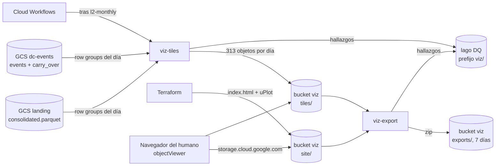

# Documento de Requerimientos Técnicos — Capa de visualización (TRD-viz)

## Tablero de un día con tiles M4 precalculados y uPlot, servido desde un bucket sin servidor

> **Capa transversal de consumo · Arquitectura Medallion · Single-Node Big Data · Google Cloud Platform**

|Campo        |Valor                                                                           |
|-------------|--------------------------------------------------------------------------------|
|Documento    |TRD-viz — Capa transversal de visualización                                     |
|Versión      |**1.0**                                                                         |
|Estado       |Línea base. Fija el contrato de tiles por día que implementan las hijas 2 a 7 de la Épica E6 (ITSC-303). |
|Fecha        |Octubre de 2026                                                                 |
|Documento padre|TRD maestro v2.5                                                              |
|Alcance      |Capa viz: job de tiles, job de exportación, tablero estático                    |
|Clasificación|Académico / Uso personal                                                        |
|Contexto     |Trabajo de grado — Maestría en Finanzas · Universidad EAFIT (Medellín, Colombia)|

### Historial de revisiones

|Versión|Fecha|Descripción|
|---|---|---|
|1.0|Oct 2026|Línea base (ITSC-304). Recoge la decisión [Decisión: principios de diseño de la capa de visualización](https://app.notion.com/p/3f027957d23d81b8b12ad2217ffa96fb) (2026-10-05) y fija el contrato de tiles por día: disposición en el bucket, formato binario, niveles de zoom con su presupuesto de bytes, regla de estado por columna, procedencia de los eventos de un día e idempotencia. Fija también modos, variables, hallazgos de DQ, costos y observabilidad. Es la fuente única para las hijas 2 a 7: ninguna reabre lo que aquí se fija. |

-----

## Cómo leer este documento

Este TRD detalla la **capa viz** y **hereda las invariantes** del TRD maestro, de [TRD-L1](l1.md) y de [TRD-L2](l2.md). No las repite salvo cuando las concreta. El porqué de cada decisión se escribe **una sola vez**, en la sección 6; el resto del documento y las cards de la Épica lo enlazan.

- Si buscas **qué construye viz y con qué garantías** → secciones 4 y 5 (requerimientos).
- Si buscas **por qué uPlot, tiles M4 y bucket sin servidor** → sección 6 (ADR de capa).
- Si buscas **el formato exacto de un tile, sus niveles de zoom o la regla de estado** → sección 7 (contrato de datos).
- Si buscas **los modos, las variables y los nombres de job** → secciones 8 y 11.
- Si buscas **los hallazgos de DQ de viz** → sección 9.
- Si buscas **cuánto cuesta y qué mide cada card** → secciones 10 y 14.
- Si vas a **cambiar la vista** → sección 6.7 (los nueve principios y la Evaluación ergonómica, obligatoria en tu PR).

-----

## Tabla de contenido

1. [Introducción y propósito](#1-introducción-y-propósito)
1. [Invariantes heredadas](#2-invariantes-heredadas)
1. [Alcance de la capa viz](#3-alcance-de-la-capa-viz)
1. [Requerimientos funcionales](#4-requerimientos-funcionales)
1. [Requerimientos no funcionales](#5-requerimientos-no-funcionales)
1. [Decisiones de diseño de viz (ADR de capa)](#6-decisiones-de-diseño-de-viz-adr-de-capa)
1. [Contrato de datos](#7-contrato-de-datos)
1. [Pipeline interno y modos de ejecución](#8-pipeline-interno-y-modos-de-ejecución)
1. [Validaciones y política de calidad de datos](#9-validaciones-y-política-de-calidad-de-datos)
1. [Arquitectura de cómputo, dimensionamiento y costo](#10-arquitectura-de-cómputo-dimensionamiento-y-costo)
1. [Operaciones](#11-operaciones)
1. [Riesgos y mitigaciones](#12-riesgos-y-mitigaciones)
1. [Criterios de aceptación](#13-criterios-de-aceptación)
1. [Ítems abiertos y a validar](#14-ítems-abiertos-y-a-validar)
1. [Anexos](#15-anexos)

-----

## 1. Introducción y propósito

viz es la capa que **muestra** lo que las demás calculan. Sirve para juzgar si el detector y el pipeline están bien, a menudo mientras algo falla. Por eso se diseña como una cabina de pilotos —para decidir rápido y sin error— y no como una vitrina.

El problema técnico es de volumen: un día de BTCUSDT tiene del orden de millones de ticks y, a θ bajo, miles de eventos DC por θ. Ningún navegador pinta eso crudo, y un servidor que lo reduzca en cada interacción pone cómputo en caliente donde no hace falta. viz lo resuelve **una sola vez por día**, en un job: reduce cada día a **tiles** —arreglos binarios planos por nivel de zoom— y el navegador solo los descarga y los dibuja. No hay servidor: el HTML, uPlot y los tiles viven en un bucket privado.

Este documento fija, para viz, todo lo que la Épica E6 necesita para repartir el trabajo sin que cada hija invente su propio formato: el contrato de tiles por día (§7), los modos y variables de los dos jobs (§8, §11), los hallazgos de DQ (§9), los costos y la observabilidad (§10, §11) y la regla de proceso que protege la vista de la deriva (§6.7).

-----

## 2. Invariantes heredadas

viz hereda y no contradice:

- **Región única us-east1** y **presupuesto** ≤ 100 USD/mes (objetivo < 5 USD/mes en estado estacionario). Salvaguarda adicional: presupuesto `intrinsica-mensual` de 5 USD en Facturación, con alertas al 50, 90 y 100 % del costo real (creado por el humano el 2026-10-05).
- **Particionado estilo hive** (`provider=<p>/market=<m>/asset=<a>/…`) en todo lo que viz escribe.
- **Idempotencia** (RF-12 del maestro): re-ejecutar un día con la misma entrada produce los mismos tiles.
- **Mínimo privilegio** (IAM, una service account por modo) e **IaC reproducible** (Terraform). Sin Secret Manager: viz lee y escribe buckets propios del project vía IAM.
- **Una imagen por capa, parametrizada por modo** (RF-15 del maestro): la imagen `viz_tiles` tiene los modos `tiles` y `export`.
- **Hallazgos de DQ** con el esquema unificado y la función compartida `emit_findings()` ([`docs/data-contracts.md`, "Lago de hallazgos de calidad de datos"](../data-contracts.md#lago-de-hallazgos-de-calidad-de-datos)); mismo formato de log que L1 y L2.
- **Contratos de entrada**: el Parquet conformado de L1 ([TRD-L1 §7.2](l1.md#72-salida--parquet-conformado-de-l1-contrato-hacia-l2)) y los `events.parquet` y `carry_over.parquet` de L2 ([TRD-L2 §7.2](l2.md#72-salida--eventsparquet-contrato-hacia-l3) y [§7.4](l2.md#74-carry-over--contrato-y-disposición-física)). viz no pide nada que esos contratos no entreguen.

**Decisiones que no se reabren aquí** (ya fijadas fuera de este documento; viz las hereda como dadas):

|Decisión|Dónde se fijó|Qué fija para viz|
|---|---|---|
|Principios de diseño de la capa de visualización|[Decisión: principios de diseño de la capa de visualización](https://app.notion.com/p/3f027957d23d81b8b12ad2217ffa96fb) (2026-10-05)|Las tres prioridades y su orden, uPlot, tiles M4, solo bucket sin servidor, volumen en barras, los nueve principios y la Evaluación ergonómica obligatoria. La sección 6 las recoge y escribe su porqué una sola vez.|
|Los agentes no despliegan ni ejecutan pipelines|[Decisión: despliegue de stacks de capa por GitHub Actions con WIF](https://app.notion.com/p/3e527957d23d810e9401d9d941d17f83) (2026-09-24)|`terraform.yml` y `run-job.yml` los dispara y aprueba el humano; el stack `data` lo aplica solo el humano desde Cloud Shell. El backfill de tiles lo lanza el humano.|
|Eficiencia de memoria ante todo|[Decisión: eficiencia de memoria ante todo](https://app.notion.com/p/3e727957d23d811887eaf14c886b9a0c) (2026-09-26)|Todo dato en RAM se libera en cuanto se aprovechó; nunca conviven dos representaciones del mismo dato; el pico de una unidad es O(lote), no O(unidad) (§8.1).|
|Hallazgos con el esquema de L1 y L2|[TRD-L1 §7.3](l1.md#73-lago-de-hallazgos-de-calidad-de-datos), [TRD-L2 §9.4](l2.md#94-emisión)|viz agrega `check_type` propios y `layer = "viz"`; no agrega columnas al esquema (§9).|

-----

## 3. Alcance de la capa viz

### 3.1 Dentro de alcance

- **Tiles por día** (§7): precio M4, volumen por cubeta y estado de dirección por θ, en seis niveles de zoom, escritos al prefijo `tiles/` del bucket viz.
- **Job `viz-tiles`**: lee un mes de L1 y los eventos de L2, escribe los tiles de cada día del mes, idempotente por hash de entrada.
- **Job `viz-export`**: empaqueta un día en un zip autocontenido que abre sin servidor.
- **Tablero estático**: `index.html` más uPlot empaquetado en el repo con versión fija, publicado al prefijo `site/` por Terraform.
- **Hallazgos de DQ** propios de viz (§9) y la observabilidad del job (§11).
- **Backfill** de tiles del histórico, lanzado por el humano.

### 3.2 Fuera de alcance (se difiere)

- **Cloud Run service** con autenticación propia (opción B de la decisión). Se abre como card solo cuando aparezca un usuario sin acceso IAM al proyecto; entre tanto, el zip exportable cubre al asesor.
- **Más de un día en pantalla**, comparación de días o de símbolos, y Capas 3 y 4 en el tablero. Si aparece un segundo usuario con otra necesidad, se revisa la arquitectura de tiles antes de agregar paneles (§6.1, "Cuándo reabrir").
- **Telemetría o logging desde el navegador.**
- **Multi-activo real**: el diseño no lo impide (partición por `asset`), pero `tiles/latest.json` es mono-activo (§7.7).
- **Consumo de los lagos de DQ y meta-métricas** (BigQuery externo): sigue diferido (maestro §8.4); no es el tablero de datos de esta capa.

-----

## 4. Requerimientos funcionales

*Prioridad MoSCoW: M (Must), S (Should), C (Could).*

|ID       |Nombre                         |Descripción                                                                                                                                  |Prio.|
|---------|--------------------------------|----------------------------------------------------------------------------------------------------------------------------------------------|-----|
|RF-VZ-01 |Tile de precio M4               |Por día y nivel de zoom, los cuatro puntos M4 (primero, mínimo, máximo, último) de cada columna, independientes de θ (§7.3).                     |M    |
|RF-VZ-02 |Tile de volumen                 |Por día y nivel, la suma de `quantity` de cada columna (§7.3).                                                                                   |M    |
|RF-VZ-03 |Tile de dirección por θ         |Por día, nivel y θ, un byte por columna con cuatro estados (confirmación alza, overshoot alza, confirmación baja, overshoot baja) y 0 sin evento (§7.4, §7.5).|M    |
|RF-VZ-04 |Índice y marca de commit        |`index.json` por día, escrito al final: su presencia significa que el día está completo (§7.2, §7.8).                                            |M    |
|RF-VZ-05 |Puntero al último día           |`tiles/latest.json` apunta al último día con tiles completos (§7.7).                                                                             |M    |
|RF-VZ-06 |Cola provisional explícita      |Un día cuyo último evento aún no se cierra se escribe igual, con la cola marcada como provisional, y se corrige cuando L2 cierra el evento (§7.6).|M    |
|RF-VZ-07 |Idempotencia por hash de entrada|Un día se regenera solo si cambió el hash de sus archivos de entrada o la versión del formato; `--force` lo ignora (§7.8).                      |M    |
|RF-VZ-08 |Modo `tiles`                    |Por defecto el mes anterior (UTC); `--day`, o `--from` y `--to` por meses; `--force` (§8.2).                                                    |M    |
|RF-VZ-09 |Modo `export`                   |`--day` deja en `exports/` un zip autocontenido con página, uPlot y tiles del día (§8.3).                                                        |M    |
|RF-VZ-10 |Hallazgos de DQ                 |Emitir al lago de DQ con `layer = "viz"` y el día en `details.day` (§9).                                                                          |M    |
|RF-VZ-11 |Modo degradado visible          |Un tile o un día faltante se ve en pantalla como hueco con marcador y texto; nunca se interpola ni se rellena en silencio (principio 6, §6.7).    |M    |
|RF-VZ-12 |Evaluación ergonómica           |Todo PR que cambie la vista rediseña la vista completa e incluye la sección "Evaluación ergonómica" (§6.7).                                      |M    |
|RF-VZ-13 |Encadenamiento tras L2          |Al terminar `l2-monthly`, Cloud Workflows lanza `viz-tiles` sin intervención (hija 5).                                                          |S    |
|RF-VZ-14 |Backfill de tiles               |El humano lanza el histórico desde `run-job.yml`, por rangos de meses (§8.2, §10.3).                                                             |S    |
|RF-VZ-15 |Primera vista                   |Precio crudo del último día disponible con regiones DC de dos tonos por θ, filtro de θ, tooltip de cubeta y volumen en barras con eje X y cursor compartidos (§6.6).|M    |

-----

## 5. Requerimientos no funcionales

|ID        |Atributo                  |Requerimiento                                                                                                                                       |Prio.|
|----------|---------------------------|-----------------------------------------------------------------------------------------------------------------------------------------------------|-----|
|RNF-VZ-01 |Eficiencia (prioridad 1)   |Ningún cálculo en el momento de la interacción; nada en RAM que ya se aprovechó; nada se transfiere al navegador que no se vaya a dibujar.            |M    |
|RNF-VZ-02 |Presupuesto de bytes       |Abrir un día transfiere menos de 1 MB (incluye página y uPlot); el primer trazo sale en menos de 500 ms en red doméstica; cambiar θ responde en menos de 100 ms y no vuelve a descargar precio ni volumen (§7.3, §14 ítem 1).|M    |
|RNF-VZ-03 |Ergonomía (prioridad 2)    |La vista cumple los nueve principios de §6.7.                                                                                                        |M    |
|RNF-VZ-04 |Eficiencia de memoria      |Pico de una unidad de trabajo O(lote): un row group de L1 más acumuladores de tamaño fijo (O(columnas del nivel más fino)); nunca el día ni el mes enteros (§8.1).|M    |
|RNF-VZ-05 |Determinismo               |Misma entrada y misma `tiles_version` producen los mismos bytes en cada archivo de tile (el `index.json` lleva `generated_at` y queda fuera).        |M    |
|RNF-VZ-06 |Costo fijo cero            |Sin servidor siempre encendido, sin base propia: el costo es almacenamiento más el cómputo de los jobs, dentro del presupuesto de §10.                |M    |
|RNF-VZ-07 |Regenerable                |Los tiles se regeneran desde L1 y L2 en cualquier momento; no son fuente de verdad.                                                                 |M    |
|RNF-VZ-08 |Acoplamiento débil         |viz se comunica con L1 y L2 solo por sus contratos Parquet (§7.1) y con el navegador solo por los archivos de §7.2.                                  |M    |
|RNF-VZ-09 |Sin terceros               |Ninguna petición del navegador sale a un dominio distinto del bucket: uPlot va empaquetado, sin CDN.                                                  |M    |
|RNF-VZ-10 |Mínimo privilegio          |viz escribe solo en su bucket y en el lago de DQ (prefijo `viz/`); nunca toca `landing`, `dc-events` ni `manifest`.                                 |M    |

-----

## 6. Decisiones de diseño de viz (ADR de capa)

*Cada decisión hereda las invariantes del maestro y concreta la entrada de Documentación enlazada en §2. Las filas "Alternativas descartadas" son las de esa entrada.*

### 6.1 ADR-VZ-01 — Existe una capa transversal de consumo visual

|Campo|Contenido|
|---|---|
|**Decisión**|viz no es una capa Medallion más: **lee** de Silver y Gold, **no escribe en el lago** y **no es insumo de ningún otro proceso**. En el maestro entra en §3.1 como fila nueva de tipo "consumo" (ADR-09).|
|**Justificación**|Las cuatro capas Medallion suben la calidad del dato y cada una alimenta a la siguiente. viz no hace ninguna de las dos cosas: es una hoja del grafo. Tratarla como capa 5 la ataría al orden L1→L4 y haría que su retraso bloqueara a otras; como consumo transversal, E5 (Capa 3) no la bloquea ni ella a E5.|
|**Cuándo reabrir**|Si aparece un segundo usuario con otra necesidad (p. ej. comparar días o símbolos lado a lado), se revisa la arquitectura de tiles antes de agregar paneles.|

### 6.2 ADR-VZ-02 — Tres prioridades, en este orden; el orden rompe empates

|Campo|Contenido|
|---|---|
|**Decisión**|(1) **Eficiencia**: ningún cálculo en el momento de la interacción, nada en RAM que ya se aprovechó, nada se transfiere al navegador que no se vaya a dibujar. (2) **Ergonomía de monitoreo bajo estrés**: el tablero se diseña como una cabina de pilotos. (3) **Look and feel**: solo lo que sobrevive a las dos anteriores.|
|**Justificación**|El tablero juzga si el detector y el pipeline están bien, a menudo mientras algo falla. Las normas de aviación existen porque un operador bajo estrés lee mal un color aislado, pierde el contexto si la escala salta y se equivoca si tiene que confirmar un diálogo. La estética va última porque es lo único que se puede perder sin perder la función.|

### 6.3 ADR-VZ-03 — Motor de gráficos: uPlot

|Campo|Contenido|
|---|---|
|**Decisión**|uPlot: librería de canvas de ~45 KB, sin dependencias, la que usa Grafana para series de tiempo. Se empaqueta en el repo con versión fija.|
|**Justificación**|Dibuja cientos de miles de puntos en milisegundos y su tamaño no pesa en el presupuesto de bytes (§7.3). Es el motor de dibujo de Grafana sin el servidor, la base y la pluginería que lo rodean.|
|**Cuándo reabrir**|Si uPlot no soporta una representación necesaria (p. ej. regiones con degradado), se evalúa un plugin propio antes de cambiar de motor.|

### 6.4 ADR-VZ-04 — Tiles M4 precalculados, un job por día

|Campo|Contenido|
|---|---|
|**Decisión**|Un job `viz-tiles`, encadenado tras `l2-monthly`, reduce cada día a tiles por nivel de zoom con **M4** (Jugel et al., 2014): por cada columna de píxeles se conservan el primer, el último, el mínimo y el máximo precio. Un tile de precio por día (independiente de θ), un tile de dirección por θ y la suma de volumen por cubeta. El navegador solo descarga y pinta.|
|**Justificación — por qué M4**|M4 garantiza que la imagen a resolución de píxel es idéntica a la de la serie completa con cuatro puntos por columna. El costo se paga una vez, en el job, no en cada apertura.|
|**Justificación — por qué el precio no depende de θ**|Los 50 θ comparten la misma serie de precio. Separar precio (un tile) y dirección (un tile por θ) hace que cambiar θ descargue unos pocos KB de dirección y no vuelva a bajar el precio (invariante de la Épica).|
|**Justificación — por qué por día**|El día es la unidad de la vista (un día en pantalla) y la de la regeneración: un día es independiente de los demás, a diferencia de los meses de L2, que se encadenan por carry-over. Los días se pueden generar en cualquier orden y en paralelo.|

### 6.5 ADR-VZ-05 — Entrega: solo bucket, sin servidor

|Campo|Contenido|
|---|---|
|**Decisión**|El HTML, uPlot y los tiles viven en un bucket privado declarado en el stack `data`; el stack `viz` declara los jobs, los objetos de `site/` y el acceso del visor (dónde vive cada recurso, en §11). Se abre por `storage.cloud.google.com/<bucket>/site/index.html`: Google pide iniciar sesión y sirve el archivo si la cuenta tiene `objectViewer`. Costo fijo cero y ninguna superficie de autenticación propia.|
|**Justificación**|La prioridad 1 es eficiencia, y la pieza más eficiente es la que no se construye. Un servicio de Cloud Run con validación de Google Sign-In agrega imagen, stack, autenticación propia y logs para un problema que no existe con un solo usuario.|
|**Opción B**|Cloud Run service con validación de Google Sign-In. Se abre como card solo cuando aparezca un usuario sin acceso IAM al proyecto; mientras tanto, el zip exportable cubre al asesor.|
|**Alternativas descartadas**|**Cloud Run service para servir el tablero (hoy)**: ver la justificación. **Looker Studio**: conecta a BigQuery, no a Parquet en bucket; obligaría a una copia del dato y rompe la prioridad 1. **Grafana**: servidor siempre encendido, base propia y pluginería para Parquet; uPlot es su motor sin el resto. **Streamlit, Dash, Panel**: cada interacción vuelve al servidor Python, con latencia de cientos de ms y cómputo en caliente, contrario a la prioridad 1 y al principio 8. **Plotly**: dibuja en SVG/WebGL con un bundle de más de 3 MB; con cientos de miles de puntos el navegador se arrastra. **Stack del legacy (HoloViews, Bokeh, Datashader, Panel)**: resolvía el volumen con rasterización en servidor; aquí el volumen se resuelve una vez, en el job de tiles, y el servidor desaparece.|

### 6.6 ADR-VZ-06 — Volumen como barras en un panel inferior, nunca como tamaño de punto

|Campo|Contenido|
|---|---|
|**Decisión**|El volumen es un panel inferior de barras (20 a 25 % de la altura), con eje X y cursor compartidos con el precio.|
|**Justificación**|Cleveland y McGill (1984) muestran que el ojo compara longitudes alineadas con precisión y áreas con error sistemático; además, una burbuja gruesa tapa el precio que está debajo.|
|**Primera vista acordada**|Serie cruda de precio contra tiempo del último día disponible. Regiones verticales de fondo por evento DC, en dos tonos: claro para la fase de confirmación y fuerte para el overshoot; verde para alza, rojo para baja. Filtro de θ que cambia solo el tile de dirección. Tooltip sobre la cubeta: hora, mínimo y máximo del cubo M4, estado DC. Volumen como panel inferior.|

### 6.7 ADR-VZ-07 — Nueve principios de ergonomía y Evaluación ergonómica obligatoria

|Campo|Contenido|
|---|---|
|**Decisión**|Todo cambio visual se revisa contra los nueve principios, tomados de FAA HF-STD-001, SAE ARP4102/7, EASA CS-25.1302 y la filosofía de cabina oscura y silenciosa (*dark and quiet cockpit*). Cada card que cambie la vista rediseña la vista completa y su PR trae la sección "Evaluación ergonómica".|
|**Justificación**|Exigir el rediseño completo en cada incremento evita la deriva típica de los tableros: paneles que se acumulan hasta que nadie mira ninguno.|

|#|Principio|Qué significa en el tablero|
|---|---|---|
|1|Cabina oscura|Fondo oscuro de bajo brillo; lo normal no llama la atención; solo lo anómalo resalta.|
|2|El color nunca va solo|Todo estado codificado por color lleva también forma, posición o texto. Rojo y verde quedan reservados a la dirección DC; las alertas van en ámbar con texto.|
|3|Franja de estado fija|Una barra siempre visible con fecha del día, θ activo, última actualización y modo (normal o degradado). Nunca se desplaza ni se oculta.|
|4|Eje X y cursor compartidos|Todos los paneles alineados al mismo tiempo; el cursor se mueve en todos a la vez.|
|5|Escalas estables|El eje Y no salta al cambiar θ ni al mover el cursor; cambia solo con zoom explícito del usuario.|
|6|Modo degradado visible|Si falta un tile o un día no llegó, se muestra el hueco con un marcador y texto; nunca se interpola ni se rellena en silencio.|
|7|Numerales tabulares monoespaciados|Cifras alineadas, contraste mínimo 7:1, tamaño mínimo 12 px.|
|8|Interacción menor a 100 ms y reversible|Toda acción responde antes de 100 ms y se deshace con una acción; sin confirmaciones modales.|
|9|Menos es más|Cada elemento justifica su lugar; un incremento que agrega sin quitar es sospechoso.|

**Regla de proceso: Evaluación ergonómica obligatoria.** El PR de toda card que agregue, mueva o quite un elemento de la vista incluye una sección "Evaluación ergonómica" con cuatro partes:

1. Captura o descripción de la **vista completa** resultante.
2. Revisión contra los nueve principios, con lo que se **quitó** para hacer lugar.
3. **Métricas de eficiencia antes y después**: bytes transferidos por día cargado, tiempo hasta el primer trazo y tiempo de respuesta al cambiar θ.
4. **Veredicto**: qué prioridad ganó cuando hubo conflicto y por qué.

`pr-review` rechaza el PR si la sección falta o si una métrica empeora sin justificación escrita.

### 6.8 ADR-VZ-08 — Seis niveles de zoom de 128 a 4 096 columnas por día

|Campo|Contenido|
|---|---|
|**Decisión**|El ancho `w` de un nivel es el **número de columnas en que se divide el día UTC completo**. Los niveles son `w ∈ {128, 256, 512, 1024, 2048, 4096}`: potencias de 2, de la columna más gruesa (675 s) a la más fina (21,09 s). Detalle y presupuesto en §7.3.|
|**Por qué potencias de 2**|Dos razones. (1) Todo `w ≤ 8192` divide el día (86 400 000 000 µs) en columnas de duración **entera** en µs, así que la columna de un tick se calcula con enteros, sin redondeo. (2) M4 es **componible**: el primero de una columna gruesa es el primero de su primera columna fina **no vacía**, el último es el último de la última **no vacía** de las dos, y el mínimo y el máximo son el mínimo de mínimos y el máximo de máximos, que **ignoran las columnas vacías** (`NaN`). Si las dos están vacías, la gruesa también. Basta recorrer los ticks una vez, a `w = 4096`, y derivar los demás niveles de ese, sin releer ni guardar ticks (§8.1).|
|**Por qué 4 096 como techo**|El ancho útil del gráfico en un monitor de escritorio es del orden de 1 500 px: `w = 2048` cubre el día completo con una columna por píxel o menos, y `w = 4096` deja ~2,7 veces de zoom antes de que una columna pase de un píxel. Los niveles de 128 a 1 024 sirven al primer trazo (4,7 KB) y a pantallas angostas. El techo lo fija el almacenamiento: cada duplicación del nivel más fino suma ~0,70 MB por día y duplica el total (tabla de §10.1).|
|**Consecuencia asumida**|La resolución máxima es una columna de 21,09 s. Un evento DC de θ muy pequeño que dure menos que eso no se distingue en pantalla: la vista de un día sirve para juzgar el detector y el pipeline, no para auditar un tick. Si esa resolución no alcanza, la salida es un nivel más fino (con su costo) o un tile por rango horario; ambas se evalúan antes de agregar paneles (§14 ítem 8).|

### 6.9 ADR-VZ-09 — Estado de una columna: el del último tick de la cubeta

|Campo|Contenido|
|---|---|
|**Decisión**|El estado DC de una columna es el que tiene **el último tick de la cubeta**. Una columna sin ticks tiene estado 0 y su precio es NaN (§7.3, §7.5). El estado de un tick se decide por su `agg_trade_id` contra los intervalos de los eventos (§7.5).|
|**Justificación — último tick**|El estado es una propiedad del instante, no de un intervalo. De los cuatro puntos M4, el último es el que cierra la columna; usar su estado deja el tile de dirección alineado con el de precio y evita decidir qué hacer cuando la cubeta cruza una frontera de fase. El costo es que una frontera de fase dentro de una columna se atribuye entera a la fase del último tick: un error de a lo sumo una columna (21,09 s en el nivel más fino).|
|**Justificación — `agg_trade_id` y no tiempo**|Varios ticks comparten `transact_time`, pero `agg_trade_id` es estrictamente creciente (contrato de L1) y cada punto de un evento de L2 lo lleva. Compararlo con ids evita el caso del extremo que comparte instante con un tick posterior.|
|**Justificación — no rellenar columnas vacías**|Una columna sin ticks podría heredar el estado vecino, pero sería inventar un dato (principio 6). Se escribe 0 y la columna se ve como hueco.|

### 6.10 ADR-VZ-10 — `index.json` al final como marca de commit; idempotencia por hash de entrada

|Campo|Contenido|
|---|---|
|**Decisión**|Un día se escribe en este orden: se borra su `index.json` si existía, se escriben los archivos de tile y **al final** se escribe el `index.json`. El `index.json` es la marca de commit: un día sin él no existe para el tablero. Cada día lleva en su índice el `input_hash` de sus archivos de entrada y la `tiles_version`; si ambos coinciden con los calculados, el día se salta (§7.8).|
|**Justificación**|Cada objeto de GCS se publica entero o no se publica, pero un día son 313 objetos y no hay transacción entre ellos. L2 resolvió el mismo problema con la escritura atómica (temporal más `commit`) y el orden "primero eventos, luego carry-over". Aquí el índice es el último escrito: un lector que lo ve sabe que todos los tiles que lista ya están. Un tile no necesita su propio temporal más renombre: ahorra una operación Clase A por objeto (§10.3). Si el job muere a medias, el día queda sin índice (visible como degradado) y la siguiente corrida lo rehace.|

-----

## 7. Contrato de datos

### 7.1 Entradas

viz **solo lee** archivos de L1 y L2 que ya son inmutables o están completos:

|Entrada|Archivo|Qué usa viz|
|---|---|---|
|L1|`consolidated.parquet` del mes ([TRD-L1 §7.2](l1.md#72-salida--parquet-conformado-de-l1-contrato-hacia-l2))|`agg_trade_id`, `transact_time` (µs UTC), `price` (`DECIMAL(18,8)`), `quantity` (`DECIMAL(18,8)`). Nunca provisionales: L2 tampoco los consume ([ADR-L2-09](l2.md#69-adr-l2-09--l2-solo-consume-consolidatedparquet-nunca-los-provisionales-diarios-de-l1)) y un día sin eventos no tiene regiones que dibujar.|
|L2|`events.parquet` por θ y mes ([TRD-L2 §7.2](l2.md#72-salida--eventsparquet-contrato-hacia-l3))|Por evento: `reference_agg_trade_id`, `confirm_agg_trade_id`, `extreme_agg_trade_id` y `direction`.|
|L2|`carry_over.parquet` por θ y mes ([TRD-L2 §7.4](l2.md#74-carry-over--contrato-y-disposición-física))|Para la cola provisional y para seguir la cadena de un pendiente de varios meses (§7.6): `has_pending_event`, `pending_reference_agg_trade_id`, `pending_confirm_agg_trade_id`, `direction` y el extremo vigente (`ext_high_*` o `ext_low_*`).|

El **último día disponible** es el último día del último mes consolidado en L1 y cerrado por L2. Los tiles se generan por día, pero el disparo es mensual, tras `l2-monthly`. El día es UTC, como los archivos de Binance.

### 7.2 Disposición en el bucket

Raíz: `VIZ_TILES_ROOT` (§11), es decir `gs://<bucket viz>/tiles`. Un día:

```
tiles/provider=<p>/market=<m>/asset=<a>/day=YYYY-MM-DD/
├── price-<w>.f32                  # 6 archivos: w = 128 … 4096
├── volume-<w>.f32                 # 6 archivos
├── dir-<w>-<theta>.u8             # 6 × 50 archivos; <theta> como en L2: "0." + 8 decimales
└── index.json                     # se escribe al final: marca de commit
tiles/latest.json                  # último día con index.json
```

Un día completo son **313 objetos** (6 + 6 + 300 + 1) y **≈ 0,70 MB**. `<theta>` usa el mismo texto de ancho fijo que la partición de L2 (`dir-2048-0.00010000.u8`); los θ son los del catálogo que L2 tenía en ese mes ([TRD-L2 §7.3](l2.md#73-el-catálogo-de-θ)).

Todos los binarios se escriben con `Content-Type: application/octet-stream` y `Cache-Control: private, max-age=31536000, immutable`; `index.json` y `latest.json`, con `application/json` y `Cache-Control: no-cache`. El tablero pide cada tile con `?h=<primeros 12 hex del input_hash>` tomado del índice: GCS ignora el parámetro y un día regenerado cambia de URL, así que la caché del navegador nunca sirve un tile viejo (los tiles que vuelve a abrir el mismo usuario cuestan 0 bytes).

**`index.json`** (ejemplo; todos los campos son obligatorios):

```json
{
  "tiles_version": "1.0.0",
  "provider": "binance", "market": "spot", "asset": "BTCUSDT",
  "day": "2026-08-31",
  "day_start_us": 1788134400000000,
  "input_hash": "9f2c…(sha256 en hex)",
  "generated_at": "2026-10-05T17:00:00Z",
  "image_version": "0.1.0+3a9b2c1",
  "ticks": 1234567,
  "levels": [128, 256, 512, 1024, 2048, 4096],
  "thetas": [
    {"theta": "0.00010000", "events": 11873, "provisional_from_s": null},
    {"theta": "0.05000000", "events": 4, "provisional_from_s": 41234.5}
  ],
  "missing_thetas": []
}
```

|Campo|Significado|
|---|---|
|`tiles_version`|semver del **formato** de los tiles (no la de la imagen). Cambia con cualquier modificación de §7.3 a §7.5; el tablero rechaza (modo degradado) una versión mayor que no conoce.|
|`day_start_us`|Inicio del día UTC en µs desde la época: el origen del tiempo relativo de los tiles.|
|`input_hash`|Huella de los archivos de entrada (§7.8).|
|`generated_at`|Momento de generación (UTC). Alimenta "última actualización" de la franja de estado (principio 3). Es lo único del índice que cambia entre dos corridas idénticas.|
|`ticks`|Ticks del día en L1.|
|`levels`|Los `w` presentes. El tablero no asume la lista: lee esta.|
|`thetas[].events`|Filas de eventos que tocan el día, incluida la cola pendiente si la hay.|
|`thetas[].provisional_from_s`|Segundos desde el inicio del día a partir de los cuales el estado de ese θ es provisional hasta el final del día; `null` si todo el día es definitivo (§7.6).|
|`missing_thetas`|θ del catálogo sin entrada completa en L2 ese mes; no tienen tile de dirección (§9.3). El tablero los muestra como hueco.|

### 7.3 Tiles de precio y volumen; niveles de zoom y presupuesto

**Columna de un tick.** Con `rel_us = transact_time − day_start_us` y `col = floor(rel_us × w / 86 400 000 000)`, en enteros. Un tick cae en una sola columna de cada nivel.

**`price-<w>.f32`**: binario sin cabecera, `float32` IEEE-754 little-endian, **dos bloques consecutivos** de `4w` valores:

|Bloque|Offset (bytes)|Contenido|
|---|---|---|
|Tiempo|`0`|`t[i]`: segundos desde `day_start_us`, `float32`.|
|Precio|`16w`|`p[i]`: precio en la unidad de la cotización (USDT), `float32`.|

Los puntos `i = 4·col + k` (`k = 0..3`) son los cuatro puntos M4 de la columna `col`, **en orden de tiempo**: el primer tick, el mínimo, el máximo y el último, con el mínimo y el máximo ordenados por su posición en la serie. Si dos puntos coinciden (p. ej. el primero es el mínimo), se repiten: el paso es fijo, 4 puntos por columna. Ante empates de precio dentro de la columna se toma el tick con menor `agg_trade_id`. Una columna **sin ticks** lleva en sus cuatro `t` el **inicio de la columna** (`col × 86 400 / w` segundos, exacto en `float32` para todo `w ≤ 4096`) y `NaN` solo en sus cuatro `p`: así `t` es finito y no decreciente en todo el tile, que es lo que exige un eje X de uPlot y su búsqueda binaria del cursor.

*Por qué dos bloques y no pares intercalados:* el tiempo y el precio de cada punto quedan alineados por índice (`t[i]`, `p[i]`) y el navegador mapea cada bloque con `new Float32Array(buffer, 0, 4w)` y `new Float32Array(buffer, 16w, 4w)`, sin recorrer los datos para separarlos (prioridad 1). El hueco de una columna vacía lo dibuja la vista: uPlot marca los huecos con `null` en Y y no con `NaN` (canvas ignora `lineTo(NaN)` y uniría los puntos vecinos), así que al cargar la vista copia `p` a un arreglo de Y y pone `null` donde `p[i]` es `NaN`. Es una pasada sobre `4w` ≤ 16 384 valores, microsegundos frente a los 100 ms del principio 8; `t` se usa sin tocar.

*Precisión:* el precio se convierte una sola vez, al escribir, del entero exacto de L1 (`price_int / 10⁸`, vía `f64`) a `float32` con redondeo al más cercano. Hasta 131 072 USDT la resolución es 0,0078 USDT. El tiempo relativo llega a 86 400 s: la resolución es 7,8 ms al final del día (error máximo 3,9 ms), suficiente para columnas de 21 s o más.

**`volume-<w>.f32`**: `w` valores `float32`, la **suma de `quantity`** de los ticks de cada columna, en la unidad base (BTC). La suma se hace en enteros de escala `10⁸` y se convierte al final. Una columna sin ticks vale 0; que está vacía lo dice el precio (NaN).

**Niveles de zoom y bytes** (un θ por fila de dirección):

|`w`|Duración de columna|`price`|`volume`|`dir` (un θ)|Total por nivel (un θ)|
|---|---|---|---|---|---|
|128|675 s|4 096 B|512 B|128 B|4 736 B|
|256|337,5 s|8 192 B|1 024 B|256 B|9 472 B|
|512|168,75 s|16 384 B|2 048 B|512 B|18 944 B|
|1 024|84,38 s|32 768 B|4 096 B|1 024 B|37 888 B|
|2 048|42,19 s|65 536 B|8 192 B|2 048 B|75 776 B|
|4 096|21,09 s|131 072 B|16 384 B|4 096 B|151 552 B|
|**Suma**|||258 048 B|32 256 B|8 064 B|298 368 B|

**Presupuesto por apertura (< 1 MB).** Costo por columna: 32 B de precio (4 puntos × 2 × 4 B) + 4 B de volumen + 1 B de dirección por θ.

|Acción|Qué se descarga|Bytes|
|---|---|---|
|Primer trazo|`latest.json` (~0,2 KB) + `index.json` (~4 KB) + nivel 128 de un θ|≈ 9 KB|
|Día completo en pantalla|Nivel 2 048 de un θ|75 776 B|
|Zoom 2× (nivel 4 096)|Nivel 4 096 de un θ|151 552 B|
|Cambiar θ|Un tile de dirección por nivel visible: 2 048 B (+ 4 096 B si hay zoom). Precio y volumen no se descargan.|2 a 6 KB|
|Página y uPlot (`site/`)|`index.html`, uPlot, estilos|~60 KB (orden de magnitud; lo mide la hija 4)|
|**Apertura típica**|índices + niveles 128, 2 048 y 4 096 de un θ + página|**≈ 0,30 MB**|
|**Techo absoluto**|El día entero, 50 θ, 6 niveles, más índices y página|**≈ 0,76 MB**|

Incluso el uso extremo (tocar los 50 θ en los 6 niveles) queda bajo 1 MB **sin comprimir**. El presupuesto no depende de `Content-Encoding: gzip`.

**Presupuesto por día y por histórico.** Por día: precio 258 048 B + volumen 32 256 B + dirección 50 × 8 064 = 403 200 B = **693 504 B**, más ~4 KB de `index.json` ≈ **0,70 MB**. El histórico de L1 y L2 va del 2017-08-17 al 2026-08-31, el último mes cerrado a la fecha (109 meses): **3 302 días**.

|Concepto|Cálculo|Resultado|
|---|---|---|
|Almacenamiento del histórico|3 302 días × ~0,70 MB|**≈ 2,31 GB (2,15 GiB)**|
|Objetos del histórico|3 302 días × 313|**≈ 1,03 millones**|
|Crecimiento en estado estacionario|~30 días × 0,70 MB|≈ 21 MB por mes|

Los 2,31 GB caben **dentro de los 5 GB** del cupo gratis de Cloud Storage tomados por sí solos, así que `Content-Encoding: gzip` no hace falta para entrar en el cupo y no se adopta (queda como palanca, §14 ítem 4). **Pero el cupo no es de viz:** es uno por billing account y el medallion medido ya lo excede (L1 38,4 GiB + L2 21,14 GiB, maestro §7.1 y §9.1). El almacenamiento de viz se paga: ≈ 0,05 USD/mes a 0,02 USD/GB-mes. §10.3 recoge el efecto en el costo.

### 7.4 Tile de dirección

**`dir-<w>-<theta>.u8`**: `w` bytes, uno por columna, con el estado DC del θ en esa columna (regla de §7.5):

|Valor|Estado|Tono en la vista|
|---|---|---|
|0|Sin evento (antes del primer evento del θ, o columna sin ticks)|sin región|
|1|Confirmación alza (de la referencia a la confirmación de un upturn)|verde claro|
|2|Overshoot alza (de la confirmación al extremo de un upturn)|verde fuerte|
|3|Confirmación baja|rojo claro|
|4|Overshoot baja|rojo fuerte|
|5 a 255|Reservados; el tablero los trata como 0 y lo señala (modo degradado)||

Los tonos son una indicación; el color y la forma los fija la vista bajo el principio 2.

### 7.5 Regla de estado por columna

El estado de una columna es el de su **último tick** (ADR-VZ-09). El estado de un tick con id `x` sale de los eventos del θ:

1. Si existe un evento `e` con `e.reference_agg_trade_id < x ≤ e.extreme_agg_trade_id`, el tick está en `e`. Es **confirmación** si `x ≤ e.confirm_agg_trade_id` y **overshoot** si `x > e.confirm_agg_trade_id`. Se usa el último id del grupo de empate, así que todo tick del instante de confirmación es de la fase DC ([ADR-L2-03](l2.md)). El valor es 1 o 2 si `e.direction = 1` y 3 o 4 si `e.direction = −1`.
2. Si no existe tal evento y el tick cae en la cola del mes (§7.6), el estado lo da la cola.
3. En cualquier otro caso, 0.

Los eventos de un θ se encadenan sin huecos —la referencia de uno es el extremo del anterior—, así que un tick posterior a la referencia del primer evento tiene exactamente un estado. Los niveles gruesos se derivan de los finos: el estado de una columna de `w` es el de la última columna **no vacía** de las dos de `2w` que la forman.

### 7.6 De dónde salen los eventos de un día

Un evento DC se escribe en la partición del mes que confirma el evento **siguiente** ([ADR-L2-06](l2.md)), así que los eventos que tocan un día `D` del mes `M` están en tres lugares:

|Fuente|Qué aporta para `D`|
|---|---|
|`events.parquet` de `M`|Los eventos **cerrados dentro de `M`**. Incluye el que cruza la medianoche de `D`: su extremo se resolvió en `M`.|
|`carry_over.parquet` de `M`|El evento **pendiente** al cierre de `M` (`has_pending_event`): su referencia y su confirmación son conocidas, su extremo no. Da la **cola provisional**.|
|`carry_over.parquet` de `M+1`, `M+2`, …, **solo si hay pendiente al cierre de `M`**|Dicen si el evento sigue pendiente (mismo `pending_confirm_agg_trade_id`) o ya se cerró. Un evento puede quedar pendiente varios meses (θ grande, [ADR-L2-06](l2.md)): se leen en cadena, un mes tras otro, hasta el primero cuyo carry-over ya no trae ese pendiente o hasta el último mes existente.|
|`events.parquet` de `M+k`, el **primer** mes de la cadena cuyo carry-over ya no trae el pendiente (`k ≥ 1`)|El evento que era pendiente al cierre de `M`, ya cerrado: está en la partición de `M+k` y trae su `extreme_agg_trade_id` definitivo. Reemplaza la cola provisional. Si el carry-over de `M+k` aún no existe (L2 escribe primero los eventos y luego el carry-over), la cadena se considera abierta.|

**Cola provisional.** Tras la confirmación del evento pendiente `p`, el extremo vigente al cierre de `M` (`ext_high_*` si `direction = 1`, `ext_low_*` si `direction = −1`) es un **candidato**: nunca retrocede, pero un tick de un mes posterior puede superarlo. Entonces, para los ticks de `M` posteriores a `p.confirm_agg_trade_id`:

- hasta el id del candidato: **overshoot** de `p` (certero: el extremo final es igual o posterior);
- después del candidato: **confirmación del sentido contrario** (provisional: es la fase DC del evento siguiente si el candidato no se mueve).

`provisional_from_s` de ese θ es el tiempo del candidato relativo al día, acotado a 0 si cae en un día anterior; es `null` en los días anteriores al candidato. Con el evento resuelto en `M+k`, las mismas reglas usan el `extreme_agg_trade_id` definitivo y la cola deja de ser provisional (`provisional_from_s = null`): los ticks posteriores al extremo y anteriores al fin de `M` son la confirmación del evento siguiente, que confirma en `M+k`.

Mientras la cadena sigue abierta (el último carry-over existente aún trae el mismo pendiente: un overshoot de más de un mes), la cola de `M` **sigue provisional**, con el candidato del carry-over de `M`. El último día disponible casi siempre trae cola provisional, porque su evento abierto no cierra hasta que L2 procese el mes que lo confirma.

**Regla para mantener los tiles al día.** Un evento pendiente deja cola provisional en **cada** mes que atraviesa, así que los meses con cola son contiguos hasta el mes anterior al que lo cierra. Por eso, cuando `viz-tiles` procesa un mes `N`, revisa hacia atrás **todos** los meses anteriores con cola provisional, no solo el previo: desde `N−1`, mira el `index.json` del último día del mes; si trae algún `provisional_from_s` distinto de `null`, retrocede por los días de ese mes mientras los encuentre provisionales y pasa al mes anterior; se detiene en el primer mes cuyo último día es definitivo para todos los θ. A cada día así hallado le aplica el protocolo de §7.8: el `input_hash` cambia solo si la cadena avanzó o se cerró, y el resto se salta. No hace falta un `--from` y `--to` del humano para corregir una cola larga.

### 7.7 `tiles/latest.json`

```json
{"tiles_version": "1.0.0", "provider": "binance", "market": "spot", "asset": "BTCUSDT", "day": "2026-08-31"}
```

Apunta al **último día con `index.json` escrito**. Se escribe después del `index.json` de ese día y solo avanza: un día anterior regenerado no lo retrocede. Es **mono-activo** porque vive en la raíz de `tiles/`; el multi-activo exigiría moverlo bajo `asset=<a>/`, y ese cambio de contrato sube `tiles_version`.

### 7.8 Idempotencia y marca de commit

**`input_hash`.** SHA-256 de un texto canónico: primero `tiles_version` y `day`, luego una línea `<ruta relativa a su raíz>␉<tamaño en bytes>␉<CRC32C>` por **cada archivo de entrada**, ordenadas por ruta. Tamaño y CRC32C salen de los metadatos del objeto en GCS, sin descargarlo (en local se calculan sobre el archivo). Los archivos de entrada de un día `D` del mes `M` son:

- el `consolidated.parquet` de `M` en L1;
- el `events.parquet` y el `carry_over.parquet` de `M` de cada θ del catálogo;
- por cada θ **con evento pendiente al cierre de `M`**, y **solo en los días `D` con cola provisional** (del día del candidato en adelante: el mismo criterio de `provisional_from_s`, que sale del carry-over de `M`, ya entrada): los `carry_over.parquet` de la cadena de §7.6 (`M+1`, `M+2`, … hasta donde la cadena existe) y, si la cadena cerró, el `events.parquet` de `M+k`. Los días anteriores al candidato no los llevan: resolverse el evento no cambia sus estados, porque sus ticks son overshoot del pendiente con el extremo provisional y con el definitivo. Mientras la cadena sigue abierta, cada mes nuevo cambia el hash de esos días y los rehace con tiles idénticos: es inocuo y acotado a los días de la cola.

*Por qué CRC32C y no un hash del contenido lógico:* L2 no publica un manifiesto de sus `content_hash` (solo van en los hallazgos `events_summary`), y descargar los archivos para hashearlos cuesta más que regenerar. El CRC32C es lo que GCS ya calcula. Que L2 reescriba un archivo con los mismos datos y distintos bytes provoca, a lo sumo, una regeneración que produce los mismos tiles: es inocuo.

**Protocolo por día.**

1. Calcular `input_hash`. Si el `index.json` del día existe con el mismo `input_hash` y la misma `tiles_version`, **saltar** (`tiles_summary` con `details.skipped = true`), salvo `--force`.
2. Si existe con otro hash, **borrarlo**: el día pasa a "no disponible" mientras se rehace.
3. Escribir los 312 archivos de tile.
4. Escribir `index.json`: **la marca de commit**.
5. Escribir `latest.json` si el día es posterior al apuntado.

Si el job muere entre 2 y 4, el día queda sin índice (el tablero lo muestra como degradado) y la siguiente corrida lo rehace. Los tiles huérfanos se sobrescriben.

**Efecto de agregar un θ al catálogo de L2.** El `events.parquet` nuevo entra en el hash de todos los días de ese mes y los regenera enteros (precio y volumen no cambian, pero se reescriben). Es un costo conocido (§10.3, §12).

### 7.9 La exportación

`exports/<provider>-<market>-<asset>-<YYYY-MM-DD>.zip`, con la misma disposición interna `tiles/…/day=…/` que el bucket, más `tiles/latest.json` apuntando a ese día, la página y uPlot. Tiene `lifecycle` de 7 días en el bucket.

**Restricción para la hija 6:** el zip debe abrir **desde disco**, sin servidor, y los navegadores bloquean `fetch` sobre `file://`. La exportación no puede depender de leer los tiles con `fetch`: los incrusta en un `<script>` (p. ej. un archivo `.js` que registra cada tile en base64 bajo su nombre relativo) y el tablero carga los tiles por una sola función con dos implementaciones, HTTP en el bucket y registro local en el zip. El día pesa ~0,70 MB, ~0,93 MB en base64: cabe sin comprimir.

-----

## 8. Pipeline interno y modos de ejecución

### 8.1 Núcleo compartido (un día)

El orden del núcleo respeta la eficiencia de memoria: el día nunca está entero en RAM.

1. **Hash y decisión** (§7.8, paso 1). Si se salta, no se lee ningún tick.
2. **Pasada 1 sobre los ticks**: abrir `consolidated.parquet` de `M` y leer **solo los row groups cuyo rango de `transact_time` toca el día** (estadísticas de columna; el archivo viene ordenado), row group por row group. Por tick: calcular la columna en `w = 4096` y actualizar, por columna, los acumuladores M4 (primero, mínimo, máximo, último, con su `t`), la suma entera de `quantity` y el `agg_trade_id` del último tick. Liberar el row group antes del siguiente. La memoria de esta pasada es **fija**: un row group más 4 096 columnas × unos 100 B, ~0,4 MB.
3. **Derivar** los niveles 2 048 a 128 a partir del nivel 4 096 (M4 es componible, ADR-VZ-08), escribir `price-<w>.f32` y `volume-<w>.f32` y liberar los acumuladores de precio y volumen.
4. **Pasada 2 por θ** (un θ a la vez): leer del `events.parquet` de `M` los row groups que tocan el día (estadísticas de `reference_agg_trade_id` y `extreme_agg_trade_id`), más la cola de §7.6, y recorrer **a la vez** esos eventos y los 4 096 ids de último tick en una sola barrida (ambos ordenados por `agg_trade_id`): sale el estado de cada columna del nivel 4 096. Derivar los niveles gruesos (§7.5), escribir los seis `dir-<w>-<theta>.u8` del θ y liberar. La memoria de esta pasada es **un row group de eventos** (hasta 32 768 filas) más 4 096 bytes.
5. **Escribir** `index.json` y `latest.json` (§7.8, pasos 4 y 5) y **emitir** `tiles_summary`.

El pico de una unidad es **O(lote)**: un row group de L1, o uno de eventos, más acumuladores de tamaño fijo. No depende de los ticks del día ni de los eventos de un θ pequeño. Nunca conviven el tile y los ticks de los que salió.

### 8.2 Modo `tiles`

|Argumento|Efecto|
|---|---|
|(ninguno)|El **mes anterior** al actual (UTC), día por día, más la revisión de los meses anteriores con cola provisional (§7.6). Es lo que lanza el encadenamiento tras `l2-monthly`.|
|`--day YYYY-MM-DD`|Un solo día.|
|`--from YYYY-MM` y `--to YYYY-MM`|Todos los días de cada mes del rango, en orden. `--to` por defecto es `--from`. Es la forma del backfill.|
|`--force`|Ignora el `input_hash` del paso 1 y regenera lo seleccionado.|
|`--asset`|Activo; por defecto `BTCUSDT`, como en L1 y L2.|

`--day` no se combina con `--from` ni `--to` (código 2). A diferencia de L2, `--force` no exige `--from`: sin rango regenera el mes anterior, que es barato.

**Los días de un mes son independientes entre sí**, porque no hay carry-over que los encadene. Eso permite recorrer un mes con una sola lectura de L1 (cada día cierra cuando cambia el día de los ticks) y, para el backfill, repartir meses entre tareas (§10.3).

**Códigos de salida**, como en L1 y L2: `0` éxito (incluye "todo al día"), `1` la unidad terminó pero dejó un hallazgo `input_missing` o falló, `2` error de uso (argumentos incompatibles, falta una variable de entorno).

### 8.3 Modo `export`

`--mode export --day YYYY-MM-DD` (obligatorio; sin él, código 2). **No lee L1 ni L2.** Lee del bucket los tiles del día (desde `VIZ_TILES_ROOT`) y la página con uPlot (desde `VIZ_SITE_ROOT`), escribe el zip en `VIZ_EXPORTS_ROOT` (§7.9) y emite `export_summary`. Si el día no tiene `index.json`, deja `input_missing` y sale con código 1. Memoria: un archivo a la vez (el mayor pesa 131 KB).

### 8.4 Modo y nombre de job

La imagen es una sola, `viz_tiles` (capa `layers/viz_tiles`, con su `VERSION`), con `--mode tiles` y `--mode export`. El módulo Terraform `layer` nombra el job como `<capa>-<modo>`: con `layer = "viz"` salen **`viz-tiles`** y **`viz-export`**, cada uno con su service account (`viz-tiles`, `viz-export`).

-----

## 9. Validaciones y política de calidad de datos

### 9.1 Política: continuar con hallazgo y hueco visible

Los tiles no son fuente de verdad y se regeneran. Por eso, a diferencia de L2 (cuyo estado encadenado exige fail-closed, [ADR-L2-08](l2.md)), viz **continúa y deja hallazgo**: si falta un θ en L2, el día se escribe con los demás y el θ ausente va a `missing_thetas` (se ve en pantalla, principio 6). Cuando el archivo aparece, el `input_hash` cambia y el día se rehace solo. Si falta el mes de L1, el día no se escribe. En ambos casos la unidad termina con código 1, para que la alerta del job lo vea.

### 9.2 Chequeos

|Chequeo|Qué verifica|
|---|---|
|Entrada completa|Existe el `consolidated.parquet` del mes y los `events.parquet` y `carry_over.parquet` de cada θ del catálogo.|
|Día con ticks|El día tiene al menos un tick en L1.|
|Tiles de entrada (export)|El día tiene `index.json` en `tiles/`.|

### 9.3 Tipos de chequeo (`check_type`)

Todos llevan `layer = "viz"`, `mode ∈ {tiles, export}`, `stage = "canonical"`, `year` y `month` del día y **`details.day = "YYYY-MM-DD"`**. El esquema de hallazgos no gana columnas: el día y lo demás viajan en `details` ([`docs/data-contracts.md`](../data-contracts.md#lago-de-hallazgos-de-calidad-de-datos)).

|`check_type`      |`severity`|`status`|Cuándo|
|-------------------|----------|--------|------|
|`tiles_summary`    |`info`    |`pass`  |Uno por día al cerrarlo (escrito o saltado). `metric_value` = ticks del día. `details`: `day`, `input_hash`, `tiles_version`, `skipped`, `objects`, `bytes`, `thetas`, `provisional_thetas` (θ con cola provisional) y `missing_thetas`.|
|`input_missing`    |`error`   |`fail`  |Falta una entrada. `details`: `day` y `what` ∈ {`l1`, `events`, `carry_over`, `ticks`, `tiles`}; con `events` o `carry_over` lleva también `theta`; lleva `path` cuando aplica. Un día sin ticks es `what = "ticks"`. `tiles` solo lo emite `export`.|
|`export_summary`   |`info`    |`pass`  |Uno por exportación. `metric_value` = bytes del zip. `details`: `day`, `object` (ruta del zip), `files`, `tiles_version`.|

Los `mode` nuevos (`tiles`, `export`) entran al catálogo de modos de `docs/data-contracts.md` y a la validación de `shared/dq`, si la hay; lo hace la hija 2 junto al código.

### 9.4 Emisión

La misma función `emit_findings()` de `/shared/dq` que usa L2: log de consola con una línea JSON por hallazgo (`finding_id`, severidad) más fila persistida en `VIZ_DQ_ROOT`. Se emiten en **una llamada por mes procesado**, no una por día, para no multiplicar archivos pequeños en el lago.

-----

## 10. Arquitectura de cómputo, dimensionamiento y costo

### 10.1 Vista de cómputo



**Efecto del techo del nivel más fino** (decisión de §6.8; mismos 50 θ y 6 niveles):

|Niveles|Columnas por día|Bytes por día|Histórico (3 302 días)|
|---|---|---|---|
|128 a 4 096 (adoptado)|8 064|≈ 0,70 MB|≈ 2,31 GB|
|256 a 8 192|16 128|≈ 1,39 MB|≈ 4,59 GB|
|512 a 16 384|32 256|≈ 2,78 MB|≈ 9,17 GB|

### 10.2 Dimensionamiento

**Cómputo.** Cloud Run Jobs, una imagen, dos modos (RF-15). El tamaño de `viz-tiles` y `viz-export` **no se fija aquí**: se mide, como se hizo con L1 y L2. La memoria esperada es baja por construcción (§8.1: un row group de L1 o de eventos más ~0,4 MB de acumuladores), así que 1 vCPU y 1 GiB son un punto de partida razonable para la sonda, no una decisión. Las reglas de L2 se heredan: timeout de `tiles` ≥ 6× la pared del mes más pesado y timeout del backfill ≥ 1,5× la pared extrapolada y ≤ 86 400 s (tope del módulo `layer`).

**Quién mide.** La hija 2 (smoke con un día real y sonda de un mes), la 5 (volumen real del backfill y tiempo de pared) y la 7 (runbook con las tres métricas de eficiencia y el costo de Billing). Las cifras de §10.3 son de servilleta hasta entonces.

### 10.3 Costo

Todo cae en el nivel gratuito permanente de Google Cloud, distinto del crédito de prueba. Cuadro de la decisión, con la columna de lo que la hija 7 debe confirmar:

|Recurso|Gratis cada mes|Estimación viz|Base|
|---|---|---|---|
|Almacenamiento GCS (región US)|5 GB|2 a 3 GB para 9 años|~0,7 MB por día: precio M4 en 6 niveles, 50 tiles de dirección de 1 byte por columna, volumen por cubeta. **Aritmética de §7.3: 2,31 GB.**|
|Lecturas GCS (clase B)|50 000|< 500|Un día abierto descarga unos 10 objetos|
|Egreso de red|100 GB|< 1 GB|Un usuario, pocos días por semana|
|Job `viz-tiles`|180 000 vCPU-s y 360 000 GiB-s (compartido con L1 y L2)|~60 vCPU-s por día nuevo|Comparable al costo fijo medido en L2 (~20 s por mes)|

**Lo que la servilleta no contaba** (aritmética a la vista; las tarifas son de lista de referencia y se confirman contra Billing en la hija 7):

|Concepto|Cálculo|Resultado|
|---|---|---|
|El cupo de 5 GB no es de viz|Es por billing account y el medallion medido (L1 38,4 + L2 21,14 GiB) ya lo excede. 2,15 GiB × 0,02 USD/GB-mes|≈ 0,05 USD/mes (se paga)|
|Operaciones **Clase A** (escritura) del backfill|3 302 días × 313 objetos = 1,03 M objetos × 0,005 USD por 1 000. Un tile se escribe directo, sin temporal más renombre (ADR-VZ-10), así que es 1 operación por objeto|≈ 5,2 USD **una vez**|
|Operaciones Clase A en estado estacionario|~30 días × 313 = 9 390 al mes × 0,005 USD por 1 000|≈ 0,05 USD/mes|
|Cómputo del backfill|3 302 días × ~60 vCPU-s = ~198 000 vCPU-s, frente a 180 000 gratis y compartidos con L1 y L2. A 0,000018 USD por vCPU-s|≤ 3,6 USD de lista, una vez|
|Un θ nuevo en el catálogo de L2|Regenera todos los días del mes (§7.8): hasta repetir el backfill, ~5 USD de operaciones|Conocido (§12)|

El backfill de tiles, tal como lo estima la servilleta, **no cabe en el presupuesto `intrinsica-mensual` de 5 USD** si se concentra en un mes: solo las operaciones Clase A rozan el tope. Es una corrida única que lanza el humano, así que la salida es **repartirla en varios meses calendario** (`--from` y `--to` por años) o acotar el rango; la decisión es suya (§14 ítem 2). El estado estacionario cuesta ≈ 0,10 USD/mes de almacenamiento y operaciones más el cómputo dentro del cupo.

-----

## 11. Operaciones

- **Imagen:** una sola, `viz_tiles` (RF-15), con `--mode tiles` y `--mode export`. `layers/viz_tiles/VERSION` sube con todo cambio de código, como en L1 y L2 (`check-layer-versions.sh`); la capa entra en `LAYERS` de `ci.yml`.
- **Jobs:** `viz-tiles` y `viz-export`, del módulo `layer` (§8.4).
- **Orquestación:** Cloud Workflows lanza `viz-tiles` al terminar `l2-monthly` (sin argumentos: mes anterior). El backfill lo lanza el humano desde `run-job.yml`.
- **Variables de entorno** (como `L2_*`: raíz local o `gs://…`; un argumento de línea de comandos, cuando exista, gana):

|Variable|Qué es|`tiles`|`export`|
|---|---|---|---|
|`VIZ_LANDING_ROOT`|Raíz de L1, `gs://<bucket landing>/l1`|lee||
|`VIZ_EVENTS_ROOT`|Raíz de L2, `gs://<bucket dc-events>/l2`|lee||
|`VIZ_TILES_ROOT`|`gs://<bucket viz>/tiles`|escribe|lee|
|`VIZ_SITE_ROOT`|`gs://<bucket viz>/site`||lee|
|`VIZ_EXPORTS_ROOT`|`gs://<bucket viz>/exports`||escribe|
|`VIZ_DQ_ROOT`|`gs://<bucket dq-findings>/viz`|escribe|escribe|

  Falta una variable que el modo necesita → error de uso, código 2.

- **Bucket:** `intrinsica-dc-viz`, privado, declarado en el **stack `data`** (que aplica solo el humano) con los prefijos `tiles/`, `site/` y `exports/`; `exports/` con *lifecycle* de 7 días. El stack `data` también agrega el bucket viz a `deploy_bucket_iam` (`infra/stacks/batch/data/deploy.tf`), sin lo cual el apply de Actions no puede fijar los bindings del módulo `layer` sobre él, y da a la cuenta de despliegue `objectUser` **solo bajo `site/`** (binding con condición de prefijo, como `deploy_thetas_seed`), para publicar y reemplazar la página. El stack `viz` declara los jobs (módulo `layer`), los `google_storage_bucket_object` de `site/` y el binding del visor.
- **IAM** (mínimo privilegio, una service account por modo, por prefijo como en el módulo `layer`):

|Service account|Lee|Escribe|
|---|---|---|
|`viz-tiles`|`landing` bajo `l1/` y `dc-events` bajo `l2/` (`objectViewer`)|`tiles/` del bucket viz y `viz/` del lago de DQ (`objectUser`: crear, sobrescribir y borrar el `index.json` antes de rehacer)|
|`viz-export`|`tiles/` y `site/` (`objectViewer`)|`exports/` y `viz/` del lago de DQ (`objectUser`)|

  **Cambio al módulo `layer` (lo hace la hija 3).** `viz-export` necesita dos roles en el mismo bucket viz: `objectViewer` en `tiles/` y `site/`, y `objectUser` en `exports/`. Hoy `access` del módulo es un mapa de bucket a **un solo** `{role, prefixes}` (`infra/modules/layer/variables.tf`) y no admite dos concesiones al mismo bucket en un modo. Se elige cambiar `access` a una **lista** de concesiones `{bucket, role, prefixes}`, y no dar `objectUser` en los tres prefijos: lo segundo dejaría a `viz-export` sobrescribir o borrar tiles y sitio, contra el mínimo privilegio (§2), solo para evitar un cambio de módulo que se hace una vez. La clave de cada binding (`modo/bucket/prefijo`) no cambia, así que los bindings de L1 y L2 conservan su dirección en el estado y el `plan` de sus stacks debe salir sin cambios; sus `access` pasan de mapa a lista en el mismo PR.

  Ninguna toca `manifest`. El visor humano recibe `objectViewer` sobre el bucket viz: su correo va como *secret* de repositorio `VIZ_VIEWER` (como `ALERT_EMAIL` tras la revisión de ITSC-291), no en `.tfvars` del repo público, porque saldría en el plan. Ese binding lo declara el **stack `viz`**, no `data`: el stack `data` se aplica desde Cloud Shell, adonde un secret de GitHub no llega. La hija 3 agrega la variable `viewer_email` al stack y hace que `_terraform-stack.yml` la pase por `TF_VAR_viewer_email` solo para el stack `viz`, igual que `ALERT_EMAIL` para `alerting` (con su `secrets: inherit` en `terraform.yml`).
- **Sitio:** `index.html` y uPlot, con versión fija en el repo y sin CDN ni llamadas a terceros, se publican a `site/` con `google_storage_bucket_object` desde el repo, en el stack `viz` (el que aplica Actions con aprobación del humano en el environment `gcp`).
- **Acceso:** `storage.cloud.google.com/<bucket>/site/index.html`; Google pide iniciar sesión.

### 11.1 Observabilidad

Con la restricción vigente de que los agentes no tocan GCP y solo leen `gh run view --log`:

|Componente|Qué registra|Costo|
|---|---|---|
|Job `viz-tiles` y `viz-export`|Misma convención de L1 y L2: una línea JSON por hallazgo con `finding_id` y severidad, códigos de salida y tabla de hallazgos en el *summary* de Actions|Dentro de los 50 GiB gratis de Logging|
|Alerta por correo|Ninguna nueva: la política de ITSC-296 filtra `cloud_run_job` con `severity=ERROR` y `finding_id`; el job nuevo entra solo|0|
|Navegador|Nada. Sin telemetría; un tile faltante se ve en pantalla como modo degradado (principio 6)|0|
|Acceso al bucket|Logs de uso de GCS apagados; auditoría de IAM por defecto|0|

No hay card de logging: es esta sección y el criterio 8 de §13 ("emite hallazgos con el mismo esquema que L2").

-----

## 12. Riesgos y mitigaciones

|ID    |Riesgo|Impacto|Mitigación|
|------|------|-------|----------|
|RVZ-01|Un lector ve un día a medias (tiles de dos corridas, o sin todos sus archivos).|Alto|`index.json` al final como marca de commit; se borra antes de rehacer; tiles inmutables con `?h=` del hash (§7.2, ADR-VZ-10).|
|RVZ-02|La cola provisional se toma por definitiva y el humano juzga mal el detector.|Alto|`provisional_from_s` en el índice, marcador visible con texto en la vista (principios 2 y 6) y regeneración cuando L2 cierra el evento, aunque tarde varios meses (§7.6).|
|RVZ-03|Una frontera de fase dentro de una columna se atribuye entera al último tick, y la resolución de 21,09 s no distingue eventos más cortos de θ pequeños.|Medio|Declarado como consecuencia de ADR-VZ-08 y ADR-VZ-09. Palanca: un nivel más fino o tiles por rango horario, evaluados con su costo (§10.1, §14 ítem 8).|
|RVZ-04|El backfill rompe el presupuesto `intrinsica-mensual` por las operaciones Clase A y el cómputo.|Medio|Repartirlo en meses calendario o acotar el rango; el humano lo lanza (§10.3, §14 ítem 2). Los tiles se escriben sin temporal más renombre.|
|RVZ-05|La exportación no abre desde disco porque `fetch` sobre `file://` está bloqueado.|Alto|Tiles incrustados en un `<script>` y un cargador con dos implementaciones (§7.9); lo verifica el criterio 3 de la Épica.|
|RVZ-06|`storage.cloud.google.com` no sirve el HTML o sus tiles como el diseño supone (tipo de contenido, descarga en vez de render).|Alto|El criterio 1 de la Épica lo verifica en la hija 4 antes de construir sobre él; si falla, se abre la opción B (§6.5) con una card.|
|RVZ-07|Los tiles quedan desfasados de L2 tras relanzar L2 o resolverse un evento pendiente.|Medio|`input_hash` sobre los archivos de entrada (incluye la cadena de carry-over y el `events.parquet` de `M+k` en los días con cola); revisión de los días provisionales de todos los meses con cola (§7.6, §7.8).|
|RVZ-08|`float32` pierde precisión.|Bajo|Resolución de 0,0078 USDT hasta 131 072 USDT y 7,8 ms al final del día (§7.3), sobre columnas de 21 s; el tooltip muestra el valor de la cubeta, no un tick exacto.|
|RVZ-09|Agregar un θ en L2 regenera todos los días del mes.|Bajo|Conocido; el costo es el de repetir el backfill de ese rango (§7.8, §10.3). Si molesta, se compara por archivo antes de reescribir (§14 ítem 9).|
|RVZ-10|Los paneles se acumulan hasta que nadie mira ninguno.|Medio|Evaluación ergonómica obligatoria en todo PR que cambie la vista; `pr-review` rechaza si falta o si una métrica empeora sin justificación (§6.7).|
|RVZ-11|Aparece un usuario sin acceso IAM al proyecto.|Bajo|El zip exportable cubre al asesor; la opción B se abre como card (§6.5).|

-----

## 13. Criterios de aceptación

1. Un día de tiles es **un conjunto de 313 objetos** con la disposición de §7.2, y su `index.json` es el último escrito. Matar el job entre dos tiles deja el día sin índice y la corrida siguiente lo completa.
2. `price-<w>.f32` cumple M4: sobre un día sintético y uno real, cada columna conserva el primero, el último, el mínimo y el máximo de sus ticks, en orden de tiempo, con `NaN` en `p` y el inicio de la columna en `t` en las columnas vacías. Los niveles gruesos coinciden **exactamente** con M4 calculado directo sobre los ticks.
3. `volume-<w>.f32` suma `quantity` por columna y la suma de las columnas de un nivel es igual en los seis niveles.
4. `dir-<w>-<theta>.u8` sigue §7.5: sobre un día sintético con eventos conocidos, cada columna toma el estado del último tick; la cola de un mes con evento pendiente sale provisional; al cerrarse el evento en `M+1` queda definitiva; y si el evento sigue pendiente más de un mes (cadena de carry-over de dos o más meses), la cola sigue provisional hasta `M+k` y entonces la corrida sin argumentos la corrige sin intervención del humano.
5. Re-ejecutar un día con la misma entrada **salta** sin escribir; con un archivo de entrada distinto, lo regenera; `--force` regenera siempre. Los archivos de tile salen **idénticos byte a byte** entre dos corridas con la misma entrada.
6. Abrir el día más reciente transfiere **menos de 1 MB** (incluida la página), el primer trazo sale en **menos de 500 ms** en red doméstica y **cambiar θ** responde en **menos de 100 ms** y solo descarga tiles de dirección (cifras medidas y escritas en el runbook por la hija 7).
7. Con un mes de L1 sin `consolidated.parquet`, o un θ sin entrada en L2, `viz-tiles` emite `input_missing` con `details.day` y sale con código 1; el día del θ ausente aparece en `missing_thetas`.
8. Los hallazgos de viz usan el esquema de L1 y L2, con `layer = "viz"` y los `check_type` de §9.3, y la alerta de ITSC-296 los cubre sin cambios.
9. El pico de memoria de una unidad se mide y queda muy por debajo del día entero (§8.1).
10. `viz-export --day` deja un zip que abre **desde disco** en un navegador limpio y muestra lo mismo que el tablero.
11. Todo PR que cambia la vista trae la sección "Evaluación ergonómica" (§6.7) y `pr-review` la verificó.
12. Este documento no cambia ningún `VERSION`: `check-layer-versions.sh` no exige nada.

-----

## 14. Ítems abiertos y a validar

|# |Ítem|Estado|Quién lo cierra|
|--|----|------|---------------|
|1 |**"Cambiar θ sin red adicional".** La decisión pide un cambio de θ bajo 100 ms "sin red adicional", y la Épica pide que cambiar θ descargue **un** tile de dirección. Son compatibles solo si se lee así: a lo más una petición de 2 a 6 KB la **primera** vez que se elige un θ, y ninguna después (caché de la página y del navegador). Si "sin red" significa **cero** peticiones siempre, hay que precargar tiles que quizá no se dibujen, contra la prioridad 1.|**Abierto.** Aquí se adopta la lectura de la primera vez; se confirma o se corrige al medirla.|El humano, con la medición de la hija 4 y el runbook de la hija 7.|
|2 |**Costo de operaciones Clase A del backfill** (~5,2 USD) y del cómputo (≤ 3,6 USD): no estaban en la estimación de la decisión y rozan el presupuesto de 5 USD si se concentran (§10.3).|**Abierto.** Salida propuesta: repartirlo en meses calendario o acotar el rango.|El humano decide el reparto; la hija 5 mide el costo real.|
|3 |**Dimensionamiento** de `viz-tiles` y `viz-export` (vCPU, memoria, timeouts) y **paralelismo del backfill** (los días son independientes: una tarea por mes es posible).|**Abierto.** Sin medir.|Hijas 2, 3 y 5.|
|4 |**`Content-Encoding: gzip`** para los tiles.|**No hace falta** para entrar en el cupo ni en 1 MB (§7.3). Queda como palanca si el volumen real supera la aritmética.|Hija 5, con el volumen real.|
|5 |**Servicio del HTML desde `storage.cloud.google.com`** con sesión de Google (RVZ-06).|**Abierto**, hasta el primer despliegue.|Hija 4.|
|6 |**Multi-activo**: `latest.json` está en la raíz de `tiles/` (§7.7).|Diferido hasta que haya un segundo activo.|Futuro.|
|7 |**Hueco de una columna vacía en uPlot** (§7.3): que la copia de `p` con `null` en Y y `t` finito corte la línea y deje estable el cursor compartido.|**Abierto.** Se asume por la documentación de uPlot; sin verificar.|Hija 4, antes de congelar `tiles_version` 1.0.0.|
|8 |**Resolución más fina que 21,09 s** (ADR-VZ-08, RVZ-03): un nivel más fino (cada duplicación suma ~0,70 MB por día, §10.1) o un tile por rango horario.|Diferido. Solo se abre si la vista de un día no alcanza para juzgar un θ pequeño.|El humano, con la evidencia de uso de la hija 7.|
|9 |**Comparar por archivo antes de reescribir** tras agregar un θ en L2 (RVZ-09): evita regenerar precio y volumen, que no cambian (§7.8).|Diferido. Hoy se acepta repetir el backfill del rango (~5 USD de operaciones, §10.3).|Futuro, si el costo molesta.|

-----

## 15. Anexos

### 15.1 Glosario (adiciones de viz)

|Término|Definición|
|---|---|
|Tile|Arreglo binario plano de un día, un nivel de zoom y una magnitud (precio, volumen o dirección de un θ). No es un objeto Parquet: el navegador lo mapea tal cual a un `Float32Array` o `Uint8Array`.|
|M4|Agregación de series de tiempo orientada a visualización (Jugel et al., 2014): por cada columna de píxeles conserva el primer, el último, el mínimo y el máximo valor, y así reproduce la imagen a resolución de píxel de la serie completa.|
|Nivel de zoom (`w`)|Número de columnas en que se divide el día UTC completo. Los niveles son 128, 256, 512, 1 024, 2 048 y 4 096.|
|Columna|Una cubeta de tiempo de un nivel: `86 400 / w` segundos. Es la unidad del tile.|
|Marca de commit|El `index.json` de un día: se escribe al final, y su presencia dice que todos los tiles que lista ya están.|
|Cola provisional|Tramo final de un mes cuyo evento aún no se cierra en L2; sus estados se dibujan con el extremo candidato y se corrigen cuando L2 cierra el evento (§7.6).|
|Modo degradado|Estado de la vista cuando falta un tile o un día: el hueco se muestra con marcador y texto (principio 6).|
|Evaluación ergonómica|Sección obligatoria del PR de toda card que cambie la vista (§6.7).|

### 15.2 Referencias

- Decisión: [principios de diseño de la capa de visualización](https://app.notion.com/p/3f027957d23d81b8b12ad2217ffa96fb) (2026-10-05).
- TRD maestro — Plataforma de Análisis de Directional Change (documento padre), §3.1, §6 (ADR-09) y §11.
- [TRD-L1](l1.md) y [TRD-L2](l2.md): contratos de entrada y de hallazgos; [`docs/data-contracts.md`](../data-contracts.md).
- Jugel, U., Jerzak, Z., Hackenbroich, G., & Markl, V. (2014). *M4: A Visualization-Oriented Time Series Data Aggregation.* PVLDB 7(10).
- Cleveland, W. S., & McGill, R. (1984). *Graphical Perception: Theory, Experimentation, and Application to the Development of Graphical Methods.* Journal of the American Statistical Association, 79(387).
- FAA HF-STD-001, SAE ARP4102/7, EASA CS-25.1302.
- uPlot: <https://github.com/leeoniya/uPlot>.
- Google Cloud — Cloud Storage (precios y Always Free), Cloud Run Jobs (`cloud.google.com`).

-----

> **Nota de cierre.** TRD-viz v1.0 fija, para la capa de visualización, el diseño de una capa de consumo sin servidor: tiles M4 por día en seis niveles (de 128 a 4 096 columnas), con precio y volumen independientes de θ y un tile de dirección por θ; la regla de estado por columna y de procedencia de los eventos de un día, con su cola provisional; la idempotencia por hash de entrada con el índice como marca de commit; los modos `tiles` y `export`; las variables `VIZ_*`; los hallazgos de DQ con `layer = "viz"`; y la regla de proceso que exige una Evaluación ergonómica en todo cambio de la vista. Las hijas 2 a 7 de la Épica E6 lo implementan; ninguna reabre estas decisiones. Lo que falta por medir (dimensionamiento, costo real del backfill y las tres métricas de eficiencia) está en §14.
