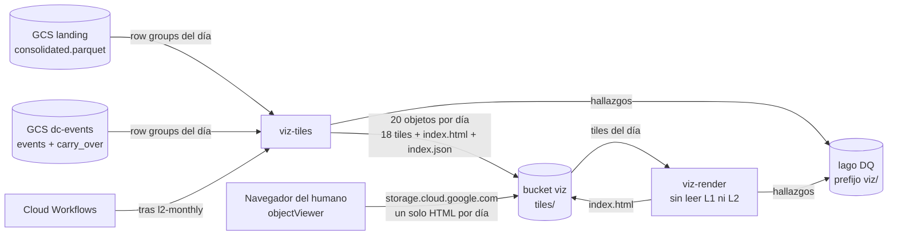

# Documento de Requerimientos Técnicos — Capa de visualización (TRD-viz)

## Tablero de un día con tiles M4 precalculados y uPlot, servido desde un bucket sin servidor

> **Capa transversal de consumo · Arquitectura Medallion · Single-Node Big Data · Google Cloud Platform**

|Campo        |Valor                                                                           |
|-------------|--------------------------------------------------------------------------------|
|Documento    |TRD-viz — Capa transversal de visualización                                     |
|Versión      |**1.2**                                                                         |
|Estado       |Línea base. Fija el contrato de tiles y de la página por día que implementan las hijas 2 a 7 de la Épica E6 (ITSC-303). |
|Fecha        |Octubre de 2026                                                                 |
|Documento padre|TRD maestro v2.5                                                              |
|Alcance      |Capa viz: job de tiles, modo de regeneración de páginas, página HTML autocontenida por día|
|Clasificación|Académico / Uso personal                                                        |
|Contexto     |Trabajo de grado — Maestría en Finanzas · Universidad EAFIT (Medellín, Colombia)|

### Historial de revisiones

|Versión|Fecha|Descripción|
|---|---|---|
|1.0|Oct 2026|Línea base (ITSC-304). Recoge la decisión [Decisión: principios de diseño de la capa de visualización](https://app.notion.com/p/3f027957d23d81b8b12ad2217ffa96fb) (2026-10-05) y fija el contrato de tiles por día: disposición en el bucket, formato binario (tiempo y precio en enteros exactos, dirección de los 50 θ empaquetada por nivel), niveles de zoom con su presupuesto de bytes, regla de estado por columna, procedencia de los eventos de un día e idempotencia. Fija también modos, variables, hallazgos de DQ, costos y observabilidad. Es la fuente única para las hijas 2 a 7: ninguna reabre lo que aquí se fija. |
|1.1|Oct 2026|Corrección de arquitectura (ITSC-305), antes de implementar el contrato. El `price_scale` ya no se elige por día (la mayor potencia de 10 que deja exactos todos los `price_int`): con una escala fina, un solo trade con cinco decimales hacía que el precio no cupiera en `int32` y borraba el día entero de BTCUSDT, lo que contradecía la política de §9.1 (continuar con hallazgo y hueco visible). Ahora es **fijo por activo**, igual al tick de la cotización (100 para BTCUSDT) y declarado en el código; un `price_int` fuera del tick se redondea al tick más cercano (mitad al par) al escribir, sobre acumuladores M4 calculados con el `price_int` crudo, y deja el hallazgo `price_rounded`. El día siempre se escribe; `price_unrepresentable` queda solo como guarda para un precio mayor que `INT32_MAX / price_scale`. Cambian §7.2, §7.3, §8.1, §9.1 a §9.3, RVZ-08, la prueba 2 de §13 y el ítem 10 de §14. |
|1.2|Oct 2026|Corrección de arquitectura (ITSC-308): la entrega ya no es una página que descarga tiles con `fetch` más un zip exportable, sino **un HTML autocontenido por día** que lleva los tiles dentro. La prueba del humano en `storage.cloud.google.com` descartó el `fetch` (Google sirve cada archivo privado desde un dominio bloqueado de un solo uso: §6.5). Cambian §6.5 (con la evidencia), §7.2 (el `index.html` y `latest.html`, los metadatos de cada objeto y `page` en el índice: `tiles_version` 1.1.0), §7.3 (presupuesto de la apertura), §7.8 (criterio del `input_hash`, abajo), §7.9 (el HTML es el exportable: no hay zip), §8.3 (modo `render` en lugar de `export`), §8.4, §9, §10, §11 (sin `site/` ni `exports/`, sin `VIZ_SITE_ROOT` ni `VIZ_EXPORTS_ROOT`), §12, §13 y §14 (ítem 5 cerrado). **Corrección heredada de ITSC-306 (PR #94):** en §7.8 el `input_hash` de un día incluye la cadena de carry-overs desde el día del candidato del `carry_over.parquet` **del propio mes**, no desde el del último carry-over de la cadena. Con el criterio de la 1.1, cuando `M+1` mueve el candidato fuera de `M` el hash de esos días no cambiaba y la cola provisional vieja nunca se rehacía; el código de ITSC-306 ya implementaba el criterio correcto y tiene prueba, y el documento se alinea al código. |

-----

## Cómo leer este documento

Este TRD detalla la **capa viz** y **hereda las invariantes** del TRD maestro, de [TRD-L1](l1.md) y de [TRD-L2](l2.md). No las repite salvo cuando las concreta. El porqué de cada decisión se escribe **una sola vez**, en la sección 6; el resto del documento y las cards de la Épica lo enlazan.

- Si buscas **qué construye viz y con qué garantías** → secciones 4 y 5 (requerimientos).
- Si buscas **por qué uPlot, tiles M4 y bucket sin servidor** → sección 6 (ADR de capa).
- Si buscas **el formato exacto de un tile, sus niveles de zoom o la regla de estado** → sección 7 (contrato de datos).
- Si buscas **los modos, las variables y los nombres de job** → secciones 8 y 11.
- Si buscas **los hallazgos de DQ de viz** → sección 9.
- Si buscas **cuánto cuesta y qué mide cada card** → secciones 10 y 14.
- Si vas a **cambiar la vista** → sección 6.7 (los nueve principios y la Evaluación ergonómica, obligatoria en tu PR).

-----

## Tabla de contenido

1. [Introducción y propósito](#1-introducción-y-propósito)
1. [Invariantes heredadas](#2-invariantes-heredadas)
1. [Alcance de la capa viz](#3-alcance-de-la-capa-viz)
1. [Requerimientos funcionales](#4-requerimientos-funcionales)
1. [Requerimientos no funcionales](#5-requerimientos-no-funcionales)
1. [Decisiones de diseño de viz (ADR de capa)](#6-decisiones-de-diseño-de-viz-adr-de-capa)
1. [Contrato de datos](#7-contrato-de-datos)
1. [Pipeline interno y modos de ejecución](#8-pipeline-interno-y-modos-de-ejecución)
1. [Validaciones y política de calidad de datos](#9-validaciones-y-política-de-calidad-de-datos)
1. [Arquitectura de cómputo, dimensionamiento y costo](#10-arquitectura-de-cómputo-dimensionamiento-y-costo)
1. [Operaciones](#11-operaciones)
1. [Riesgos y mitigaciones](#12-riesgos-y-mitigaciones)
1. [Criterios de aceptación](#13-criterios-de-aceptación)
1. [Ítems abiertos y a validar](#14-ítems-abiertos-y-a-validar)
1. [Anexos](#15-anexos)

-----

## 1. Introducción y propósito

viz es la capa que **muestra** lo que las demás calculan. Sirve para juzgar si el detector y el pipeline están bien, a menudo mientras algo falla. Por eso se diseña como una cabina de pilotos —para decidir rápido y sin error— y no como una vitrina.

El problema técnico es de volumen: un día de BTCUSDT tiene del orden de millones de ticks y, a θ bajo, miles de eventos DC por θ. Ningún navegador pinta eso crudo, y un servidor que lo reduzca en cada interacción pone cómputo en caliente donde no hace falta. viz lo resuelve **una sola vez por día**, en un job: reduce cada día a **tiles** —arreglos binarios planos por nivel de zoom— y los escribe dentro de **un solo HTML** que el navegador abre, decodifica y dibuja. No hay servidor: el HTML de cada día, con uPlot y los tiles dentro, vive en un bucket privado.

Este documento fija, para viz, todo lo que la Épica E6 necesita para repartir el trabajo sin que cada hija invente su propio formato: el contrato de tiles por día (§7), los modos y variables de los jobs (§8, §11), los hallazgos de DQ (§9), los costos y la observabilidad (§10, §11) y la regla de proceso que protege la vista de la deriva (§6.7).

-----

## 2. Invariantes heredadas

viz hereda y no contradice:

- **Región única us-east1** y **presupuesto** ≤ 100 USD/mes (objetivo < 5 USD/mes en estado estacionario). Salvaguarda adicional: presupuesto `intrinsica-mensual` de 5 USD en Facturación, con alertas al 50, 90 y 100 % del costo real (creado por el humano el 2026-10-05).
- **Particionado estilo hive** (`provider=<p>/market=<m>/asset=<a>/…`) en todo lo que viz escribe.
- **Idempotencia** (RF-12 del maestro): re-ejecutar un día con la misma entrada produce los mismos tiles.
- **Mínimo privilegio** (IAM, una service account por modo) e **IaC reproducible** (Terraform). Sin Secret Manager: viz lee y escribe buckets propios del project vía IAM.
- **Una imagen por capa, parametrizada por modo** (RF-15 del maestro): la imagen `viz_tiles` tiene los modos `tiles` y `render`.
- **Hallazgos de DQ** con el esquema unificado y la función compartida `emit_findings()` ([`docs/data-contracts.md`, "Lago de hallazgos de calidad de datos"](../data-contracts.md#lago-de-hallazgos-de-calidad-de-datos)); mismo formato de log que L1 y L2.
- **Contratos de entrada**: el Parquet conformado de L1 ([TRD-L1 §7.2](l1.md#72-salida--parquet-conformado-de-l1-contrato-hacia-l2)) y los `events.parquet` y `carry_over.parquet` de L2 ([TRD-L2 §7.2](l2.md#72-salida--eventsparquet-contrato-hacia-l3) y [§7.4](l2.md#74-carry-over--contrato-y-disposición-física)). viz no pide nada que esos contratos no entreguen.

**Decisiones que no se reabren aquí** (ya fijadas fuera de este documento; viz las hereda como dadas):

|Decisión|Dónde se fijó|Qué fija para viz|
|---|---|---|
|Principios de diseño de la capa de visualización|[Decisión: principios de diseño de la capa de visualización](https://app.notion.com/p/3f027957d23d81b8b12ad2217ffa96fb) (2026-10-05)|Las tres prioridades y su orden, uPlot, tiles M4, solo bucket sin servidor, volumen en barras, los nueve principios y la Evaluación ergonómica obligatoria. La sección 6 las recoge y escribe su porqué una sola vez.|
|Los agentes no despliegan ni ejecutan pipelines|[Decisión: despliegue de stacks de capa por GitHub Actions con WIF](https://app.notion.com/p/3e527957d23d810e9401d9d941d17f83) (2026-09-24)|`terraform.yml` y `run-job.yml` los dispara y aprueba el humano; el stack `data` lo aplica solo el humano desde Cloud Shell. El backfill de tiles lo lanza el humano.|
|Eficiencia de memoria ante todo|[Decisión: eficiencia de memoria ante todo](https://app.notion.com/p/3e727957d23d811887eaf14c886b9a0c) (2026-09-26)|Todo dato en RAM se libera en cuanto se aprovechó; nunca conviven dos representaciones del mismo dato; el pico de una unidad es O(lote), no O(unidad) (§8.1).|
|Hallazgos con el esquema de L1 y L2|[TRD-L1 §7.3](l1.md#73-lago-de-hallazgos-de-calidad-de-datos), [TRD-L2 §9.4](l2.md#94-emisión)|viz agrega `check_type` propios y `layer = "viz"`; no agrega columnas al esquema (§9).|

-----

## 3. Alcance de la capa viz

### 3.1 Dentro de alcance

- **Tiles por día** (§7): precio M4, volumen por cubeta y estado de dirección por θ, en seis niveles de zoom, escritos al prefijo `tiles/` del bucket viz.
- **Job `viz-tiles`**: lee un mes de L1 y los eventos de L2, escribe los tiles de cada día del mes, idempotente por hash de entrada.
- **Página del día**: un `index.html` autocontenido por día (plantilla de `layers/viz_tiles/site/`, uPlot con versión fija y los tiles en base64), que el mismo job escribe junto a los tiles; `tiles/latest.html` es la copia del último día (§7.9). No hay publicación por Terraform.
- **Modo `render`**: vuelve a generar las páginas desde los tiles ya escritos, sin leer L1 ni L2, cuando cambia la plantilla (§8.3).
- **Hallazgos de DQ** propios de viz (§9) y la observabilidad del job (§11).
- **Backfill** de tiles del histórico, lanzado por el humano.

### 3.2 Fuera de alcance (se difiere)

- **Cloud Run service** con autenticación propia (opción B de la decisión). Se abre como card solo cuando aparezca un usuario sin acceso IAM al proyecto; entre tanto, el HTML del día, que es un solo archivo y abre desde disco, cubre al asesor.
- **Más de un día en pantalla**, comparación de días o de símbolos, y Capas 3 y 4 en el tablero. Si aparece un segundo usuario con otra necesidad, se revisa la arquitectura de tiles antes de agregar paneles (§6.1, "Cuándo reabrir").
- **Telemetría o logging desde el navegador.**
- **Multi-activo real**: el diseño no lo impide (partición por `asset`), pero `tiles/latest.json` es mono-activo (§7.7).
- **Consumo de los lagos de DQ y meta-métricas** (BigQuery externo): sigue diferido (maestro §8.4); no es el tablero de datos de esta capa.

-----

## 4. Requerimientos funcionales

*Prioridad MoSCoW: M (Must), S (Should), C (Could).*

|ID       |Nombre                         |Descripción                                                                                                                                  |Prio.|
|---------|--------------------------------|----------------------------------------------------------------------------------------------------------------------------------------------|-----|
|RF-VZ-01 |Tile de precio M4               |Por día y nivel de zoom, los cuatro puntos M4 (primero, mínimo, máximo, último) de cada columna, independientes de θ, con tiempo y precio en **enteros** (el precio en unidades del tick, §7.3).|M    |
|RF-VZ-02 |Tile de volumen                 |Por día y nivel, la suma de `quantity` de cada columna (§7.3).                                                                                   |M    |
|RF-VZ-03 |Tile de dirección por nivel     |Por día y nivel, un archivo con un bloque por θ y un byte por columna con cuatro estados (confirmación alza, overshoot alza, confirmación baja, overshoot baja) y 0 sin evento (§7.4, §7.5).|M    |
|RF-VZ-04 |Índice y marca de commit        |`index.json` por día, escrito al final: su presencia significa que el día está completo (§7.2, §7.8).                                            |M    |
|RF-VZ-05 |Puntero al último día           |`tiles/latest.json` apunta al último día con tiles completos y `tiles/latest.html` es la copia de su página (§7.7).                                |M    |
|RF-VZ-06 |Cola provisional explícita      |Un día cuyo último evento aún no se cierra se escribe igual, con la cola marcada como provisional, y se corrige cuando L2 cierra el evento (§7.6).|M    |
|RF-VZ-07 |Idempotencia por hash de entrada|Un día se regenera solo si cambió el hash de sus archivos de entrada o la versión del formato; `--force` lo ignora (§7.8).                      |M    |
|RF-VZ-08 |Modo `tiles`                    |Por defecto el mes anterior (UTC); `--day`, o `--from` y `--to` por meses; `--force` (§8.2).                                                    |M    |
|RF-VZ-09 |Modo `render`                   |`--day`, o `--from` y `--to`, vuelve a generar el `index.html` de los días pedidos desde sus tiles, sin leer L1 ni L2 (§8.3).                      |M    |
|RF-VZ-10 |Hallazgos de DQ                 |Emitir al lago de DQ con `layer = "viz"` y el día en `details.day` (§9).                                                                          |M    |
|RF-VZ-11 |Modo degradado visible          |Un tile o un día faltante se ve en pantalla como hueco con marcador y texto; nunca se interpola ni se rellena en silencio (principio 6, §6.7).    |M    |
|RF-VZ-12 |Evaluación ergonómica           |Todo PR que cambie la vista rediseña la vista completa e incluye la sección "Evaluación ergonómica" (§6.7).                                      |M    |
|RF-VZ-13 |Encadenamiento tras L2          |Al terminar `l2-monthly`, Cloud Workflows lanza `viz-tiles` sin intervención (hija 5).                                                          |S    |
|RF-VZ-14 |Backfill de tiles               |El humano lanza el histórico desde `run-job.yml`, por rangos de meses (§8.2, §10.3).                                                             |S    |
|RF-VZ-15 |Primera vista                   |Precio crudo del último día disponible con regiones DC de dos tonos por θ, filtro de θ, tooltip de cubeta y volumen en barras con eje X y cursor compartidos (§6.6).|M    |

-----

## 5. Requerimientos no funcionales

|ID        |Atributo                  |Requerimiento                                                                                                                                       |Prio.|
|----------|---------------------------|-----------------------------------------------------------------------------------------------------------------------------------------------------|-----|
|RNF-VZ-01 |Eficiencia (prioridad 1)   |Ningún cálculo en el momento de la interacción; nada en RAM que ya se aprovechó; nada se transfiere al navegador que no se vaya a dibujar.            |M    |
|RNF-VZ-02 |Presupuesto de bytes       |Abrir un día transfiere un solo documento, el HTML en gzip, de menos de 1 MB (incluye plantilla, uPlot y los tiles); el primer trazo sale en menos de 500 ms en red doméstica; cambiar θ responde en menos de 100 ms **sin ninguna petición de red**: la dirección de los 50 θ ya está en la página (§7.3, §7.4).|M    |
|RNF-VZ-03 |Ergonomía (prioridad 2)    |La vista cumple los nueve principios de §6.7.                                                                                                        |M    |
|RNF-VZ-04 |Eficiencia de memoria      |Pico de una unidad de trabajo O(lote): un row group de L1 más acumuladores de tamaño fijo (O(columnas del nivel más fino)); nunca el día ni el mes enteros (§8.1).|M    |
|RNF-VZ-05 |Determinismo               |Misma entrada y misma `tiles_version` producen los mismos bytes en cada archivo de tile (el `index.json` lleva `generated_at` y queda fuera; la página lo lleva dentro).|M    |
|RNF-VZ-06 |Costo fijo cero            |Sin servidor siempre encendido, sin base propia: el costo es almacenamiento más el cómputo de los jobs, dentro del presupuesto de §10.                |M    |
|RNF-VZ-07 |Regenerable                |Los tiles se regeneran desde L1 y L2 en cualquier momento; no son fuente de verdad.                                                                 |M    |
|RNF-VZ-08 |Acoplamiento débil         |viz se comunica con L1 y L2 solo por sus contratos Parquet (§7.1) y con el navegador solo por la página de §7.9.                                  |M    |
|RNF-VZ-09 |Sin terceros ni red        |La página no hace ninguna petición después de cargar: uPlot y los tiles van dentro del documento, sin CDN, sin fuentes externas, sin `fetch`.         |M    |
|RNF-VZ-10 |Mínimo privilegio          |viz escribe solo en su bucket y en el lago de DQ (prefijo `viz/`); nunca toca `landing`, `dc-events` ni `manifest`.                                 |M    |

-----

## 6. Decisiones de diseño de viz (ADR de capa)

*Cada decisión hereda las invariantes del maestro y concreta la entrada de Documentación enlazada en §2. Las filas "Alternativas descartadas" son las de esa entrada.*

### 6.1 ADR-VZ-01 — Existe una capa transversal de consumo visual

|Campo|Contenido|
|---|---|
|**Decisión**|viz no es una capa Medallion más: **lee** de Silver y Gold, **no escribe en el lago** y **no es insumo de ningún otro proceso**. En el maestro entra en §3.1 como fila nueva de tipo "consumo" (ADR-09).|
|**Justificación**|Las cuatro capas Medallion suben la calidad del dato y cada una alimenta a la siguiente. viz no hace ninguna de las dos cosas: es una hoja del grafo. Tratarla como capa 5 la ataría al orden L1→L4 y haría que su retraso bloqueara a otras; como consumo transversal, E5 (Capa 3) no la bloquea ni ella a E5.|
|**Cuándo reabrir**|Si aparece un segundo usuario con otra necesidad (p. ej. comparar días o símbolos lado a lado), se revisa la arquitectura de tiles antes de agregar paneles.|

### 6.2 ADR-VZ-02 — Tres prioridades, en este orden; el orden rompe empates

|Campo|Contenido|
|---|---|
|**Decisión**|(1) **Eficiencia**: ningún cálculo en el momento de la interacción, nada en RAM que ya se aprovechó, nada se transfiere al navegador que no se vaya a dibujar. (2) **Ergonomía de monitoreo bajo estrés**: el tablero se diseña como una cabina de pilotos. (3) **Look and feel**: solo lo que sobrevive a las dos anteriores.|
|**Justificación**|El tablero juzga si el detector y el pipeline están bien, a menudo mientras algo falla. Las normas de aviación existen porque un operador bajo estrés lee mal un color aislado, pierde el contexto si la escala salta y se equivoca si tiene que confirmar un diálogo. La estética va última porque es lo único que se puede perder sin perder la función.|

### 6.3 ADR-VZ-03 — Motor de gráficos: uPlot

|Campo|Contenido|
|---|---|
|**Decisión**|uPlot: librería de canvas de ~45 KB, sin dependencias, la que usa Grafana para series de tiempo. Se empaqueta en el repo con versión fija.|
|**Justificación**|Dibuja cientos de miles de puntos en milisegundos y su tamaño no pesa en el presupuesto de bytes (§7.3). Es el motor de dibujo de Grafana sin el servidor, la base y la pluginería que lo rodean.|
|**Cuándo reabrir**|Si uPlot no soporta una representación necesaria (p. ej. regiones con degradado), se evalúa un plugin propio antes de cambiar de motor.|

### 6.4 ADR-VZ-04 — Tiles M4 precalculados, un job por día

|Campo|Contenido|
|---|---|
|**Decisión**|Un job `viz-tiles`, encadenado tras `l2-monthly`, reduce cada día a tiles por nivel de zoom con **M4** (Jugel et al., 2014): por cada columna de píxeles se conservan el primer, el último, el mínimo y el máximo precio. Por nivel, tres tiles: precio (independiente de θ), volumen por cubeta y dirección, que **empaqueta los 50 θ** en un solo archivo. El navegador solo descarga y pinta.|
|**Justificación — por qué M4**|M4 garantiza que la imagen a resolución de píxel es idéntica a la de la serie completa con cuatro puntos por columna. El costo se paga una vez, en el job, no en cada apertura.|
|**Justificación — por qué el precio no depende de θ**|Los 50 θ comparten la misma serie de precio: un tile de precio por nivel y no 50. Cambiar θ nunca vuelve a bajar el precio (invariante de la Épica).|
|**Justificación — por qué la dirección va empaquetada por nivel y no un archivo por θ**|Con un archivo por θ un día son 313 objetos; empaquetado, 19. (1) **Costo**: las escrituras son operaciones Clase A, una por objeto; el backfill pasa de 1,03 M operaciones (≈ 5,2 USD, al tope del presupuesto de 5 USD) a 63 k (≈ 0,3 USD) (§10.3). (2) **Interacción**: cambiar θ no hace **ninguna** petición, porque los 50 θ del nivel ya están en memoria; es la lectura literal de la decisión ("sin red adicional"), sin caché que pueda fallar. (3) **Lo que cuesta**: la apertura típica pasa de ≈ 0,30 MB a ≈ 0,60 MB, bajo el límite de 1 MB, y el techo absoluto (el día entero) no cambia (§7.3). La dirección de los 50 θ no es una precarga especulativa: el filtro de θ es parte de la vista del día y sus bloques son lo que dibuja al moverlo; la prioridad 1 pide no transferir lo que no se dibuja, y esto se dibuja con un clic, sin red.|
|**Justificación — por qué por día**|El día es la unidad de la vista (un día en pantalla) y la de la regeneración: un día es independiente de los demás, a diferencia de los meses de L2, que se encadenan por carry-over. Los días se pueden generar en cualquier orden y en paralelo.|

### 6.5 ADR-VZ-05 — Entrega: solo bucket, sin servidor

|Campo|Contenido|
|---|---|
|**Decisión**|El navegador recibe **un solo documento por día**: `index.html`, con la plantilla, uPlot y los 18 arreglos del día (base64, bajo su nombre, en `window.VIZ_DATA`) dentro (§7.9). Lo escribe el job `viz-tiles` junto a los tiles del día y copia el del último día a `tiles/latest.html`; `viz-render` lo regenera cuando cambia la plantilla. Vive en el bucket privado declarado en el stack `data` y se abre por `storage.cloud.google.com/<bucket>/tiles/latest.html` (o el `index.html` de un día): Google pide iniciar sesión y sirve el documento si la cuenta tiene `objectViewer`. Costo fijo cero, ninguna superficie de autenticación propia, **ninguna publicación por Terraform** y ninguna petición de red después de la carga.|
|**Evidencia (prueba del humano, 2026-10-05)**|Se probó la versión anterior, una página que descargaba sus tiles con `fetch`, abierta desde `storage.cloud.google.com`. Google sirve cada archivo privado desde un **dominio bloqueado de un solo uso** (`<hash>-apidata.googleusercontent.com`, con un token `jk` en la URL): una petición relativa a ese documento recibe «Bad Locked Domain» y una absoluta a otro origen la bloquea el navegador por CORS. El inicio de sesión de Google sirve **un documento completo por URL, no sus recursos**. De ahí la decisión: todo lo que la página necesita viaja dentro del documento. Registrada en la card ITSC-308 y en el punto 5 de la decisión de diseño de viz.|
|**Justificación**|La prioridad 1 es eficiencia, y la pieza más eficiente es la que no se construye. Un servicio de Cloud Run con validación de Google Sign-In agrega imagen, stack, autenticación propia y logs para un problema que no existe con un solo usuario; y un sitio estático con tiles aparte exige un origen que sirva recursos, que es justo lo que `storage.cloud.google.com` no entrega. Con los datos dentro, abrir un día es **una petición** y cambiar θ, **ninguna**; el mismo archivo abre desde disco (`file://`), desde un servidor estático o adjunto en un correo.|
|**Costo asumido**|El base64 infla 33 % (los arreglos de un día, ≈ 0,70 MB, pasan a ≈ 0,93 MB) y el documento lleva los seis niveles aunque la primera vista decodifique uno. Con `Content-Encoding: gzip` en el objeto el día viaja en una fracción (los bloques de dirección se comprimen casi a nada; medición en §7.3), de modo que **el presupuesto de 1 MB ahora sí depende del gzip** (§7.3, §14 ítem 4). Los binarios siguen escritos junto a la página (los usa `render` y sirven de auditoría): el almacenamiento del día crece con ella (§7.3, §14 ítem 11).|
|**Opción B**|Cloud Run service con validación de Google Sign-In. Se abre como card solo cuando aparezca un usuario sin acceso IAM al proyecto; mientras tanto, el HTML del día cubre al asesor (es un archivo que se descarga y abre).|
|**Alternativas descartadas**|**Página que descarga tiles con `fetch` desde el bucket (versión previa de ITSC-308)**: descartada por la evidencia de arriba. **Zip exportable (`viz-export`, versión 1.0 y 1.1 de este documento)**: ya no hace falta, el HTML es el exportable (§7.9). **Cloud Run service para servir el tablero (hoy)**: ver la justificación. **Looker Studio**: conecta a BigQuery, no a Parquet en bucket; obligaría a una copia del dato y rompe la prioridad 1. **Grafana**: servidor siempre encendido, base propia y pluginería para Parquet; uPlot es su motor sin el resto. **Streamlit, Dash, Panel**: cada interacción vuelve al servidor Python, con latencia de cientos de ms y cómputo en caliente, contrario a la prioridad 1 y al principio 8. **Plotly**: dibuja en SVG/WebGL con un bundle de más de 3 MB; con cientos de miles de puntos el navegador se arrastra. **Stack del legacy (HoloViews, Bokeh, Datashader, Panel)**: resolvía el volumen con rasterización en servidor; aquí el volumen se resuelve una vez, en el job de tiles, y el servidor desaparece.|

### 6.6 ADR-VZ-06 — Volumen como barras en un panel inferior, nunca como tamaño de punto

|Campo|Contenido|
|---|---|
|**Decisión**|El volumen es un panel inferior de barras (20 a 25 % de la altura), con eje X y cursor compartidos con el precio.|
|**Justificación**|Cleveland y McGill (1984) muestran que el ojo compara longitudes alineadas con precisión y áreas con error sistemático; además, una burbuja gruesa tapa el precio que está debajo.|
|**Primera vista acordada**|Serie cruda de precio contra tiempo del último día disponible. Regiones verticales de fondo por evento DC, en dos tonos: claro para la fase de confirmación y fuerte para el overshoot; verde para alza, rojo para baja. Filtro de θ que cambia solo el tile de dirección. Tooltip sobre la cubeta: hora, mínimo y máximo del cubo M4, estado DC. Volumen como panel inferior.|

### 6.7 ADR-VZ-07 — Nueve principios de ergonomía y Evaluación ergonómica obligatoria

|Campo|Contenido|
|---|---|
|**Decisión**|Todo cambio visual se revisa contra los nueve principios, tomados de FAA HF-STD-001, SAE ARP4102/7, EASA CS-25.1302 y la filosofía de cabina oscura y silenciosa (*dark and quiet cockpit*). Cada card que cambie la vista rediseña la vista completa y su PR trae la sección "Evaluación ergonómica".|
|**Justificación**|Exigir el rediseño completo en cada incremento evita la deriva típica de los tableros: paneles que se acumulan hasta que nadie mira ninguno.|

|#|Principio|Qué significa en el tablero|
|---|---|---|
|1|Cabina oscura|Fondo oscuro de bajo brillo; lo normal no llama la atención; solo lo anómalo resalta.|
|2|El color nunca va solo|Todo estado codificado por color lleva también forma, posición o texto. Rojo y verde quedan reservados a la dirección DC; las alertas van en ámbar con texto.|
|3|Franja de estado fija|Una barra siempre visible con fecha del día, θ activo, última actualización y modo (normal o degradado). Nunca se desplaza ni se oculta.|
|4|Eje X y cursor compartidos|Todos los paneles alineados al mismo tiempo; el cursor se mueve en todos a la vez.|
|5|Escalas estables|El eje Y no salta al cambiar θ ni al mover el cursor; cambia solo con zoom explícito del usuario.|
|6|Modo degradado visible|Si falta un tile o un día no llegó, se muestra el hueco con un marcador y texto; nunca se interpola ni se rellena en silencio.|
|7|Numerales tabulares monoespaciados|Cifras alineadas, contraste mínimo 7:1, tamaño mínimo 12 px.|
|8|Interacción menor a 100 ms y reversible|Toda acción responde antes de 100 ms y se deshace con una acción; sin confirmaciones modales.|
|9|Menos es más|Cada elemento justifica su lugar; un incremento que agrega sin quitar es sospechoso.|

**Regla de proceso: Evaluación ergonómica obligatoria.** El PR de toda card que agregue, mueva o quite un elemento de la vista incluye una sección "Evaluación ergonómica" con cuatro partes:

1. Captura o descripción de la **vista completa** resultante.
2. Revisión contra los nueve principios, con lo que se **quitó** para hacer lugar.
3. **Métricas de eficiencia antes y después**: bytes transferidos por día cargado, tiempo hasta el primer trazo y tiempo de respuesta al cambiar θ.
4. **Veredicto**: qué prioridad ganó cuando hubo conflicto y por qué.

`pr-review` rechaza el PR si la sección falta o si una métrica empeora sin justificación escrita.

### 6.8 ADR-VZ-08 — Seis niveles de zoom de 128 a 4 096 columnas por día

|Campo|Contenido|
|---|---|
|**Decisión**|El ancho `w` de un nivel es el **número de columnas en que se divide el día UTC completo**. Los niveles son `w ∈ {128, 256, 512, 1024, 2048, 4096}`: potencias de 2, de la columna más gruesa (675 s) a la más fina (21,09 s). Detalle y presupuesto en §7.3.|
|**Por qué potencias de 2**|Dos razones. (1) Todo `w ≤ 8192` divide el día (86 400 000 000 µs) en columnas de duración **entera** en µs, así que la columna de un tick se calcula con enteros, sin redondeo. (2) M4 es **componible**: el primero de una columna gruesa es el primero de su primera columna fina **no vacía**, el último es el último de la última **no vacía** de las dos, y el mínimo y el máximo son el mínimo de mínimos y el máximo de máximos, que **ignoran las columnas vacías**. Si las dos están vacías, la gruesa también. Basta recorrer los ticks una vez, a `w = 4096`, y derivar los demás niveles de ese, sin releer ni guardar ticks (§8.1).|
|**Por qué 4 096 como techo**|El ancho útil del gráfico en un monitor de escritorio es del orden de 1 500 px: `w = 2048` cubre el día completo con una columna por píxel o menos, y `w = 4096` deja ~2,7 veces de zoom antes de que una columna pase de un píxel. Los niveles de 128 a 1 024 sirven al primer trazo (11 KB) y a pantallas angostas. El techo lo fija el almacenamiento: cada duplicación del nivel más fino suma ~0,70 MB por día y duplica el total (tabla de §10.1).|
|**Consecuencia asumida**|La resolución máxima es una columna de 21,09 s. Un evento DC de θ muy pequeño que dure menos que eso no se distingue en pantalla: la vista de un día sirve para juzgar el detector y el pipeline, no para auditar un tick. Si esa resolución no alcanza, la salida es un nivel más fino (con su costo) o un tile por rango horario; ambas se evalúan antes de agregar paneles (§14 ítem 8).|

### 6.9 ADR-VZ-09 — Estado de una columna: el del último tick de la cubeta

|Campo|Contenido|
|---|---|
|**Decisión**|El estado DC de una columna es el que tiene **el último tick de la cubeta**. Una columna sin ticks tiene estado 0 y su precio es el sentinela de vacío (§7.3, §7.5). El estado de un tick se decide por su `agg_trade_id` contra los intervalos de los eventos (§7.5).|
|**Justificación — último tick**|El estado es una propiedad del instante, no de un intervalo. De los cuatro puntos M4, el último es el que cierra la columna; usar su estado deja el tile de dirección alineado con el de precio y evita decidir qué hacer cuando la cubeta cruza una frontera de fase. El costo es que una frontera de fase dentro de una columna se atribuye entera a la fase del último tick: un error de a lo sumo una columna (21,09 s en el nivel más fino).|
|**Justificación — `agg_trade_id` y no tiempo**|Varios ticks comparten `transact_time`, pero `agg_trade_id` es estrictamente creciente (contrato de L1) y cada punto de un evento de L2 lo lleva. Compararlo con ids evita el caso del extremo que comparte instante con un tick posterior.|
|**Justificación — no rellenar columnas vacías**|Una columna sin ticks podría heredar el estado vecino, pero sería inventar un dato (principio 6). Se escribe 0 y la columna se ve como hueco.|

### 6.10 ADR-VZ-10 — `index.json` al final como marca de commit; idempotencia por hash de entrada

|Campo|Contenido|
|---|---|
|**Decisión**|Un día se escribe en este orden: se borra su `index.json` si existía, se escriben los archivos de tile y **al final** se escribe el `index.json`. El `index.json` es la marca de commit: un día sin él no existe para el tablero. Cada día lleva en su índice el `input_hash` de sus archivos de entrada y la `tiles_version`; si ambos coinciden con los calculados, el día se salta (§7.8).|
|**Justificación**|Cada objeto de GCS se publica entero o no se publica, pero un día son 20 objetos y no hay transacción entre ellos. L2 resolvió el mismo problema con la escritura atómica (temporal más `commit`) y el orden "primero eventos, luego carry-over". Aquí el índice es el último escrito: un lector que lo ve sabe que todos los tiles que lista ya están. Un tile no necesita su propio temporal más renombre: ahorra una operación Clase A por objeto (§10.3). Si el job muere a medias, el día queda sin índice (visible como degradado) y la siguiente corrida lo rehace.|

-----

## 7. Contrato de datos

### 7.1 Entradas

viz **solo lee** archivos de L1 y L2 que ya son inmutables o están completos:

|Entrada|Archivo|Qué usa viz|
|---|---|---|
|L1|`consolidated.parquet` del mes ([TRD-L1 §7.2](l1.md#72-salida--parquet-conformado-de-l1-contrato-hacia-l2))|`agg_trade_id`, `transact_time` (µs UTC), `price` (`DECIMAL(18,8)`), `quantity` (`DECIMAL(18,8)`). Nunca provisionales: L2 tampoco los consume ([ADR-L2-09](l2.md#69-adr-l2-09--l2-solo-consume-consolidatedparquet-nunca-los-provisionales-diarios-de-l1)) y un día sin eventos no tiene regiones que dibujar.|
|L2|`events.parquet` por θ y mes ([TRD-L2 §7.2](l2.md#72-salida--eventsparquet-contrato-hacia-l3))|Por evento: `reference_agg_trade_id`, `confirm_agg_trade_id`, `extreme_agg_trade_id` y `direction`.|
|L2|`carry_over.parquet` por θ y mes ([TRD-L2 §7.4](l2.md#74-carry-over--contrato-y-disposición-física))|Para la cola provisional y para seguir la cadena de un pendiente de varios meses (§7.6): `has_pending_event`, `pending_reference_agg_trade_id`, `pending_confirm_agg_trade_id`, `direction` y el extremo vigente (`ext_high_*` o `ext_low_*`).|

El **último día disponible** es el último día del último mes consolidado en L1 y cerrado por L2. Los tiles se generan por día, pero el disparo es mensual, tras `l2-monthly`. El día es UTC, como los archivos de Binance.

### 7.2 Disposición en el bucket

Raíz: `VIZ_TILES_ROOT` (§11), es decir `gs://<bucket viz>/tiles`. Un día:

```
tiles/provider=<p>/market=<m>/asset=<a>/day=YYYY-MM-DD/
├── price-<w>.i32                  # 6 archivos: w = 128 … 4096
├── volume-<w>.f32                 # 6 archivos
├── dir-<w>.u8                     # 6 archivos: los θ del día empaquetados, en el orden de index.json
├── index.html                     # la página del día: plantilla, uPlot y los 18 arreglos (§7.9)
└── index.json                     # se escribe al final: marca de commit
tiles/latest.json                  # último día con index.json
tiles/latest.html                  # copia de la página de ese día
```

Un día completo son **20 objetos** (6 + 6 + 6 + 2): **≈ 0,70 MB** de arreglos más la página (§7.3 trae el tamaño). Los θ son los del catálogo que L2 tenía en ese mes ([TRD-L2 §7.3](l2.md#73-el-catálogo-de-θ)); su orden dentro de `dir-<w>.u8` es el de `thetas` en el índice (§7.4).

**Metadatos de cada objeto**, fijados al escribirlo (`write_day`): los binarios, `Content-Type: application/octet-stream` y `Cache-Control: private, max-age=31536000, immutable`; `index.json` y `latest.json`, `application/json` y `Cache-Control: no-cache`; las páginas (`index.html`, `latest.html`), `text/html; charset=utf-8`, `Content-Encoding: gzip` y `Cache-Control: no-cache`. En disco local los metadatos no existen y la página se escribe **sin comprimir**, para que abra por `file://`. Nadie descarga los binarios desde el navegador (la página los lleva dentro): ya no hace falta el parámetro `?h=` de la versión 1.1, y un día regenerado cambia el contenido de `index.html`, que se revalida en cada apertura (`no-cache`).

El `index.html` se escribe **antes** del `index.json` (§7.8): un índice implica su página.

**`index.json`** (ejemplo; todos los campos son obligatorios):

```json
{
  "tiles_version": "1.1.0",
  "provider": "binance", "market": "spot", "asset": "BTCUSDT",
  "day": "2026-08-31",
  "t0": 1788134400000000,
  "price_scale": 100,
  "ticks": 1234567,
  "levels": [128, 256, 512, 1024, 2048, 4096],
  "price": {"128": "price-128.i32", "…": "…", "4096": "price-4096.i32"},
  "volume": {"128": "volume-128.f32", "…": "…", "4096": "volume-4096.f32"},
  "dir": {"128": "dir-128.u8", "…": "…", "4096": "dir-4096.u8"},
  "page": "index.html",
  "thetas": [
    {"theta": "0.00010000", "events": 11873, "provisional_from_s": null},
    {"theta": "0.05000000", "events": 4, "provisional_from_s": 41234.5}
  ],
  "missing_thetas": [],
  "input_hash": "9f2c…(sha256 en hex)",
  "content_hash": "b71e…(sha256 en hex)",
  "generated_at": "2026-10-05T17:00:00Z",
  "image_version": "0.1.0+3a9b2c1"
}
```

|Campo|Significado|
|---|---|
|`tiles_version`|semver del **formato** de los tiles y del índice (no la de la imagen). Cambia con cualquier modificación de §7.2 a §7.5 (la 1.1.0 agregó `page`); la página rechaza (modo degradado) una versión mayor que no conoce.|
|`t0`|Inicio del día UTC en µs desde la época: el origen del tiempo relativo de los tiles.|
|`price_scale`|Unidades de precio del tile por unidad de la cotización: el precio en USDT es `p / price_scale`. **Fijo por activo**, igual al tick de la cotización: 100 para BTCUSDT (tick de 0,01). Nunca se elige por día (§7.3).|
|`input_hash`|Huella de los archivos de entrada (§7.8).|
|`content_hash`|SHA-256 de los arreglos: por cada archivo en orden de nombre, el nombre, un byte nulo y sus bytes. No depende de `generated_at`: dos corridas con las mismas entradas lo repiten.|
|`generated_at`|Momento de generación (UTC). Alimenta "última actualización" de la franja de estado (principio 3). Es lo único del índice que cambia entre dos corridas idénticas; `render` lo conserva (no es la hora de la regeneración de la página).|
|`ticks`|Ticks del día en L1.|
|`levels`|Los `w` presentes. El tablero no asume la lista: lee esta.|
|`price`, `volume`, `dir`|Nombre del archivo de cada tipo por nivel: `{"128": "price-128.i32", …}`.|
|`page`|Nombre de la página autocontenida del día, `index.html` (§7.9).|
|`thetas`|Los θ con bloque en `dir-<w>.u8`, en el orden de los bloques: el θ en la posición `k` ocupa los bytes `k·w` a `(k+1)·w − 1` (§7.4). `theta` es el mismo texto de ancho fijo que la partición de L2 (`"0." + 8 decimales`), ordenado de menor a mayor.|
|`thetas[].events`|Filas de eventos que tocan el día, incluida la cola pendiente si la hay.|
|`thetas[].provisional_from_s`|Segundos desde el inicio del día a partir de los cuales el estado de ese θ es provisional hasta el final del día; `null` si todo el día es definitivo (§7.6).|
|`missing_thetas`|θ del catálogo sin entrada completa en L2 ese mes; no tienen bloque en `dir-<w>.u8` (§9.3). El tablero los muestra como hueco.|

### 7.3 Tiles de precio y volumen; niveles de zoom y presupuesto

**Columna de un tick.** Con `rel_us = transact_time − t0` y `col = floor(rel_us × w / 86 400 000 000)`, en enteros. Un tick cae en una sola columna de cada nivel.

**`price-<w>.i32`**: binario sin cabecera, enteros little-endian, **dos bloques consecutivos** de `4w` valores:

|Bloque|Offset (bytes)|Contenido|
|---|---|---|
|Tiempo|`0`|`t[i]`: milisegundos desde `t0`, `uint32`: `floor(rel_us / 1000)`.|
|Precio|`16w`|`p[i]`: precio en unidades de `1 / price_scale` USDT, `int32`: `price_int / (10⁸ / price_scale)` redondeado al entero más cercano, mitad al par (exacto si el precio cae en el tick).|

Los puntos `i = 4·col + k` (`k = 0..3`) son los cuatro puntos M4 de la columna `col`, **en orden de tiempo**: el primer tick, el mínimo, el máximo y el último, con el mínimo y el máximo ordenados por su posición en la serie. Si dos puntos coinciden (p. ej. el primero es el mínimo), se repiten: el paso es fijo, 4 puntos por columna. Ante empates de precio dentro de la columna se toma el tick con menor `agg_trade_id`. Una columna **sin ticks** lleva en sus cuatro `t` el **inicio de la columna** (`floor(col × 86 400 000 / w)` ms, en enteros) y el sentinela **`INT32_MIN`** (−2 147 483 648) solo en sus cuatro `p`: así `t` es no decreciente en todo el tile (el `floor` conserva el orden: ningún tick de la columna es anterior a su inicio), que es lo que exige un eje X de uPlot y su búsqueda binaria del cursor.

*Por qué enteros y no `float32` (decisión):* el tablero existe para juzgar al detector, y el principio 7 pide numerales exactos. Con `float32` la resolución del precio es 0,0078 USDT hasta 131 072 USDT y 0,0156 por encima, más gruesa que el tick de 0,01 de BTCUSDT: el tooltip mostraría mínimos y máximos que nunca se negociaron. Con `int32` en unidades de `1 / price_scale` el precio es el de L1 en el tick, sin la pérdida del `float32`, hasta 21 474 836,47 USDT con `price_scale = 100`. El tiempo en `uint32` ms llega a 86 400 000 (cabe con holgura) y es exacto para los datos de Binance anteriores a 2025, que vienen en ms; desde 2025-01-01 vienen en µs ([ADR-L1-02](l1.md#62-adr-l1-02--normalización-temporal-a-microsegundos-por-magnitud)) y se truncan al ms (error < 1 ms), frente a los 3,9 ms de error de `float32` al final del día. Los bytes son los mismos: 4 por valor.

*Cómo se fija `price_scale` (decisión, v1.1):* es **fijo por activo**, igual al tick de la cotización (100 para BTCUSDT), declarado en el código (`PRICE_SCALE_BY_ASSET`) y escrito en `index.json`. Nunca se elige por día. La v1.0 lo elegía por día como la mayor potencia de 10 que dejaba exactos todos los `price_int`, y no escribía el día si el precio no cabía en `int32` con esa escala. Eso era frágil: el tickSize no acota los trades históricos ([ADR-L1-03](l1.md#63-adr-l1-03--precio-y-cantidad-como-decimal-exacto)), y con escala 10⁵ el máximo representable es 21 474 USDT, así que un solo trade con cinco decimales borraba la visualización de un día entero de BTCUSDT, en contra de §9.1. Con la escala fija el máximo es 21 474 836,47 USDT y el día siempre se escribe.

*Qué pasa con un precio fuera del tick:* los acumuladores M4 (primero, mínimo, máximo, último) se calculan sobre el `price_int` **crudo** (×10⁸), y el resultado se redondea **una sola vez**, al escribir, al tick más cercano (mitad al par). Redondear antes de acumular podría cambiar qué tick es el mínimo o el máximo; al final, el redondeo es monótono y conserva el orden `mínimo ≤ primero, último ≤ máximo`. El job cuenta, con memoria fija, los ticks del día fuera del tick y la mayor distancia de uno a su tick más cercano, y emite el hallazgo `price_rounded` (§9.3): el tooltip puede mostrar un precio que no se negoció al céntimo, pero el hallazgo lo hace visible y medible, y nunca ocurre en silencio. `price_unrepresentable` queda solo como guarda: un precio mayor que `INT32_MAX / price_scale` (§9.3).

*Por qué dos bloques y no pares intercalados:* el tiempo y el precio de cada punto quedan alineados por índice (`t[i]`, `p[i]`) y el navegador lee cada bloque con `new Uint32Array(buffer, 0, 4w)` y `new Int32Array(buffer, 16w, 4w)`, sin copiarlos para separarlos. Al cargar, la vista hace **una sola pasada** sobre los `4w` ≤ 16 384 puntos, microsegundos frente a los 100 ms del principio 8, y en ella hace las dos conversiones que uPlot necesita: arma X (`t[i] / 1000`, segundos exactos al ms) y Y (`p[i] / price_scale`, o `null` donde `p[i]` es el sentinela: uPlot marca los huecos con `null` y canvas uniría los puntos vecinos de un valor no finito). Luego suelta el `ArrayBuffer` descargado. Tras la carga cada dato vive una sola vez (en X y en Y), como exige la invariante de §2; solo durante la pasada conviven el buffer y sus dos derivados, un pico de `4w` valores y no de día. El tooltip formatea el precio con `log10(price_scale)` decimales: el numeral que muestra es exactamente el negociado.

**`volume-<w>.f32`**: `w` valores `float32` IEEE-754 little-endian, la **suma de `quantity`** de los ticks de cada columna, en la unidad base (BTC). La suma se hace en enteros de escala `10⁸` y se convierte al final. Queda en `float32` porque es una magnitud de barra, que se lee por su longitud y no al centavo. Una columna sin ticks vale 0; que está vacía lo dice el precio (sentinela).

**Niveles de zoom y bytes** (la dirección con los 50 θ empaquetados, §7.4):

|`w`|Duración de columna|`price`|`volume`|`dir` (50 θ)|Total por nivel|
|---|---|---|---|---|---|
|128|675 s|4 096 B|512 B|6 400 B|11 008 B|
|256|337,5 s|8 192 B|1 024 B|12 800 B|22 016 B|
|512|168,75 s|16 384 B|2 048 B|25 600 B|44 032 B|
|1 024|84,38 s|32 768 B|4 096 B|51 200 B|88 064 B|
|2 048|42,19 s|65 536 B|8 192 B|102 400 B|176 128 B|
|4 096|21,09 s|131 072 B|16 384 B|204 800 B|352 256 B|
|**Suma**||258 048 B|32 256 B|403 200 B|693 504 B|

**Presupuesto por apertura (< 1 MB).** Costo por columna: 32 B de precio (4 puntos × (4 B de tiempo + 4 B de precio)) + 4 B de volumen + 50 B de dirección (1 B por θ). La página lleva el día entero, así que abrir un día es **una sola petición**: el `index.html`.

|Concepto|Bytes|Base|
|---|---|---|
|Arreglos del día (6 niveles, 50 θ)|693 504 B|tabla de arriba|
|En base64 (+ 33 %)|≈ 0,92 MB|aritmética|
|Plantilla, `app.js`, CSS y uPlot 1.6.32|77 928 B|medido|
|**HTML sin comprimir, 50 θ**|**≈ 1,0 MB**|suma|
|HTML en gzip, día del humo (5 θ, 4 735 ticks)|191 764 B (520 470 B sin comprimir)|medido, nivel 9|
|Dirección en gzip, por θ|≈ 2,5 KB|medido: 12 761 B de diferencia entre 5 θ y ninguno|
|**HTML en gzip, 50 θ**|**≈ 0,3 a 0,4 MB**|estimación: 179 KB del día del humo sin dirección más 50 × 2,5 KB; el precio de un día real tiene más ticks y comprime algo menos|
|Cambiar θ|0 B, 0 peticiones|el bloque ya está en memoria|

Sin gzip la página de un día de 50 θ ronda el límite de 1 MB; en un bucket va comprimida (`Content-Encoding: gzip`, §7.2), y los navegadores piden gzip siempre, así que **el presupuesto ahora depende de él** (antes no, §14 ítem 4). La primera vista decodifica **un solo nivel**, el que cubre el ancho de la ventana (en 1 500 px, el 2 048: 176 128 B de arreglos con 50 θ); un zoom decodifica el siguiente desde la misma página (sin red). Lo que mide el humano (primer trazo, cambio de θ) se escribe en la card y en el runbook de la hija 7.

**Presupuesto por día y por histórico.** Por día: precio 258 048 B + volumen 32 256 B + dirección 50 × 8 064 = 403 200 B = **693 504 B**, más ~4 KB de `index.json` ≈ **0,70 MB**. El histórico de L1 y L2 va del 2017-08-17 al 2026-08-31, el último mes cerrado a la fecha (109 meses): **3 302 días**.

|Concepto|Cálculo|Resultado|
|---|---|---|
|Almacenamiento del histórico|3 302 días × ~0,70 MB|**≈ 2,31 GB (2,15 GiB)**|
|Objetos del histórico|3 302 días × 20|**≈ 66 mil**|
|Almacenamiento de las páginas|3 302 días × ≈ 0,35 MB en gzip (estimado: 0,3 a 0,4 MB)|≈ 1,16 GB|
|**Total (tiles y páginas)**||**≈ 3,5 GB (3,2 GiB)**|
|Crecimiento en estado estacionario|~30 días × (0,70 + 0,35) MB|≈ 32 MB por mes|

Los ≈ 3,5 GB caben **dentro de los 5 GB** del cupo gratis de Cloud Storage tomados por sí solos. **Pero el cupo no es de viz:** es uno por billing account y el medallion medido ya lo excede (L1 38,4 GiB + L2 21,14 GiB, maestro §7.1 y §9.1). El almacenamiento de viz se paga: ≈ 0,07 USD/mes a 0,02 USD/GB-mes. §10.3 recoge el efecto en el costo. La página guarda los arreglos que ya están en los binarios: esa duplicación es deliberada y se revisa en §14 ítem 11.

### 7.4 Tile de dirección

**`dir-<w>.u8`**: `n·w` bytes, con `n` el número de entradas de `thetas` en el índice (50 con el catálogo completo). Son `n` bloques consecutivos de `w` bytes, uno por θ en el orden de `thetas`: el θ en la posición `k` ocupa los bytes `k·w` a `(k+1)·w − 1`, y el navegador lo lee con `new Uint8Array(buffer, k·w, w)`, sin copiar. Cada byte es el estado DC del θ en esa columna (regla de §7.5). Un θ de `missing_thetas` no tiene bloque. Por qué un archivo por nivel y no uno por θ: ADR-VZ-04.

|Valor|Estado|Tono en la vista|
|---|---|---|
|0|Sin evento (antes del primer evento del θ, o columna sin ticks)|sin región|
|1|Confirmación alza (de la referencia a la confirmación de un upturn)|verde claro|
|2|Overshoot alza (de la confirmación al extremo de un upturn)|verde fuerte|
|3|Confirmación baja|rojo claro|
|4|Overshoot baja|rojo fuerte|
|5 a 255|Reservados; el tablero los trata como 0 y lo señala (modo degradado)||

Los tonos son una indicación; el color y la forma los fija la vista bajo el principio 2.

### 7.5 Regla de estado por columna

El estado de una columna es el de su **último tick** (ADR-VZ-09). El estado de un tick con id `x` sale de los eventos del θ:

1. Si existe un evento `e` con `e.reference_agg_trade_id < x ≤ e.extreme_agg_trade_id`, el tick está en `e`. Es **confirmación** si `x ≤ e.confirm_agg_trade_id` y **overshoot** si `x > e.confirm_agg_trade_id`. Se usa el último id del grupo de empate, así que todo tick del instante de confirmación es de la fase DC ([ADR-L2-03](l2.md#63-adr-l2-03--regla-conservadora-de-empates-y-validación-un-dc-tiene-al-menos-un-tick-porta-kernelpy-de-la-v0)). El valor es 1 o 2 si `e.direction = 1` y 3 o 4 si `e.direction = −1`.
2. Si no existe tal evento y el tick cae en la cola del mes (§7.6), el estado lo da la cola.
3. En cualquier otro caso, 0.

Los eventos de un θ se encadenan sin huecos —la referencia de uno es el extremo del anterior—, así que un tick posterior a la referencia del primer evento tiene exactamente un estado. Los niveles gruesos se derivan de los finos: el estado de una columna de `w` es el de la última columna **no vacía** de las dos de `2w` que la forman.

### 7.6 De dónde salen los eventos de un día

Un evento DC se escribe en la partición del mes que confirma el evento **siguiente** ([ADR-L2-06](l2.md#66-adr-l2-06--partición-provider--market--asset--theta--year--month-la-confirmación-del-evento-siguiente-decide-el-mes)), así que los eventos que tocan un día `D` del mes `M` están en tres lugares:

|Fuente|Qué aporta para `D`|
|---|---|
|`events.parquet` de `M`|Los eventos **cerrados dentro de `M`**. Incluye el que cruza la medianoche de `D`: su extremo se resolvió en `M`.|
|`carry_over.parquet` de `M`|El evento **pendiente** al cierre de `M` (`has_pending_event`): su referencia y su confirmación son conocidas, su extremo no. Da la **cola provisional**.|
|`carry_over.parquet` de `M+1`, `M+2`, …, **solo si hay pendiente al cierre de `M`**|Dicen si el evento sigue pendiente (mismo `pending_confirm_agg_trade_id`) o ya se cerró. Un evento puede quedar pendiente varios meses (θ grande, [ADR-L2-06](l2.md#66-adr-l2-06--partición-provider--market--asset--theta--year--month-la-confirmación-del-evento-siguiente-decide-el-mes)): se leen en cadena, un mes tras otro, hasta el primero cuyo carry-over ya no trae ese pendiente o hasta el último mes existente.|
|`events.parquet` de `M+k`, el **primer** mes de la cadena cuyo carry-over ya no trae el pendiente (`k ≥ 1`)|El evento que era pendiente al cierre de `M`, ya cerrado: está en la partición de `M+k` y trae su `extreme_agg_trade_id` definitivo. Reemplaza la cola provisional. Si el carry-over de `M+k` aún no existe (L2 escribe primero los eventos y luego el carry-over), la cadena se considera abierta.|

**Cola provisional.** Tras la confirmación del evento pendiente `p`, el extremo vigente al cierre de `M` (`ext_high_*` si `direction = 1`, `ext_low_*` si `direction = −1`) es un **candidato**: nunca retrocede, pero un tick de un mes posterior puede superarlo. Si la cadena ya tiene carry-overs de meses posteriores (abajo), el candidato es el del **último carry-over existente**, no el de `M`: es el extremo más reciente que se conoce. Entonces, para los ticks de `M` posteriores a `p.confirm_agg_trade_id`:

- hasta el id del candidato: **overshoot** de `p` (certero: el extremo final es igual o posterior);
- después del candidato: **confirmación del sentido contrario** (provisional: es la fase DC del evento siguiente si el candidato no se mueve).

`provisional_from_s` de ese θ es el tiempo del candidato relativo al día, acotado a 0 si cae en un día anterior; es `null` en los días anteriores al candidato. Con el evento resuelto en `M+k`, las mismas reglas usan el `extreme_agg_trade_id` definitivo y la cola deja de ser provisional (`provisional_from_s = null`): los ticks posteriores al extremo y anteriores al fin de `M` son la confirmación del evento siguiente, que confirma en `M+k`.

Mientras la cadena sigue abierta (el último carry-over existente aún trae el mismo pendiente: un overshoot de más de un mes), la cola de `M` se calcula con el candidato de ese último carry-over. Si el candidato cae **después de `M`**, el extremo final es posterior a todo tick de `M`: toda la cola de `M` es overshoot certero de `p` y `provisional_from_s` es `null` en todos sus días; no hay "confirmación contraria" que dibujar. Si cae dentro de `M`, la cola sigue provisional como arriba. El último día disponible casi siempre trae cola provisional, porque su evento abierto no cierra hasta que L2 procese el mes que lo confirma.

**Regla para mantener los tiles al día.** Un evento pendiente deja cola provisional en **cada** mes que atraviesa, así que los meses con cola son contiguos hasta el mes anterior al que lo cierra. Por eso, cuando `viz-tiles` procesa un mes `N`, revisa hacia atrás **todos** los meses anteriores con cola provisional, no solo el previo: desde `N−1`, mira el `index.json` del último día del mes; si trae algún `provisional_from_s` distinto de `null`, retrocede por los días de ese mes mientras los encuentre provisionales y pasa al mes anterior; se detiene en el primer mes cuyo último día es definitivo para todos los θ. A cada día así hallado le aplica el protocolo de §7.8: el `input_hash` cambia solo si la cadena avanzó o se cerró, y el resto se salta. No hace falta un `--from` y `--to` del humano para corregir una cola larga.

### 7.7 `tiles/latest.json`

```json
{"tiles_version": "1.0.0", "provider": "binance", "market": "spot", "asset": "BTCUSDT", "day": "2026-08-31"}
```

Apunta al **último día con `index.json` escrito**. Se escribe después del `index.json` de ese día y solo avanza: un día anterior regenerado no lo retrocede. `tiles/latest.html`, la copia de la página de ese día, se escribe justo antes y con la misma regla. Es **mono-activo** porque vive en la raíz de `tiles/`; el multi-activo exigiría moverlo bajo `asset=<a>/`, y ese cambio de contrato sube `tiles_version`.

### 7.8 Idempotencia y marca de commit

**`input_hash`.** SHA-256 de un texto canónico: primero `tiles_version` y `day`, luego una línea `<ruta relativa a su raíz>␉<tamaño en bytes>␉<CRC32C>` por **cada archivo de entrada**, ordenadas por ruta. Tamaño y CRC32C salen de los metadatos del objeto en GCS, sin descargarlo (en local se calculan sobre el archivo). Los archivos de entrada de un día `D` del mes `M` son:

- el `consolidated.parquet` de `M` en L1;
- el `events.parquet` y el `carry_over.parquet` de `M` de cada θ del catálogo;
- por cada θ **con evento pendiente al cierre de `M`**, y **solo en los días `D` desde el día del candidato del `carry_over.parquet` de `M`** (el tiempo del extremo vigente que **ese** archivo reporta, `ext_high_*` o `ext_low_*` según su `direction`; no el del último carry-over de la cadena): los `carry_over.parquet` de la cadena de §7.6 (`M+1`, `M+2`, … hasta donde la cadena existe) y, si la cadena cerró, el `events.parquet` de `M+k`. Los días anteriores a ese candidato no los llevan: resolverse el evento no cambia sus estados, porque sus ticks son overshoot del pendiente con cualquier extremo posterior. Mientras la cadena sigue abierta, cada mes nuevo cambia el hash de esos días y los rehace; con el candidato aún dentro de `M` los tiles salen idénticos (inocuo y acotado a los días de la cola); cuando el candidato pasa a un mes posterior, los tiles cambian una sola vez (los días pasan a overshoot certero, `provisional_from_s = null`); y una vez cerrada la cadena, el conjunto de archivos queda fijo y no se vuelven a tocar.

*Por qué el candidato del propio mes (corrección de la 1.2).* La versión 1.1 medía "desde el día del candidato" con el del **último** carry-over de la cadena. Si el primer carry-over de la cadena (`M+1`) ya mueve el candidato a un mes posterior, el candidato último cae fuera de `M`, ningún día de `M` llevaba la cadena en el hash y **el hash de esos días no cambiaba**: la cola provisional vieja (confirmación del sentido contrario) nunca se rehacía. Con el candidato del propio mes, esos días incluyen la cadena, su hash cambia y se rehacen. El código de ITSC-306 ya lo implementa así (`ThetaMonth.affects`) y lo prueba.

*Por qué CRC32C y no un hash del contenido lógico:* L2 no publica un manifiesto de sus `content_hash` (solo van en los hallazgos `events_summary`), y descargar los archivos para hashearlos cuesta más que regenerar. El CRC32C es lo que GCS ya calcula. Que L2 reescriba un archivo con los mismos datos y distintos bytes provoca, a lo sumo, una regeneración que produce los mismos tiles: es inocuo.

**Protocolo por día.**

1. Calcular `input_hash`. Si el `index.json` del día existe con el mismo `input_hash` y la misma `tiles_version`, **saltar** (`tiles_summary` con `details.skipped = true`), salvo `--force`.
2. Si existe con otro hash, **borrarlo**: el día pasa a "no disponible" mientras se rehace.
3. Escribir los 18 archivos de tile y, después, la página `index.html` (lleva los mismos arreglos).
4. Escribir `index.json`: **la marca de commit**.
5. Escribir `latest.html` y `latest.json` si el día no es anterior al apuntado.

Si el job muere entre 2 y 4, el día queda sin índice (el tablero lo muestra como degradado) y la siguiente corrida lo rehace. Los tiles y la página huérfanos se sobrescriben.

**Efecto de agregar un θ al catálogo de L2.** El `events.parquet` nuevo entra en el hash de todos los días de ese mes y los regenera enteros (precio y volumen no cambian, pero se reescriben). Es un costo conocido (§10.3, §12).

### 7.9 La página del día (el exportable)

`index.html` es **un solo documento**, sin peticiones de red: ninguna URL apunta fuera de él (sin CDN, sin fuentes externas, sin `fetch`). Es también el exportable: ya no hay zip. Se arma así (`render_day` del paquete, a partir del `index.json` y los 18 arreglos del día):

|Parte|Contenido|
|---|---|
|`<meta name="viz-render">`|Al comienzo del documento: `tiles_version=<semver>;template=<SHA-256 de la plantilla>`. El modo `render` lo lee para saltar lo que ya está al día (§8.3).|
|`<style>` y `<script>`|`style.css` y `vendor/uPlot.min.css`; `vendor/uPlot.iife.min.js` (uPlot **1.6.32**, MIT); `app.js`. Todo de `layers/viz_tiles/site/`, que entra en la imagen.|
|`window.VIZ_DATA`|`{"tiles_version", "generated_at", "files": {<nombre del arreglo>: <base64>}, "index": <index.json>}`. Los 18 arreglos van codificados de uno en uno y en orden de nombre; el `<` se escapa para que ningún dato cierre el `<script>`.|

**Reproducibilidad.** Los arreglos embebidos reproducen byte a byte el `content_hash` del índice (una prueba los decodifica y los compara). Misma plantilla, mismos tiles y mismo `generated_at` dan el mismo documento; en un bucket va en gzip sin marca de tiempo, también determinista.

**La vista** decodifica los arreglos del nivel que cubre el ancho de la ventana (una pasada por tile: `Uint32Array` e `Int32Array`, `Float32Array`, `Uint8Array`) y hace solo las dos conversiones de §7.3; suelta el texto base64 de cada tile en cuanto lo decodifica. Cambiar θ solo repinta con otro bloque del `dir-<w>.u8` ya en memoria; el zoom usa el nivel más fino que cubre el rango visible. Escribe en la consola el tamaño decodificado, el tiempo hasta el primer trazo y el de cada cambio de θ (`performance`): son las métricas de la Evaluación ergonómica y del runbook. Sin telemetría.

**Cómo se abre.** Desde un bucket, por `storage.cloud.google.com/<bucket>/tiles/latest.html` (o el `index.html` de un día), con sesión de Google (§6.5). Desde disco o un servidor estático, igual: en disco local el job escribe la página sin comprimir.

-----

## 8. Pipeline interno y modos de ejecución

### 8.1 Núcleo compartido (un día)

El orden del núcleo respeta la eficiencia de memoria: el día nunca está entero en RAM.

1. **Hash y decisión** (§7.8, paso 1). Si se salta, no se lee ningún tick.
2. **Pasada 1 sobre los ticks**: abrir `consolidated.parquet` de `M` y leer **solo los row groups cuyo rango de `transact_time` toca el día** (estadísticas de columna; el archivo viene ordenado), row group por row group. Por tick: calcular la columna en `w = 4096` y actualizar, por columna, los acumuladores M4 (primero, mínimo, máximo, último, con su `t` y su `price_int` enteros), la suma entera de `quantity` y el `agg_trade_id` del último tick; y, para todo el día, el conteo de ticks fuera del tick y su mayor distancia al tick más cercano (§7.3, `price_rounded`). Liberar el row group antes del siguiente. La memoria de esta pasada es **fija**: un row group más 4 096 columnas × unos 100 B, ~0,4 MB.
3. **Derivar** los niveles 2 048 a 128 a partir del nivel 4 096 (M4 es componible, ADR-VZ-08), redondear el precio al tick del activo (`price_scale`), escribir `price-<w>.i32` y `volume-<w>.f32` y liberar los acumuladores de precio y volumen.
4. **Pasada 2 por θ** (un θ a la vez, en el orden de `thetas`): leer del `events.parquet` de `M` los row groups que tocan el día (estadísticas de `reference_agg_trade_id` y `extreme_agg_trade_id`), más la cola de §7.6, y recorrer **a la vez** esos eventos y los 4 096 ids de último tick en una sola barrida (ambos ordenados por `agg_trade_id`): sale el estado de cada columna del nivel 4 096. Derivar los niveles gruesos (§7.5) y copiar cada nivel en el bloque del θ dentro de los seis buffers de salida (`n·w` bytes cada uno, §7.4). Liberar los eventos antes del θ siguiente. Tras el último θ, escribir los seis `dir-<w>.u8` y liberar los buffers. La memoria de esta pasada es **un row group de eventos** (hasta 32 768 filas) más los buffers de salida, de tamaño fijo: 50 × 8 064 B ≈ 0,4 MB.
5. **Escribir** la página `index.html` (los 18 arreglos se vuelven a armar de uno en uno y se codifican; nunca están dos veces en RAM), después `index.json` y `latest.html` y `latest.json` (§7.8, pasos 3 a 5), y **emitir** `tiles_summary`.

El pico de una unidad es **O(lote)**: un row group de L1, o uno de eventos, más acumuladores de tamaño fijo. No depende de los ticks del día ni de los eventos de un θ pequeño. Nunca conviven el tile y los ticks de los que salió.

### 8.2 Modo `tiles`

|Argumento|Efecto|
|---|---|
|(ninguno)|El **mes anterior** al actual (UTC), día por día, más la revisión de los meses anteriores con cola provisional (§7.6). Es lo que lanza el encadenamiento tras `l2-monthly`.|
|`--day YYYY-MM-DD`|Un solo día.|
|`--from YYYY-MM` y `--to YYYY-MM`|Todos los días de cada mes del rango, en orden. `--to` por defecto es `--from`. Es la forma del backfill.|
|`--force`|Ignora el `input_hash` del paso 1 y regenera lo seleccionado.|
|`--asset`|Activo; por defecto `BTCUSDT`, como en L1 y L2.|

`--day` no se combina con `--from` ni `--to` (código 2). A diferencia de L2, `--force` no exige `--from`: sin rango regenera el mes anterior, que es barato.

**Los días de un mes son independientes entre sí**, porque no hay carry-over que los encadene. Eso permite recorrer un mes con una sola lectura de L1 (cada día cierra cuando cambia el día de los ticks) y, para el backfill, repartir meses entre tareas (§10.3).

**Códigos de salida**, como en L1 y L2: `0` éxito (incluye "todo al día"), `1` la unidad terminó pero dejó un hallazgo `input_missing` o falló, `2` error de uso (argumentos incompatibles, falta una variable de entorno).

### 8.3 Modo `render`

`--mode render [--day YYYY-MM-DD | --from YYYY-MM [--to YYYY-MM]] [--force]`. **No lee L1 ni L2**: lee del bucket (`VIZ_TILES_ROOT`) el `index.json` y los 18 arreglos de cada día pedido y vuelve a escribir su `index.html` (y `latest.html` si es el último día). Es para cuando cambia la plantilla (HTML, JS, CSS o uPlot) y hay que regenerar las páginas sin repetir la reducción.

- **Idempotente por `tiles_version` más hash de la plantilla**, guardados en el `<meta name="viz-render">` de la propia página (§7.9): si ambos coinciden, el día se salta (`render_summary` con `skipped = true`) y no se escribe nada; `--force` lo ignora. Para leerlo basta el comienzo del archivo (sea texto o gzip).
- **Sin argumentos**, el mes anterior (UTC), como `tiles`; con `--from` y `--to`, los días de cada mes del rango que tengan `index.json`; con `--day`, ese día.
- **Entradas faltantes**: un `--day` sin `index.json`, un mes pedido sin ningún día con tiles, un arreglo que falta o que no coincide con el `content_hash` del índice dejan `input_missing` con `what = "tiles"` (con `reason` en los dos últimos) y código 1; el día **no se reescribe**.
- **Memoria**: los 18 arreglos de un día se leen, se codifican y se sueltan de uno en uno (el mayor, `price-4096.i32`, pesa 131 KB); nunca más de un día en RAM.
- El job `viz-render` y su disparo desde `run-job.yml` los trae la hija 7 (ITSC-310).

### 8.4 Modo y nombre de job

La imagen es una sola, `viz_tiles` (capa `layers/viz_tiles`, con su `VERSION`), con `--mode tiles` y `--mode render`. El módulo Terraform `layer` nombra el job como `<capa>-<modo>`: con `layer = "viz"` salen **`viz-tiles`** y **`viz-render`**, cada uno con su service account (`viz-tiles`, `viz-render`).

-----

## 9. Validaciones y política de calidad de datos

### 9.1 Política: continuar con hallazgo y hueco visible

Los tiles no son fuente de verdad y se regeneran. Por eso, a diferencia de L2 (cuyo estado encadenado exige fail-closed, [ADR-L2-08](l2.md#68-adr-l2-08--carry-over-faltante-o-de-otra-versión-fail-closed-no-log-and-continue)), viz **continúa y deja hallazgo**: si falta un θ en L2, el día se escribe con los demás y el θ ausente va a `missing_thetas` (se ve en pantalla, principio 6). Cuando el archivo aparece, el `input_hash` cambia y el día se rehace solo. Si falta el mes de L1, el día no se escribe, y tampoco si el precio máximo no cabe en `int32` (`price_unrepresentable`, solo una guarda teórica: §7.3). Un precio fuera del tick **no** impide escribir el día: se redondea al tick y deja `price_rounded` (`warning`). La unidad termina con código 1 cuando deja un hallazgo `error`, para que la alerta del job lo vea; un `warning` no cambia el código.

### 9.2 Chequeos

|Chequeo|Qué verifica|
|---|---|
|Entrada completa|Existe el `consolidated.parquet` del mes y los `events.parquet` y `carry_over.parquet` de cada θ del catálogo.|
|Día con ticks|El día tiene al menos un tick en L1.|
|Precio representable|Con el `price_scale` del activo, el precio máximo cabe en `int32` (§7.3).|
|Precio en el tick|Todo `price_int` del día cae en el tick del activo; si no, se redondea y se avisa (`price_rounded`, §7.3).|
|Tiles de entrada (render)|El día tiene `index.json` y sus 18 arreglos en `tiles/`, y estos coinciden con el `content_hash` del índice.|

### 9.3 Tipos de chequeo (`check_type`)

Todos llevan `layer = "viz"`, `mode ∈ {tiles, render}`, `stage = "canonical"`, `year` y `month` del día y **`details.day = "YYYY-MM-DD"`**. El esquema de hallazgos no gana columnas: el día y lo demás viajan en `details` ([`docs/data-contracts.md`](../data-contracts.md#lago-de-hallazgos-de-calidad-de-datos)).

|`check_type`      |`severity`|`status`|Cuándo|
|-------------------|----------|--------|------|
|`tiles_summary`    |`info`    |`pass`  |Uno por día al cerrarlo (escrito o saltado). `metric_value` = ticks del día. `details`: `day`, `input_hash`, `content_hash`, `tiles_version`, `skipped`, `objects` (20: incluye la página), `bytes`, `levels`, `provisional_tail`, `thetas`, `provisional_thetas` (θ con cola provisional) y `missing_thetas`.|
|`input_missing`    |`error`   |`fail`  |Falta una entrada. `details`: `day` y `what` ∈ {`l1`, `events`, `carry_over`, `ticks`, `tiles`}; con `events` o `carry_over` lleva también `theta`; lleva `path` cuando aplica. Un día sin ticks es `what = "ticks"`. `tiles` solo lo emite `render` (día sin `index.json`, arreglo faltante o que no coincide con el `content_hash`: lleva `reason`).|
|`price_rounded`    |`warning` |`pass`  |El día tiene ticks cuyo `price_int` no cae en el tick del activo; el tile los redondeó al tick más cercano, mitad al par (§7.3). El día **se escribe**. Uno por día afectado. `metric_value` = `count`. `details`: `day`, `count` (ticks del día fuera del tick) y `max_abs_delta_int` (la mayor distancia de uno de ellos a su tick más cercano, en enteros de L1, ×10⁻⁸).|
|`price_unrepresentable`|`error`|`fail`  |Guarda: el precio máximo del día es mayor que `INT32_MAX / price_scale` (21 474 836,47 con 100). No se espera verla. El día no se escribe. `details`: `day`, `price_scale` y `max_price_int`.|
|`render_summary`   |`info`    |`pass`  |Uno por día del modo `render`, regenerado o al día. `metric_value` = bytes de la página. `details`: `day`, `skipped`, `tiles_version`, `template_hash`, `content_hash` y `page_bytes`.|

Los `mode` nuevos (`tiles`, `render`) entran al catálogo de modos de `docs/data-contracts.md` y a la validación de `shared/dq`, si la hay; lo hace la hija 2 junto al código.

### 9.4 Emisión

La misma función `emit_findings()` de `/shared/dq` que usa L2: log de consola con una línea JSON por hallazgo (`finding_id`, severidad) más fila persistida en `VIZ_DQ_ROOT`. Se emiten en **una llamada por mes procesado**, no una por día, para no multiplicar archivos pequeños en el lago.

-----

## 10. Arquitectura de cómputo, dimensionamiento y costo

### 10.1 Vista de cómputo



**Efecto del techo del nivel más fino** (decisión de §6.8; mismos 50 θ y 6 niveles):

|Niveles|Columnas por día|Bytes por día|Histórico (3 302 días)|
|---|---|---|---|
|128 a 4 096 (adoptado)|8 064|≈ 0,70 MB|≈ 2,31 GB|
|256 a 8 192|16 128|≈ 1,39 MB|≈ 4,59 GB|
|512 a 16 384|32 256|≈ 2,78 MB|≈ 9,17 GB|

### 10.2 Dimensionamiento

**Cómputo.** Cloud Run Jobs, una imagen, dos modos (RF-15). El tamaño de `viz-tiles` y `viz-render` **no se fija aquí**: se mide, como se hizo con L1 y L2. La memoria esperada es baja por construcción (§8.1: un row group de L1 o de eventos más ~0,4 MB de acumuladores), así que 1 vCPU y 1 GiB son un punto de partida razonable para la sonda, no una decisión. Las reglas de L2 se heredan: timeout de `tiles` ≥ 6× la pared del mes más pesado y timeout del backfill ≥ 1,5× la pared extrapolada y ≤ 86 400 s (tope del módulo `layer`).

**Quién mide.** La hija 2 (smoke con un día real y sonda de un mes), la 5 (volumen real del backfill y tiempo de pared), la 4 (ITSC-308: bytes de la página; el primer trazo y el cambio de θ los mide el humano en el navegador) y la 7 (runbook con las tres métricas de eficiencia y el costo de Billing). Las cifras de §10.3 son de servilleta hasta entonces.

### 10.3 Costo

Todo cae en el nivel gratuito permanente de Google Cloud, distinto del crédito de prueba. Cuadro de la decisión, con la columna de lo que la hija 7 debe confirmar:

|Recurso|Gratis cada mes|Estimación viz|Base|
|---|---|---|---|
|Almacenamiento GCS (región US)|5 GB|3 a 4 GB para 9 años|~0,7 MB por día de arreglos (precio M4 en 6 niveles, dirección de los 50 θ empaquetada, volumen) más la página en gzip (≈ 0,35 MB, estimado). **Aritmética de §7.3: ≈ 3,5 GB.**|
|Lecturas GCS (clase B)|50 000|< 100|Un día abierto descarga **un** objeto: su `index.html` (o `latest.html`)|
|Egreso de red|100 GB|< 1 GB|Un usuario, pocos días por semana|
|Job `viz-tiles`|180 000 vCPU-s y 360 000 GiB-s (compartido con L1 y L2)|~60 vCPU-s por día nuevo|Comparable al costo fijo medido en L2 (~20 s por mes)|

**Lo que la servilleta no contaba** (aritmética a la vista; las tarifas son de lista de referencia y se confirman contra Billing en la hija 7):

|Concepto|Cálculo|Resultado|
|---|---|---|
|El cupo de 5 GB no es de viz|Es por billing account y el medallion medido (L1 38,4 + L2 21,14 GiB) ya lo excede. ≈ 3,2 GiB × 0,02 USD/GB-mes|≈ 0,07 USD/mes (se paga)|
|Operaciones **Clase A** (escritura) del backfill|3 302 días × 20 objetos = 66 040 objetos × 0,005 USD por 1 000. Un tile se escribe directo, sin temporal más renombre (ADR-VZ-10), así que es 1 operación por objeto. Con un archivo de dirección por θ (314 objetos por día) eran 1,04 M operaciones y ≈ 5,2 USD: por eso se empaqueta (ADR-VZ-04)|≈ 0,33 USD **una vez**|
|Operaciones Clase A en estado estacionario|~30 días × 20 = 600 al mes × 0,005 USD por 1 000|< 0,01 USD/mes|
|Cómputo del backfill|3 302 días × ~60 vCPU-s = ~198 000 vCPU-s, frente a 180 000 gratis y compartidos con L1 y L2. A 0,000018 USD por vCPU-s|≤ 3,6 USD de lista, una vez|
|Un θ nuevo en el catálogo de L2|Regenera todos los días del mes (§7.8): hasta repetir el backfill, ~0,33 USD de operaciones más su cómputo|Conocido (§12)|
|Un cambio de la plantilla|`--mode render` regenera las páginas desde los tiles, sin leer L1 ni L2: 3 302 escrituras (≈ 0,02 USD) y lecturas de ≈ 0,7 MB por día|Barato; es la razón del modo|

El backfill de tiles, tal como lo estima la servilleta, suma ≈ 3,9 USD de lista una vez (0,33 de operaciones y hasta 3,6 de cómputo, que en parte cae en el cupo gratis): cabe por sí solo en el presupuesto `intrinsica-mensual` de 5 USD, pero junto al gasto ordinario del mes deja poco margen. Es una corrida única que lanza el humano; si la medición de la hija 5 lo pide, la salida es **repartirla en dos meses calendario** (`--from` y `--to`) o acotar el rango, y la decisión es suya (§14 ítem 2). El estado estacionario cuesta ≈ 0,07 USD/mes de almacenamiento, operaciones despreciables y el cómputo dentro del cupo.

-----

## 11. Operaciones

- **Imagen:** una sola, `viz_tiles` (RF-15), con `--mode tiles` y `--mode render`. `layers/viz_tiles/VERSION` sube con todo cambio de código, como en L1 y L2 (`check-layer-versions.sh`); la capa entra en `LAYERS` de `ci.yml`. La **plantilla** de la página (`layers/viz_tiles/site/`) es código de la capa y viaja en la imagen (`/app/site`, `VIZ_TEMPLATE_DIR`): sin ella no hay página que rellenar. Cambiarla sube `VERSION` y se vuelve a aplicar con `--mode render`.
- **Jobs:** `viz-tiles` y `viz-render`, del módulo `layer` (§8.4). El job `viz-render` y su disparo desde `run-job.yml` son de la hija 7 (ITSC-310).
- **Orquestación:** Cloud Workflows lanza `viz-tiles` al terminar `l2-monthly` (sin argumentos: mes anterior). El backfill lo lanza el humano desde `run-job.yml`.
- **Variables de entorno** (como `L2_*`: raíz local o `gs://…`; un argumento de línea de comandos, cuando exista, gana):

|Variable|Qué es|`tiles`|`render`|
|---|---|---|---|
|`VIZ_LANDING_ROOT`|Raíz de L1, `gs://<bucket landing>/l1`|lee||
|`VIZ_EVENTS_ROOT`|Raíz de L2, `gs://<bucket dc-events>/l2`|lee||
|`VIZ_TILES_ROOT`|`gs://<bucket viz>/tiles`|escribe|lee y escribe|
|`VIZ_DQ_ROOT`|`gs://<bucket dq-findings>/viz`|escribe|escribe|

  Falta una variable que el modo necesita → error de uso, código 2. `VIZ_TEMPLATE_DIR` no la fija el operador: la fija la imagen (en desarrollo, la plantilla se lee de `layers/viz_tiles/site/`). **Ya no existen** `VIZ_SITE_ROOT` ni `VIZ_EXPORTS_ROOT`: no hay prefijos `site/` ni `exports/`.

- **Bucket:** `intrinsica-dc-viz`, privado, declarado en el **stack `data`** (que aplica solo el humano) con el prefijo `tiles/`. El stack `data` también agrega el bucket viz a `deploy_bucket_iam` (`infra/stacks/batch/data/deploy.tf`), sin lo cual el apply de Actions no puede fijar los bindings del módulo `layer` sobre él. **Sin `site/` ni `exports/`**: la página la escribe el job junto a los tiles, no Terraform, así que la cuenta de despliegue no necesita `objectUser` sobre ningún prefijo del bucket viz.
- **IAM** (mínimo privilegio, una service account por modo, por prefijo como en el módulo `layer`):

|Service account|Lee|Escribe|
|---|---|---|
|`viz-tiles`|`landing` bajo `l1/` y `dc-events` bajo `l2/` (`objectViewer`)|`tiles/` del bucket viz y `viz/` del lago de DQ (`objectUser`: crear, sobrescribir y borrar el `index.json` antes de rehacer)|
|`viz-render`|`tiles/` (lo cubre `objectUser`)|`tiles/` del bucket viz y `viz/` del lago de DQ (`objectUser`)|

  Cada modo recibe **una sola** concesión sobre el bucket viz (`objectUser` en `tiles/`), así que el módulo `layer` **no necesita el cambio de `access` a lista de concesiones** que la versión 1.1 pedía para `viz-export` (que necesitaba dos roles en el mismo bucket). Ninguna toca `manifest`. El visor humano recibe `objectViewer` sobre el bucket viz: su correo va como *secret* de repositorio `VIZ_VIEWER` (como `ALERT_EMAIL` tras la revisión de ITSC-291), no en `.tfvars` del repo público, porque saldría en el plan. Ese binding lo declara el **stack `viz`**, no `data`: el stack `data` se aplica desde Cloud Shell, adonde un secret de GitHub no llega. La hija 3 (ITSC-307) agrega la variable `viewer_email` al stack y hace que `_terraform-stack.yml` la pase por `TF_VAR_viewer_email` solo para el stack `viz`, igual que `ALERT_EMAIL` para `alerting` (con su `secrets: inherit` en `terraform.yml`). También replica en el job de plan de PR de `terraform.yml` el relleno `TF_VAR_viewer_email` (como `TF_VAR_alert_email: plan@example.invalid`): ahí no hay secret y, sin valor, el plan del stack `viz` en un PR falla por la variable sin valor.
- **Sitio:** no hay publicación del sitio: el `index.html` de cada día (y `latest.html`) lo escribe el job (§7.9).
- **Acceso:** `storage.cloud.google.com/<bucket>/tiles/latest.html`, o el `index.html` de un día; Google pide iniciar sesión.

### 11.1 Observabilidad

Con la restricción vigente de que los agentes no tocan GCP y solo leen `gh run view --log`:

|Componente|Qué registra|Costo|
|---|---|---|
|Job `viz-tiles` y `viz-render`|Misma convención de L1 y L2: una línea JSON por hallazgo con `finding_id` y severidad, códigos de salida y tabla de hallazgos en el *summary* de Actions|Dentro de los 50 GiB gratis de Logging|
|Alerta por correo|Ninguna nueva: la política de ITSC-296 filtra `cloud_run_job` con `severity=ERROR` y `finding_id`; el job nuevo entra solo|0|
|Navegador|Nada. Sin telemetría; un tile faltante se ve en pantalla como modo degradado (principio 6)|0|
|Acceso al bucket|Logs de uso de GCS apagados; auditoría de IAM por defecto|0|

No hay card de logging: es esta sección y el criterio 8 de §13 ("emite hallazgos con el mismo esquema que L2").

-----

## 12. Riesgos y mitigaciones

|ID    |Riesgo|Impacto|Mitigación|
|------|------|-------|----------|
|RVZ-01|Un lector ve un día a medias (tiles de dos corridas, o sin todos sus archivos).|Alto|`index.json` al final como marca de commit; se borra antes de rehacer; la página se escribe antes del índice y la abre un solo objeto, que es consistente por sí mismo (§7.2, §7.9, ADR-VZ-10).|
|RVZ-02|La cola provisional se toma por definitiva y el humano juzga mal el detector.|Alto|`provisional_from_s` en el índice, marcador visible con texto en la vista (principios 2 y 6) y regeneración cuando L2 cierra el evento, aunque tarde varios meses (§7.6).|
|RVZ-03|Una frontera de fase dentro de una columna se atribuye entera al último tick, y la resolución de 21,09 s no distingue eventos más cortos de θ pequeños.|Medio|Declarado como consecuencia de ADR-VZ-08 y ADR-VZ-09. Palanca: un nivel más fino o tiles por rango horario, evaluados con su costo (§10.1, §14 ítem 8).|
|RVZ-04|El backfill rompe el presupuesto `intrinsica-mensual` por el cómputo, sumado al gasto ordinario del mes.|Bajo|La dirección empaquetada por nivel baja las operaciones Clase A a ≈ 0,3 USD (ADR-VZ-04) y los tiles se escriben sin temporal más renombre. Si la medición lo pide, repartirlo en dos meses calendario o acotar el rango; el humano lo lanza (§10.3, §14 ítem 2).|
|RVZ-05|La página no abre desde disco porque `fetch` sobre `file://` está bloqueado.|Alto|La página no usa `fetch`: los tiles van incrustados en un `<script>` (§7.9). Una prueba lo verifica: sin peticiones, y los arreglos embebidos reproducen el `content_hash`; lo confirma el criterio 3 de la Épica.|
|RVZ-06|`storage.cloud.google.com` no sirve el HTML como el diseño supone (tipo de contenido, descarga en vez de render, o los recursos de la página).|Alto|**Materializado y resuelto en la 1.2**: servía el documento pero no sus recursos (§6.5, evidencia), así que la página lleva todo dentro. Queda por confirmar la primera apertura tras el despliegue, con `Content-Type: text/html` y `Content-Encoding: gzip` (§14 ítem 12); si falla, se abre la opción B (§6.5) con una card.|
|RVZ-07|Los tiles quedan desfasados de L2 tras relanzar L2 o resolverse un evento pendiente.|Medio|`input_hash` sobre los archivos de entrada (incluye la cadena de carry-over y el `events.parquet` de `M+k` en los días con cola); revisión de los días provisionales de todos los meses con cola (§7.6, §7.8).|
|RVZ-08|El tile muestra un precio que nunca se negoció (redondeo del formato).|Alto|Precio en `int32` con `price_scale` fijo por activo igual al tick, y tiempo en `uint32` ms (§7.3). Un precio fuera del tick se redondea al tick más cercano y deja `price_rounded` (§9.3): el redondeo existe pero nunca es en silencio, y el día no se pierde. `price_unrepresentable` es solo la guarda para un precio mayor que `INT32_MAX / price_scale`.|
|RVZ-09|Agregar un θ en L2 regenera todos los días del mes.|Bajo|Conocido; el costo es el de repetir el backfill de ese rango (§7.8, §10.3). Si molesta, se compara por archivo antes de reescribir (§14 ítem 9).|
|RVZ-10|Los paneles se acumulan hasta que nadie mira ninguno.|Medio|Evaluación ergonómica obligatoria en todo PR que cambie la vista; `pr-review` rechaza si falta o si una métrica empeora sin justificación (§6.7).|
|RVZ-11|Aparece un usuario sin acceso IAM al proyecto.|Bajo|El HTML del día es un solo archivo que se descarga y abre en cualquier navegador; la opción B se abre como card (§6.5).|

-----

## 13. Criterios de aceptación

1. Un día de tiles es **un conjunto de 20 objetos** (18 tiles, `index.html` e `index.json`) con la disposición de §7.2, y su `index.json` es el último escrito. Matar el job entre dos tiles deja el día sin índice y la corrida siguiente lo completa.
2. `price-<w>.i32` cumple M4: sobre un día sintético y uno real, cada columna conserva el primero, el último, el mínimo y el máximo de sus ticks, en orden de tiempo, con `INT32_MIN` en `p` y el inicio de la columna en `t` en las columnas vacías. Cada `p / price_scale` es **igual** al `price` de L1 del tick cuando este cae en el tick; un día sintético con un precio fuera del tick se escribe igual, con ese precio redondeado al tick más cercano (mitad al par), M4 calculado sobre el precio crudo y el hallazgo `price_rounded` con su `count` y `max_abs_delta_int`; y uno cuyo precio es mayor que `INT32_MAX / price_scale` lanza `price_unrepresentable` y no se escribe. Los niveles gruesos coinciden **exactamente** con M4 calculado directo sobre los ticks.
3. `volume-<w>.f32` suma `quantity` por columna y la suma de las columnas de un nivel es igual en los seis niveles.
4. `dir-<w>.u8` trae un bloque de `w` bytes por θ en el orden de `thetas` del índice y cada bloque sigue §7.5: sobre un día sintético con eventos conocidos, cada columna toma el estado del último tick; la cola de un mes con evento pendiente sale provisional; al cerrarse el evento en `M+1` queda definitiva; y si el evento sigue pendiente más de un mes (cadena de carry-over de dos o más meses), la cola sigue provisional hasta `M+k` y entonces la corrida sin argumentos la corrige sin intervención del humano.
5. Re-ejecutar un día con la misma entrada **salta** sin escribir; con un archivo de entrada distinto, lo regenera; `--force` regenera siempre. Los archivos de tile salen **idénticos byte a byte** entre dos corridas con la misma entrada.
6. Abrir el día más reciente transfiere **menos de 1 MB** (el `index.html` en gzip: un solo documento), el primer trazo sale en **menos de 500 ms** en red doméstica y **cambiar θ** responde en **menos de 100 ms** sin ninguna petición de red (cifras medidas por el humano en el navegador y escritas en el runbook por la hija 7; los bytes del día del humo, en §7.3).
7. Con un mes de L1 sin `consolidated.parquet`, o un θ sin entrada en L2, `viz-tiles` emite `input_missing` con `details.day` y sale con código 1; el día del θ ausente aparece en `missing_thetas`.
8. Los hallazgos de viz usan el esquema de L1 y L2, con `layer = "viz"` y los `check_type` de §9.3, y la alerta de ITSC-296 los cubre sin cambios.
9. El pico de memoria de una unidad se mide y queda muy por debajo del día entero (§8.1).
10. El `index.html` de un día abre **desde disco** (`file://`) y desde un servidor estático, sin peticiones de red, y sus arreglos embebidos reproducen byte a byte el `content_hash` del índice. `--mode render` lo regenera desde los tiles sin leer L1 ni L2 y se salta lo que ya está al día.
11. Todo PR que cambia la vista trae la sección "Evaluación ergonómica" (§6.7) y `pr-review` la verificó.
12. Este documento no cambia ningún `VERSION`: `check-layer-versions.sh` no exige nada.

-----

## 14. Ítems abiertos y a validar

|# |Ítem|Estado|Quién lo cierra|
|--|----|------|---------------|
|1 |**"Cambiar θ sin red adicional".** La decisión pide un cambio de θ bajo 100 ms "sin red adicional", y la Épica pide que cambiar θ descargue **un** tile de dirección.|**Cerrado** en la lectura literal de la decisión: la dirección de los 50 θ va empaquetada por nivel (ADR-VZ-04, §7.4), así que cambiar θ hace **cero** peticiones. El tile de dirección se descarga una vez por nivel, con el nivel; la Épica se lee así. Los 100 ms los mide el humano en el navegador (ITSC-308).|Humano (medición).|
|2 |**Costo del backfill**: operaciones Clase A (≈ 0,3 USD con la dirección empaquetada; eran ≈ 5,2 USD con un archivo por θ) y cómputo (≤ 3,6 USD de lista). No estaban en la estimación de la decisión (§10.3).|**Abierto, de menor alcance.** ≈ 3,9 USD cabe en el presupuesto de 5 USD, con poco margen junto al gasto del mes. Salida si la medición lo pide: repartirlo en dos meses calendario o acotar el rango.|El humano decide el reparto; la hija 5 mide el costo real.|
|3 |**Dimensionamiento** de `viz-tiles` y `viz-render` (vCPU, memoria, timeouts) y **paralelismo del backfill** (los días son independientes: una tarea por mes es posible).|**Abierto.** Sin medir.|Hijas 2, 3 y 5.|
|4 |**`Content-Encoding: gzip`** para la página.|**Cerrado en 1.2: se adopta**, solo para `index.html` y `latest.html` en un bucket (los binarios no lo llevan). Con la página embebiendo los arreglos en base64 el documento ronda 1 MB sin comprimir con 50 θ y ≈ 0,3 a 0,4 MB en gzip (§7.3): el presupuesto de 1 MB depende de él.|ITSC-308.|
|5 |**Servicio del HTML desde `storage.cloud.google.com`** con sesión de Google (RVZ-06).|**Cerrado con la evidencia de la prueba del humano (2026-10-05)**: Google sirve el documento completo por URL, pero cada recurso desde un dominio bloqueado de un solo uso («Bad Locked Domain» en relativas, CORS en absolutas). El diseño cambió a un HTML autocontenido por día (§6.5, §7.9). Lo que queda por confirmar, la primera apertura del HTML autocontenido tras el despliegue, es el ítem 12.|ITSC-308.|
|6 |**Multi-activo**: `latest.json` está en la raíz de `tiles/` (§7.7).|Diferido hasta que haya un segundo activo.|Futuro.|
|7 |**Hueco de una columna vacía en uPlot** (§7.3): que el arreglo de Y con `null` (armado en la misma pasada de carga que convierte X a segundos y suelta el buffer) corte la línea y deje estable el cursor compartido.|**Cerrado en la implementación, a falta de la prueba visual.** La vista arma Y con `null` y el uPlot 1.6.32 real corre en pruebas (Node) con esos datos sin error, con el cursor y el zoom sincronizados entre paneles; que la línea se corte en el hueco lo confirma el humano en la Evaluación ergonómica de ITSC-308.|ITSC-308 y el humano.|
|8 |**Resolución más fina que 21,09 s** (ADR-VZ-08, RVZ-03): un nivel más fino (cada duplicación suma ~0,70 MB por día, §10.1) o un tile por rango horario.|Diferido. Solo se abre si la vista de un día no alcanza para juzgar un θ pequeño.|El humano, con la evidencia de uso de la hija 7.|
|9 |**Comparar por archivo antes de reescribir** tras agregar un θ en L2 (RVZ-09): evita regenerar precio y volumen, que no cambian (§7.8).|Diferido. Hoy se acepta repetir el backfill del rango (~0,3 USD de operaciones más su cómputo, §10.3).|Futuro, si el costo molesta.|
|10|**Precios fuera del tick** (§7.3, `price_rounded`): el tickSize no acota los trades históricos, así que algunos ticks del backfill pueden redondearse al tick. Con el `price_scale` fijo el día nunca se pierde, pero el tooltip muestra el precio redondeado.|**Cerrado en 1.1** como contrato: `price_scale` fijo por activo, redondeo al tick y hallazgo `price_rounded`. **Abierto** solo el dato: cuántos ticks y días del histórico emiten `price_rounded` y con qué `max_abs_delta_int`. Si fueran muchos, se evalúa un `price_scale` más fino para ese activo antes de congelar `tiles_version` 1.0.0.|Hija 2 o hija 5 (medición sobre L1).|
|11|**Los binarios duplican lo que lleva la página**: cada día guarda los 18 arreglos sueltos y otra vez dentro del `index.html` (≈ 0,35 MB en gzip por día, ≈ 1,2 GB del histórico, §7.3). Los sueltos los usa `render` y sirven de auditoría; el navegador no los lee.|Diferido. Si el almacenamiento molesta, el modo `render` puede pasar a leer los arreglos de la propia página y los binarios dejar de escribirse (un cambio de contrato que sube `tiles_version`).|Futuro, con el costo real.|
|12|**Primera apertura del HTML en `storage.cloud.google.com`** tras el despliegue: que el objeto se sirva con `Content-Type: text/html; charset=utf-8` y `Content-Encoding: gzip` (los metadatos los fija el job al escribir con el sistema de archivos de Arrow sobre GCS, que no se pudo ejercer desde el entorno de desarrollo), que se vea la página y que la transferencia sea la medida de §7.3.|**Abierto**, hasta el despliegue del stack `data` y la primera corrida de `viz-tiles` en GCS.|El humano (con la hija 7, runbook).|

-----

## 15. Anexos

### 15.1 Glosario (adiciones de viz)

|Término|Definición|
|---|---|
|Tile|Arreglo binario plano de un día, un nivel de zoom y una magnitud (precio, volumen o dirección de los θ del día). No es un objeto Parquet: el navegador lo lee tal cual con un arreglo tipado (`Uint32Array` e `Int32Array`, `Float32Array` o `Uint8Array`).|
|M4|Agregación de series de tiempo orientada a visualización (Jugel et al., 2014): por cada columna de píxeles conserva el primer, el último, el mínimo y el máximo valor, y así reproduce la imagen a resolución de píxel de la serie completa.|
|Nivel de zoom (`w`)|Número de columnas en que se divide el día UTC completo. Los niveles son 128, 256, 512, 1 024, 2 048 y 4 096.|
|Columna|Una cubeta de tiempo de un nivel: `86 400 / w` segundos. Es la unidad del tile.|
|Marca de commit|El `index.json` de un día: se escribe al final, y su presencia dice que todos los tiles que lista ya están.|
|Cola provisional|Tramo final de un mes cuyo evento aún no se cierra en L2; sus estados se dibujan con el extremo candidato y se corrigen cuando L2 cierra el evento (§7.6).|
|Modo degradado|Estado de la vista cuando falta un tile o un día: el hueco se muestra con marcador y texto (principio 6).|
|Evaluación ergonómica|Sección obligatoria del PR de toda card que cambie la vista (§6.7).|
|Página del día|El `index.html` autocontenido de un día: plantilla, uPlot y los 18 arreglos en base64 en un solo documento, sin peticiones de red (§7.9).|
|Plantilla|Los archivos de `layers/viz_tiles/site/` (HTML, JS, CSS y uPlot) con que `viz-tiles` y `viz-render` arman la página; su huella SHA-256 queda en el HTML.|

### 15.2 Referencias

- Decisión: [principios de diseño de la capa de visualización](https://app.notion.com/p/3f027957d23d81b8b12ad2217ffa96fb) (2026-10-05).
- TRD maestro — Plataforma de Análisis de Directional Change (documento padre), §3.1, §6 (ADR-09) y §11.
- [TRD-L1](l1.md) y [TRD-L2](l2.md): contratos de entrada y de hallazgos; [`docs/data-contracts.md`](../data-contracts.md).
- Jugel, U., Jerzak, Z., Hackenbroich, G., & Markl, V. (2014). *M4: A Visualization-Oriented Time Series Data Aggregation.* PVLDB 7(10).
- Cleveland, W. S., & McGill, R. (1984). *Graphical Perception: Theory, Experimentation, and Application to the Development of Graphical Methods.* Journal of the American Statistical Association, 79(387).
- FAA HF-STD-001, SAE ARP4102/7, EASA CS-25.1302.
- uPlot 1.6.32 (MIT): <https://github.com/leeoniya/uPlot>.
- Google Cloud — Cloud Storage (precios y Always Free), Cloud Run Jobs (`cloud.google.com`).

-----

> **Nota de cierre.** TRD-viz v1.2 fija, para la capa de visualización, el diseño de una capa de consumo sin servidor: tiles M4 por día en seis niveles (de 128 a 4 096 columnas), con precio y volumen independientes de θ en enteros (el precio en unidades del tick del activo) y un tile de dirección por nivel que empaqueta los 50 θ; **un HTML autocontenido por día que lleva esos tiles dentro** (la prueba de `storage.cloud.google.com` descartó la página que los descarga); la regla de estado por columna y de procedencia de los eventos de un día, con su cola provisional; la idempotencia por hash de entrada con el índice como marca de commit, y la de las páginas por `tiles_version` más hash de la plantilla; los modos `tiles` y `render`; las variables `VIZ_*`; los hallazgos de DQ con `layer = "viz"`; y la regla de proceso que exige una Evaluación ergonómica en todo cambio de la vista. Las hijas 2 a 7 de la Épica E6 lo implementan; ninguna reabre estas decisiones. Lo que falta por medir (dimensionamiento, costo real del backfill, las métricas de eficiencia en el navegador y la primera apertura desde GCS) está en §14.
